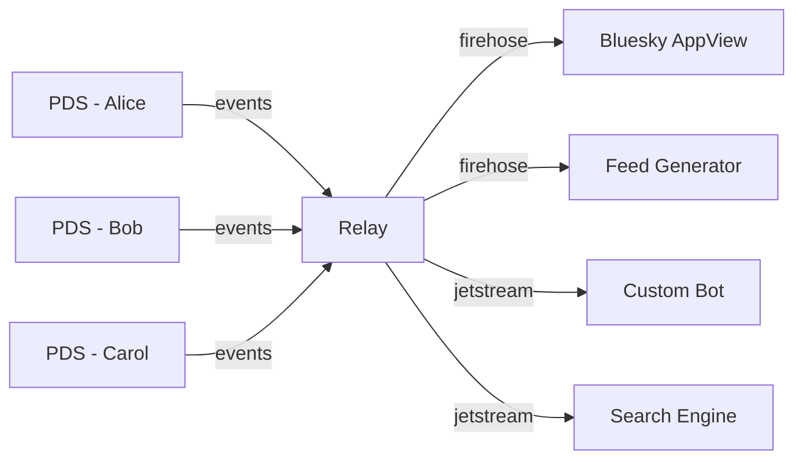
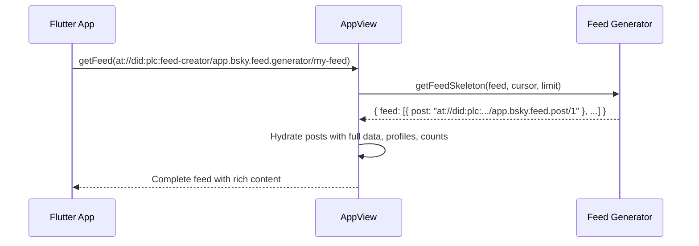
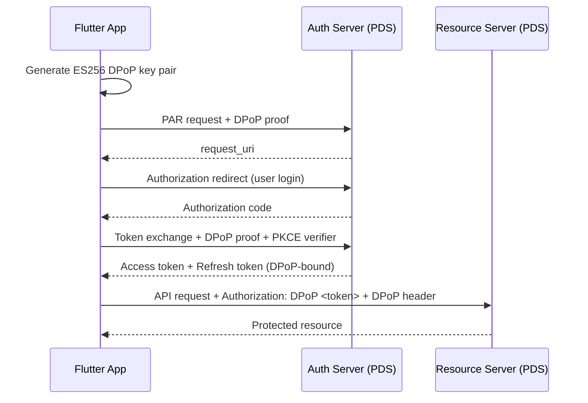
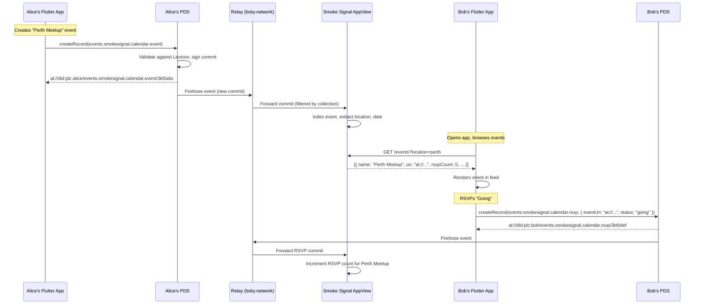

# The AT Protocol — Complete Component Overview

> A comprehensive reference for every layer of the Authenticated Transfer Protocol, with concrete examples drawn from the Bluesky and Smoke Signal ecosystems, followed by a frank critique of the protocol's strengths and weaknesses.

---

## Table of Contents

1. [What Is the AT Protocol?](#what-is-the-at-protocol)
2. [Design Philosophy: Speech vs Reach](#design-philosophy-speech-vs-reach)
3. [Core Components](#core-components)
   - [Identity Layer (DIDs & Handles)](#1-identity-layer-dids--handles)
   - [Personal Data Server (PDS)](#2-personal-data-server-pds)
   - [Data Repositories & the Merkle Search Tree](#3-data-repositories--the-merkle-search-tree)
   - [Lexicon (Schema System)](#4-lexicon-schema-system)
   - [XRPC (API Layer)](#5-xrpc-api-layer)
   - [Relays & the Firehose](#6-relays--the-firehose)
   - [AppView (Application Index)](#7-appview-application-index)
   - [Feed Generators](#8-feed-generators)
   - [Labelers (Moderation Services)](#9-labelers-moderation-services)
   - [OAuth & Authentication](#10-oauth--authentication)
4. [Data Flow: End-to-End Example](#data-flow-end-to-end-example)
5. [Critique: Strengths](#critique-strengths)
6. [Critique: Weaknesses](#critique-weaknesses)
7. [Comparison with ActivityPub](#comparison-with-activitypub)
8. [Relevance to This Project](#relevance-to-this-project)

---

## What Is the AT Protocol?

The **Authenticated Transfer Protocol** (AT Protocol, or `atproto`) is an open, federated protocol for building decentralized social applications. It was designed by Bluesky PBC and is currently undergoing IETF standardization.

The protocol's central promise is **credible exit**: a user can leave any service provider, take their data and identity with them, and maintain their social graph on a new provider — without needing permission from the old one.

**Key URI scheme**: `at://`

```
at://did:plc:z72i7hdynmk6r22z27h6tvur/app.bsky.feed.post/3jt5zhq2kv22c

   └─ DID (who) ──────────────────┘ └─ Collection (what) ──┘ └─ Record Key ┘
```

---

## Design Philosophy: Speech vs Reach

The AT Protocol fundamentally separates two concerns:

| Concern | Layer | Responsibility | Who Runs It |
|---------|-------|---------------|-------------|
| **Speech** | PDS + Identity | Creating, storing, owning data | Users / hosting providers |
| **Reach** | Relays + AppViews + Feeds | Indexing, discovering, curating data | Infrastructure operators |

This separation means your data exists independently of any algorithm, app, or moderation decision applied to it. Your posts live in *your* repository. A feed generator decides whether to show them; it cannot delete them.

---

## Core Components

### 1. Identity Layer (DIDs & Handles)

Identity in atproto is a two-layer system: a **permanent cryptographic ID** and a **human-readable alias**.

#### DID (Decentralized Identifier)

Your DID is your permanent, immutable account identifier. It never changes, even if you switch servers or change your username.

```
did:plc:z72i7hdynmk6r22z27h6tvur
```

**`did:plc`** is the primary DID method used in atproto. It is a novel method designed by Bluesky, stored in a central registry called the **PLC Directory** (`plc.directory`). Each DID resolves to a **DID Document** containing:

- **Signing Key**: The public key used to verify repository commits
- **PDS Endpoint**: The URL of the user's current hosting server
- **Handle**: The current human-readable alias

```json
// Example DID Document (simplified)
{
  "id": "did:plc:z72i7hdynmk6r22z27h6tvur",
  "alsoKnownAs": ["at://bsky.app"],
  "verificationMethod": [{
    "id": "#atproto",
    "type": "Multikey",
    "publicKeyMultibase": "zQ3shXjHeiBuRCKmM..."
  }],
  "service": [{
    "id": "#atproto_pds",
    "type": "AtprotoPersonalDataServer",
    "serviceEndpoint": "https://morel.us-east.host.bsky.network"
  }]
}
```

**`did:web`** is also supported as an alternative method. It uses a domain's `.well-known` directory to host the DID document, making it fully self-hosted but tied to DNS control.

#### Handle

A handle is a human-readable domain name that aliases a DID:

```
@alice.bsky.social      →  did:plc:abc123...
@bob.example.com        →  did:plc:def456...
```

Handles are verified via DNS TXT records or HTTP `.well-known` files. You can use **any domain you own** as your handle, giving you full control over your identity branding.

**Example**: If you own `orbit.au`, you can set your handle to `@orbit.au` by adding a DNS TXT record:
```
_atproto.orbit.au  TXT  "did=did:plc:your-did-here"
```

#### Recovery Keys

DID PLC includes an important safety mechanism: a **recovery key** held independently by the user. If your PDS goes rogue, you can use this key to update your DID document directly, pointing your identity to a new server without needing cooperation from the old one.

---

### 2. Personal Data Server (PDS)

The PDS is the user's **"home in the cloud"** — the server that hosts your data, manages your account, and provides API access.

#### Responsibilities

| Function | Description |
|----------|-------------|
| **Repository hosting** | Stores the user's signed data repository |
| **Authentication** | Handles OAuth flows and session management |
| **Record CRUD** | Provides APIs to create, read, update, delete records |
| **Blob storage** | Stores media (images, videos) referenced by records |
| **Firehose publishing** | Emits real-time events when data changes |
| **Account management** | Signup, password reset, data export, account migration |

#### Example: Creating a Record via PDS

```bash
# Create a post record in your PDS repository
POST https://bsky.social/xrpc/com.atproto.repo.createRecord
Authorization: Bearer <access-token>
Content-Type: application/json

{
  "repo": "did:plc:z72i7hdynmk6r22z27h6tvur",
  "collection": "app.bsky.feed.post",
  "record": {
    "$type": "app.bsky.feed.post",
    "text": "Hello from the AT Protocol!",
    "createdAt": "2026-04-06T02:00:00.000Z"
  }
}
```

**Response:**
```json
{
  "uri": "at://did:plc:z72i7hdynmk6r22z27h6tvur/app.bsky.feed.post/3kt5abc123",
  "cid": "bafyreig2fjxi3..."
}
```

#### Account Portability

Because your identity (DID) is separate from your hosting (PDS), you can **migrate your entire account** to a different PDS:

1. Export your repository from the old PDS (a `.car` file)
2. Import the repository into a new PDS
3. Update your DID document to point to the new PDS
4. The old PDS can be decommissioned — your followers, likes, and posts all follow you

---

### 3. Data Repositories & the Merkle Search Tree

Every user's data is stored in a **signed data repository** — a structured, authenticated collection of records.

#### Repository Structure

```
Repository (signed commit)
└── MST Root
    ├── app.bsky.feed.post/3jt5zhq... → {text: "Hello!", createdAt: "..."}
    ├── app.bsky.feed.like/3jt5abc... → {subject: {uri: "at://...", cid: "..."}}
    ├── app.bsky.graph.follow/3k2d... → {subject: "did:plc:other-user"}
    └── events.smokesignal.calendar.event/3kt... → {name: "Perth Meetup", ...}
```

Records are organized by **collection** (the Lexicon NSID) and **record key** (typically a TID — timestamp-based identifier).

#### Merkle Search Tree (MST)

The MST is a **deterministic, content-addressed search tree** that maps record paths to their CIDs (Content Identifiers).

**Key properties:**

| Property | Benefit |
|----------|---------|
| **Deterministic** | Same records always produce the same tree structure, regardless of insertion order |
| **Content-addressed** | Each node is hashed; comparing root hashes instantly reveals if two repos match |
| **Efficient diff** | Only changed branches need to be synchronized between servers |
| **Self-certifying** | The signed commit at the root lets anyone verify the data hasn't been tampered with |

**How tree level is determined:**

```
key → SHA-256(key) → count leading zero bits → tree level

Example:
  "app.bsky.feed.post/3jt5zhq" → SHA-256 → 0000 1011... → level 2 (4 leading zeros ÷ 2)
  "app.bsky.feed.like/3jt5abc" → SHA-256 → 0110 0101... → level 0
```

Keys with more leading zeros sit higher in the tree, creating a naturally balanced structure.

#### Data Encoding

Records are encoded in **DAG-CBOR** (Concise Binary Object Representation) and transported in **CAR** (Content Addressable Archive) files. This is a binary format optimized for:
- Compact storage
- Content addressing (every block has a CID)
- Efficient streaming and synchronization

---

### 4. Lexicon (Schema System)

Lexicon is the **global schema definition language** that ensures all clients, servers, and services can understand each other's data. It is the backbone of interoperability across the "Atmosphere" (the atproto ecosystem).

#### NSID (Namespaced Identifier)

Every schema is identified by a reverse-DNS style namespace:

```
app.bsky.feed.post           ← Bluesky social post
app.bsky.graph.follow         ← Follow relationship
events.smokesignal.calendar.event  ← Smoke Signal event record
events.smokesignal.calendar.rsvp   ← Smoke Signal RSVP record
com.atproto.repo.createRecord      ← Core protocol procedure
```

The namespace owner controls the definitions. Anyone can *use* them to create interoperable data.

#### Primary Lexicon Types

| Type | HTTP Method | Purpose | Example |
|------|-------------|---------|---------|
| **Record** | — | Data structure stored in a repository | A post, a like, an event |
| **Query** | GET | Read-only operation | Fetch a user's profile |
| **Procedure** | POST | State-mutating operation | Create a record, delete an account |
| **Subscription** | WebSocket | Real-time event stream | The firehose |

#### Example: Event Record Lexicon

This is the Lexicon schema that defines a Smoke Signal event — the same schema our Flutter app will use:

```json
{
  "lexicon": 1,
  "id": "events.smokesignal.calendar.event",
  "defs": {
    "main": {
      "type": "record",
      "description": "A calendar event record.",
      "key": "tid",
      "record": {
        "type": "object",
        "required": ["name", "startsAt", "createdAt"],
        "properties": {
          "name": {
            "type": "string",
            "maxLength": 500,
            "description": "The title of the event."
          },
          "description": {
            "type": "string",
            "maxLength": 10000,
            "description": "Full description of the event."
          },
          "startsAt": {
            "type": "string",
            "format": "datetime",
            "description": "ISO 8601 start time."
          },
          "endsAt": {
            "type": "string",
            "format": "datetime"
          },
          "status": {
            "type": "string",
            "knownValues": ["scheduled", "cancelled", "postponed"]
          },
          "locations": {
            "type": "array",
            "items": { "type": "ref", "ref": "#location" }
          },
          "createdAt": {
            "type": "string",
            "format": "datetime"
          }
        }
      }
    },
    "location": {
      "type": "object",
      "properties": {
        "name": { "type": "string" },
        "address": { "type": "string" },
        "coordinates": { "type": "ref", "ref": "#geoCoordinates" }
      }
    },
    "geoCoordinates": {
      "type": "object",
      "required": ["latitude", "longitude"],
      "properties": {
        "latitude": { "type": "number" },
        "longitude": { "type": "number" }
      }
    }
  }
}
```

#### Why Lexicons Matter

- **No rendering code shared**: A Bluesky client and a Smoke Signal client never share UI code, but they can both read and write event records because they share the Lexicon definition.
- **Validation**: PDS servers validate incoming records against their Lexicon schema before storing them.
- **Code generation**: Tools can generate type-safe Dart/TypeScript/Go models directly from Lexicon JSON files.

---

### 5. XRPC (API Layer)

**XRPC** (Cross-server Remote Procedure Call) is the HTTP-based API convention used throughout atproto. It is not a separate wire protocol — it's a set of conventions applied to standard HTTP requests, driven by Lexicon schemas.

#### How XRPC Works

```
NSID:   com.atproto.repo.createRecord
        └── maps to endpoint: /xrpc/com.atproto.repo.createRecord

Method Type:
  - "query"     →  HTTP GET
  - "procedure"  →  HTTP POST  
  - "subscription" → WebSocket
```

#### Example: Fetching a Profile (Query)

```bash
GET https://bsky.social/xrpc/app.bsky.actor.getProfile?actor=alice.bsky.social

# Response
{
  "did": "did:plc:abc123",
  "handle": "alice.bsky.social",
  "displayName": "Alice",
  "avatar": "https://cdn.bsky.social/img/avatar/...",
  "followersCount": 1042,
  "followsCount": 256,
  "postsCount": 3891
}
```

#### Example: Creating an Event (Procedure)

```bash
POST https://pds.example.com/xrpc/com.atproto.repo.createRecord
Content-Type: application/json
Authorization: Bearer <token>

{
  "repo": "did:plc:user-did",
  "collection": "events.smokesignal.calendar.event",
  "record": {
    "$type": "events.smokesignal.calendar.event",
    "name": "Perth Flutter Meetup",
    "startsAt": "2026-05-15T18:00:00+08:00",
    "status": "scheduled",
    "locations": [{
      "name": "Spacecubed",
      "address": "45 St Georges Terrace, Perth WA",
      "coordinates": { "latitude": -31.9523, "longitude": 115.8613 }
    }],
    "createdAt": "2026-04-06T02:00:00Z"
  }
}
```

#### Error Handling

XRPC uses structured error responses with well-known error codes:

```json
{
  "error": "InvalidRequest",
  "message": "Record failed Lexicon validation: missing required field 'name'"
}
```

---

### 6. Relays & the Firehose

Relays are the **aggregation and indexing layer** of the network. They crawl PDS instances to build a unified, real-time stream of all public activity.

#### The Firehose

The firehose is a **WebSocket-based event stream** that emits every public repository change across the network in real time.

```
wss://bsky.network/xrpc/com.atproto.sync.subscribeRepos

Stream output (DAG-CBOR encoded):
  → commit { repo: "did:plc:abc", ops: [{ path: "app.bsky.feed.post/3kt...", action: "create", cid: "..." }] }
  → commit { repo: "did:plc:def", ops: [{ path: "app.bsky.graph.follow/3kt...", action: "create", cid: "..." }] }
  → commit { repo: "did:plc:ghi", ops: [{ path: "events.smokesignal.calendar.event/3kt...", action: "create", cid: "..." }] }
  ...
```

#### Jetstream (Simplified Firehose)

For developers who don't need the full binary firehose, **Jetstream** provides a lightweight JSON-encoded alternative:

```
wss://jetstream.atproto.tools/subscribe?wantedCollections=events.smokesignal.calendar.event

# JSON output:
{
  "did": "did:plc:abc123",
  "time_us": 1712368800000000,
  "kind": "commit",
  "commit": {
    "rev": "3kt5abc...",
    "operation": "create",
    "collection": "events.smokesignal.calendar.event",
    "rkey": "3kt5def...",
    "record": {
      "name": "Perth Flutter Meetup",
      "startsAt": "2026-05-15T18:00:00+08:00",
      ...
    }
  }
}
```

Jetstream supports **filtering by collection or DID**, making it ideal for building focused services like event aggregators.

#### Relay Architecture



---

### 7. AppView (Application Index)

An AppView is a **specialized service** that consumes data from Relays and presents it as a coherent application experience. It is the "reach" layer — it decides *how* data is displayed and discovered.

#### What an AppView Does

| Function | Example |
|----------|---------|
| **Aggregation** | Count likes, reposts, followers for each piece of content |
| **Hydration** | Fetch full record data, profiles, and media to build rich API responses |
| **Search** | Full-text search across all indexed content |
| **API serving** | Provide the API endpoints that client apps consume |
| **Feed composition** | Combine feed generator skeletons with full record data |

#### Example: Smoke Signal AppView

The **Smoke Signal** service operates its own AppView that:
1. Subscribes to the firehose (or Jetstream)
2. Filters for `events.smokesignal.calendar.event` and `events.smokesignal.calendar.rsvp` records
3. Indexes events by date, location, and creator
4. Aggregates RSVP counts per event
5. Serves a web UI and API at `smokesignal.events`

Our Flutter app can query this AppView to discover events across the entire network, not just the current user's PDS.

---

### 8. Feed Generators

Feed generators are **independent algorithmic services** that provide custom content curation. They enable **algorithmic choice** — users pick which algorithm curates their timeline.

#### How Feed Generation Works



#### The Skeleton Pattern

Feed generators return only a **skeleton** — a list of `at://` URIs pointing to posts. The AppView then **hydrates** these with full content. This design means:

- Feed generators never need to store or serve actual content
- They only need to decide *which* posts to include and in *what order*
- The AppView handles authentication, content policy, and rendering data

#### Example: An Event-Based Feed Generator

You could build a feed generator that:
1. Subscribes to Jetstream filtering for `events.smokesignal.calendar.event`
2. Identifies posts that mention or link to upcoming events
3. Returns a skeleton of event-related posts sorted by proximity to the user's location

---

### 9. Labelers (Moderation Services)

Labelers are **modular content moderation services** that issue labels (metadata annotations) about content and accounts. They are a key part of atproto's approach to **composable moderation**.

#### How Labelers Work

| Step | Action |
|------|--------|
| 1 | Labeler subscribes to the firehose |
| 2 | Analyzes content (automated or human review) |
| 3 | Issues labels like `spam`, `nsfw`, `misinformation` |
| 4 | Users subscribe to labelers they trust |
| 5 | AppView applies label-based filtering per user preferences |

#### Key Design Decision

Labels **don't delete content**. They annotate it. The user (or their chosen AppView) decides how to handle labeled content:

- **Hide** it entirely
- **Blur** the media with a warning
- **Show** a content warning before displaying
- **Ignore** the label completely

This means moderation is **layered and user-driven**, not a single binary decision by a platform.

---

### 10. OAuth & Authentication

AT Protocol uses **OAuth 2.0 with DPoP** (Demonstrating Proof-of-Possession) for secure, granular authentication.

#### Key Concepts

| Concept | Purpose |
|---------|---------|
| **DPoP** (mandatory) | Binds tokens to a cryptographic key pair, preventing token theft |
| **PKCE** | Prevents authorization code interception |
| **PAR** | Pushed Authorization Requests for secure flow initiation |
| **Scopes** | Granular permissions (e.g., read-only access, or write to specific collections) |

#### Authentication Flow (Simplified)



#### Legacy: App Passwords

For simpler integrations, atproto also supports **app passwords** — scoped credentials that bypass the full OAuth flow. These are still commonly used for bots and development but are being phased out in favor of OAuth for production apps.

```dart
// Simple session creation with app password (atproto.dart SDK)
final session = await createSession(
  identifier: 'alice.bsky.social',
  password: 'xxxx-xxxx-xxxx-xxxx', // App password, not main password
);
```

---

## Data Flow: End-to-End Example

Here's how creating and discovering an event works across the full stack — directly relevant to our Flutter app:



---

## Critique: Strengths

### 1. True Data Portability (Credible Exit)

This is atproto's **strongest differentiator**. Because identity (DID) is decoupled from hosting (PDS), and data is stored in self-certifying repositories, users can genuinely leave a provider without losing anything. This isn't theoretical — the migration tooling exists and works today.

> Unlike most "portable" platforms where migration means "export a zip file and lose your followers," atproto migration preserves your DID, social graph, and all references to your content network-wide.

### 2. Interoperability via Lexicons

The Lexicon system is elegant and practical. By defining schemas at the protocol level rather than the application level, atproto enables genuine interoperability:

- Smoke Signal events created in one app appear in all compatible apps
- A Bluesky post can be liked from a completely different client
- Custom record types can be invented by anyone without permission

### 3. Composable Moderation

The labeler system is a genuinely novel approach to content moderation. Instead of a single platform deciding what's acceptable, users can subscribe to multiple moderation providers and configure their own preferences. This separates the question of "should this content exist?" from "should I see this content?"

### 4. Algorithmic Choice

Feed generators let users choose their own algorithms. This is a meaningful departure from platforms where a single, opaque algorithm determines what you see. You can:

- Use the default chronological feed
- Subscribe to a community-curated feed
- Build your own custom algorithm
- Switch between feeds instantly

### 5. Verifiable Data Integrity

The Merkle Search Tree structure means every piece of data is cryptographically signed and content-addressed. You can independently verify that a post was created by a specific user, that it hasn't been tampered with, and that the repository state is consistent. This is a strong foundation for trust in a decentralized system.

### 6. Developer-Friendly Architecture

The protocol is genuinely well-documented and approachable:
- Lexicon schemas are just JSON files
- XRPC maps cleanly to HTTP REST conventions
- Jetstream provides a simple JSON entry point for consuming network data
- SDKs exist in TypeScript, Go, Python, Dart, and more

---

## Critique: Weaknesses

### 1. Centralization Risk: The Bluesky Bottleneck

> [!WARNING]
> This is the most significant structural concern with the AT Protocol in its current state.

Despite the protocol's decentralized design, critical infrastructure remains under Bluesky PBC's control:

| Component | Current State |
|-----------|--------------|
| **PLC Directory** | Single registry operated by Bluesky. Plans to transfer to an independent body, but hasn't happened yet |
| **Primary Relay** (`bsky.network`) | Operated by Bluesky. Running an independent relay at scale is extremely resource-intensive |
| **Primary AppView** | Bluesky's AppView handles the vast majority of network traffic |
| **OAuth Infrastructure** | Most users authenticate through Bluesky's PDS infrastructure |

If `plc.directory` goes down, no DID can be resolved. If `bsky.network` goes down, no firehose data flows. The protocol *can* survive these failures in theory, but in practice the ecosystem is deeply centralized around Bluesky's services today.

### 2. Relay Economics: A Scaling Problem

Running a Relay is **extremely expensive**. The firehose processes every public commit from every user on the network. As of early 2026, this means:

- Ingesting millions of events per day
- Storing and indexing petabytes of repository data
- Serving WebSocket connections to potentially thousands of consumers

There is **no built-in economic model** for relay operators. Unlike blockchain validators (who earn fees), relay operators bear costs with no protocol-level compensation. This creates a natural tendency toward centralization — only well-funded organizations can afford to run relays.

### 3. Privacy Gaps

> [!CAUTION]
> The AT Protocol was designed primarily for **public data**. Private data support is still immature.

- **No E2EE DMs** in the protocol yet (in development)
- **All repository data is effectively public** — any relay can index it
- **Deletion is not guaranteed** — once data hits the firehose, copies may exist on any number of relays and AppViews
- **Permissioned data** (limiting who can see specific records) is still in early development

For our event app, this means: events published to a PDS are public. There is currently no protocol-level mechanism for "private events" or "invite-only RSVPs."

### 4. Operational Complexity for Self-Hosting

Running your own PDS is technically possible but operationally demanding:
- Requires a public server with TLS
- Must handle repository synchronization correctly
- Must implement the full XRPC API surface
- Must stay current with protocol updates
- DNS configuration for handle verification

The average user will never self-host a PDS. This means the "portability" story, while real, still depends on the availability of competing hosting providers — and right now, there aren't many.

### 5. Lexicon Governance: Who Defines the Standard?

Lexicon namespaces are controlled by domain ownership. The `app.bsky.*` namespace is controlled by Bluesky. The `events.smokesignal.*` namespace is controlled by Smoke Signal. This creates questions:

- **What if a namespace owner abandons their schemas?** There's no protocol-level mechanism for community takeover.
- **What if two apps define conflicting schemas for the same concept?** There's no arbitration process.
- **Schema evolution is limited**: Lexicon v1 has no versioning mechanism for breaking changes to existing record types.

### 6. Sync Protocol Maturity

Repository synchronization (getting data efficiently from PDS to Relay) is still maturing:
- **Backfilling** (fetching historical data) can be slow and resource-intensive
- The sync protocol has gone through multiple revisions (v1, v1.1) with breaking changes
- Implementations sometimes fall out of sync with the evolving spec
- There's no fully spec-compliant consumer reference implementation yet for the latest sync version

### 7. Network Effect Lock-In (Soft Centralization)

While atproto provides *technical* mechanisms for portability, social network effects create *practical* lock-in:
- ~95% of AT Protocol users are on Bluesky
- Most feed generators and labelers optimize for Bluesky content
- Independent apps (like Smoke Signal) have a tiny fraction of the user base
- This makes Bluesky the de facto norm-setter for protocol evolution

---

## Comparison with ActivityPub

| Aspect | AT Protocol | ActivityPub (Mastodon/Fediverse) |
|--------|-------------|----------------------------------|
| **Identity portability** | Strong (DID-based, server-independent) | Weak (tied to your instance) |
| **Data portability** | Strong (self-certifying repos, CAR export) | Weak (varies by implementation) |
| **Global discovery** | Strong (relays provide full network view) | Weak (per-instance, no global search by default) |
| **Moderation model** | Composable labelers, user-driven | Instance-level block/allow lists |
| **Algorithm choice** | Pluggable feed generators | Mostly chronological |
| **Decentralization (current)** | Moderate (centralized infra, decentralized data) | Strong (thousands of independent instances) |
| **Decentralization (theoretical)** | Strong | Strong |
| **Privacy** | Weak (public-first design) | Moderate (per-post visibility, DMs) |
| **Complexity** | High | Moderate |
| **Developer ecosystem** | Growing rapidly | Mature |
| **Standardization** | IETF in progress | W3C Recommendation |

---

## Relevance to This Project

For our **Flutter event app**, the following components are directly used:

| Component | How We Use It |
|-----------|--------------|
| **PDS** | Hosts user's event and RSVP records |
| **DID + Handle** | User identity and authentication |
| **Lexicon** | `events.smokesignal.calendar.event` and `.rsvp` schemas define our data model |
| **XRPC** | All API calls (create event, RSVP, fetch profile) go through XRPC |
| **App Password / OAuth** | Authentication for the `atproto.dart` SDK |
| **Smoke Signal AppView** | Event discovery across the network |
| **Firehose / Jetstream** | Potential real-time event updates (future feature) |

The `atproto.dart` SDK abstracts most of these details, but understanding the full stack is essential for debugging, making architectural decisions (e.g., should we query the PDS directly or the AppView?), and ensuring our records are interoperable with the broader ecosystem.

---

*Last updated: 2026-04-06*
*Reference: [atproto.com](https://atproto.com) | [Bluesky Docs](https://docs.bsky.app) | [Smoke Signal](https://smokesignal.events)*
