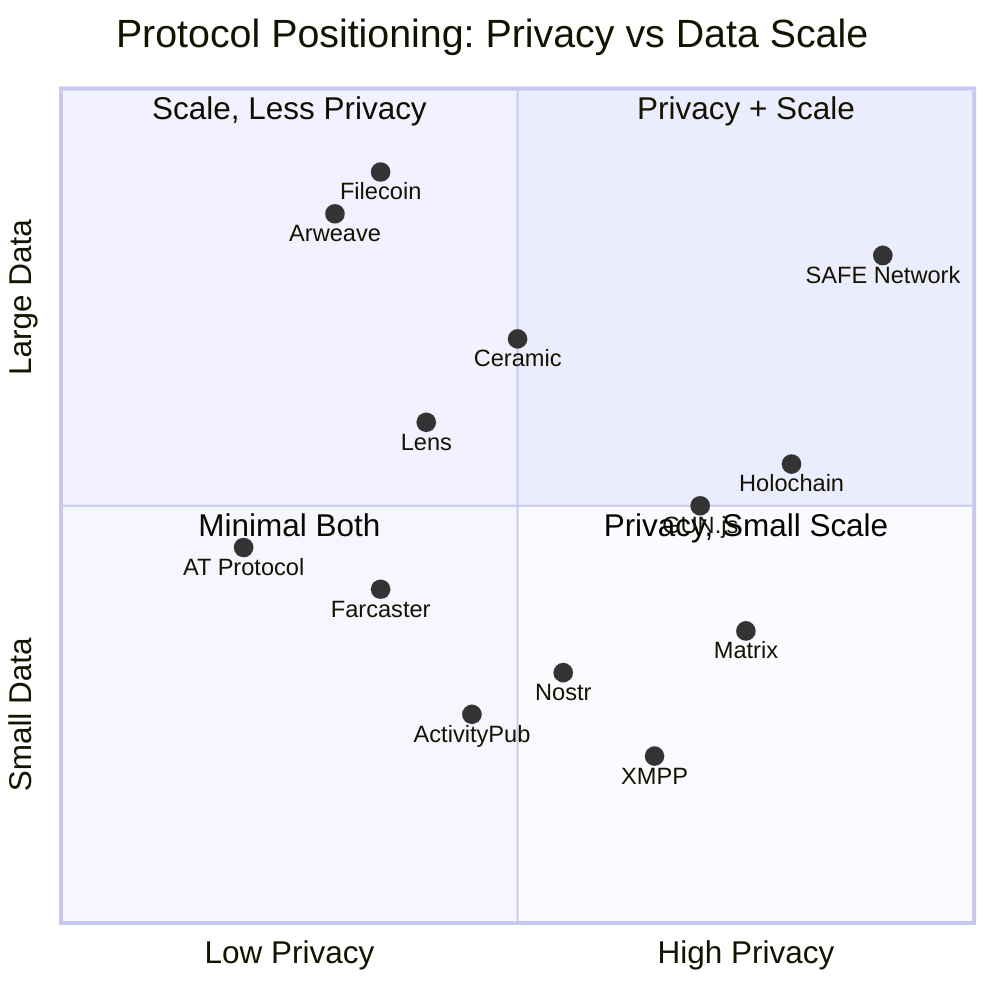
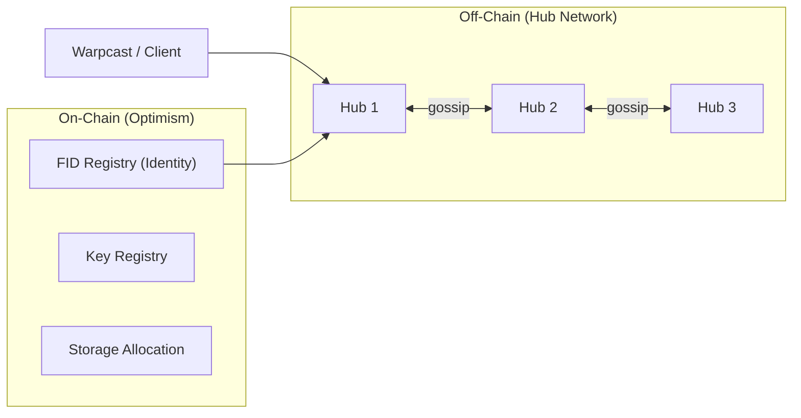
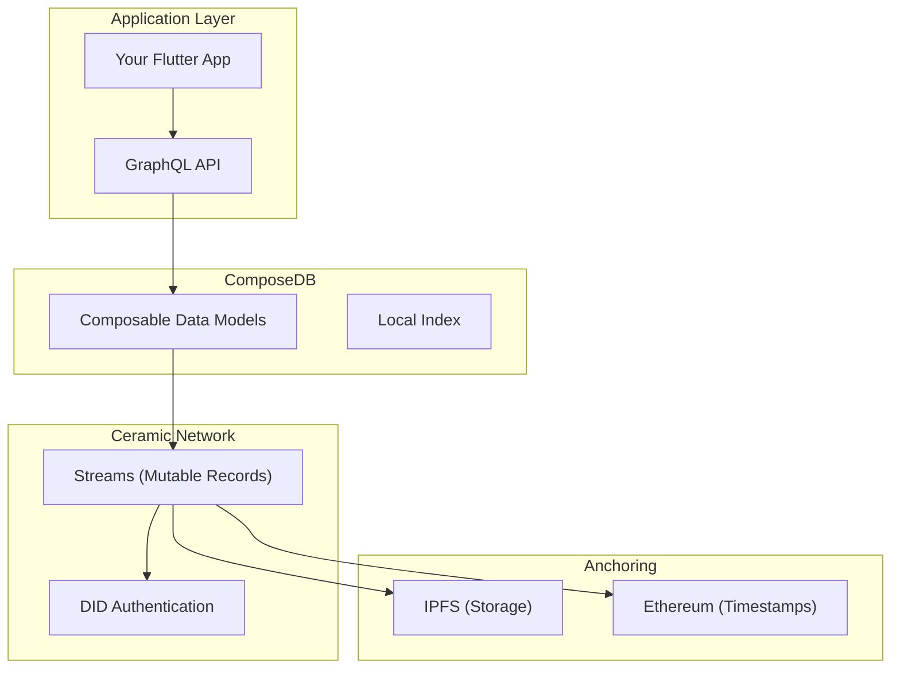

# Decentralised Protocols — Privacy, Data Ownership & Crypto-Backed Alternatives

> A companion to [at-protocol-overview.md](./at-protocol-overview.md). Surveys every major decentralised protocol relevant to privacy-preserving social/event applications, including crypto-backed storage and data networks that handle large datasets.

---

## Table of Contents

1. [Protocol Landscape Map](#protocol-landscape-map)
2. [Social / Communication Protocols](#social--communication-protocols)
   - [Nostr](#1-nostr)
   - [Farcaster](#2-farcaster)
   - [ActivityPub (Fediverse)](#3-activitypub-fediverse)
   - [Matrix](#4-matrix)
   - [XMPP](#5-xmpp)
3. [Crypto-Backed Data & Storage Protocols](#crypto-backed-data--storage-protocols)
   - [Ceramic / ComposeDB](#6-ceramic--composedb)
   - [IPFS + Filecoin](#7-ipfs--filecoin)
   - [Arweave](#8-arweave)
   - [Lens Protocol](#9-lens-protocol)
4. [Agent-Centric / Privacy-First Protocols](#agent-centric--privacy-first-protocols)
   - [Holochain](#10-holochain)
   - [SAFE Network](#11-safe-network)
   - [GUN.js](#12-gunjs)
5. [Master Comparison Table](#master-comparison-table)
6. [Privacy Scorecard: AT Protocol vs the Field](#privacy-scorecard-at-protocol-vs-the-field)
7. [Recommendation for the Event App](#recommendation-for-the-event-app)

---

## Protocol Landscape Map



---

## Social / Communication Protocols

### 1. Nostr

**Notes and Other Stuff Transmitted by Relays**

Nostr is the closest philosophical cousin to the AT Protocol — a simple, relay-based protocol for decentralised social communication. But it takes a radically different approach to identity and privacy.

#### Architecture

```
┌──────────┐     ┌───────────┐     ┌──────────┐
│  Client  │────▶│  Relay 1  │◀────│  Client  │
│  (Alice) │     └───────────┘     │  (Bob)   │
│          │────▶│  Relay 2  │◀────│          │
└──────────┘     └───────────┘     └──────────┘
```

- **Identity**: Pure cryptographic keypairs (no servers, no DNS, no registry). Your public key *is* your identity.
- **Data model**: JSON "events" signed by the user's private key
- **Storage**: Relays store events ephemerally — no persistence guarantee

#### Privacy Features

| Feature | Status |
|---------|--------|
| E2E encrypted DMs | ✅ NIP-17 (Gift Wrapping) — hides sender, recipient, and content from relays |
| Metadata protection | ✅ NIP-59 wraps messages in disposable keypairs |
| Content encryption | ✅ NIP-44 (versioned encrypted payloads) |
| Public by default | ⚠️ Yes — all non-encrypted events are broadcast to relays |

#### Example: Encrypted DM (NIP-17 flow)

```
1. Alice creates a "rumor" event (unsigned, kind 14) with the DM content
2. Alice "seals" it (kind 13) — encrypts to Bob's pubkey using NIP-44
3. Alice "gift wraps" it (kind 1059) — re-encrypts using a random disposable key
4. The relay sees only the disposable key's pubkey — not Alice's, not Bob's
5. Bob unwraps → unseals → reads the rumor
```

#### Large Data Handling

> [!WARNING]
> Nostr is **not** designed for large datasets. Relays are lightweight and typically purge old data.

- Long-form content: NIP-23 (articles), but no binary blobs
- Media: Hosted externally (e.g., Blossom servers), linked by URL
- No built-in incentive for relay operators to store data permanently

#### Strengths
- Extremely simple protocol — you can implement a client in a weekend
- True anonymity possible (no registration, no handle system)
- Censorship-resistant by design (redundant relays)
- Excellent encrypted messaging with NIP-17

#### Weaknesses
- No data persistence guarantee — your posts can disappear
- Relay discoverability and UX remain rough
- Key management burden falls entirely on the user (lose your key = lose your identity)
- No schema system like Lexicon — interoperability is ad hoc via NIPs

---

### 2. Farcaster

**The "Sufficiently Decentralised" Social Protocol**

Farcaster uses **Ethereum** (Optimism L2) for identity and on-chain state, with an off-chain network of **Hubs** for data storage and propagation.

#### Architecture



- **Identity**: Ethereum wallet → Farcaster ID (FID) minted as on-chain contract
- **Data model**: Signed "messages" (casts, reactions, follows) stored on Hubs
- **Sync**: Gossip protocol between Hubs (eventually consistent)

#### Privacy Assessment

| Feature | Status |
|---------|--------|
| E2E encrypted DMs | ❌ Not natively supported |
| Identity privacy | ❌ Tied to Ethereum wallet (pseudonymous but traceable on-chain) |
| Content privacy | ❌ All casts are public and gossiped to all Hubs |
| Data deletion | ⚠️ Messages can be "revoked" but propagation is best-effort |

#### Large Data Handling

- Storage is **on-chain gated** — you rent storage units via Ethereum
- Each unit provides a limited number of casts, reactions, etc.
- No mechanism for large binary data (media hosted externally)
- Storage caps create a natural limit on data scale per user

#### Strengths
- Strong identity guarantees (Ethereum-backed)
- True peer-to-peer data replication via Hub gossip
- Composable with the broader Ethereum/DeFi ecosystem (Frames, on-chain actions)
- Warpcast is a polished, mainstream-quality client

#### Weaknesses
- **Zero privacy features** — everything is public and on-chain traceable
- Requires Ethereum wallet and on-chain transaction for signup
- Hub network is centralising around a few large operators
- Storage costs can become significant at scale

---

### 3. ActivityPub (Fediverse)

**The W3C Standard for Federated Social Networking**

ActivityPub powers Mastodon, PeerTube, Pixelfed, and thousands of independent instances. It's the most mature decentralised social protocol.

#### Privacy Features

| Feature | Status |
|---------|--------|
| Per-post visibility | ✅ Public, unlisted, followers-only, direct |
| E2E encrypted DMs | ❌ DMs are server-to-server, not E2E encrypted |
| Instance-level control | ✅ Instance admins control federation, data retention |
| Metadata protection | ⚠️ Federated servers see sender/recipient metadata |
| Account portability | ❌ Weak — followers redirect, but posts don't migrate |

#### Large Data Handling

- Instance operators bear all storage costs
- Media (images, video) is stored per-instance
- No protocol-level incentive or limit — depends entirely on the instance operator
- Large instances (mastodon.social) spend significant resources on media storage

#### Key Trade-off

ActivityPub's **instance-level privacy** is its strength and weakness. Your instance admin has full access to your data (including "private" DMs). True privacy requires trusting or running your own instance.

---

### 4. Matrix

**End-to-End Encrypted Decentralised Communication**

Matrix is the strongest privacy-focused *communication* protocol in the decentralised space.

#### Privacy Features

| Feature | Status |
|---------|--------|
| E2E encryption | ✅ Default for all private rooms (Megolm/Olm) |
| Metadata protection | ⚠️ Room membership and join/leave events are visible to home servers |
| Self-hosting | ✅ Run your own Synapse/Dendrite home server |
| Device verification | ✅ Cross-signing and key verification built in |
| Decryption control | ✅ Message keys are per-device, per-session |

#### Large Data Handling

- Designed for messaging, not bulk data storage
- Media is stored on home servers and distributed to participants
- Room history can grow very large for active channels
- No content-addressed storage or permanent archival

#### Key Strength for Privacy

Matrix is the **only** mainstream decentralised protocol where E2E encryption is the default and deeply integrated. If your event app required encrypted event discussions, Matrix would be the communication layer of choice.

---

### 5. XMPP

**The Extensible Messaging and Presence Protocol**

The veteran of decentralised messaging (originally Jabber, 1999). Minimalist, extensible, and battle-tested.

#### Privacy Features

| Feature | Status |
|---------|--------|
| E2E encryption | ✅ Via OMEMO extension (Signal protocol based) |
| Metadata minimalism | ✅ Servers see minimal metadata by design |
| Self-hosting | ✅ Lightweight servers (ejabberd, Prosody) |
| Offline message delivery | ✅ Server stores until delivery, then can purge |

#### Relevance

XMPP is excellent for private messaging but lacks the social graph, record system, and discoverability features needed for an event platform. It's more a building block than a complete solution.

---

## Crypto-Backed Data & Storage Protocols

These protocols use **cryptocurrency incentive mechanisms** to solve data persistence, privacy, and scale — the exact gaps that the AT Protocol and Nostr leave open.

### 6. Ceramic / ComposeDB

**Decentralised Mutable Data Streams on IPFS**

Ceramic is the most direct competitor to the AT Protocol's data model. It provides **mutable, verifiable data records** on a decentralised network — essentially what the AT Protocol's PDS + Lexicon layer does, but backed by IPFS and blockchain anchoring.

#### Architecture



#### Key Concepts

| Concept | Description |
|---------|-------------|
| **Streams** | Append-only logs of commits, identified by a persistent StreamID |
| **ComposeDB** | GraphQL database layer on top of Ceramic — feels like Postgres |
| **Data Models** | Shared schemas (similar to Lexicons) that enable cross-app interoperability |
| **Anchoring** | Commits are periodically anchored to Ethereum for tamper-proof ordering |

#### Example: Event Record on Ceramic

```graphql
# ComposeDB Schema
type Event @createModel(
  accountRelation: LIST
  description: "A calendar event"
) {
  name: String! @string(maxLength: 500)
  description: String @string(maxLength: 10000)
  startsAt: DateTime!
  endsAt: DateTime
  location: String @string(maxLength: 200)
  status: String @string(maxLength: 50)
  createdAt: DateTime!
}

# Create an event
mutation {
  createEvent(input: {
    content: {
      name: "Perth Flutter Meetup"
      startsAt: "2026-05-15T18:00:00+08:00"
      location: "Spacecubed, Perth"
      status: "scheduled"
      createdAt: "2026-04-06T02:00:00Z"
    }
  }) {
    document { id }
  }
}
```

#### Privacy & Large Data

| Feature | Status |
|---------|--------|
| Data encryption | ⚠️ Application-level (not protocol-level) |
| Identity | ✅ DID-based (compatible with AT Protocol DIDs) |
| Data ownership | ✅ Only the DID holder can modify their streams |
| Large datasets | ✅ IPFS backing handles arbitrarily large content |
| Persistence | ⚠️ Depends on Ceramic node availability + IPFS pinning |

#### Why It Matters for Events

Ceramic + ComposeDB could theoretically replace the AT Protocol's PDS as the data layer for your event app. The trade-off: you lose Bluesky ecosystem interoperability but gain IPFS-backed storage and more mature mutable data semantics.

---

### 7. IPFS + Filecoin

**Content-Addressed Storage + Cryptoeconomic Persistence**

IPFS provides the addressing and transport; Filecoin provides the economic incentive for storage providers to actually keep your data.

#### How They Work Together

```
┌────────────┐    Content Hash (CID)     ┌─────────────────┐
│  Your App  │ ─────────────────────────▶ │  IPFS Network   │
│            │ ◀───── Retrieve by CID ─── │  (P2P Routing)  │
└────────────┘                            └────────┬────────┘
                                                   │
                                          Paid Storage Deal
                                                   │
                                          ┌────────▼────────┐
                                          │    Filecoin      │
                                          │  Storage Market  │
                                          │  (Proof of       │
                                          │   Spacetime)     │
                                          └─────────────────┘
```

| Aspect | IPFS | Filecoin |
|--------|------|----------|
| **Purpose** | Content-addressed P2P file system | Paid, verifiable storage marketplace |
| **Persistence** | Only while a node pins the content | Contractually guaranteed (storage deals) |
| **Cost** | Free (but no guarantees) | Paid in FIL tokens |
| **Scale** | Unlimited file size | Handles petabyte-scale datasets |
| **Privacy** | ❌ CIDs are public; anyone with the hash can fetch | ⚠️ Client-side encryption required |

#### Privacy Assessment

> [!CAUTION]
> IPFS is **not private by default**. Content is addressed by hash — if someone knows the CID, they can retrieve the content. DHT queries can reveal which nodes are requesting or providing content.

**For privacy, you must**:
1. Encrypt content client-side before uploading
2. Share decryption keys through a separate secure channel
3. Use a private IPFS network or gateway for sensitive data

#### Large Data Handling: ✅ Excellent

Filecoin is specifically designed for **large-scale decentralised storage**:
- Storage providers compete on price (typically cheaper than AWS S3 for cold storage)
- Proof-of-Replication verifies data is actually stored
- Proof-of-Spacetime verifies it's stored continuously over time
- Can handle multi-terabyte datasets

---

### 8. Arweave

**Permanent, One-Time-Payment Decentralised Storage**

Arweave's unique proposition: **pay once, store forever**. An endowment model ensures data persistence across decades.

| Aspect | Details |
|--------|---------|
| **Payment** | One-time fee in AR tokens |
| **Persistence** | Designed to be permanent (200+ year endowment model) |
| **Throughput** | Lower than Filecoin for bulk ingestion |
| **Scale** | Handles large datasets but cost is higher than Filecoin |
| **Privacy** | ❌ All data on Arweave is public and permanent |

#### Privacy Assessment

> [!WARNING]
> Arweave is the **worst choice for private data**. Anything stored on Arweave is permanent AND public. Even encrypted data will eventually be crackable given enough time and compute — and on Arweave, there's no way to delete it.

**Best used for**: Public archives, NFT metadata, legal documents, published content that should never be lost.

---

### 9. Lens Protocol

**On-Chain Social Graph (Ethereum / Lens Chain)**

Lens uses NFTs and smart contracts to create a user-owned social graph where your profile, followers, and content history are portable blockchain assets.

#### Architecture

```
User Wallet → Lens Profile NFT → On-Chain Social Graph
                    │
                    ├── Publications (posts, comments, mirrors)
                    ├── Follows (NFTs representing connections)
                    └── Collects (NFTs representing content engagement)
```

#### Privacy & Data Assessment

| Feature | Status |
|---------|--------|
| Data ownership | ✅ NFT-based — you own your profile in your wallet |
| Privacy | ❌ Everything is on-chain and publicly queryable |
| Large data | ⚠️ On-chain storage is expensive; media is off-chain (IPFS/Arweave) |
| Identity | Pseudonymous (wallet address) but on-chain traceable |
| Portability | ✅ Any app built on Lens can read the same social graph |

#### Event App Relevance

Lens could power an event system where RSVPs are on-chain (NFT-based tickets), but the complete lack of privacy and high transaction costs make it impractical for casual event coordination. Better suited for ticketed/monetised events where on-chain provenance matters.

---

## Agent-Centric / Privacy-First Protocols

These protocols take fundamentally different architectural approaches — prioritising privacy and user agency from the ground up, rather than adding privacy as an afterthought.

### 10. Holochain

**Agent-Centric, No Global Consensus**

Holochain is the most radical departure from blockchain/relay thinking. There is **no global ledger**. Each user (agent) maintains their own local hash chain, and validation is performed by peers.

#### Architecture

```
┌─────────────────────────────────────────────────┐
│               Holochain Application             │
│                   (hApp DNA)                     │
├──────────┬──────────┬──────────┬────────────────┤
│ Agent A  │ Agent B  │ Agent C  │  Agent D       │
│ (local   │ (local   │ (local   │  (local        │
│  chain)  │  chain)  │  chain)  │   chain)       │
└────┬─────┴────┬─────┴────┬─────┴────┬───────────┘
     │          │          │          │
     └──────────┼──────────┼──────────┘
           DHT (Distributed Hash Table)
           Shared validation / gossip
```

#### Key Concepts

| Concept | Description |
|---------|-------------|
| **Source Chain** | Each agent has their own append-only hash chain (like a personal blockchain) |
| **DNA** | Shared application rules that define validation — agents enforce rules locally |
| **DHT** | A shared space for data that multiple agents need to access |
| **No Miners** | No proof-of-work, no mining, no tokens required to participate |

#### Privacy & Large Data

| Feature | Status |
|---------|--------|
| Data sovereignty | ✅ Data lives on user's device first, shared selectively |
| Encryption | ✅ Capability-based access control — share data with specific agents |
| No global ledger | ✅ No public record of all activity |
| Large data | ✅ Can handle large datasets across the DHT |
| Offline-first | ✅ Works without internet, syncs when connected |
| Metadata protection | ✅ No central observer can see all activity |

#### Why It's Interesting for Events

Holochain's model is **ideal for private events**:
- Create an event in your source chain
- Share it selectively with invited attendees
- RSVPs are validated peer-to-peer, no public broadcast
- No relay, no firehose, no public index unless you want one

#### Weaknesses
- Small ecosystem, limited tooling and SDKs
- No Flutter/Dart SDK (Rust + JavaScript only)
- Complex mental model for developers used to client-server
- Network effects are tiny compared to AT Protocol or Nostr

---

### 11. SAFE Network

**Autonomous, Self-Encrypting Decentralised Storage**

The SAFE (Secure Access For Everyone) Network is the most ambitious privacy-first protocol. Data is automatically encrypted, sharded, and distributed — privacy isn't an option, it's the architecture.

#### How Self-Encryption Works

```
1. File is split into chunks
2. Each chunk is encrypted using the hashes of neighbouring chunks
3. Chunks are distributed across the network to random nodes
4. No single node holds a complete file or the key to decrypt it
5. Only the data owner holds the "data map" that can reassemble the file
```

#### Privacy & Large Data

| Feature | Status |
|---------|--------|
| Encryption | ✅ Automatic self-encryption — cannot be disabled |
| Data ownership | ✅ Only the holder of the data map can access content |
| Anonymity | ✅ Network routing hides user IP addresses |
| Large data | ✅ Designed for arbitrary file sizes |
| Persistence | ✅ Network maintains data as long as the network exists |
| Censorship resistance | ✅ No single node can identify or remove content |

#### Status & Caveats

> [!IMPORTANT]
> As of early 2026, the SAFE Network is still in testing/beta. It has been in development since 2006 and has one of the longest development timelines in the space. The technology is impressive but unproven at production scale.

- No Flutter/Dart SDK
- Token economics (SafeCoin) still being finalised
- Very small user base and developer community
- Limited application ecosystem

---

### 12. GUN.js

**Decentralised Real-Time Graph Database**

GUN is a JavaScript-first, peer-to-peer database that synchronises data in real-time using CRDTs (Conflict-free Replicated Data Types).

#### Architecture

```javascript
// GUN is remarkably simple to use
const gun = Gun(['https://relay1.example.com', 'https://relay2.example.com']);

// Create an event
gun.get('events').get('perth-meetup').put({
  name: 'Perth Flutter Meetup',
  startsAt: '2026-05-15T18:00:00+08:00',
  location: 'Spacecubed',
  status: 'scheduled'
});

// Read in real-time (reactive)
gun.get('events').get('perth-meetup').on((data) => {
  console.log('Event updated:', data);
});
```

#### Privacy Features

| Feature | Status |
|---------|--------|
| SEA (Security, Encryption, Authorization) | ✅ Built-in crypto module for user auth and encryption |
| E2E encryption | ✅ Via SEA — encrypt data to specific user pubkeys |
| Peer-to-peer | ✅ Data syncs directly between peers, relay is optional |
| Offline-first | ✅ Works offline, syncs when reconnected |

#### Large Data Assessment

- CRDTs work well for structured/graph data but not optimised for large binary blobs
- Relay peers bear storage burden with no economic incentive
- Performance degrades with very large graphs
- No guaranteed persistence — depends on peer availability

#### Relevance

GUN's real-time, peer-to-peer nature makes it excellent for **live event updates** (e.g., real-time RSVP counts, live chat during events). It could complement an AT Protocol app as a real-time sync layer.

---

## Master Comparison Table

| Protocol | Privacy | Large Data | Crypto Incentive | Identity Model | Maturity | Flutter SDK |
|----------|---------|-----------|-----------------|---------------|----------|------------|
| **AT Protocol** | ❌ Weak | ⚠️ Moderate | ❌ None | DID (did:plc) | ✅ Production | ✅ atproto.dart |
| **Nostr** | ⚠️ Moderate | ❌ Weak | ❌ None (Zaps via LN) | Keypair | ✅ Production | ⚠️ Community |
| **Farcaster** | ❌ Weak | ❌ Weak | ✅ ETH (storage) | Ethereum wallet | ✅ Production | ❌ None |
| **ActivityPub** | ⚠️ Moderate | ⚠️ Moderate | ❌ None | Instance-bound | ✅ Mature | ❌ None |
| **Matrix** | ✅ Strong | ⚠️ Moderate | ❌ None | Matrix ID | ✅ Mature | ⚠️ Community |
| **Ceramic** | ⚠️ Moderate | ✅ Strong | ⚠️ Anchoring fees | DID (flexible) | ⚠️ Growing | ❌ None |
| **Filecoin** | ⚠️ Moderate* | ✅ Excellent | ✅ FIL token | Wallet | ✅ Production | ❌ None |
| **Arweave** | ❌ Weak | ✅ Excellent | ✅ AR token | Wallet | ✅ Production | ❌ None |
| **Lens** | ❌ Weak | ⚠️ Moderate | ✅ LENS/GHO | NFT Profile | ✅ Production | ❌ None |
| **Holochain** | ✅ Strong | ✅ Strong | ❌ None | Agent keypair | ⚠️ Beta | ❌ None |
| **SAFE Network** | ✅ Excellent | ✅ Excellent | ✅ SafeCoin | Network ID | ❌ Beta | ❌ None |
| **GUN.js** | ⚠️ Moderate | ⚠️ Moderate | ❌ None | SEA keypair | ⚠️ Stable | ❌ None |

*\* Filecoin privacy requires client-side encryption; the network itself is public.*

---

## Privacy Scorecard: AT Protocol vs the Field

| Privacy Dimension | AT Protocol | Best Alternative | Winner |
|-------------------|-------------|-----------------|--------|
| **Content encryption** | ❌ None (public repos) | Matrix (E2EE default) | Matrix |
| **DM privacy** | ❌ In development | Nostr NIP-17 (Gift Wrap) | Nostr |
| **Metadata protection** | ❌ Firehose exposes all activity | Holochain (no global view) | Holochain |
| **Identity privacy** | ⚠️ Pseudonymous handle | Nostr (bare keypair) | Nostr |
| **Data deletion** | ❌ Firehose copies persist | XMPP (server-only, purgeable) | XMPP |
| **Selective sharing** | ❌ All-or-nothing public | Holochain (capability-based) | Holochain |
| **Self-hosting ease** | ⚠️ Complex PDS setup | XMPP (lightweight servers) | XMPP |
| **Large private data** | ❌ Not supported | SAFE Network (self-encrypting) | SAFE |

**Verdict**: The AT Protocol is the **weakest** major protocol for privacy. Its design philosophy is "public first" — your repository is visible to any relay. This is a conscious trade-off for openness and discoverability, but it means private events, invite-only gatherings, and confidential RSVPs are fundamentally at odds with the protocol's architecture.

---

## Recommendation for the Event App

Given this analysis, here's how the landscape maps to our Flutter event app:

### What AT Protocol Does Well (Keep)
- ✅ **Interoperability** with Smoke Signal's 7,400+ existing events
- ✅ **Established Dart SDK** (`atproto.dart`) — the only protocol with first-class Flutter support
- ✅ **Identity portability** via DIDs
- ✅ **Schema system** (Lexicon) for structured event data
- ✅ **Existing user base** (Bluesky accounts work immediately)

### What AT Protocol Lacks (Consider Supplementing)

| Gap | Potential Supplement | Complexity |
|-----|---------------------|-----------|
| **Private events** | Holochain (ideal but no Dart SDK) or client-side encryption + direct PDS queries | High |
| **Encrypted event chat** | Matrix room per event (mature E2E, community Flutter SDK) | Medium |
| **Large media storage** | IPFS (pin event photos/videos, store CID in AT record) | Medium |
| **Permanent event archives** | Arweave (one-time payment for permanent public events) | Low |
| **Real-time RSVP updates** | GUN.js or WebSocket layer alongside AT Protocol | Medium |

### Pragmatic Path Forward

> [!TIP]
> **For the MVP**: Use AT Protocol as the primary stack — it has the Dart SDK, the user base, and the Smoke Signal interop. Accept the privacy limitations for now.
>
> **For V2**: Consider a hybrid approach where **public events** flow through AT Protocol (discoverable, interoperable) and **private events** use client-side encryption with direct PDS-to-PDS communication, bypassing the relay/firehose entirely. This keeps the same infrastructure but limits visibility.
>
> **For V3**: Evaluate adding Ceramic/ComposeDB as an alternative data layer for users who want crypto-backed persistence without Bluesky dependency.

---

*Last updated: 2026-04-06*
*Companion to: [at-protocol-overview.md](./at-protocol-overview.md)*
