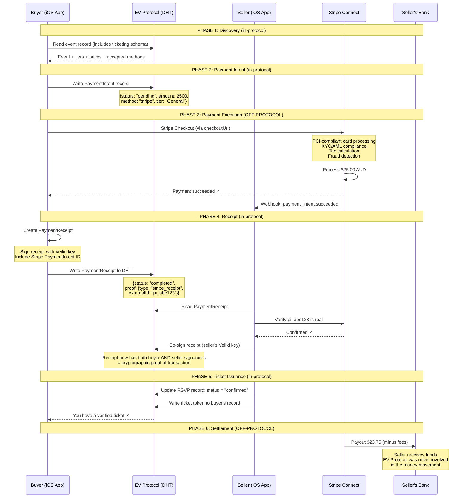
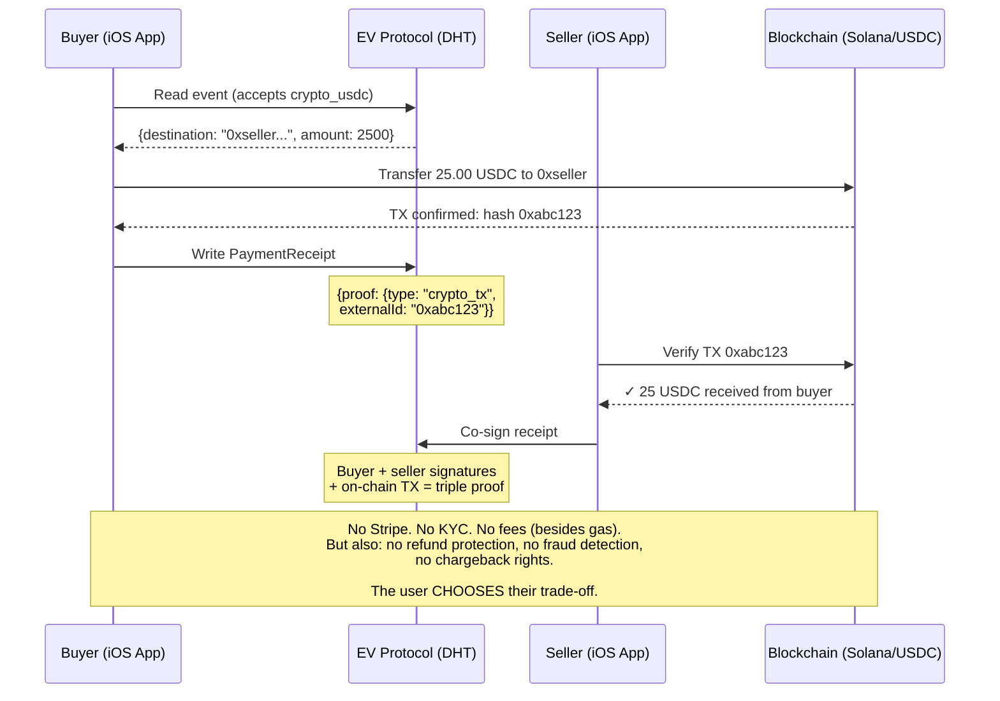

# EV Protocol: Payments Architecture

> **TL;DR**: The protocol should NOT handle payments natively. Payments are an app-layer concern, not a protocol concern. The protocol provides payment *schemas* (intent, status, receipts) — the actual money moves through established payment rails (Stripe Connect, RevenueCat, crypto). This is the right design, not a compromise.

---

## Should the Protocol Handle Payments?

**No. And this is a strong, deliberate architectural choice — not a gap.**

Here's why:

### What "Native Protocol Payments" Would Mean

```
If EV Protocol handled payments natively, it would need:

  1. MONEY MOVEMENT
     └── Hold funds between buyer and seller
     └── Split payments (platform fee, organiser payout, tax)
     └── Currency conversion (AUD, USD, EUR, etc.)
     └── Multi-party settlement (venue, performer, organiser, platform)
     
  2. COMPLIANCE
     └── PCI-DSS Level 1 compliance (credit card data)
     └── KYC/AML (Know Your Customer / Anti-Money Laundering)
     └── Per-jurisdiction tax calculation and reporting
     └── 1099s (US), GST (AU), VAT (EU) reporting
     └── Money transmitter licenses (varies by country)
     
  3. DISPUTE RESOLUTION
     └── Chargebacks
     └── Refund policies
     └── Fraud detection
     └── Buyer/seller protection
     
  4. LIABILITY
     └── Who is responsible when payments go wrong?
     └── In a decentralised protocol, who does the buyer sue?
     └── Which jurisdiction's laws apply?
```

### Why This Is Catastrophically Wrong for a Protocol

```
HTTP doesn't process payments.
SMTP doesn't process payments.
AT Protocol doesn't process payments.
BitTorrent doesn't process payments.
ActivityPub doesn't process payments.

These protocols CARRY payment-related data.
The payments happen elsewhere.

Why? Because payments are:
  ├── Jurisdictionally complex (200+ countries, different laws)
  ├── Liability-heavy (someone MUST be liable for lost money)
  ├── Compliance-intensive (PCI-DSS audit alone costs $50-200K)
  ├── A solved problem (Stripe spent $100B+ solving this)
  └── Orthogonal to the protocol's purpose (event discovery)

Embedding payments in the protocol would:
  ├── Make the protocol illegal in many jurisdictions
  ├── Require money transmitter licenses ($$$)
  ├── Create unsolvable liability questions
  ├── Add massive attack surface (financial incentive for hackers)
  └── Solve a problem that's already solved, badly
```

> [!CAUTION]
> **The payment trap**: Every protocol designer eventually thinks "we should add payments." This killed or complicated dozens of protocols. The moment you touch money movement, you become a financial institution in the eyes of regulators. The EV Protocol should learn from this and explicitly NOT be a financial protocol.

---

## What the Protocol SHOULD Handle

The protocol handles **payment schemas** — the structured data that describes, requests, coordinates, and proves payments. The actual money never touches the protocol.

```
WHAT THE PROTOCOL HANDLES          WHAT PAYMENT PROCESSORS HANDLE
──────────────────────────         ─────────────────────────────
Payment INTENT                     Credit card processing
  "This event costs $25"           Bank transfers
                                   Currency conversion
Payment OPTIONS                    PCI-DSS compliance
  "Pay via Stripe / crypto / cash" KYC/AML verification
                                   Tax calculation
Payment STATUS                     Fraud detection
  "User X has paid for event Y"    Chargebacks
                                   Refunds
Payment RECEIPT                    Settlement
  "Cryptographic proof of payment" Payout to organiser
                                   Dispute resolution
Payment POLICY
  "Refundable until 24h before"
  "Sliding scale $0-50"
```

### The HTTP Analogy

```
HTTP doesn't process payments. But HTTP carries ALL payment data:

  POST /checkout
  Content-Type: application/json
  {
    "items": [{"name": "Concert Ticket", "price": 2500}],
    "payment_method": "pm_stripe_abc123",
    "currency": "aud"
  }

  → Stripe processes the actual payment
  → HTTP carries the intent and result
  → The web works perfectly this way

EV Protocol is the same:

  DHT Record: ev.payment.intent
  {
    "eventDhtKey": "VLD0:abc...",
    "amount": 2500,
    "currency": "AUD",
    "paymentMethods": ["stripe", "crypto_usdc"]
  }

  → Stripe/crypto processes the actual payment
  → EV Protocol carries the intent, status, and receipt
  → The decentralised app works perfectly this way
```

---

## Payment Lexicon Schemas

Using the same Lexicon format as the rest of the EV Protocol, here are the payment schemas:

### 1. Ticket Definition (on the event record)

```dart
// This extends the existing event Lexicon — not a new record type
const eventTicketingLexicon = {
  "lexicon": 1,
  "id": "ev.event.calendar.event",
  "defs": {
    "ticketing": {
      "type": "object",
      "description": "Ticketing configuration for a paid event",
      "properties": {
        "model": {
          "type": "string",
          "knownValues": [
            "free",           // No payment required
            "fixed",          // Fixed price ticket
            "tiered",         // Multiple ticket tiers
            "sliding",        // Pay what you can ($0 - max)
            "donation",       // Free with optional donation
            "subscription",   // Requires membership
          ]
        },
        "tiers": {
          "type": "array",
          "description": "Available ticket tiers",
          "items": { "type": "ref", "ref": "#ticketTier" }
        },
        "currency": {
          "type": "string",
          "description": "ISO 4217 currency code",
          "maxLength": 3
        },
        "acceptedMethods": {
          "type": "array",
          "description": "Payment methods the organiser accepts",
          "items": { "type": "ref", "ref": "#paymentMethod" }
        },
        "refundPolicy": {
          "type": "ref",
          "ref": "#refundPolicy"
        },
        "maxCapacity": {
          "type": "integer",
          "minimum": 1
        },
        "soldCount": {
          "type": "integer",
          "description": "Approximate sold count (updated periodically)"
        }
      }
    },
    "ticketTier": {
      "type": "object",
      "required": ["name", "priceMinor"],
      "properties": {
        "name": {
          "type": "string",
          "description": "Tier name: 'General Admission', 'VIP', 'Early Bird'"
        },
        "priceMinor": {
          "type": "integer",
          "description": "Price in minor currency units (cents). 2500 = $25.00",
          "minimum": 0
        },
        "maxPriceMinor": {
          "type": "integer",
          "description": "For sliding scale: maximum price. Null = no max"
        },
        "quantity": {
          "type": "integer",
          "description": "Total tickets available at this tier"
        },
        "description": {
          "type": "string",
          "maxLength": 500
        },
        "salesStart": {
          "type": "string",
          "format": "datetime"
        },
        "salesEnd": {
          "type": "string",
          "format": "datetime"
        }
      }
    },
    "paymentMethod": {
      "type": "object",
      "required": ["type"],
      "properties": {
        "type": {
          "type": "string",
          "knownValues": [
            "stripe",         // Stripe Connect
            "paypal",         // PayPal
            "square",         // Square
            "crypto_btc",     // Bitcoin
            "crypto_usdc",    // USDC stablecoin
            "crypto_sol",     // Solana
            "cash",           // Pay at door
            "bank_transfer",  // Direct bank transfer
            "free",           // No payment
          ]
        },
        "destination": {
          "type": "string",
          "description": "Payment destination — Stripe account ID, crypto address, etc."
        },
        "checkoutUrl": {
          "type": "string",
          "description": "URL to external checkout page (Stripe Checkout, PayPal, etc.)"
        }
      }
    },
    "refundPolicy": {
      "type": "object",
      "properties": {
        "type": {
          "type": "string",
          "knownValues": ["full", "partial", "none", "conditional"]
        },
        "cutoffHours": {
          "type": "integer",
          "description": "Hours before event when refunds are no longer available"
        },
        "description": {
          "type": "string",
          "maxLength": 500
        }
      }
    }
  }
};
```

### 2. Payment Intent (buyer → protocol)

```dart
const paymentIntentLexicon = {
  "lexicon": 1,
  "id": "ev.payment.intent",
  "defs": {
    "main": {
      "type": "record",
      "description": "A buyer's intent to pay for an event ticket",
      "key": "tid",
      "record": {
        "type": "object",
        "required": ["eventDhtKey", "buyerPubkey", "tierName", "amountMinor", "currency", "createdAt"],
        "properties": {
          "eventDhtKey": {
            "type": "string",
            "description": "DHT key of the event"
          },
          "buyerPubkey": {
            "type": "string",
            "description": "Veilid public key of the buyer"
          },
          "tierName": {
            "type": "string",
            "description": "Which ticket tier"
          },
          "amountMinor": {
            "type": "integer",
            "description": "Amount in minor currency units (cents)"
          },
          "currency": {
            "type": "string",
            "maxLength": 3
          },
          "paymentMethod": {
            "type": "string",
            "description": "Chosen payment method type"
          },
          "status": {
            "type": "string",
            "knownValues": ["pending", "processing", "completed", "failed", "refunded", "cancelled"]
          },
          "createdAt": {
            "type": "string",
            "format": "datetime"
          }
        }
      }
    }
  }
};
```

### 3. Payment Receipt (proof of payment, stored in DHT)

```dart
const paymentReceiptLexicon = {
  "lexicon": 1,
  "id": "ev.payment.receipt",
  "defs": {
    "main": {
      "type": "record",
      "description": "Cryptographic proof that payment was completed",
      "key": "tid",
      "record": {
        "type": "object",
        "required": ["eventDhtKey", "buyerPubkey", "amountMinor", "currency", "completedAt", "proof"],
        "properties": {
          "eventDhtKey": {
            "type": "string"
          },
          "buyerPubkey": {
            "type": "string"
          },
          "sellerPubkey": {
            "type": "string",
            "description": "Event organiser's Veilid public key"
          },
          "amountMinor": {
            "type": "integer"
          },
          "currency": {
            "type": "string"
          },
          "tierName": {
            "type": "string"
          },
          "completedAt": {
            "type": "string",
            "format": "datetime"
          },
          "proof": {
            "type": "ref",
            "ref": "#paymentProof"
          }
        }
      }
    },
    "paymentProof": {
      "type": "object",
      "required": ["type"],
      "properties": {
        "type": {
          "type": "string",
          "knownValues": ["stripe_receipt", "crypto_tx", "organiser_confirmation", "cash_acknowledgement"]
        },
        "externalId": {
          "type": "string",
          "description": "Stripe PaymentIntent ID, crypto tx hash, etc."
        },
        "receiptUrl": {
          "type": "string",
          "description": "URL to external receipt (Stripe receipt page, block explorer, etc.)"
        },
        "sellerSignature": {
          "type": "string",
          "description": "Organiser's Veilid signature confirming receipt of payment"
        }
      }
    }
  }
};
```

---

## The Complete Payment Flow



---

## Payment Models for Events

Every event has some form of payment. Here's how the schema handles each:

### Free Events

```dart
// Even "free" events have a payment model — it's explicitly free
final freeEvent = EventRecord(
  name: 'Perth Flutter Meetup',
  ticketing: Ticketing(
    model: TicketModel.free,
    tiers: [TicketTier(name: 'General', priceMinor: 0)],
    currency: 'AUD',
    acceptedMethods: [PaymentMethod(type: 'free')],
    maxCapacity: 50,
  ),
);
// RSVP = ticket. No payment flow. Instant confirmation.
```

### Fixed Price Events

```dart
final paidEvent = EventRecord(
  name: 'Sunset Concert at Kings Park',
  ticketing: Ticketing(
    model: TicketModel.fixed,
    tiers: [
      TicketTier(name: 'General Admission', priceMinor: 2500), // $25
      TicketTier(name: 'VIP', priceMinor: 7500),               // $75
    ],
    currency: 'AUD',
    acceptedMethods: [
      PaymentMethod(
        type: 'stripe',
        destination: 'acct_organiser123',
        checkoutUrl: 'https://checkout.stripe.com/pay/cs_abc...',
      ),
      PaymentMethod(
        type: 'cash',
        // No destination — pay at door
      ),
    ],
    refundPolicy: RefundPolicy(
      type: RefundType.conditional,
      cutoffHours: 24,
      description: 'Full refund up to 24 hours before the event',
    ),
    maxCapacity: 500,
  ),
);
```

### Donation-Based Events

```dart
final donationEvent = EventRecord(
  name: 'Community Yoga in the Park',
  ticketing: Ticketing(
    model: TicketModel.donation,
    tiers: [
      TicketTier(
        name: 'Free Entry',
        priceMinor: 0,
      ),
      TicketTier(
        name: 'Suggested Donation',
        priceMinor: 1000,   // $10 suggested
        maxPriceMinor: 5000, // up to $50
      ),
    ],
    acceptedMethods: [
      PaymentMethod(type: 'free'),
      PaymentMethod(type: 'stripe', destination: 'acct_yoga123'),
      PaymentMethod(type: 'crypto_usdc', destination: '0xabc...'),
    ],
  ),
);
```

### Sliding Scale Events

```dart
final slidingEvent = EventRecord(
  name: 'Mental Health Workshop',
  ticketing: Ticketing(
    model: TicketModel.sliding,
    tiers: [
      TicketTier(
        name: 'Pay What You Can',
        priceMinor: 0,       // Min: free
        maxPriceMinor: 5000, // Max: $50
        description: 'No one turned away for lack of funds',
      ),
    ],
    acceptedMethods: [
      PaymentMethod(type: 'stripe', destination: 'acct_workshop'),
    ],
  ),
);
```

---

## Why Schemas Are Enough

### What Schemas Give You

```
Schemas handle:
  ✅ Price display          — "This event costs $25 AUD"
  ✅ Tier selection         — "General / VIP / Early Bird"
  ✅ Payment method choice  — "Stripe / crypto / cash at door"
  ✅ Checkout routing       — "Open Stripe Checkout at this URL"
  ✅ Payment status         — "Pending → Completed → Refunded"
  ✅ Receipt storage        — Cryptographic proof in DHT
  ✅ Ticket verification    — Signed receipt = valid ticket
  ✅ Refund policy display  — "Refundable 24h before event"
  ✅ Capacity tracking      — "47/50 tickets remaining"
  ✅ Revenue model          — Free / fixed / sliding / donation

Schemas DON'T handle (correctly):
  ❌ Credit card numbers    — Stripe tokenises these
  ❌ Bank account details   — Stripe Connect manages these
  ❌ Tax calculation        — Stripe Tax / local tax APIs
  ❌ Fraud detection        — Stripe Radar
  ❌ Chargebacks            — Stripe handles disputes
  ❌ Settlement             — Stripe → organiser's bank
  ❌ PCI compliance         — Stripe is PCI Level 1 certified
  ❌ KYC/AML               — Stripe Connect onboarding
```

### The Boundary Is Clean

```
┌────────────────────────────────────────────────────────────┐
│                                                            │
│  EV PROTOCOL (in-protocol)                                 │
│  ─────────────────────────                                 │
│  "What needs to be paid"        → Payment schemas          │
│  "Who is paying whom"           → Pubkey references        │
│  "What was paid"                → Signed receipt           │
│  "Is this ticket valid"         → Verify receipt signature │
│                                                            │
│  CLEAN HANDOFF BOUNDARY                                    │
│  ─────────────────────                                     │
│  checkoutUrl → opens external payment processor            │
│  Stripe webhook → triggers receipt creation in protocol    │
│                                                            │
│  STRIPE / PAYMENT PROCESSOR (off-protocol)                 │
│  ─────────────────────────────────────────                 │
│  "Collect the money"            → Card processing          │
│  "Verify the buyer"             → KYC/AML                  │
│  "Calculate tax"                → Tax engine               │
│  "Detect fraud"                 → ML fraud detection       │
│  "Settle funds"                 → Bank payout              │
│  "Handle disputes"              → Chargeback management    │
│                                                            │
└────────────────────────────────────────────────────────────┘
```

---

## Crypto Payments: The Native Alternative

For users who want to avoid Stripe entirely, the schema natively supports crypto payments. This flow IS more "protocol-native" because the payment verification can happen on-chain without a centralised processor:



---

## Why This Design Is Better Than Native Protocol Payments

| Dimension | Native Protocol Payments | Schema + External Processors |
|---|---|---|
| **Compliance** | Must build PCI/KYC/AML into protocol | Stripe handles compliance |
| **Liability** | Protocol operators are liable | Payment processor is liable |
| **Jurisdictions** | Must support 200+ countries' laws | Stripe supports 46+ countries |
| **Refunds** | Must build dispute resolution | Stripe/PayPal handle disputes |
| **Currency support** | Must handle forex | Stripe handles 135+ currencies |
| **Attack surface** | Massive (financial incentive) | Minimal (no money in protocol) |
| **Development cost** | $10M+ to build, certify, maintain | ~$0 (use Stripe SDK) |
| **Time to market** | Years | Weeks |
| **User trust** | "Send money to anonymous DHT node" 😬 | "Pay with Stripe" ✅ |
| **Crypto option** | Possible but complex | Trivially supported via schema |
| **Payment flexibility** | Locked to protocol's capabilities | Any processor, any method |
| **Protocol simplicity** | Massively complex | Clean, simple schemas |

> [!IMPORTANT]
> **The architectural principle**: A protocol should be **unopinionated about money movement**. The moment you bake a specific payment mechanism into the protocol, you've created a dependency that's harder to change than any other part of the system. By keeping payments as schemas, any new payment method (Apple Pay, bank instant transfer, crypto, CBDC, whatever comes next) is supported by adding a new `paymentMethod` value to the schema — no protocol change needed.

---

## Implementation in Flutter

```dart
// lib/services/payment/payment_service.dart

class PaymentService {
  final VeilidSchemaLayer _schema;

  /// Initiate payment for an event
  Future<PaymentResult> pay({
    required EventRecord event,
    required TicketTier tier,
    required PaymentMethod method,
  }) async {
    // 1. Create payment intent in DHT
    final intentKey = await _schema.createRecord(
      collection: 'ev.payment.intent',
      data: {
        'eventDhtKey': event.dhtKey,
        'buyerPubkey': myPubkey.toString(),
        'tierName': tier.name,
        'amountMinor': tier.priceMinor,
        'currency': event.ticketing!.currency,
        'paymentMethod': method.type,
        'status': 'pending',
        'createdAt': DateTime.now().toIso8601String(),
      },
    );

    // 2. Route to appropriate payment processor
    switch (method.type) {
      case 'stripe':
        return _handleStripePayment(event, tier, method, intentKey);
      case 'crypto_usdc':
        return _handleCryptoPayment(event, tier, method, intentKey);
      case 'cash':
        return _handleCashPayment(event, tier, intentKey);
      case 'free':
        return _handleFreeTicket(event, tier, intentKey);
      default:
        throw UnsupportedPaymentMethodException(method.type);
    }
  }

  Future<PaymentResult> _handleStripePayment(
    EventRecord event,
    TicketTier tier,
    PaymentMethod method,
    DhtRecordKey intentKey,
  ) async {
    // Open Stripe Checkout (exits the app briefly)
    final result = await StripeService.checkout(
      checkoutUrl: method.checkoutUrl!,
      amount: tier.priceMinor,
      currency: event.ticketing!.currency,
    );

    if (result.success) {
      // Write receipt to DHT
      await _schema.createRecord(
        collection: 'ev.payment.receipt',
        data: {
          'eventDhtKey': event.dhtKey,
          'buyerPubkey': myPubkey.toString(),
          'sellerPubkey': event.creatorPubkey,
          'amountMinor': tier.priceMinor,
          'currency': event.ticketing!.currency,
          'tierName': tier.name,
          'completedAt': DateTime.now().toIso8601String(),
          'proof': {
            'type': 'stripe_receipt',
            'externalId': result.paymentIntentId,
            'receiptUrl': result.receiptUrl,
          },
        },
      );

      // Update intent status
      await _schema.updateRecord(
        key: intentKey,
        collection: 'ev.payment.intent',
        data: {'status': 'completed'},
      );

      return PaymentResult.success(receiptId: result.paymentIntentId);
    }
    
    return PaymentResult.failed(reason: result.errorMessage);
  }

  Future<PaymentResult> _handleFreeTicket(
    EventRecord event,
    TicketTier tier,
    DhtRecordKey intentKey,
  ) async {
    // Free events still get a receipt — just with zero amount
    await _schema.createRecord(
      collection: 'ev.payment.receipt',
      data: {
        'eventDhtKey': event.dhtKey,
        'buyerPubkey': myPubkey.toString(),
        'sellerPubkey': event.creatorPubkey,
        'amountMinor': 0,
        'currency': 'AUD',
        'tierName': tier.name,
        'completedAt': DateTime.now().toIso8601String(),
        'proof': {
          'type': 'organiser_confirmation',
          'sellerSignature': null, // Auto-confirmed for free events
        },
      },
    );

    await _schema.updateRecord(
      key: intentKey,
      collection: 'ev.payment.intent',
      data: {'status': 'completed'},
    );

    return PaymentResult.success(receiptId: 'free');
  }
}
```

---

## EV Protocol Layer Update

```
┌──────────────────────────────────────────────────────┐
│               EV Protocol Stack                       │
│                                                      │
│  ┌──────────────────────────────────────────────┐    │
│  │  Layer 5: PAYMENTS (schema only)              │    │
│  │  Payment intent, receipt, and proof schemas   │    │
│  │  Checkout routing to external processors      │    │
│  │  Cryptographic receipt verification           │    │
│  │  NO money movement in protocol                │    │
│  └──────────────────────────────────────────────┘    │
│                                                      │
│  ┌──────────────────────────────────────────────┐    │
│  │  Layer 4: SEARCH                              │    │
│  │  Tier 1-3 search architecture                 │    │
│  └──────────────────────────────────────────────┘    │
│                                                      │
│  ┌──────────────────────────────────────────────┐    │
│  │  Layer 3: SCHEMA (Lexicon enforcement)        │    │
│  │  VeilidSchemaLayer validates all records       │    │
│  └──────────────────────────────────────────────┘    │
│                                                      │
│  ┌──────────────────────────────────────────────┐    │
│  │  Layer 2: IDENTITY (bridged)                  │    │
│  │  Veilid + AT Protocol key bridge              │    │
│  └──────────────────────────────────────────────┘    │
│                                                      │
│  ┌──────────────────────────────────────────────┐    │
│  │  Layer 1: NETWORK (Veilid DHT)                │    │
│  └──────────────────────────────────────────────┘    │
│                                                      │
│  ┌──────────────────────────────────────────────┐    │
│  │  Layer 0: TRANSPORT (Veilid)                  │    │
│  └──────────────────────────────────────────────┘    │
│                                                      │
│  ┌ ─ ─ ─ ─ ─ ─ ─ ─ ─ ─ ─ ─ ─ ─ ─ ─ ─ ─ ─ ─ ┐    │
│    OFF-PROTOCOL: Payment Processors              │    │
│  │ Stripe Connect │ PayPal │ Crypto │ Cash       │    │
│    (NOT part of EV Protocol)                     │    │
│  └ ─ ─ ─ ─ ─ ─ ─ ─ ─ ─ ─ ─ ─ ─ ─ ─ ─ ─ ─ ─ ┘    │
└──────────────────────────────────────────────────────┘
```

---

*Last updated: 2026-04-06*
*Part of: [EV Search Architecture](./ev-protocol-search-architecture.md) | [Veilid Scale Analysis](./veilid-scale-identity-search.md) | [Protocol Candidates](./protocol-candidates-solving-weaknesses.md)*
