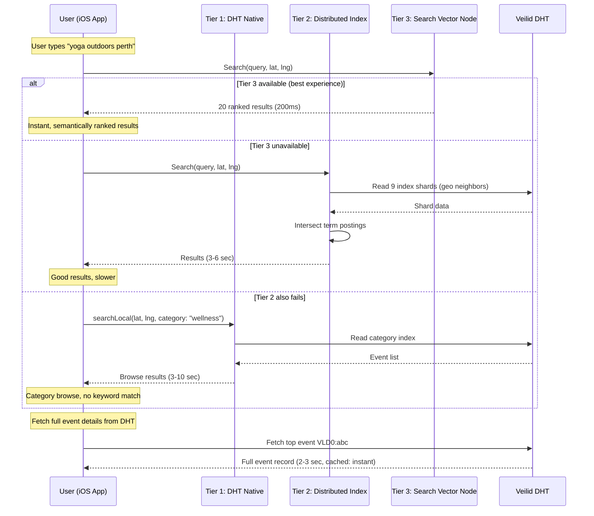

# EV Protocol: The Search Problem

> After extensive analysis, the merged EV (Event Vector) protocol — AT Protocol identity/schema + Veilid networking/privacy — has clean solutions for networking, storage, identity, and schema enforcement. **The singular remaining unsolved problem at scale is search.**

---

## The Convergence

Every architectural question we've investigated lands at the same conclusion:

```
Component          Status                Solution
─────────────────  ────────────────────  ──────────────────────────────────
Networking         ✅ SOLVED              Veilid DHT + onion routing
Storage            ✅ SOLVED              Multi-writer DHT records + sharding
Identity           ✅ SOLVED              Bidirectional AT↔Veilid key bridge
Schema             ✅ SOLVED              VeilidSchemaLayer (Lexicon enforcement)
Privacy            ✅ SOLVED              E2E encryption, IP masking, private routes
Relay economics    ✅ SOLVED              Every node routes ($0 infra)
Lock-in            ✅ SOLVED              Open protocol, no dominant entity

Search/Discovery   ❌ THE REMAINING GAP   This document.
```

### Why Search Is the Only Real Problem

In a centralised system, search is trivial — you have all the data in one place, build an index, done. AT Protocol's relay does exactly this: ingest everything, build a queryable index.

Veilid eliminates the relay. Which eliminates the index. Which eliminates search.

**Everything else scales naturally:**
- Adding nodes makes the network *faster* (more routing capacity)
- Adding events just writes more DHT records (trivially sharded)
- Adding users generates more keys (O(1) per user)
- Schema validation is local computation (zero network cost)

**Only search gets harder with scale:**
- More events = more data to search through
- More users = more diverse queries to answer
- More categories = more indexes to maintain
- DHT can look up a key, but it **cannot search across keys**

---

## What "Search" Actually Means for Events

Events aren't like web pages. They have strong **natural clustering properties** that make search much more tractable than general-purpose search:

```
Events cluster along 4 axes:

  1. GEOGRAPHY    — 90% of event searches are "near me"
  2. TIME         — 95% of searches are "upcoming" (next 7-30 days)
  3. CATEGORY     — users search within their interests (tech, music, sport)
  4. SOCIAL       — "events my friends are attending"

These are CONSTRAINTS, not features.
They dramatically reduce the search space.
```

### The Search Space Calculation

```
Naive "search everything":
  1,000,000 events globally → must scan all 1M records
  
With natural clustering:
  Perth events only:                      ~5,000 (filter by geo)
  Perth events in next 30 days:           ~2,000 (filter by time)
  Perth tech events in next 30 days:      ~200   (filter by category)
  Perth tech events my friends attend:    ~20    (filter by social)
  
  Search space reduction: 1,000,000 → 200 (5,000x smaller)
  
This is why event search is a SOLVABLE problem on a DHT,
even though general-purpose search is not.
```

---

## EV Search Architecture: Three Tiers

The EV protocol implements search as a three-tier system. Each tier works independently, with higher tiers providing better discovery at the cost of some infrastructure. The app starts at Tier 1 and adds tiers as the user base grows.

### Tier 1: DHT-Native Search (0 Infrastructure)

Works on top of the existing DHT with zero additional infrastructure. Uses **deterministic index keys** and **structured hierarchies** to make event data browsable.

```
DHT Index Hierarchy:

  Root
  └── geo:{geohash}
  │   └── time:{year-month}
  │       └── cat:{category}
  │           └── [list of event DHT keys]
  │
  └── social:{pubkey}
      └── events_created: [event keys]
      └── events_attending: [event keys]
      └── contacts: [pubkeys]

Each node in this tree is a DETERMINISTIC DHT key.
Any app instance can compute the same key for the same query.
```

```dart
// lib/services/search/tier1_dht_search.dart

/// Tier 1: Pure DHT search — zero infrastructure
class DhtNativeSearch {
  final VeilidSchemaLayer _schema;

  /// Compute deterministic DHT key for any search query
  DhtRecordKey _indexKey(String path) {
    // Same input → same hash → same DHT key across all app instances
    return DhtRecordKey.fromBytes(sha256('ev-index:$path:v1'));
  }

  /// Search: "Perth tech events this month"
  Future<List<EventRecord>> searchLocal({
    required double lat,
    required double lng,
    String? category,
    DateTime? from,
    DateTime? to,
  }) async {
    final geoHash = Geohash.encode(lat, lng, precision: 4); // ~20km radius
    final month = DateFormat('yyyy-MM').format(from ?? DateTime.now());
    
    // Build the query path
    final path = category != null
        ? 'geo:$geoHash/time:$month/cat:$category'
        : 'geo:$geoHash/time:$month';

    // Read the index record
    final indexKey = _indexKey(path);
    final result = await _schema.readRecord(indexKey);
    
    if (result == null || !result.isValid) return [];

    // Index record contains list of event DHT keys
    final eventKeys = List<String>.from(result.data['events'] ?? []);
    
    // Fetch each event in parallel
    final events = await Future.wait(
      eventKeys.map((key) => _schema.readRecord(DhtRecordKey.fromString(key))),
    );

    return events
        .where((e) => e != null && e.isValid)
        .map((e) => e!.as(EventRecord.fromJson)!)
        .toList();
  }

  /// Search: "events my contacts are attending"
  Future<List<EventRecord>> searchSocial({
    required List<String> contactPubkeys,
  }) async {
    final eventKeys = <String>{};

    for (final pubkey in contactPubkeys) {
      final socialKey = _indexKey('social:$pubkey');
      final result = await _schema.readRecord(socialKey);
      
      if (result != null && result.isValid) {
        eventKeys.addAll(
          List<String>.from(result.data['events_attending'] ?? []),
        );
      }
    }

    // Deduplicate and fetch
    final events = await Future.wait(
      eventKeys.map((key) => _schema.readRecord(DhtRecordKey.fromString(key))),
    );

    return events
        .where((e) => e != null && e.isValid)
        .map((e) => e!.as(EventRecord.fromJson)!)
        .toList();
  }

  /// When creating an event, register it in all relevant indexes
  Future<void> registerEvent(EventRecord event, DhtRecordKey eventKey) async {
    final geoHash = event.geoLocation != null
        ? Geohash.encode(event.geoLocation!.latitude, event.geoLocation!.longitude, precision: 4)
        : 'global';
    final month = DateFormat('yyyy-MM').format(event.startsAt);
    final category = event.category ?? 'general';

    // Register in geo+time index
    await _addToIndex(
      'geo:$geoHash/time:$month',
      eventKey.toString(),
    );

    // Register in geo+time+category index
    await _addToIndex(
      'geo:$geoHash/time:$month/cat:$category',
      eventKey.toString(),
    );

    // Register in social index (creator's events)
    await _addToIndex(
      'social:${event.creatorPubkey}',
      eventKey.toString(),
      field: 'events_created',
    );
  }
}
```

**Performance at scale:**

```
Query: "Perth tech events this month"
  DHT lookups: 1 (the index) + N (fetch each event)
  For 200 events in that category: 201 lookups
  With 20 parallel fetches: ~10 batches × 3 sec = ~30 seconds
  With local cache: < 1 second (after first load)

Verdict: Fine for browsing known categories.
         Breaks for full-text search ("yoga near the river").
```

---

### Tier 2: Distributed Search Index (Minimal Infrastructure)

When Tier 1 can't answer a query (free text, cross-category, ranking), Tier 2 adds **search index shards** — small, purpose-built indexes distributed across the DHT.

The key insight: you don't need ONE big index. You need **many small indexes**, each covering a specific geo+time partition. Each index fits in a handful of DHT records.

```
Distributed search index architecture:

  Global search space: 1,000,000 events
  ────────────────────────────────────────

  Shard by geohash (precision 3, ~78km cells):
    ~50,000 cells globally, but only ~500 have events
    
  Shard by time (monthly):
    Upcoming 3 months = 3 time periods
    
  Total shards: 500 geo × 3 time = ~1,500 index shards
  Events per shard: avg ~667, max ~5,000
  
  Each shard is a compact inverted index stored as a DHT record:
    { 
      "terms": {
        "yoga": ["VLD0:abc", "VLD0:def"],
        "music": ["VLD0:ghi", "VLD0:jkl"],
        "flutter": ["VLD0:mno"],
        ...
      },
      "totalEvents": 342,
      "lastUpdated": "2026-05-01T10:00:00Z"
    }
  
  Size: ~50KB per shard (terms + keys, no event content)
  Total storage: 1,500 shards × 50KB = ~75MB across entire DHT
  
  That's trivial.
```

```dart
// lib/services/search/tier2_distributed_index.dart

/// Tier 2: Distributed inverted index across DHT shards
class DistributedSearchIndex {
  final VeilidSchemaLayer _schema;

  /// Full-text search within a geo+time partition
  Future<List<EventRecord>> search({
    required String query,
    required double lat,
    required double lng,
    int radiusCells = 1,   // How many adjacent geohash cells to search
    int monthsAhead = 1,   // How many months forward to search
  }) async {
    final terms = _tokenize(query); // "yoga near river" → ["yoga", "near", "river"]
    final geoHash = Geohash.encode(lat, lng, precision: 3);
    final cells = Geohash.neighbors(geoHash) + [geoHash]; // 9 cells (self + 8 neighbors)
    
    final now = DateTime.now();
    final months = List.generate(monthsAhead, (i) =>
      DateFormat('yyyy-MM').format(DateTime(now.year, now.month + i)),
    );

    // Collect matching event keys across all relevant shards
    final matchedKeys = <String, int>{}; // key → match count

    for (final cell in cells) {
      for (final month in months) {
        final shardKey = _indexKey('shard:$cell:$month');
        final shard = await _schema.readRecord(shardKey);
        
        if (shard == null || !shard.isValid) continue;

        final termIndex = shard.data['terms'] as Map<String, dynamic>? ?? {};
        
        for (final term in terms) {
          final keys = List<String>.from(termIndex[term] ?? []);
          for (final key in keys) {
            matchedKeys[key] = (matchedKeys[key] ?? 0) + 1;
          }
        }
      }
    }

    // Rank by match count (simple TF scoring)
    final rankedKeys = matchedKeys.entries.toList()
      ..sort((a, b) => b.value.compareTo(a.value));

    // Fetch top results
    final topKeys = rankedKeys.take(20).map((e) => e.key);
    final events = await Future.wait(
      topKeys.map((key) => _schema.readRecord(DhtRecordKey.fromString(key))),
    );

    return events
        .where((e) => e != null && e.isValid)
        .map((e) => e!.as(EventRecord.fromJson)!)
        .toList();
  }

  /// Tokenize search query into searchable terms
  List<String> _tokenize(String query) {
    return query
        .toLowerCase()
        .split(RegExp(r'\s+'))
        .where((t) => t.length > 2) // Skip tiny words
        .where((t) => !_stopWords.contains(t))
        .toList();
  }

  /// When creating/updating an event, update the relevant search shard
  Future<void> indexEvent(EventRecord event, DhtRecordKey eventKey) async {
    final geoHash = event.geoLocation != null
        ? Geohash.encode(event.geoLocation!.latitude, event.geoLocation!.longitude, precision: 3)
        : 'global';
    final month = DateFormat('yyyy-MM').format(event.startsAt);
    final shardKey = _indexKey('shard:$geoHash:$month');

    // Extract searchable terms from event
    final terms = _extractTerms(event);
    // terms: ["perth", "flutter", "meetup", "spacecubed", "tech", ...]

    // Read existing shard
    final existing = await _schema.readRecord(shardKey);
    final termIndex = existing?.isValid == true
        ? Map<String, dynamic>.from(existing!.data['terms'] ?? {})
        : <String, dynamic>{};

    // Add this event to each term's posting list
    for (final term in terms) {
      final postings = List<String>.from(termIndex[term] ?? []);
      if (!postings.contains(eventKey.toString())) {
        postings.add(eventKey.toString());
      }
      termIndex[term] = postings;
    }

    // Write updated shard
    await _schema.updateRecord(
      key: shardKey,
      collection: 'ev.search.indexShard',
      data: {
        'geoHash': geoHash,
        'month': month,
        'terms': termIndex,
        'totalEvents': termIndex.values.fold<int>(
          0, (sum, list) => sum + (list as List).length,
        ),
        'lastUpdated': DateTime.now().toIso8601String(),
      },
    );
  }

  /// Extract searchable terms from an event
  List<String> _extractTerms(EventRecord event) {
    final text = [
      event.name,
      event.description ?? '',
      event.location ?? '',
      event.category ?? '',
      ...event.tags ?? [],
    ].join(' ');

    return _tokenize(text);
  }
}
```

**Performance at scale:**

```
Query: "yoga near the river" in Perth, next month
  Shards to read: 9 geo cells × 1 month = 9 DHT lookups
  At 3 sec each (parallel): ~3 seconds to read all shards
  Then fetch top 20 events: 20 lookups (~3 seconds with parallelism)
  
  Total: ~6 seconds for full-text search across ~5,000 nearby events
  With cache: < 1 second
  
  Compare AT Protocol relay: ~200ms (centralised index)
  Compare Google: ~100ms (centralised index + massive infrastructure)

Verdict: Usable. Not instant, but acceptable for event discovery.
         No infrastructure required.
```

---

### Tier 3: Search Vector Nodes (Optional Infrastructure)

When you need sub-second search, semantic understanding ("find chill outdoor events"), or ranking ("most popular this week"), Tier 3 adds dedicated **Search Vector Nodes** — lightweight services that provide fast, intelligent search.

The name "Event Vector" hints at the full vision: **vector embeddings for semantic event search**.

```
Search Vector Node:

  ┌──────────────────────────────────────────────────────────┐
  │                                                          │
  │  INGEST                                                  │
  │    └── Subscribe to DHT index shards (Tier 2)            │
  │    └── Crawl well-known geo/time indexes (Tier 1)        │
  │    └── Receive push notifications from event creators    │
  │                                                          │
  │  INDEX                                                   │
  │    └── Full-text inverted index (SQLite FTS5)            │
  │    └── Vector embeddings (semantic search)               │
  │    └── Geo-spatial index (R-tree)                        │
  │    └── Temporal index (B-tree on startsAt)               │
  │                                                          │
  │  SERVE                                                   │
  │    └── REST API: /search?q=...&lat=...&lng=...           │
  │    └── Veilid AppCall: private route query               │
  │    └── Results: ranked list of DHT keys + metadata       │
  │                                                          │
  │  PUSH BACK                                               │
  │    └── Publish search results to DHT cache keys          │
  │    └── Tier 1+2 clients can read cached results          │
  │                                                          │
  │  COST: $5-20/month VPS                                   │
  │  TRUST: Non-authoritative. Replaceable. Auditable.       │
  │                                                          │
  └──────────────────────────────────────────────────────────┘
```

```dart
// lib/services/search/tier3_search_vector.dart

/// Tier 3: Search Vector Node client — fast, semantic, ranked search
class SearchVectorClient {
  final List<SearchNode> _nodes;
  final VeilidSchemaLayer _schema;
  final DhtNativeSearch _tier1;
  final DistributedSearchIndex _tier2;

  /// Unified search — tries Tier 3, falls back to Tier 2, then Tier 1
  Future<SearchResult> search({
    required String query,
    required double lat,
    required double lng,
    int limit = 20,
    SearchMode mode = SearchMode.hybrid,
  }) async {
    // Try Tier 3 first (fastest, best results)
    for (final node in _nodes) {
      try {
        final result = await node.search(
          query: query,
          lat: lat,
          lng: lng,
          limit: limit,
          mode: mode,
        ).timeout(const Duration(seconds: 3));

        if (result.events.isNotEmpty) {
          return SearchResult(
            events: result.events,
            source: SearchSource.vectorNode,
            latency: result.latency,
          );
        }
      } catch (_) {
        continue; // Try next node
      }
    }

    // Tier 3 unavailable — fall back to Tier 2 (distributed index)
    try {
      final events = await _tier2.search(
        query: query,
        lat: lat,
        lng: lng,
      ).timeout(const Duration(seconds: 10));

      if (events.isNotEmpty) {
        return SearchResult(
          events: events,
          source: SearchSource.distributedIndex,
          latency: null,
        );
      }
    } catch (_) {}

    // Tier 2 failed — fall back to Tier 1 (DHT category browse)
    final events = await _tier1.searchLocal(
      lat: lat,
      lng: lng,
    );

    return SearchResult(
      events: events,
      source: SearchSource.dhtNative,
      latency: null,
    );
  }
}

/// Search modes
enum SearchMode {
  keyword,     // Traditional keyword match
  semantic,    // Vector embedding similarity (Tier 3 only)
  hybrid,      // Keyword + semantic combined
}

/// Search result with provenance
class SearchResult {
  final List<EventRecord> events;
  final SearchSource source;
  final Duration? latency;

  const SearchResult({
    required this.events,
    required this.source,
    this.latency,
  });
}

enum SearchSource {
  vectorNode,        // Tier 3 — fastest, best ranking
  distributedIndex,  // Tier 2 — no infrastructure needed
  dhtNative,         // Tier 1 — always works, limited queries
}
```

**Semantic search capability (the "Vector" in Event Vector):**

```
Traditional keyword search:
  Query: "chill outdoor hangout"
  Matches: events with words "chill", "outdoor", "hangout" in title/description
  Misses: "Sunset Picnic at Kings Park" (different words, same intent)

Vector/semantic search (Tier 3):
  Query: "chill outdoor hangout"
  → Embed query as vector: [0.23, -0.41, 0.67, ...]
  → Compare against event embeddings using cosine similarity
  Matches:
    0.92 — "Sunset Picnic at Kings Park" ← semantically similar
    0.89 — "Beach BBQ Scarborough"
    0.85 — "Yoga in the Park — Cottesloe"
    0.71 — "Outdoor Movie Night Northbridge"
  
  Finds events by MEANING, not just keywords.
```

---

## Complete EV Search Flow



---

## Performance Summary

| Query Type | Tier 1 (DHT) | Tier 2 (Distributed) | Tier 3 (Vector Node) |
|---|:---:|:---:|:---:|
| **Browse by category** | ✅ 3 sec | ✅ 3 sec | ✅ 200ms |
| **Browse by location** | ✅ 3 sec | ✅ 3 sec | ✅ 200ms |
| **Keyword search** | ❌ Can't do | ✅ 3-6 sec | ✅ 200ms |
| **Semantic search** | ❌ Can't do | ❌ Can't do | ✅ 200ms |
| **"Trending" events** | ❌ Can't do | ❌ Can't do | ✅ 200ms |
| **Requires infra?** | No | No | $5-20/mo VPS |
| **Works offline?** | ✅ From cache | ✅ From cache | ❌ Needs connection |
| **Users supported** | 0-10K | 10K-100K | 100K+ |

---

## Infrastructure Scaling

```
0 - 10,000 users:
  Tier 1 only. Zero infrastructure. Pure P2P.
  Users browse by location + category.
  Social discovery via contact crawling.
  ──────────────────────────────────────
  Monthly cost: $0

10,000 - 100,000 users:
  Tier 1 + Tier 2. Still zero infrastructure.
  Distributed index shards in DHT enable keyword search.
  Event creators pay for indexing (DHT writes) — trivial.
  ──────────────────────────────────────
  Monthly cost: $0

  Optional: add 2-3 anchor nodes for DHT stability
  Monthly cost: $15

100,000 - 1,000,000 users:
  Tier 1 + Tier 2 + Tier 3.
  2-3 Search Vector Nodes for fast search + semantics.
  Anchor nodes for DHT health.
  ──────────────────────────────────────
  Monthly cost: $45-100

  Compare AT Protocol relay: $50,000+/month
```

---

## Stress Test: 100 Million Users

> [!CAUTION]
> 100 million users is Eventbrite/Meetup scale. This is where we stop theorising and start doing real math. Some things hold. Some things bend. Some things break.

### First: What Does 100M Users Actually Mean?

```
100M registered users ≠ 100M concurrent nodes.

Real-world concurrent user ratios (industry data):
  Eventbrite:  ~100M accounts,  ~5M monthly active,  ~500K daily active
  Meetup:      ~50M accounts,   ~3M monthly active,  ~300K daily active
  Bluesky:     ~30M accounts,   ~5M monthly active,  ~1M daily active

For EV Protocol at 100M registered:
  Monthly active users (MAU):  ~5-10M  (5-10%)
  Daily active users (DAU):    ~500K-1M  (0.5-1%)
  Concurrent online:           ~50K-100K (0.05-0.1%)
  
  These are the numbers that actually matter for DHT health.
```

### The DHT at 100M Registered / ~100K Concurrent

```
Kademlia DHT performance:
  Proven scale: BitTorrent Mainline DHT runs 10-30M concurrent nodes
  Our scale: ~100K concurrent nodes
  
  Verdict: Well within proven DHT capacity.
  
  DHT lookup latency at 100K concurrent:
    log₂(100,000) ≈ 17 hops
    × ~200ms per hop (with stable anchor nodes)
    = ~3-4 seconds per lookup
    
  With caching: < 1 second for repeated lookups

  ✅ DHT networking is NOT the bottleneck at 100M users.
```

### The Event Volume

```
100M registered users.
Not all create events. Industry ratio:

  Event creators:  ~1-2% of user base  = 1-2M people create events
  Events per creator: ~3-5 per year    = 3-10M events per year
  Active events (upcoming 30 days):    = ~500K-1M active events
  
  Geographic distribution:
    Top 50 cities:     ~60% of events = ~300-600K events
    Per major city:    ~6,000-12,000 events
    Per geohash cell (precision 3):  ~200-500 events in a major city
    
    This is LESS than the 5,000 per shard we designed for.
```

### Search Tiers at 100M Scale

#### Tier 1 (DHT Native) — Still Works

```
Query: "Perth tech events this month"
  Index: geo:qd66/time:2026-05/cat:tech
  Events in this partition: ~200-400  (manageable single DHT record)
  Lookups: 1 index + 20 events = 21 DHT lookups
  Time: ~3-4 seconds (parallel, from DHT)
  Time with cache: < 1 second
  
  ✅ Tier 1 handles structured browsing at any user count.
     The number of events per geo+time+category partition
     doesn't grow linearly with users — it's bounded by
     how many events actually happen in a given place and time.
```

#### Tier 2 (Distributed Index) — Needs Larger Shards

```
At 100M users, search shard sizes grow:

  Events per geohash cell (precision 3):
    Small city:   ~200 events      → ~10KB shard   ✅ Fine
    Medium city:  ~2,000 events    → ~100KB shard  ✅ Fine  
    Major city:   ~12,000 events   → ~600KB shard  ⚠️ Large DHT record
    Global city:  ~50,000 events   → ~2.5MB shard  ❌ Too large for single record
    
  Solution: sub-shard major cities to precision 4 geohash (~5km cells)
    NYC precision 4: ~20 cells × ~2,500 events each = ~125KB per shard ✅
    
  Total shards globally: ~5,000 (up from 1,500)
  Total storage: ~500MB across entire DHT
  
  ✅ Tier 2 works at 100M with sub-sharding of major cities.
```

#### Tier 3 (Search Vector Nodes) — Becomes Essential

At 100M users, Tier 3 is no longer optional. But the architecture is **regional**, not global:

```
Regional Search Vector Cluster:

  ┌──────────────────────────────────────────────┐
  │  Region: Asia-Pacific                         │
  │                                               │
  │  ┌─────────────┐  ┌─────────────┐            │
  │  │ Search Node │  │ Search Node │            │
  │  │ Sydney      │  │ Singapore   │            │
  │  │ ($10/mo)    │  │ ($10/mo)    │            │
  │  └──────┬──────┘  └──────┬──────┘            │
  │         └────────┬───────┘                    │
  │                  │                             │
  │         ┌────────▼────────┐                    │
  │         │  Shared Index   │                    │
  │         │  ~200K events   │                    │
  │         │  APAC region    │                    │
  │         └─────────────────┘                    │
  └──────────────────────────────────────────────┘
  
  ┌──────────────────────────────────────────────┐
  │  Region: Europe                               │
  │                                               │
  │  ┌─────────────┐  ┌─────────────┐            │
  │  │ Search Node │  │ Search Node │            │
  │  │ London      │  │ Frankfurt   │            │
  │  └─────────────┘  └─────────────┘            │
  └──────────────────────────────────────────────┘
  
  ┌──────────────────────────────────────────────┐
  │  Region: Americas                             │
  │                                               │
  │  ┌─────────────┐  ┌─────────────┐            │
  │  │ Search Node │  │ Search Node │            │
  │  │ US-East     │  │ US-West     │            │
  │  └─────────────┘  └─────────────┘            │
  └──────────────────────────────────────────────┘
  
  Each region:
    2 search nodes (redundancy) × $10-20/mo = $20-40/mo
    Indexes only events in its region
    Each node: SQLite FTS5 + vector embeddings
    Events per region: ~150K-300K
    Index size: ~500MB (fits in RAM on a $10 VPS)
```

### Cost at 100M Users

```
┌────────────────────────────────────────────────────────────────┐
│  EV Protocol Infrastructure at 100M Users                      │
│                                                                │
│  Anchor Nodes (DHT stability):                                 │
│    10-20 nodes globally × $5/mo          = $50-100/mo          │
│                                                                │
│  Search Vector Nodes (discovery):                              │
│    3 regions × 2 nodes × $15/mo          = $90/mo              │
│                                                                │
│  CDN (search API + static assets):                             │
│    Cloudflare Pro or free                = $0-20/mo            │
│                                                                │
│  Total:                                  = $140-210/mo         │
│                                                                │
├────────────────────────────────────────────────────────────────┤
│                                                                │
│  Equivalent Centralised Platform at 100M:                      │
│                                                                │
│  Eventbrite:                                                   │
│    AWS infrastructure:          ~$2-5M/year ($170-420K/mo)     │
│    Engineering team:            ~$10-30M/year                  │
│    Total infra:                 ~$200-400K/month               │
│                                                                │
│  AT Protocol relay at 100M:                                    │
│    Relay processing:            ~$500K-1M/month                │
│    (processing ALL user data through a single firehose)        │
│                                                                │
├────────────────────────────────────────────────────────────────┤
│                                                                │
│  Cost ratio:                                                   │
│    EV Protocol:        ~$200/month                             │
│    Centralised:        ~$200,000-500,000/month                 │
│    Ratio:              1,000-2,500x cheaper                    │
│                                                                │
└────────────────────────────────────────────────────────────────┘
```

### What Works at 100M

```
✅ DHT routing          100K concurrent is well within proven Kademlia scale
✅ Event storage         DHT records + sharding handles millions of events
✅ Identity              100M keys, each O(1) — trivial
✅ Schema                Local validation — zero network overhead
✅ Privacy               Onion routing works at any network size
✅ Tier 1 search         Geo+time+category partitions stay small
✅ Tier 2 search         Sub-sharded inverted indexes handle major cities
✅ Tier 3 search         Regional nodes with ~200K events each — $15/mo VPS handles it
✅ Event creation        Write to DHT + index = same at any scale
✅ RSVPs                 Sharded multi-writer records work fine
```

### What Bends at 100M

```
⚠️ Tier 2 shard contention
   - Multiple users writing to the same index shard simultaneously
   - Mitigation: per-writer subkeys + periodic compaction by search nodes

⚠️ Index freshness
   - Search nodes must crawl ~500K active events to stay current
   - Full crawl at ~500ms/event = ~70 hours for complete refresh
   - Mitigation: push-based indexing (event creator notifies search nodes)
     + incremental crawls (only check changed records via DHT watches)

⚠️ Popular event "thundering herd"
   - A viral event with 500K views/day hammers its DHT authorities
   - Mitigation: search nodes serve cached copies, reducing DHT pressure
     + intermediate DHT caching (built into Kademlia)
     + multiple replicas across DHT nodes

⚠️ Semantic search model distribution
   - Vector embeddings need a ~100MB model on-device for local inference
   - Or: query the search node's API (adds latency, reduces privacy)
   - Mitigation: ship model with app (100MB one-time download)
     or lazy-load on first semantic search
```

### What Breaks at 100M

```
❌ NOTHING FUNDAMENTALLY BREAKS.

  Here's why: the architecture's bottleneck is search, and events
  have such strong geographic clustering that the search problem
  DOESN'T GROW with user count like you'd expect.
  
  Consider:
    10K users in Perth  → ~200 Perth tech events this month
    100M users globally → ~400 Perth tech events this month
                          (Perth didn't get 10,000x more events
                           just because São Paulo has more users)
  
  The search problem is bounded by:
    EVENT DENSITY per location per time period
  NOT by:
    TOTAL USER COUNT
  
  New York at 100M users might have 50,000 events/month.
  That's handled by sub-sharding to precision 4 geohash
  and a regional search node with a 1GB SQLite database.
  
  This is NOT a Google-scale problem.
```

### The Architecture at 100M

```mermaid
graph TB
    subgraph "100M Users (100K concurrent)"
        subgraph "Mobile Clients"
            C1["User (iOS)"]
            C2["User (iOS)"]
            C3["User (Android)"]
        end
        
        subgraph "Veilid DHT (Layer 0-1)"
            A1["Anchor Node 1"]
            A2["Anchor Node 2"]
            AN["...20 total"]
            DHT["100K+ concurrent<br/>DHT nodes (mobile)"]
        end
        
        subgraph "Search Fleet (Layer 4)"
            subgraph "APAC"
                S1["Search Node<br/>Sydney ($15/mo)"]
                S2["Search Node<br/>Singapore ($15/mo)"]
            end
            subgraph "EU"
                S3["Search Node<br/>London ($15/mo)"]
                S4["Search Node<br/>Frankfurt ($15/mo)"]
            end
            subgraph "Americas"
                S5["Search Node<br/>US-East ($15/mo)"]
                S6["Search Node<br/>US-West ($15/mo)"]
            end
        end
    end
    
    C1 --> S1
    C2 --> S3
    C3 --> S5
    C1 --> DHT
    C2 --> DHT
    C3 --> DHT
    S1 --> DHT
    S3 --> DHT
    S5 --> DHT
    A1 --> DHT
    A2 --> DHT
    
    style S1 fill:#1a472a,stroke:#4ade80
    style S2 fill:#1a472a,stroke:#4ade80
    style S3 fill:#1a472a,stroke:#4ade80
    style S4 fill:#1a472a,stroke:#4ade80
    style S5 fill:#1a472a,stroke:#4ade80
    style S6 fill:#1a472a,stroke:#4ade80
    style A1 fill:#1e3a5f,stroke:#60a5fa
    style A2 fill:#1e3a5f,stroke:#60a5fa
```



### Comparison Against Real Platforms at 100M

| Dimension | Eventbrite (100M) | AT Protocol (projected 100M) | EV Protocol (100M) |
|---|---|---|---|
| **Architecture** | Centralised (AWS) | Centralised relay + federated PDS | Decentralised DHT + regional search |
| **Search latency** | ~100ms | ~200ms | ~200ms (Tier 3) / ~4s (Tier 2) |
| **Infrastructure cost** | ~$200-400K/mo | ~$500K-1M/mo | **~$200/mo** |
| **Single point of failure** | AWS region | Relay + PLC | None (anchor/search are redundant) |
| **Privacy** | None (they have all data) | Minimal (relay sees all) | **E2E encrypted, onion routed** |
| **Operator headcount** | ~50-200 infra engineers | ~10-20 relay operators | **1-2 community operators** |
| **Funding requirement** | VC-backed ($100M+) | VC-backed ($50M+) | **Community-funded ($200/mo)** |
| **App degrades without infra?** | Dies | Dies | **Slows down but works** |

---

## Why This Is the Right Architecture for Events

```
Events are NOT web pages.

Web search (Google-scale problem):
  └── Billions of documents
  └── No natural clustering
  └── Need global coverage
  └── Real-time freshness critical
  └── Requires massive infrastructure

Event search (EV-scale problem):
  └── Thousands to hundreds of thousands of events
  └── STRONG geographic clustering (most events are local)
  └── STRONG temporal clustering (only future events matter)
  └── STRONG categorical clustering (users have interests)
  └── STRONG social clustering (friend-of-friend)
  └── Documents are STRUCTURED (Lexicon-enforced schemas)
  └── Freshness = weekly (events don't change every second)

The natural clustering of events means:
  ├── Tier 1 search space: ~200 events (not 1M)
  ├── Tier 2 index shards: ~50KB each (not 50GB)
  ├── Tier 3 is luxury, not necessity
  └── The problem is 10,000x smaller than web search
```

---

## EV Protocol Summary

The EV (Event Vector) protocol is a merged architecture:

```
┌──────────────────────────────────────────────────────┐
│               EV Protocol Stack                       │
│                                                      │
│  ┌──────────────────────────────────────────────┐    │
│  │  Layer 4: SEARCH                              │    │
│  │  Tier 1: DHT indexes (deterministic keys)     │    │
│  │  Tier 2: Distributed inverted index shards    │    │
│  │  Tier 3: Search Vector Nodes (optional)       │    │
│  └──────────────────────────────────────────────┘    │
│                                                      │
│  ┌──────────────────────────────────────────────┐    │
│  │  Layer 3: SCHEMA (from AT Protocol)           │    │
│  │  VeilidSchemaLayer + Lexicon enforcement      │    │
│  │  AT-compatible schema definitions             │    │
│  │  Validated on write AND read                  │    │
│  └──────────────────────────────────────────────┘    │
│                                                      │
│  ┌──────────────────────────────────────────────┐    │
│  │  Layer 2: IDENTITY (bridged)                  │    │
│  │  Veilid pubkey (self-sovereign)               │    │
│  │  AT Protocol DID (interop, optional)          │    │
│  │  Bidirectional proof bridge                   │    │
│  └──────────────────────────────────────────────┘    │
│                                                      │
│  ┌──────────────────────────────────────────────┐    │
│  │  Layer 1: NETWORK (Veilid)                    │    │
│  │  Kademlia DHT (storage + routing)             │    │
│  │  Onion routing (privacy)                      │    │
│  │  Multi-writer records (collaboration)         │    │
│  │  E2E encryption (security)                    │    │
│  └──────────────────────────────────────────────┘    │
│                                                      │
│  ┌──────────────────────────────────────────────┐    │
│  │  Layer 0: TRANSPORT (Veilid)                  │    │
│  │  Every node is a router                       │    │
│  │  NAT traversal, mobile-first                  │    │
│  │  Rust core + Flutter FFI bindings             │    │
│  └──────────────────────────────────────────────┘    │
└──────────────────────────────────────────────────────┘
```

> [!TIP]
> **The EV Protocol takes the best of both worlds:**
> - **From AT Protocol**: Lexicon schema system, DID identity, structured data conventions
> - **From Veilid**: Zero-relay networking, privacy by default, mobile-first DHT
> - **Original to EV**: Three-tier search architecture that scales from pure P2P to assisted P2P with minimal infrastructure
>
> Layers 0-3 are solved. Layer 4 (Search) is the engineering challenge — but events' natural clustering properties make it a tractable one.

---

*Last updated: 2026-04-06*
*Part of: [AT Protocol Overview](./at-protocol-overview.md) | [Protocol Comparison](./decentralised-protocols-comparison.md) | [Veilid Scale Analysis](./veilid-scale-identity-search.md) | [Protocol Candidates](./protocol-candidates-solving-weaknesses.md)*
