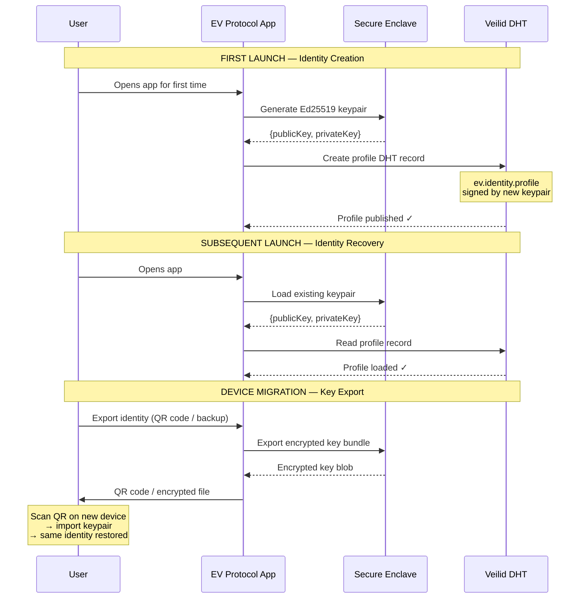
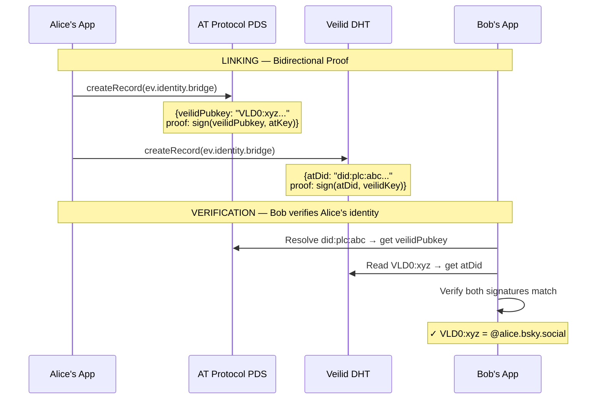
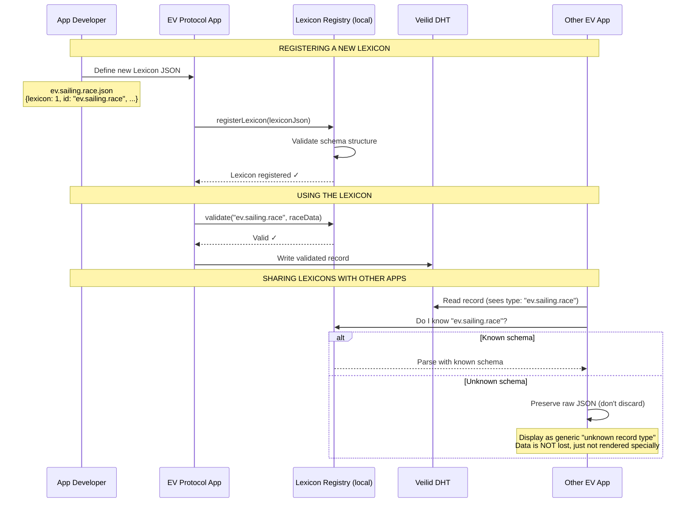
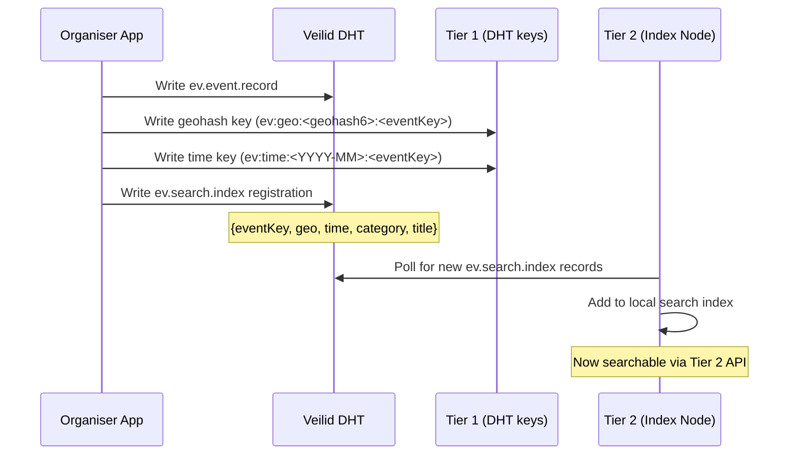
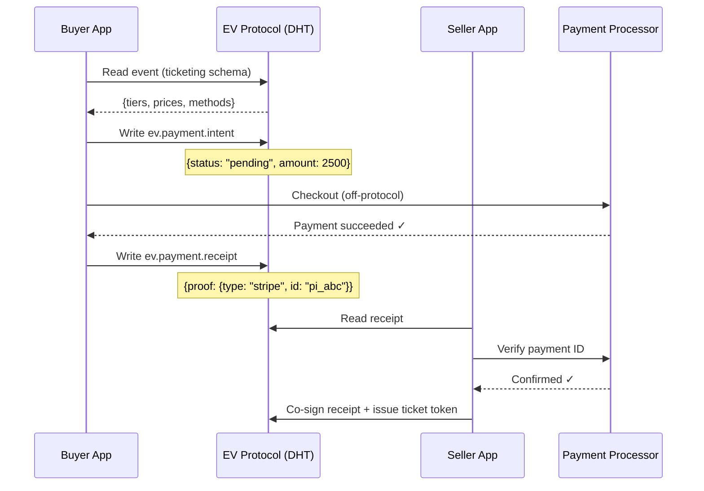
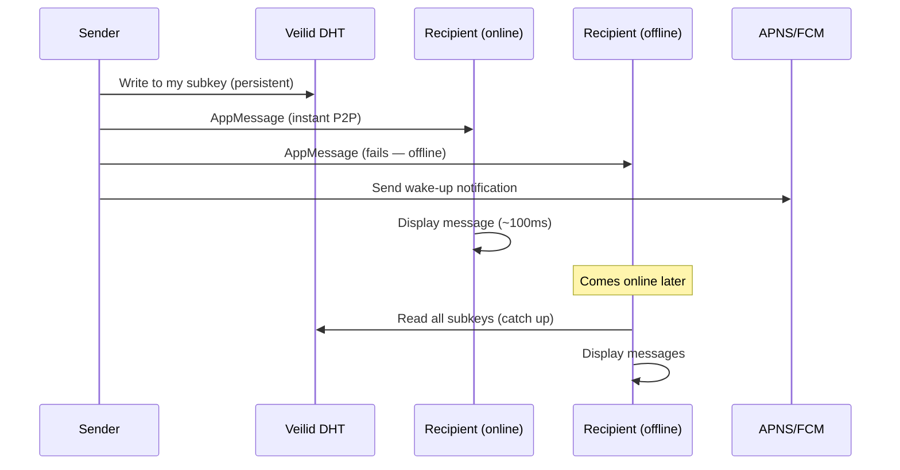
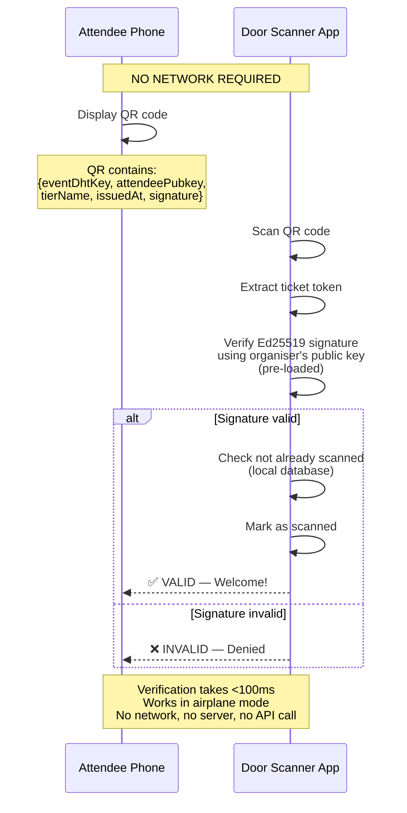

# EV Protocol Specification v0.1

> **Event Vector (EV)** — A decentralised event discovery, coordination, and communication protocol built on Veilid networking with AT Protocol-inspired schema enforcement.
>
> **Status**: Draft v0.1
> **Date**: 2026-04-06
> **License**: MPL-2.0

---

## Table of Contents

1. [Design Principles](#1-design-principles)
2. [Protocol Stack](#2-protocol-stack)
3. [Identity](#3-identity)
4. [Schema System (Lexicons)](#4-schema-system-lexicons)
5. [Record Types](#5-record-types)
6. [Storage](#6-storage)
7. [Networking](#7-networking)
8. [Search](#8-search)
9. [Payments](#9-payments)
10. [Chat](#10-chat)
11. [Moderation](#11-moderation)
12. [Groups & Vessels](#12-groups--vessels)
13. [Sailing Extension](#13-sailing-extension)
14. [Offline & Sync](#14-offline--sync)
15. [Ticketing & Verification](#15-ticketing--verification)
16. [Versioning & Extension](#16-versioning--extension)

---

## 1. Design Principles

```
P1: PRIVACY BY DEFAULT
    All communication is E2E encrypted.
    IP addresses are hidden via private routing.
    No data is collected by infrastructure operators.

P2: DATA OWNERSHIP
    Every record is signed by its creator's private key.
    No server operator can modify or delete user data.
    Users can export all their data at any time.

P3: APP PORTABILITY
    Data lives in the protocol, not in any app.
    Users can switch apps and keep all their data.
    Apps are lenses into the protocol, not containers.

P4: GRACEFUL DEGRADATION
    Core functions (events, tickets, chat) work without any server.
    Search degrades from 200ms to 4 seconds, never fails entirely.
    The app gets worse without infrastructure, it doesn't die.

P5: SCHEMA-FIRST
    All data conforms to Lexicon schemas.
    Schemas are versioned and extensible.
    Unknown schema fields are preserved, not discarded.

P6: PAYMENT BOUNDARY
    The protocol carries payment schemas (intent, receipt).
    Money movement is off-protocol (Stripe, crypto, cash).
    The protocol is never a financial instrument.

P7: ZERO BASE COST
    Core infrastructure cost is $0.
    Optional search nodes cost $15-50/month.
    The protocol should never require paid infrastructure to function.
```

---

## 2. Protocol Stack

```
┌──────────────────────────────────────────────────────────┐
│  Layer 7: EXTENSIONS (ev.sailing.*, ev.music.*, etc.)    │
├──────────────────────────────────────────────────────────┤
│  Layer 6: CHAT                                           │
│  Announcements, discussion rooms, DMs, live reactions    │
├──────────────────────────────────────────────────────────┤
│  Layer 5: PAYMENTS (schema only)                         │
│  Payment intent, receipt, ticket, refund policy          │
├──────────────────────────────────────────────────────────┤
│  Layer 4: SEARCH (3-tier)                                │
│  DHT-native → Distributed index → Search vector nodes   │
├──────────────────────────────────────────────────────────┤
│  Layer 3: SCHEMA (Lexicon enforcement)                   │
│  Schema validation, Lexicon registry, extension system   │
├──────────────────────────────────────────────────────────┤
│  Layer 2: IDENTITY                                       │
│  Veilid keypair, AT Protocol bridge (optional)           │
├──────────────────────────────────────────────────────────┤
│  Layer 1: NETWORK (Veilid DHT)                           │
│  Kademlia DHT, multi-writer records, subkeys             │
├──────────────────────────────────────────────────────────┤
│  Layer 0: TRANSPORT (Veilid)                             │
│  UDP/TCP/WebSocket, private routing, AppMessage/AppCall  │
└──────────────────────────────────────────────────────────┘
```

---

## 3. Identity

### 3.1 Primary Identity: Veilid Keypair

Every user is identified by an Ed25519 keypair generated locally on their device.

```
Keypair:
  Private key:  Stored in iOS Keychain / Android Keystore (Secure Enclave)
  Public key:   256-bit Ed25519 key, serves as the user's identity
  Format:       VLD0:<base64url-encoded-public-key>
  Example:      VLD0:dW5pcXVlLWtleS1ieXRlcw==

Properties:
  - Self-generated (no registration server)
  - Deterministic (same seed → same key)
  - One keypair = one identity across all EV Protocol apps
  - The private key NEVER leaves the device's secure storage
```

### 3.2 Identity Lifecycle



### 3.3 AT Protocol Bridge (Optional)

Users MAY link their Veilid identity to an existing AT Protocol DID for social discovery.



### 3.4 Identity Schema

```json
{
  "lexicon": 1,
  "id": "ev.identity.profile",
  "revision": 1,
  "description": "A user's public profile in the EV Protocol",
  "defs": {
    "main": {
      "type": "record",
      "key": "self",
      "record": {
        "type": "object",
        "required": ["pubkey", "displayName", "createdAt"],
        "properties": {
          "pubkey": { "type": "string", "description": "Veilid public key (VLD0:...)" },
          "displayName": { "type": "string", "maxLength": 100 },
          "bio": { "type": "string", "maxLength": 500 },
          "avatarRef": { "type": "ref", "ref": "ev.media.reference" },
          "createdAt": { "type": "string", "format": "datetime" },
          "updatedAt": { "type": "string", "format": "datetime" }
        }
      }
    }
  }
}
```

---

## 4. Schema System (Lexicons)

### 4.1 What is a Lexicon?

A Lexicon is a machine-readable schema definition that describes the structure of data records in the EV Protocol. Inspired by AT Protocol's Lexicon system, it provides:

- **Type safety**: Every record conforms to a known schema
- **Validation**: Records are validated before being written to the DHT
- **Interoperability**: Any app can read any record if it knows the schema
- **Extensibility**: New schemas can be registered without protocol changes

### 4.2 Lexicon Namespace Convention

```
Format:   ev.<domain>.<type>
Examples: ev.event.record
          ev.identity.profile
          ev.payment.intent
          ev.chat.message
          ev.sailing.race         ← domain extension
          ev.sailing.track        ← domain extension

Rules:
  - Namespaces are dot-separated, lowercase
  - First segment is always "ev" (protocol prefix)
  - Second segment is the domain (event, identity, chat, sailing, etc.)
  - Third segment is the record type
  - Extension domains (sailing, music, etc.) follow the same convention
```

### 4.3 Lexicon Registration & Extension



### 4.4 Lexicon Format

Every Lexicon JSON file follows this meta-schema:

```json
{
  "lexicon": 1,
  "id": "<namespace.id>",
  "revision": 1,
  "description": "Human-readable description",
  "defs": {
    "main": {
      "type": "record",
      "key": "<key-type>",
      "record": {
        "type": "object",
        "required": ["<field1>", "<field2>"],
        "properties": {
          "<field>": {
            "type": "<string|integer|boolean|array|object|ref>",
            "description": "Field description",
            "maxLength": 100,
            "minimum": 0,
            "format": "datetime",
            "knownValues": ["value1", "value2"],
            "items": { "type": "string" },
            "ref": "<other.lexicon.id#def>"
          }
        }
      }
    }
  }
}
```

### 4.5 Extension Rules

```
RULE 1: Unknown fields are PRESERVED, not discarded.
  If App A writes {name: "Race", wind_speed: 15} and App B
  doesn't know about "wind_speed", App B MUST keep it when
  reading and re-writing the record.

RULE 2: Required fields are ALWAYS validated.
  A record missing a required field is rejected before write.

RULE 3: Known values are SUGGESTIONS, not restrictions.
  A field with knownValues ["free", "paid"] may also contain
  "sliding" — apps should handle unknown values gracefully.

RULE 4: Revisions are backwards-compatible.
  Revision 2 of a schema may ADD optional fields.
  Revision 2 may NOT remove or change existing required fields.
  Breaking changes require a NEW schema ID.

RULE 5: Extension schemas are first-class citizens.
  ev.sailing.race has the same validation, storage, and
  transport guarantees as ev.event.record. There is no
  difference between "core" and "extension" schemas at
  the protocol level.
```

---

## 5. Record Types

### 5.1 Core Records (v0.1)

| Schema ID | Owner | Storage | Description |
|---|---|---|---|
| `ev.identity.profile` | User | Single-writer DHT | User's public profile |
| `ev.identity.bridge` | User | Single-writer DHT + PDS | AT Protocol link proof |
| `ev.event.record` | Organiser | Multi-writer DHT | Event metadata + ticketing |
| `ev.event.rsvp` | Attendee | Single-writer DHT | RSVP / registration |
| `ev.media.reference` | Uploader | Single-writer DHT | Pointer to external blob |
| `ev.payment.intent` | Buyer | Single-writer DHT | Payment request |
| `ev.payment.receipt` | Buyer+Seller | Single-writer DHT | Cryptographic payment proof |
| `ev.chat.channel` | Organiser | Multi-writer DHT | Chat channel configuration |
| `ev.chat.message` | Sender | Multi-writer DHT subkey | Individual chat message |
| `ev.chat.announcement` | Organiser | Single-writer DHT | One-to-many announcement |
| `ev.moderation.report` | Reporter | Single-writer DHT | Content/user report |
| `ev.moderation.action` | Organiser | Single-writer DHT | Moderation decision |
| `ev.search.index` | Node operator | Single-writer DHT | Search index registration |
| `ev.group.roster` | Group admin | Multi-writer DHT | Group membership + metadata |
| `ev.group.vessel` | Owner | Single-writer DHT | Yacht / vessel profile |
| `ev.ticket.token` | Organiser | Single-writer DHT | Ticket QR verification token |

### 5.2 Sailing Extension Records (v0.1)

| Schema ID | Owner | Storage | Description |
|---|---|---|---|
| `ev.sailing.race` | Organiser | Multi-writer DHT | Race definition (course, handicap) |
| `ev.sailing.result` | Organiser | Single-writer DHT | Race results + standings |
| `ev.sailing.track` | Sailor | Single-writer DHT | GPS track recording |
| `ev.sailing.course` | Organiser | Single-writer DHT | Course marks + geometry |

---

## 6. Storage

### 6.1 DHT Record Model

Every record in the EV Protocol is a Veilid DHT record.

```
DHT Record:
  ┌──────────────────────────────────────────┐
  │  Key:       Deterministic hash           │
  │  Owner:     Creator's Veilid public key  │
  │  Schema:    Filled subkey 0 = $type      │
  │  Signature: Ed25519 signature            │
  │  Data:      JSON conforming to Lexicon   │
  │  Subkeys:   0..N for multi-writer        │
  └──────────────────────────────────────────┘

Key generation:
  Single-entity record:
    key = sha256("ev:<schemaId>:<ownerPubkey>:<uniqueId>")
  
  Event-scoped record:
    key = sha256("ev:<schemaId>:<eventDhtKey>:<ownerPubkey>")
  
  Deterministic DM key:
    key = sha256("ev:dm:<sort([pubkeyA, pubkeyB]).join(':')>:v1")
```

### 6.2 Blob Storage Pattern

Large binary data (photos, videos, GPS tracks) are NOT stored in the DHT. Only references are stored.

```
"Reference-in-DHT, Blob-in-Storage"

  DHT stores:     ev.media.reference { url, hash, size, mimeType }
  Blob stored in: R2, S3, IPFS, or local device

  ┌───────────┐     reference      ┌──────────────┐
  │   DHT     │ ─────────────────→ │  Blob Store  │
  │  ~1KB     │   {url, sha256}    │  (R2/S3/IPFS)│
  │  metadata │                    │  actual file  │
  └───────────┘                    └──────────────┘
```

### 6.3 Local-First Storage

Every record is persisted locally in SQLite before being published to the DHT.

```
Write path:
  1. App creates record
  2. Validate against Lexicon schema
  3. Write to local SQLite (instant, works offline)
  4. Queue for DHT sync
  5. Sync service publishes to DHT when online

Read path:
  1. Check local SQLite cache (instant)
  2. If stale/missing: fetch from DHT
  3. Update local cache
  4. Return to app
```

---

## 7. Networking

### 7.1 Bootstrap

```
Bootstrap resolution order:
  1. Cached peers from previous session (instant, no network)
  2. App-configured bootstrap nodes (operator-controlled)
  3. Community bootstrap nodes (cDc-operated, fallback)
  4. Hardcoded peer list (compiled into app binary)
```

### 7.2 Message Delivery

```
AppMessage:  Fire-and-forget, delivered if target is online (~100ms)
AppCall:     Request-response, requires acknowledgement (~100ms)
DHT Write:   Persistent, available when target comes online (2-5s)

Message delivery strategy:
  1. Try AppMessage (instant, if target online)
  2. Always write to DHT (persistent, for offline delivery)
  3. Trigger push notification (APNS/FCM, for iOS wake-up)
```

### 7.3 Private Routing

```
All EV Protocol communication uses Veilid's private routing:
  - Sender's IP hidden from receiver
  - Receiver's IP hidden from sender
  - Intermediate nodes see only encrypted packets
  - No node sees both source and destination
```

---

## 8. Search

### 8.1 Three-Tier Architecture

```
Tier 1: DHT-Native (always available, $0)
  Deterministic key lookup by known event ID
  Geohash-prefixed keys for location-based discovery
  Latency: 2-5 seconds

Tier 2: Distributed Index (community-operated, $0-5/mo)
  Lightweight index nodes subscribe to event registrations
  Filtered queries: date range, location radius, category
  Latency: 500ms-2 seconds

Tier 3: Search Vector Nodes (optional, $15-50/mo)
  Full-text search with semantic ranking
  Trending/popular events
  Recommendation engine
  Latency: 100-500ms
```

### 8.2 Search Index Registration



---

## 9. Payments

### 9.1 Boundary

```
IN-PROTOCOL:               OFF-PROTOCOL:
  Payment intent              Credit card processing
  Payment receipt             Bank transfers
  Ticket token                Tax calculation
  Refund policy               KYC/AML compliance
  Price display               Fraud detection
                              Settlement/payout
```

### 9.2 Payment Flow



---

## 10. Chat

### 10.1 Channel Types

```
Announcements:  Single-writer DHT, organiser → all attendees
Discussion:     Multi-writer DHT, capped at ~200 participants
DMs:            2-writer DHT, fully E2E encrypted
Live Reactions: Ephemeral AppMessage, not persisted
```

### 10.2 Message Delivery



---

## 11. Moderation

### 11.1 Three-Tier System

```
Tier 1: On-Device AI (automatic, pre-upload)
  MobileNet v2 NSFW classifier (~5MB)
  Runs locally — image never leaves device if rejected
  Cost: $0

Tier 2: Organiser Admin (human, post-upload)
  Organiser can hide/remove content from their event
  ev.moderation.action records with reason

Tier 3: Community Reports (crowdsourced)
  Attendees can report content/users
  ev.moderation.report records
  Auto-hide at threshold (e.g., 3 reports)
```

---

## 12. Groups & Vessels

### 12.1 Group Model

Groups represent a persistent community of users (e.g., a sailing club, a meetup group).

```json
{
  "lexicon": 1,
  "id": "ev.group.roster",
  "revision": 1,
  "description": "A group of users with roles (e.g., sailing club)",
  "defs": {
    "main": {
      "type": "record",
      "key": "tid",
      "record": {
        "type": "object",
        "required": ["name", "adminPubkey", "createdAt"],
        "properties": {
          "name": { "type": "string", "maxLength": 200 },
          "description": { "type": "string", "maxLength": 2000 },
          "adminPubkey": { "type": "string" },
          "avatarRef": { "type": "ref", "ref": "ev.media.reference" },
          "members": {
            "type": "array",
            "items": { "type": "ref", "ref": "#member" }
          },
          "vessels": {
            "type": "array",
            "items": { "type": "ref", "ref": "ev.group.vessel" },
            "description": "Yachts/vessels registered to this group"
          },
          "visibility": {
            "type": "string",
            "knownValues": ["public", "private", "invite_only"]
          },
          "createdAt": { "type": "string", "format": "datetime" }
        }
      }
    },
    "member": {
      "type": "object",
      "required": ["pubkey", "role", "joinedAt"],
      "properties": {
        "pubkey": { "type": "string" },
        "displayName": { "type": "string" },
        "role": {
          "type": "string",
          "knownValues": ["admin", "organiser", "member", "guest"]
        },
        "joinedAt": { "type": "string", "format": "datetime" }
      }
    }
  }
}
```

### 12.2 Vessel Profile

```json
{
  "lexicon": 1,
  "id": "ev.group.vessel",
  "revision": 1,
  "description": "A yacht or vessel profile",
  "defs": {
    "main": {
      "type": "record",
      "key": "tid",
      "record": {
        "type": "object",
        "required": ["name", "ownerPubkey"],
        "properties": {
          "name": { "type": "string", "maxLength": 200 },
          "ownerPubkey": { "type": "string" },
          "sailNumber": { "type": "string", "maxLength": 20 },
          "class": { "type": "string", "maxLength": 100, "description": "Yacht class (e.g., J/24, Laser, S97)" },
          "handicap": { "type": "number", "description": "YS or IRC handicap rating" },
          "length": { "type": "number", "description": "LOA in metres" },
          "photoRef": { "type": "ref", "ref": "ev.media.reference" },
          "homePort": { "type": "string", "maxLength": 200 },
          "groupDhtKey": { "type": "string", "description": "Group this vessel belongs to" },
          "crew": {
            "type": "array",
            "items": { "type": "ref", "ref": "#crewMember" }
          }
        }
      }
    },
    "crewMember": {
      "type": "object",
      "properties": {
        "pubkey": { "type": "string" },
        "displayName": { "type": "string" },
        "role": {
          "type": "string",
          "knownValues": ["skipper", "helm", "tactician", "trimmer", "bowperson", "crew"]
        }
      }
    }
  }
}
```

---

## 13. Sailing Extension

### 13.1 Race Definition

```json
{
  "lexicon": 1,
  "id": "ev.sailing.race",
  "revision": 1,
  "description": "A sailing race within an event",
  "defs": {
    "main": {
      "type": "record",
      "key": "tid",
      "record": {
        "type": "object",
        "required": ["eventDhtKey", "name", "scheduledStart"],
        "properties": {
          "eventDhtKey": { "type": "string" },
          "name": { "type": "string", "maxLength": 200 },
          "raceNumber": { "type": "integer", "minimum": 1 },
          "scheduledStart": { "type": "string", "format": "datetime" },
          "actualStart": { "type": "string", "format": "datetime" },
          "status": {
            "type": "string",
            "knownValues": ["scheduled", "preparatory", "started", "finished", "abandoned", "postponed"]
          },
          "courseDhtKey": { "type": "string", "description": "Reference to ev.sailing.course" },
          "handicapSystem": {
            "type": "string",
            "knownValues": ["yardstick", "irc", "phrf", "none"]
          },
          "conditions": { "type": "ref", "ref": "#raceConditions" }
        }
      }
    },
    "raceConditions": {
      "type": "object",
      "properties": {
        "windSpeedKnots": { "type": "number" },
        "windDirectionDeg": { "type": "integer", "minimum": 0, "maximum": 359 },
        "seaState": { "type": "string", "knownValues": ["flat", "choppy", "moderate", "rough"] },
        "currentKnots": { "type": "number" },
        "currentDirectionDeg": { "type": "integer" },
        "visibility": { "type": "string", "knownValues": ["good", "moderate", "poor"] }
      }
    }
  }
}
```

### 13.2 GPS Track

```json
{
  "lexicon": 1,
  "id": "ev.sailing.track",
  "revision": 1,
  "description": "A GPS track recording from a race or sail",
  "defs": {
    "main": {
      "type": "record",
      "key": "tid",
      "record": {
        "type": "object",
        "required": ["raceDhtKey", "sailorPubkey", "vesselDhtKey", "startedAt"],
        "properties": {
          "raceDhtKey": { "type": "string" },
          "sailorPubkey": { "type": "string" },
          "vesselDhtKey": { "type": "string" },
          "startedAt": { "type": "string", "format": "datetime" },
          "finishedAt": { "type": "string", "format": "datetime" },
          "elapsedSeconds": { "type": "integer" },
          "correctedSeconds": { "type": "integer", "description": "After handicap correction" },
          "distanceNm": { "type": "number", "description": "Distance sailed in nautical miles" },
          "trackRef": {
            "type": "ref",
            "ref": "ev.media.reference",
            "description": "GeoJSON or GPX file reference"
          },
          "summary": { "type": "ref", "ref": "#trackSummary" }
        }
      }
    },
    "trackSummary": {
      "type": "object",
      "properties": {
        "maxSpeedKnots": { "type": "number" },
        "avgSpeedKnots": { "type": "number" },
        "pointCount": { "type": "integer" },
        "boundingBox": {
          "type": "object",
          "properties": {
            "north": { "type": "number" },
            "south": { "type": "number" },
            "east": { "type": "number" },
            "west": { "type": "number" }
          }
        }
      }
    }
  }
}
```

### 13.3 Race Results

```json
{
  "lexicon": 1,
  "id": "ev.sailing.result",
  "revision": 1,
  "description": "Results and standings for a sailing race",
  "defs": {
    "main": {
      "type": "record",
      "key": "tid",
      "record": {
        "type": "object",
        "required": ["raceDhtKey", "eventDhtKey", "results"],
        "properties": {
          "raceDhtKey": { "type": "string" },
          "eventDhtKey": { "type": "string" },
          "publishedAt": { "type": "string", "format": "datetime" },
          "results": {
            "type": "array",
            "items": { "type": "ref", "ref": "#raceResult" }
          },
          "protestsOpen": { "type": "boolean" }
        }
      }
    },
    "raceResult": {
      "type": "object",
      "required": ["vesselDhtKey", "position"],
      "properties": {
        "vesselDhtKey": { "type": "string" },
        "skipperPubkey": { "type": "string" },
        "position": { "type": "integer", "minimum": 1 },
        "elapsedSeconds": { "type": "integer" },
        "correctedSeconds": { "type": "integer" },
        "points": { "type": "number" },
        "status": {
          "type": "string",
          "knownValues": ["finished", "dnf", "dns", "dsq", "ocs", "ret", "raf"]
        },
        "trackDhtKey": { "type": "string", "description": "Link to GPS track if shared" }
      }
    }
  }
}
```

### 13.4 Course Definition

```json
{
  "lexicon": 1,
  "id": "ev.sailing.course",
  "revision": 1,
  "description": "A sailing course with marks and geometry",
  "defs": {
    "main": {
      "type": "record",
      "key": "tid",
      "record": {
        "type": "object",
        "required": ["eventDhtKey", "name", "marks"],
        "properties": {
          "eventDhtKey": { "type": "string" },
          "name": { "type": "string", "maxLength": 200 },
          "courseType": {
            "type": "string",
            "knownValues": ["windward_leeward", "triangle", "trapezoid", "fixed", "custom"]
          },
          "distanceNm": { "type": "number" },
          "marks": {
            "type": "array",
            "items": { "type": "ref", "ref": "#courseMark" }
          },
          "startLine": { "type": "ref", "ref": "#lineDefinition" },
          "finishLine": { "type": "ref", "ref": "#lineDefinition" }
        }
      }
    },
    "courseMark": {
      "type": "object",
      "required": ["name", "latitude", "longitude"],
      "properties": {
        "name": { "type": "string" },
        "latitude": { "type": "number" },
        "longitude": { "type": "number" },
        "rounding": { "type": "string", "knownValues": ["port", "starboard"] },
        "order": { "type": "integer" }
      }
    },
    "lineDefinition": {
      "type": "object",
      "properties": {
        "pin": { "type": "ref", "ref": "#courseMark" },
        "boat": { "type": "ref", "ref": "#courseMark" }
      }
    }
  }
}
```

---

## 14. Offline & Sync

### 14.1 Local-First Architecture

```
All writes go to local SQLite FIRST, then sync to DHT.

Offline queue:
  1. App creates/updates record
  2. Record validated against Lexicon
  3. Record written to SQLite with status: "pending_sync"
  4. SyncService periodically attempts DHT write
  5. On success: status → "synced"
  6. On failure: retry with exponential backoff

Conflict resolution:
  - Last-writer-wins for single-writer records
  - Per-subkey ordering for multi-writer records
  - Sequence numbers prevent stale overwrites
```

---

## 15. Ticketing & Verification

### 15.1 Ticket Token

A ticket is a cryptographic proof of registration/payment, verifiable offline.

```json
{
  "lexicon": 1,
  "id": "ev.ticket.token",
  "revision": 1,
  "description": "A ticket token for offline verification",
  "defs": {
    "main": {
      "type": "record",
      "key": "tid",
      "record": {
        "type": "object",
        "required": ["eventDhtKey", "attendeePubkey", "tierName", "issuedAt", "signature"],
        "properties": {
          "eventDhtKey": { "type": "string" },
          "attendeePubkey": { "type": "string" },
          "tierName": { "type": "string" },
          "issuedAt": { "type": "string", "format": "datetime" },
          "validUntil": { "type": "string", "format": "datetime" },
          "receiptDhtKey": { "type": "string", "description": "Link to payment receipt" },
          "signature": { "type": "string", "description": "Organiser's Ed25519 signature over token fields" },
          "scannedAt": { "type": "string", "format": "datetime", "description": "Set when ticket is scanned at venue" },
          "scannedBy": { "type": "string", "description": "Pubkey of scanner" }
        }
      }
    }
  }
}
```

### 15.2 Offline Verification Flow



---

## 16. Versioning & Extension

### 16.1 Protocol Versioning

```
Protocol version:    Semantic versioning (0.1.0)
Schema revision:     Integer, monotonically increasing per schema
Compatibility:       New versions MUST read old data
Breaking changes:    New major version (0.x → 1.x)

The protocol version is stored in every DHT record:
  { "$ev_version": "0.1.0", "$type": "ev.event.record", ... }
```

### 16.2 Adding New Schema Domains

```
To add a new domain (e.g., ev.music.*):

  1. Define Lexicon JSON files
     ev.music.setlist.json
     ev.music.artist.json
     ev.music.venue.json

  2. Register in app's Lexicon registry
     registry.registerLexicon(musicSetlistLexicon);

  3. Create/read records using standard EV Protocol APIs
     eventService.createRecord(collection: 'ev.music.setlist', data: {...});

  4. Other apps that don't know ev.music.* will:
     - Preserve the data when reading/writing
     - Display as "unknown record type" in UI
     - NOT discard or corrupt the data

No protocol changes. No infrastructure changes. No permission needed.
```

---

*This specification is the source of truth for EV Protocol v0.1.*
*Companion Dart interfaces: `packages/ev_protocol/`*
*Last updated: 2026-04-06*
