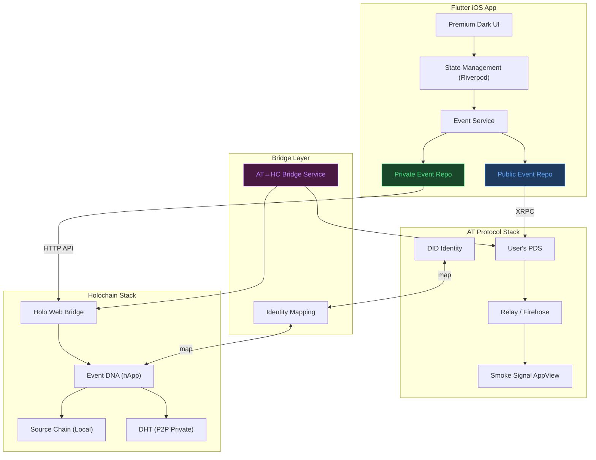
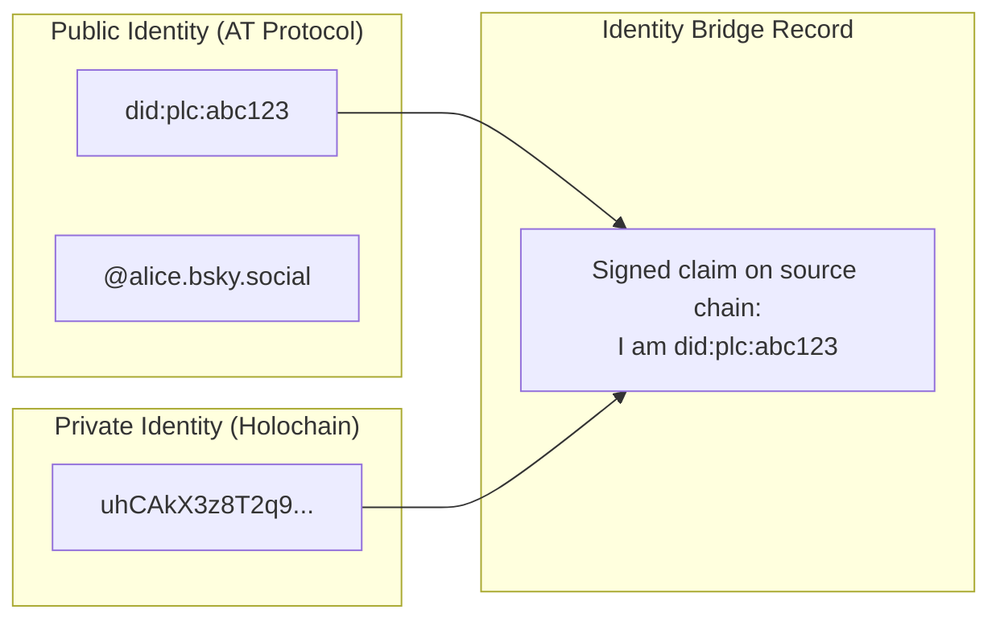
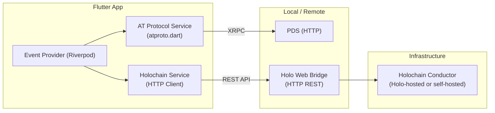
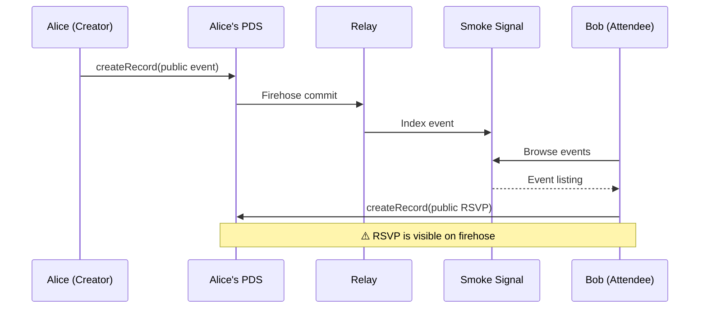
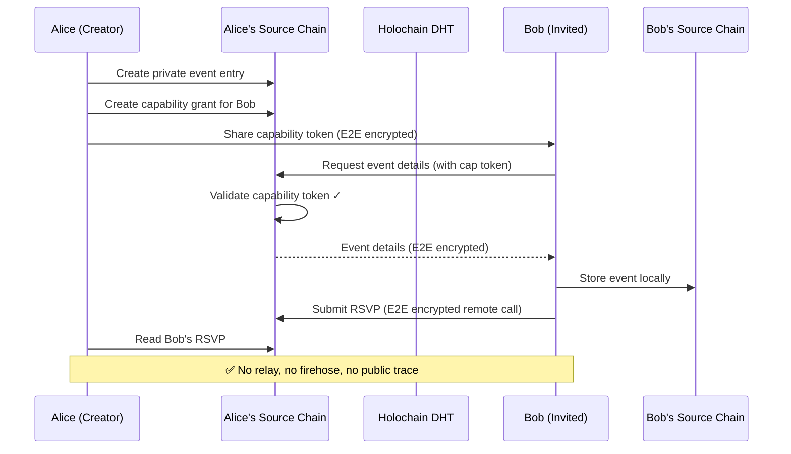
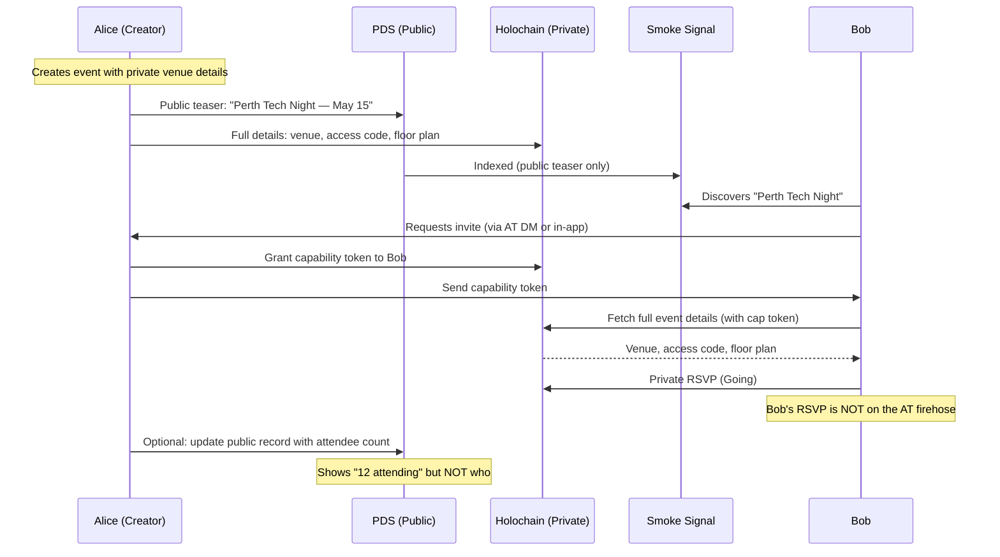
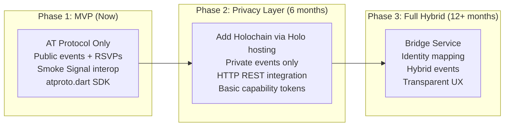
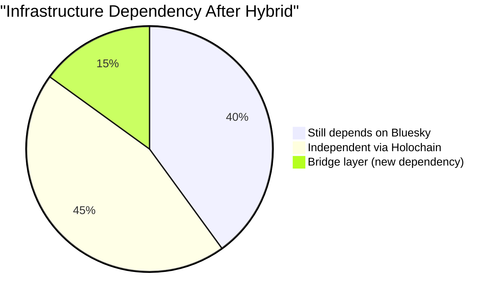
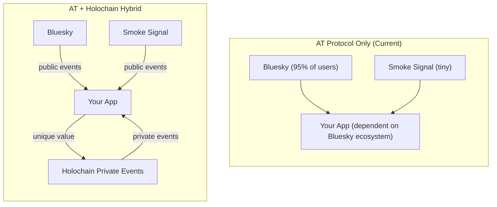
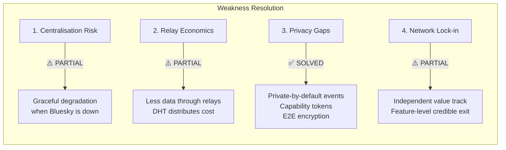

# Hybrid Architecture: AT Protocol + Holochain

> A design study for combining the AT Protocol's public discovery and interoperability strengths with Holochain's agent-centric privacy and selective sharing capabilities. Written specifically for the event app use case.

---

## Table of Contents

1. [Why Combine Them?](#why-combine-them)
2. [What Each Protocol Brings](#what-each-protocol-brings)
3. [The Hybrid Architecture](#the-hybrid-architecture)
4. [Component Design](#component-design)
   - [Identity Bridge](#1-identity-bridge)
   - [Public Event Layer (AT Protocol)](#2-public-event-layer-at-protocol)
   - [Private Event Layer (Holochain)](#3-private-event-layer-holochain)
   - [Bridge Service](#4-bridge-service)
   - [Flutter App Integration](#5-flutter-app-integration)
5. [Data Flow Scenarios](#data-flow-scenarios)
   - [Scenario A: Public Event (AT Protocol Only)](#scenario-a-public-event)
   - [Scenario B: Private Event (Holochain Only)](#scenario-b-private-event)
   - [Scenario C: Hybrid Event (Both)](#scenario-c-hybrid-event)
6. [Holochain DNA Design for Events](#holochain-dna-design-for-events)
7. [Capability Token Flows](#capability-token-flows)
8. [Technical Integration Challenges](#technical-integration-challenges)
9. [Feasibility Assessment](#feasibility-assessment)
10. [Implementation Roadmap](#implementation-roadmap)
11. [How the Hybrid Addresses AT Protocol's Core Weaknesses](#how-the-hybrid-addresses-at-protocols-core-weaknesses)

---

## Why Combine Them?

The AT Protocol and Holochain are almost **perfectly complementary** — each is strongest where the other is weakest:

| Requirement | AT Protocol | Holochain | Combined |
|-------------|:-----------:|:---------:|:--------:|
| Public event discovery | ✅ Excellent | ❌ No global index | ✅ |
| Private/invite-only events | ❌ Everything public | ✅ Agent-controlled | ✅ |
| Selective RSVP visibility | ❌ Firehose exposes all | ✅ Capability tokens | ✅ |
| Interoperability (Smoke Signal) | ✅ Lexicon schemas | ❌ Isolated ecosystem | ✅ |
| Offline-first | ❌ Requires PDS online | ✅ Local source chain | ✅ |
| Encrypted messaging | ❌ In development | ✅ E2E encrypted calls | ✅ |
| Data portability | ✅ DID-based | ✅ Agent-based | ✅ |
| Existing user base | ✅ Bluesky accounts | ❌ Tiny ecosystem | ✅ |
| Flutter/Dart SDK | ✅ atproto.dart | ❌ Rust/JS only | ⚠️ |

The thesis is simple: **use AT Protocol for what should be public, and Holochain for what should be private**.

---

## What Each Protocol Brings

### AT Protocol's Role: "The Town Square"

```
Public events → discoverable by anyone → Smoke Signal interop
                                       → Bluesky social graph
                                       → Open RSVP counts
                                       → Relay-indexed search
```

AT Protocol handles the **"reach"** side — making events visible, searchable, and interoperable with the broader Atmosphere ecosystem.

### Holochain's Role: "The Private Room"

```
Private events → visible only to invitees → encrypted details
                                          → selective RSVP sharing
                                          → private attendee list
                                          → offline-first access
                                          → no firehose leakage
```

Holochain handles the **"privacy"** side — keeping sensitive event details, guest lists, and communications visible only to authorised participants.

---

## The Hybrid Architecture



---

## Component Design

### 1. Identity Bridge

The hardest problem in a hybrid architecture is **linking identities** across two different systems without compromising the privacy guarantees of either.

#### AT Protocol Identity
```
did:plc:z72i7hdynmk6r22z27h6tvur  →  @alice.bsky.social
```
Public, resolvable, tied to a PDS. Designed to be discoverable.

#### Holochain Identity
```
Agent pubkey: uhCAkX3z8T2q9...  →  local to the hApp DNA
```
Private by default. Only peers in the same DNA can see it.

#### Bridge Strategy



**How it works:**

1. User authenticates with AT Protocol in the Flutter app (gets DID)
2. User initialises a Holochain cell (gets agent pubkey)
3. The app creates a **signed identity link** on the Holochain source chain:
   - "I, agent `uhCAkX3z8...`, claim to be `did:plc:abc123`"
   - Signed with both the Holochain agent key and the AT Protocol signing key
4. This link is **verifiable** but **private** — only shared via capability tokens with invited peers

> [!IMPORTANT]
> The identity link should **never** be published to the AT Protocol side. Publishing it would let anyone who sees your DID find your Holochain agent key, defeating the privacy separation.

---

### 2. Public Event Layer (AT Protocol)

This is identical to our existing architecture from the previous conversation — standard AT Protocol records:

```dart
// Public event — written to PDS, visible on Smoke Signal
await atprotoService.createRecord(
  collection: 'events.smokesignal.calendar.event',
  record: {
    '\$type': 'events.smokesignal.calendar.event',
    'name': 'Perth Flutter Meetup',
    'startsAt': '2026-05-15T18:00:00+08:00',
    'status': 'scheduled',
    'locations': [{
      'name': 'Spacecubed',
      'address': '45 St Georges Terrace, Perth',
    }],
    'createdAt': DateTime.now().toUtc().toIso8601String(),
  },
);
```

This event hits the firehose, gets indexed by Smoke Signal, and is discoverable by anyone. Perfect for public community events.

---

### 3. Private Event Layer (Holochain)

Private events live **exclusively** on Holochain. They never touch the AT Protocol firehose.

#### Holochain DNA: `event_private`

The DNA defines the rules for private events:

```rust
// Integrity Zome — defines data types and validation rules
// (Rust, compiled to WASM, runs in every participant's conductor)

#[hdk_entry_helper]
pub struct PrivateEvent {
    pub name: String,
    pub description: Option<String>,
    pub starts_at: Timestamp,
    pub ends_at: Option<Timestamp>,
    pub location: Option<EventLocation>,
    pub max_attendees: Option<u32>,
    pub creator_at_did: String,  // Links back to AT Protocol identity
    pub created_at: Timestamp,
}

#[hdk_entry_helper]
pub struct PrivateRsvp {
    pub event_hash: ActionHash,  // Points to the PrivateEvent entry
    pub status: RsvpStatus,      // Going, Interested, Declined
    pub responder_at_did: Option<String>,
    pub created_at: Timestamp,
}

#[hdk_entry_helper]
pub struct EventInvitation {
    pub event_hash: ActionHash,
    pub invitee_agent: AgentPubKey,
    pub invited_at: Timestamp,
    pub message: Option<String>,
}

// Validation: only the creator can modify their event
#[hdk_extern]
pub fn validate_update_entry_private_event(
    action: Update,
    _private_event: PrivateEvent,
    _original_action: EntryCreationAction,
    _original_private_event: PrivateEvent,
) -> ExternResult<ValidateCallbackResult> {
    // Only the original author can update
    if action.author != _original_action.author() {
        return Ok(ValidateCallbackResult::Invalid(
            "Only the event creator can update the event".into()
        ));
    }
    Ok(ValidateCallbackResult::Valid)
}
```

#### Key Privacy Properties

| Property | Mechanism |
|----------|-----------|
| **Event details hidden** | Stored on creator's source chain, shared only via capability grants |
| **Guest list private** | RSVPs are E2E encrypted remote calls, not published to DHT |
| **No firehose** | Holochain has no global event stream — no relay can index this |
| **Selective sharing** | Creator grants capability tokens to view event details |
| **Invite-only access** | Only agents with a capability token can read the event |
| **Offline access** | Once received, event details are on the attendee's local source chain |

---

### 4. Bridge Service

The bridge is a lightweight service that connects the two worlds when the user **chooses** to make some data cross boundaries.

#### Use Cases

| Scenario | Direction | What Crosses |
|----------|-----------|-------------|
| **Promote private event** | HC → AT | Event name + date only (no guest list, no details) |
| **Private RSVP to public event** | AT → HC | RSVP stored on Holochain; public event stays on AT |
| **Identity verification** | AT ↔ HC | Prove a Holochain agent controls a specific DID |
| **Attendee count sync** | HC → AT | Aggregate count only (not individual RSVPs) |

#### Architecture

```dart
// Bridge service — runs in the Flutter app, no external server needed
class ProtocolBridge {
  final AtprotoService atproto;
  final HolochainService holochain;
  
  /// Promote a private event to the public AT Protocol network
  /// Only shares name, date, and a "private event" flag — no sensitive details
  Future<String> promoteToPublic(String holochainEventHash) async {
    final privateEvent = await holochain.getEvent(holochainEventHash);
    
    // Create a minimal "teaser" on AT Protocol
    final record = await atproto.createRecord(
      collection: 'events.smokesignal.calendar.event',
      record: {
        '\$type': 'events.smokesignal.calendar.event',
        'name': privateEvent.name,
        'startsAt': privateEvent.startsAt.toIso8601String(),
        'status': 'scheduled',
        'description': '🔒 Private event — request an invite for details',
        // No location, no attendee info
        'createdAt': DateTime.now().toUtc().toIso8601String(),
      },
    );
    
    return record.uri; // at://did:plc:.../events.smokesignal.calendar.event/...
  }
  
  /// Create a private RSVP for a public AT Protocol event
  /// The RSVP is stored on Holochain (private) instead of the PDS (public)
  Future<void> privateRsvp({
    required String atEventUri,
    required String status, // going, interested, declined
  }) async {
    await holochain.createPrivateRsvp(
      publicEventUri: atEventUri,
      status: status,
    );
    // The RSVP exists only on the user's Holochain source chain
    // The public event on AT Protocol shows NO indication this user RSVP'd
  }
}
```

---

### 5. Flutter App Integration

The Flutter app needs to talk to **both** protocols. Since there's no Dart SDK for Holochain, the integration goes through HTTP.



#### Holochain Service (Dart HTTP Client)

```dart
class HolochainService {
  final String _bridgeUrl; // Holo Web Bridge URL
  final http.Client _client;
  
  HolochainService(this._bridgeUrl) : _client = http.Client();
  
  /// Create a private event on Holochain
  Future<String> createPrivateEvent({
    required String name,
    required DateTime startsAt,
    String? description,
    String? location,
    int? maxAttendees,
    required String creatorDid,
  }) async {
    final response = await _client.post(
      Uri.parse('$_bridgeUrl/api/v1/event_private/create_event'),
      headers: {'Content-Type': 'application/json'},
      body: jsonEncode({
        'name': name,
        'starts_at': startsAt.microsecondsSinceEpoch,
        'description': description,
        'location': location != null ? {'name': location} : null,
        'max_attendees': maxAttendees,
        'creator_at_did': creatorDid,
        'created_at': DateTime.now().microsecondsSinceEpoch,
      }),
    );
    
    final body = jsonDecode(response.body);
    return body['action_hash'] as String; // Holochain action hash
  }
  
  /// Invite an agent to a private event (grants capability token)
  Future<void> inviteToEvent({
    required String eventHash,
    required String inviteeAgentKey,
    String? message,
  }) async {
    await _client.post(
      Uri.parse('$_bridgeUrl/api/v1/event_private/invite'),
      headers: {'Content-Type': 'application/json'},
      body: jsonEncode({
        'event_hash': eventHash,
        'invitee_agent': inviteeAgentKey,
        'message': message,
      }),
    );
  }
  
  /// Get events you've been invited to
  Future<List<PrivateEventModel>> getMyInvitations() async {
    final response = await _client.get(
      Uri.parse('$_bridgeUrl/api/v1/event_private/my_invitations'),
    );
    
    final body = jsonDecode(response.body) as List;
    return body.map((e) => PrivateEventModel.fromJson(e)).toList();
  }
}
```

---

## Data Flow Scenarios

### Scenario A: Public Event

Standard AT Protocol flow — unchanged from the existing architecture.



### Scenario B: Private Event

Pure Holochain — nothing touches AT Protocol.



### Scenario C: Hybrid Event

The most interesting case — a public-facing event with private details.



---

## Holochain DNA Design for Events

### DNA Structure

```
event_private/
├── dna.yaml                    # DNA manifest
├── integrity/                  # Data types + validation rules
│   └── src/
│       ├── lib.rs
│       ├── event.rs            # PrivateEvent entry type
│       ├── rsvp.rs             # PrivateRsvp entry type
│       ├── invitation.rs       # EventInvitation entry type
│       └── identity_link.rs    # AT Protocol identity claim
└── coordinator/                # Business logic + API
    └── src/
        ├── lib.rs
        ├── event_ops.rs        # CRUD for events
        ├── rsvp_ops.rs         # RSVP operations
        ├── invitation_ops.rs   # Invite management
        └── capability_ops.rs   # Capability token management
```

### Entry Types

```rust
// The three core entry types
#[hdk_entry_defs]
#[unit_enum(UnitEntryTypes)]
pub enum EntryTypes {
    #[entry_def(visibility = "private")]  // Only on creator's source chain
    PrivateEvent(PrivateEvent),
    
    #[entry_def(visibility = "private")]  // Only on responder's source chain
    PrivateRsvp(PrivateRsvp),
    
    #[entry_def(visibility = "public")]   // On DHT — so invitees can discover it
    EventInvitation(EventInvitation),
}
```

### Validation Rules Summary

| Rule | Enforced By |
|------|------------|
| Only creator can edit/delete their event | Integrity zome validation |
| Only invited agents can read event details | Capability token check |
| RSVP must reference a valid event | Link validation |
| Max attendees limit enforced | Coordinator zome logic |
| One RSVP per agent per event | Source chain dedup check |
| Identity link must be signed by claimed DID | Cryptographic verification |

---

## Capability Token Flows

Holochain's capability token system is the key enabler for private events. Here's how it maps to event operations:

### Granting Access

```
┌──────────────────────────────────────────────────────────┐
│                  Alice's Source Chain                      │
├──────────────────────────────────────────────────────────┤
│ Entry 1: PrivateEvent { name: "Perth Tech Night", ... }  │
│                                                          │
│ Entry 2: CapabilityGrant {                               │
│   tag: "view_event_perth_tech_night",                    │
│   access: Assigned,                                      │
│   functions: GrantedFunctions::Listed(HashSet::from([    │
│     ("event_ops", "get_event_details"),                   │
│     ("rsvp_ops", "submit_rsvp"),                         │
│   ])),                                                   │
│   assignees: HashSet::from([                             │
│     bob_agent_key,                                       │
│     carol_agent_key,                                     │
│   ]),                                                    │
│   secret: <random_256_bit_token>,                        │
│ }                                                        │
└──────────────────────────────────────────────────────────┘
```

### Access Check Flow

```
Bob (with capability token) → calls get_event_details(event_hash)
                                        │
                              ┌─────────▼──────────┐
                              │ Alice's Conductor   │
                              │                     │
                              │ 1. Check: Is there  │
                              │    a CapabilityGrant │
                              │    for this function?│
                              │                     │
                              │ 2. Check: Is Bob's  │
                              │    key in assignees? │
                              │                     │
                              │ 3. Check: Does the  │
                              │    token match?      │
                              │                     │
                              │ ALL YES → Return     │
                              │ event details        │
                              └─────────────────────┘
```

### Revocation

```rust
// Alice revokes Bob's access
#[hdk_extern]
pub fn revoke_invitation(input: RevokeInput) -> ExternResult<()> {
    // Delete the capability grant from the source chain
    delete_cap_grant(input.grant_action_hash)?;
    
    // Bob's future calls will fail capability check
    // Bob still has the event data he already received (local source chain)
    // But he can no longer fetch updates or submit new RSVPs
    
    Ok(())
}
```

> [!WARNING]
> **Important caveat**: Revocation prevents *future* access but cannot delete data already received by the invitee. Once Bob has a copy of the event details on his source chain, that copy persists locally. This is an inherent property of any peer-to-peer system — you can't "unshow" someone information they've already seen.

---

## Technical Integration Challenges

### Challenge 1: No Dart/Flutter SDK for Holochain

> [!CAUTION]
> This is the single biggest technical obstacle.

**Current state**: Holochain development is Rust (backend) + JavaScript/TypeScript (frontend). There is no Dart SDK.

**Mitigation options:**

| Option | Complexity | Trade-off |
|--------|-----------|-----------|
| **A. Holo Web Bridge (HTTP REST)** | Low | Requires a hosted Holo node; adds network dependency |
| **B. WebSocket to local Conductor** | Medium | Requires Conductor running on device or local network |
| **C. FFI Bridge (Rust→Dart)** | Very High | Native integration but massive engineering effort |
| **D. Holo-hosted hApp** | Low | Offload Holochain to Holo hosting; Flutter talks via HTTP |

**Recommended: Option D (Holo-hosted hApp)** for the MVP. The Flutter app talks to a Holo-hosted instance of the event DNA via standard HTTP. This avoids the need for a Dart SDK entirely.

```
Flutter App  →  HTTP  →  Holo Web Bridge  →  Holochain Conductor  →  DHT
                          (hosted by Holo)
```

### Challenge 2: Identity Mapping

Linking a `did:plc` to a Holochain agent key without leaking the association publicly.

**Solution**: The identity link is stored as a **private entry** on the user's Holochain source chain. It is shared only via capability grants — never published to the DHT or the AT Protocol firehose.

### Challenge 3: Onboarding Friction

Users need to:
1. Have a Bluesky account (AT Protocol)
2. Be provisioned a Holochain cell (automatic via Holo hosting)
3. Link the two identities

**Mitigation**: The Flutter app handles step 2 and 3 transparently. The user logs in with their Bluesky handle; the app provisions a Holochain cell behind the scenes and links identities automatically.

### Challenge 4: Consistency Between Protocols

If a user updates an event on AT Protocol, the Holochain version doesn't automatically know (and vice versa).

**Mitigation**: The Bridge Service in the Flutter app is the source of truth for cross-protocol operations. It handles sync explicitly — the user decides what goes where.

### Challenge 5: Offline Behaviour

| Scenario | AT Protocol | Holochain |
|----------|------------|-----------|
| Device offline | ❌ Can't reach PDS | ✅ Source chain is local |
| PDS down | ❌ No API access | ✅ No dependency on PDS |
| Holo host down | ✅ AT works independently | ❌ Can't reach Conductor |
| Both down | ❌ Nothing works | ⚠️ Can read local source chain |

A truly offline-first architecture would require running a lightweight Holochain conductor on-device — feasible on desktop but challenging on iOS due to background execution limits.

---

## Feasibility Assessment

### Verdict: Feasible but phased



### Risk Matrix

| Risk | Severity | Likelihood | Mitigation |
|------|----------|-----------|------------|
| No Dart SDK for Holochain | High | Certain | Use HTTP API via Holo Web Bridge |
| Holo hosting instability | Medium | Medium | Fallback to AT Protocol for critical data |
| User confusion (two protocols) | Medium | High | Abstract behind unified UI; never expose protocol details |
| Holochain ecosystem too small | Low | Medium | Private events are self-contained; don't need ecosystem scale |
| Identity linking security | High | Low | Rigorous cryptographic verification; private-only storage |
| iOS background limits | Medium | Certain | Rely on Holo hosting, not on-device conductor |

### Honest Assessment

| Factor | Score | Notes |
|--------|:-----:|-------|
| **Technical feasibility** | 7/10 | Possible via HTTP bridge, but no native integration |
| **Development effort** | 4/10 | Significant — requires Rust Holochain DNA + Dart HTTP client + bridge logic |
| **User experience** | 6/10 | Can be smooth if abstracted well in UI |
| **Privacy improvement** | 9/10 | Massive leap over AT Protocol alone |
| **Maintenance burden** | 3/10 | Two protocol stacks to keep updated |
| **Time to market** | 5/10 | Phase 1 (AT only) is fast; Phase 2 adds months |

---

## Implementation Roadmap

### Phase 1: AT Protocol MVP (Current Sprint)
```
- [ ] Standard AT Protocol event app
- [ ] Smoke Signal interop
- [ ] Public events + RSVPs
- [ ] Bluesky auth
→ Ship and validate with users
```

### Phase 2: Holochain Proof of Concept
```
- [ ] Write event_private DNA in Rust
- [ ] Deploy to Holo hosting (dev environment)
- [ ] Build Dart HTTP client for Holo Web Bridge
- [ ] Add "Private Event" toggle in create event flow
- [ ] Test capability token grant/revoke flow
→ Internal testing only
```

### Phase 3: Bridge Integration
```
- [ ] Build ProtocolBridge service in Flutter app
- [ ] Implement identity linking (DID ↔ Agent Key)
- [ ] Build hybrid event flow (public teaser + private details)
- [ ] Add private RSVP option for public events
- [ ] Polish UX — user should never see "Holochain" or "AT Protocol"
→ Beta release to privacy-conscious users
```

### Phase 4: Production Hardening
```
- [ ] Security audit of identity bridge
- [ ] Capability token rotation and expiry
- [ ] Offline-first improvements
- [ ] Private event discovery (curated invite lists)
- [ ] Encrypted event group chat (Holochain P2P calls)
→ Production release
```

---

## How the Hybrid Addresses AT Protocol's Core Weaknesses

The four structural weaknesses of the AT Protocol — centralisation risk, relay economics, privacy gaps, and network effect lock-in — are the most frequently cited criticisms of the protocol. Here is an honest assessment of what the combined AT + Holochain architecture solves, partially mitigates, or leaves unchanged.

### Scorecard

| Weakness | AT Protocol Alone | AT + Holochain Hybrid | Verdict |
|----------|:-:|:-:|---------|
| **1. Centralisation / Bluesky Bottleneck** | ❌ Critical | ⚠️ Partially mitigated | Reduced dependency, not eliminated |
| **2. Relay Economics** | ❌ No incentive model | ⚠️ Reduced exposure | Less data through relays, but unchanged model |
| **3. Privacy Gaps** | ❌ Public-first | ✅ Solved for private events | Most significant improvement |
| **4. Network Effect Lock-in** | ❌ ~95% on Bluesky | ⚠️ Partially mitigated | Credible alternative path reduces lock-in |

---

### 1. Centralisation Risk / Bluesky Bottleneck

**The problem**: The AT Protocol depends on critical infrastructure controlled by Bluesky PBC — the PLC Directory (`plc.directory`), the primary Relay (`bsky.network`), and the dominant AppView. If any of these go down, the network is severely impaired.

#### What the hybrid solves

```
                    AT Protocol Only              AT + Holochain Hybrid
                    ─────────────────             ─────────────────────
PLC Directory down  → No DID resolution           → No DID resolution for public
                    → App is dead                    BUT private events on Holochain
                                                     continue to work (agent keys
                                                     are independent of PLC)

Relay down          → No event discovery           → No PUBLIC event discovery
                    → No firehose                    BUT private events are peer-to-peer
                    → App is crippled                and don't touch the relay at all

PDS down            → User can't create/read       → User can't create/read PUBLIC events
                    → App is dead                    BUT private events on source chain
                                                     are available offline
```

**Concrete improvement**: If Bluesky's infrastructure has an outage, the hybrid app **degrades gracefully** rather than dying completely. Users can still:
- View private events they've already been invited to (local source chain)
- RSVP to private events (E2E encrypted remote call, no PDS needed)
- Create new private events (stored on Holochain DHT)
- Communicate with peers via Holochain remote calls

**What it does NOT solve**: Public events still depend entirely on Bluesky's infrastructure. The `did:plc` method is still a single registry. The DID used for AT Protocol identity is still centrally controlled. Holochain has its *own* identity (agent keys), but the bridge between them still relies on the AT Protocol DID being resolvable for public-facing features.

#### Mitigation depth: ⚠️ Partial



The hybrid shifts roughly half the app's functionality onto infrastructure that Bluesky doesn't control. But for the public-facing half, the Bluesky bottleneck remains.

---

### 2. Relay Economics

**The problem**: Running an AT Protocol Relay is extremely expensive (millions of events/day, petabytes of storage, no protocol-level compensation). This naturally centralises relay operation to a few well-funded entities.

#### What the hybrid solves

The hybrid architecture **reduces the volume of data flowing through relays** by routing private activity through Holochain instead.

```
AT Protocol Only:
  Every event   → firehose → relay indexes it
  Every RSVP    → firehose → relay indexes it
  Every update  → firehose → relay indexes it
  = 100% of event activity hits the relay

AT + Holochain Hybrid:
  Public events only → firehose → relay indexes it
  Private events     → Holochain DHT (relay never sees it)
  Private RSVPs      → Holochain source chain (relay never sees it)
  Hybrid teasers     → firehose (minimal data, no guest lists)
  = Maybe 30-50% of event activity hits the relay
```

**Concrete improvement**: If your app has 10,000 events and 60% are private, the relay processes 4,000 events instead of 10,000. This doesn't fix the relay economics problem *for the protocol*, but it reduces your app's contribution to the bottleneck.

#### Holochain's economic model

Holochain's DHT distributes storage across participating agents — each peer stores a small "arc" of the DHT. Unlike relays, the cost is distributed:

| Component | AT Protocol Relay | Holochain DHT |
|-----------|:-:|:-:|
| Who pays | Relay operator (centralised cost) | All participants share the load |
| Storage model | One entity stores everything | Each node stores a fraction |
| Incentive | None (goodwill / business model) | Mutual benefit (your data hosted = you host some data) |
| Scale | More data = more expensive for operator | More users = more distributed = cheaper per user |

**What it does NOT solve**: For the public events that still go through AT Protocol, the relay economics are unchanged. Running a relay is still expensive and uncompensated. The hybrid doesn't fix the protocol-level incentive problem — it just uses the relay less.

#### Mitigation depth: ⚠️ Partial

Reduces relay load by routing private data through Holochain's distributed DHT. Does not fix the underlying incentive model for AT Protocol relays.

---

### 3. Privacy Gaps

**The problem**: The AT Protocol is public-first by design. All repository data hits the firehose. No E2E encrypted DMs (in development). Deletion is not guaranteed — copies persist across relays. There is currently no protocol-level mechanism for private events, invite-only gatherings, or confidential RSVPs.

#### What the hybrid solves

> [!TIP]
> This is where the hybrid architecture provides the **most dramatic improvement**. It's not a partial mitigation — it's a fundamentally different privacy model.

```
AT Protocol Privacy Model:
  ┌────────────────────────────────────────────────┐
  │         Everything is public                    │
  │                                                │
  │  Event details  → public                       │
  │  Guest list     → public (via RSVP records)    │
  │  Who RSVP'd     → public (firehose)            │
  │  Event updates  → public                       │
  │  Deletion       → not guaranteed               │
  └────────────────────────────────────────────────┘

Holochain Privacy Model (for private events):
  ┌────────────────────────────────────────────────┐
  │         Everything is private by default        │
  │                                                │
  │  Event details  → creator's source chain only  │
  │  Guest list     → capability tokens (revocable)│
  │  Who RSVP'd     → E2E encrypted remote calls   │
  │  Event updates  → shared only with token holders│
  │  Deletion       → remove from source chain     │
  │  Metadata       → no global observer exists     │
  └────────────────────────────────────────────────┘
```

**Specific privacy capabilities gained:**

| Capability | How It Works |
|-----------|-------------|
| **Private events** | Stored as private entries on creator's Holochain source chain. Never touch any firehose or relay. |
| **Invite-only access** | Capability tokens grant specific agents permission to call `get_event_details()`. No token = no access. |
| **Hidden guest lists** | RSVPs are E2E encrypted remote calls between agents. The guest list exists only on the creator's source chain. No third party can enumerate attendees. |
| **Private RSVPs to public events** | User RSVPs on Holochain instead of AT Protocol. The public event shows an aggregate count but not *who*. |
| **Encrypted event communication** | Holochain remote calls are E2E encrypted by default. Event discussions never touch public infrastructure. |
| **Selective detail sharing** | Hybrid events show a public teaser (name + date) on AT Protocol, with full details (venue, access code, floor plan) only on Holochain for token holders. |
| **Revocable access** | Creator can delete capability grants, immediately cutting off future access for specific agents. |
| **No metadata leakage** | Holochain has no firehose. No relay can observe who is creating events, who is invited, or who is RSVPing. |

**What it does NOT fully solve**:
- **Forward secrecy**: Once an invitee has received event details, revoking the capability token doesn't erase data already on their source chain
- **Public event privacy**: Any event published to AT Protocol is still public and permanent on the firehose
- **Identity correlation**: If the identity bridge is compromised, an attacker could link Holochain agent keys to AT Protocol DIDs

#### Mitigation depth: ✅ Solved (for private events)

The privacy gap is the weakness most directly and completely addressed by the hybrid architecture. For any data routed through Holochain, the privacy model is fundamentally different — private by default, shared by explicit consent.

---

### 4. Network Effect Lock-in (Soft Centralisation)

**The problem**: ~95% of AT Protocol users are on Bluesky. Most feed generators, labelers, and AppViews optimise for Bluesky content. Independent apps (like Smoke Signal) have a tiny fraction of the user base. This makes Bluesky the de facto norm-setter for protocol evolution, and gives them outsized influence over Lexicon schemas, moderation policies, and infrastructure priorities.

#### What the hybrid solves

The hybrid architecture creates **an alternative gravity well** — a parallel track where the app's value proposition doesn't depend entirely on the Bluesky network.



**Concrete improvements:**

| Aspect | AT Only | Hybrid |
|--------|---------|--------|
| **Differentiation** | Just another AT Protocol client | Unique privacy features no AT-only app can match |
| **Bluesky dependency** | 100% — if Bluesky deprioritises events, you're stuck | ~50% — private events work independently of Bluesky |
| **Lexicon governance** | Dependent on Smoke Signal maintaining their schemas | Private events use Holochain DNA rules, controlled by you |
| **User retention** | Users leave if Bluesky's ecosystem shifts | Private event community has independent network effects |
| **Protocol influence** | Zero influence over AT Protocol evolution | You define the Holochain DNA rules entirely |

**The "credible exit at the feature level"**:

The most powerful aspect is that the hybrid gives you a **feature-level credible exit**. If Bluesky makes changes that harm your use case, you can shift more functionality to Holochain without rebuilding from scratch:

```
Today:     80% AT Protocol / 20% Holochain
Crisis:    Shift to 30% AT Protocol / 70% Holochain  
Worst case: 0% AT Protocol / 100% Holochain (lose public discovery, keep private)
```

This isn't free — you lose Smoke Signal interop and public discoverability in the worst case. But you have a viable path, which is more than any pure AT Protocol app can claim.

**What it does NOT solve**:
- **Public event lock-in**: For public events, you're still subject to Bluesky's ecosystem dominance
- **User onboarding**: New users still need a Bluesky account for the full experience
- **Holochain's own network effect problem**: Holochain has an even smaller ecosystem than AT Protocol — the private event side has no existing network to leverage

#### Mitigation depth: ⚠️ Partial

The hybrid reduces lock-in by creating an independent value track (private events on Holochain) that doesn't depend on Bluesky's dominance. But for public events and initial user acquisition, the Bluesky gravity well remains.

---

### Summary: What's Actually Fixed?



> [!IMPORTANT]
> **The honest take**: The hybrid architecture **completely solves** the privacy weakness — which is arguably the most important one for an event app. It **partially mitigates** the centralisation and lock-in risks by creating a second protocol track that operates independently. It **barely touches** the relay economics problem, which remains a fundamental protocol-level issue that no individual app can fix.
>
> The trade-off is significant engineering complexity and a maintenance burden of two protocol stacks. But for an app where private events and confidential guest lists are genuine user requirements, the privacy improvement alone justifies the architecture.

---

> [!TIP]
> **Bottom line**: This hybrid architecture is the most technically interesting approach in the document set, and it genuinely solves the AT Protocol's biggest weakness (privacy). But it's also the most complex to build and maintain. The pragmatic path is to **ship the AT Protocol MVP first**, validate that users care about private events, and then invest in the Holochain integration based on real demand.

---

*Last updated: 2026-04-06*
*Part of: [AT Protocol Overview](./at-protocol-overview.md) | [Protocol Comparison](./decentralised-protocols-comparison.md) | [IPFS Deep Dive](./ipfs-deep-dive.md)*
