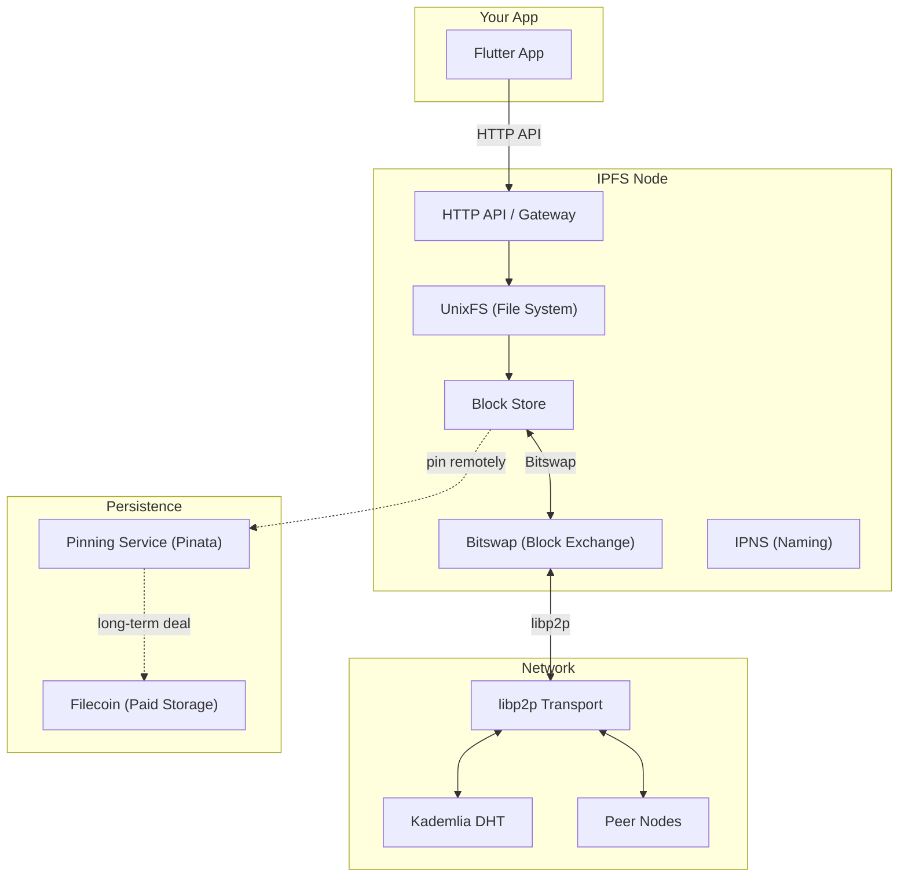
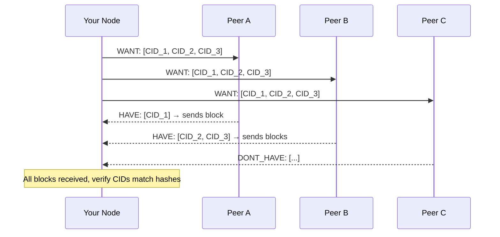
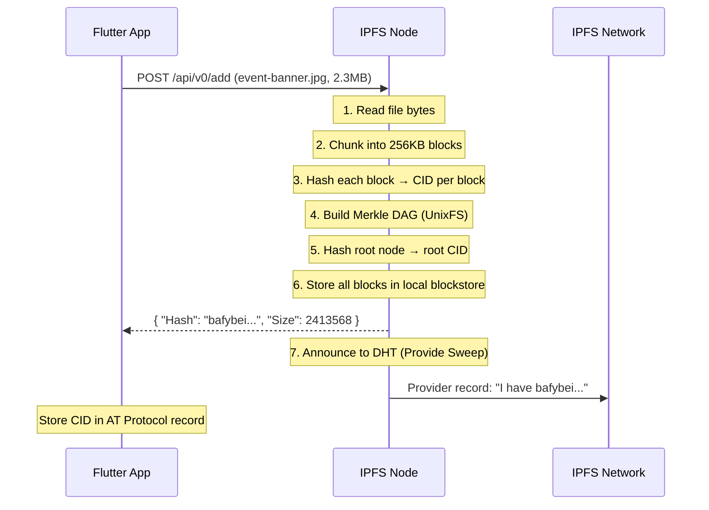
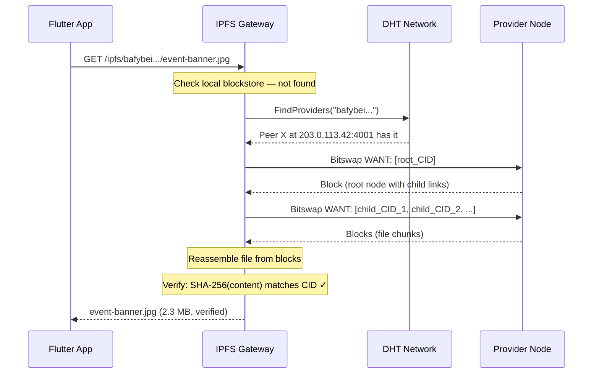
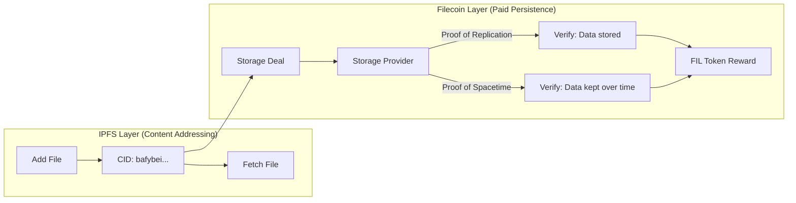
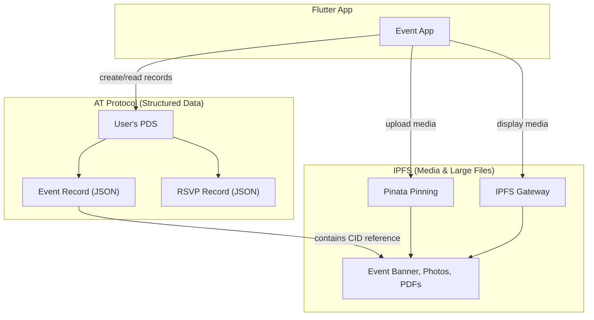

# IPFS Deep Dive — The InterPlanetary File System

> A complete technical breakdown of IPFS for Flutter developers. Covers how content addressing works from the ground up, every subsystem in the stack, practical integration paths for Flutter/iOS, and an honest assessment of what IPFS can and cannot do for our event app.

---

## Table of Contents

1. [The Core Idea: What vs Where](#the-core-idea-what-vs-where)
2. [Architecture Overview](#architecture-overview)
3. [Component Breakdown](#component-breakdown)
   - [CIDs (Content Identifiers)](#1-cids-content-identifiers)
   - [Merkle DAGs](#2-merkle-dags)
   - [UnixFS (File System Layer)](#3-unixfs-file-system-layer)
   - [Bitswap (Data Exchange)](#4-bitswap-data-exchange)
   - [DHT (Distributed Hash Table)](#5-dht-distributed-hash-table)
   - [libp2p (Networking Stack)](#6-libp2p-networking-stack)
   - [IPNS (Mutable Naming)](#7-ipns-mutable-naming)
   - [DNSLink](#8-dnslink)
   - [IPLD (Linked Data)](#9-ipld-linked-data)
4. [How a File Is Stored: Step by Step](#how-a-file-is-stored-step-by-step)
5. [How a File Is Retrieved: Step by Step](#how-a-file-is-retrieved-step-by-step)
6. [Persistence: The Pinning Problem](#persistence-the-pinning-problem)
7. [Privacy Assessment](#privacy-assessment)
8. [IPFS + Filecoin: The Incentive Layer](#ipfs--filecoin-the-incentive-layer)
9. [Flutter / Dart Integration](#flutter--dart-integration)
10. [IPFS for the Event App: Practical Scenarios](#ipfs-for-the-event-app-practical-scenarios)
11. [Strengths & Weaknesses](#strengths--weaknesses)
12. [Glossary](#glossary)

---

## The Core Idea: What vs Where

Traditional HTTP locates data by **where** it lives:

```
https://example.com/images/event-banner.jpg
         └─ server ─┘  └──── path on that server ────┘
```

If that server goes down, or moves the file, the link breaks. The URL tells you nothing about the content itself.

**IPFS locates data by what it is:**

```
ipfs://bafybeigdyrzt5sfp7udm7hu76uh7y26nf3efuylqabf3ochemuedce24ta
       └──────── cryptographic hash of the content itself ──────────┘
```

The same file will **always** produce the same hash. If even one byte changes, the hash changes entirely. This means:

- **Integrity**: You can verify you received exactly what was requested
- **Deduplication**: The same file stored by different people uses the same CID
- **Permanence**: The link works as long as *any* node on the network has the file — it doesn't matter which server

---

## Architecture Overview



---

## Component Breakdown

### 1. CIDs (Content Identifiers)

The CID is IPFS's fundamental building block — a self-describing, content-addressed identifier.

#### Structure

```
bafybeigdyrzt5sfp7udm7hu76uh7y26nf3efuylqabf3ochemuedce24ta

Decoded:
┌────────────┬──────────────┬──────────────────────────────────┐
│ Multibase   │ Multicodec   │ Multihash                        │
│ (encoding)  │ (data format)│ (hash function + digest)         │
├────────────┼──────────────┼──────────────────────────────────┤
│ base32      │ dag-pb       │ sha2-256 + 32-byte digest        │
└────────────┴──────────────┴──────────────────────────────────┘
```

**CID versions:**

| Version | Prefix | Features |
|---------|--------|----------|
| CIDv0 | `Qm...` | SHA-256 only, dag-pb only, base58btc encoding |
| CIDv1 | `bafy...` | Self-describing — any hash, any codec, any base encoding |

#### Example: Generating a CID

```
Input file: "Perth Flutter Meetup - Event Banner.jpg" (2.3 MB)

1. SHA-256 hash the content → 0x8a72f9b3c4e1d6a8...
2. Wrap in multihash     → 0x1220 8a72f9b3c4e1d6a8...
                             │ │
                             │ └── length: 32 bytes
                             └──── hash function: sha2-256
3. Wrap in CID           → version(1) + codec(dag-pb) + multihash
4. Encode in base32      → bafybeigdyrzt5sfp7udm7hu76uh7y26nf3efuylqabf3ochemuedce24ta
```

**Key property**: If someone on the other side of the world adds the exact same JPEG, they get the exact same CID. Content is globally deduplicated.

---

### 2. Merkle DAGs

IPFS organises data into **Merkle Directed Acyclic Graphs** — tree-like structures where every node contains the hashes of its children.

#### How a Large File Becomes a DAG

```
event-banner.jpg (2.3 MB)
         │
    ┌────┴─────┐──── chunk into 256KB blocks
    │          │
┌───▼───┐ ┌───▼───┐ ┌───▼───┐ ┌───▼───┐ ... (9 blocks)
│Block 1│ │Block 2│ │Block 3│ │Block 4│
│ CID_a │ │ CID_b │ │ CID_c │ │ CID_d │
└───────┘ └───────┘ └───────┘ └───────┘
    │          │          │          │
    └──────────┴──────────┴──────────┘
                    │
              ┌─────▼─────┐
              │ Root Node  │  ←── contains links to CID_a, CID_b, CID_c, CID_d...
              │ CID_root   │  ←── THIS is the CID you share
              └────────────┘
```

**Why this matters:**

| Benefit | How |
|---------|-----|
| **Parallel download** | Fetch blocks from different peers simultaneously |
| **Resumable transfers** | Only re-download missing blocks |
| **Deduplication** | Identical blocks across different files share the same CID |
| **Tamper detection** | Change one block → parent hash changes → root hash changes |
| **Efficient sync** | Compare root hashes to instantly detect differences |

#### Directory DAG

Directories work the same way:

```
event-media/                    → CID_dir
├── banner.jpg                  → CID_banner
├── venue-photo.png             → CID_venue
└── schedule.pdf                → CID_schedule

The directory CID_dir is a node containing links:
  { "banner.jpg": CID_banner, "venue-photo.png": CID_venue, "schedule.pdf": CID_schedule }
```

---

### 3. UnixFS (File System Layer)

UnixFS adds file-system semantics on top of raw DAG blocks. It tells IPFS "this collection of blocks represents a file" or "this node is a directory."

```
┌──────────────────────────────────────┐
│           UnixFS Node                │
├──────────────────────────────────────┤
│ Type: File                           │
│ Data: <raw bytes of this chunk>      │
│ FileSize: 262144                     │
│ Links: [                             │
│   { CID: bafyabc..., Size: 262144 } │
│   { CID: bafydef..., Size: 262144 } │
│ ]                                    │
└──────────────────────────────────────┘
```

**Supported types**: `File`, `Directory`, `Symlink`, `HAMTShard` (for large directories with thousands of entries)

---

### 4. Bitswap (Data Exchange)

Bitswap is the protocol that transfers blocks between peers. Think of it as BitTorrent for individual data blocks.

#### How It Works



**Key features:**
- **Want-lists**: Each node broadcasts which CIDs it needs
- **Parallel fetching**: Blocks come from whichever peer has them fastest
- **Tit-for-tat**: Nodes that share more get better service (like BitTorrent)
- **Block-level**: Operates on individual 256KB blocks, not whole files

---

### 5. DHT (Distributed Hash Table)

The Kademlia DHT is IPFS's "phone book" — it maps CIDs to the peers that have them.

#### How Content Routing Works

```
Q: "Who has bafybeigdyrzt5...?"

1. Your node hashes the CID to get a DHT key
2. Routes the query to peers "closest" to that key (XOR distance)
3. Those peers either have a provider record or point to closer peers
4. Eventually finds a provider record: "Peer X at IP:port has this CID"
5. Your node connects to Peer X via libp2p and requests the block via Bitswap
```

#### 2025 Improvement: Provide Sweep

Historically, announcing content to the DHT was expensive — each CID required a separate network operation. **Provide Sweep** (introduced 2025) batches announcements:

```
Before: Add 10,000 files → 10,000 simultaneous DHT announcements → network congestion
After:  Add 10,000 files → batched sweep over hours → smooth, efficient announcement
```

This makes self-hosting an IPFS node on consumer hardware practical for the first time.

---

### 6. libp2p (Networking Stack)

libp2p is the modular networking library that IPFS is built on. It handles everything about *how* peers find each other and communicate.

```
┌──────────────────────────────────────────────┐
│                   libp2p                      │
├──────────────┬───────────────┬───────────────┤
│  Discovery   │   Transport   │   Security    │
├──────────────┼───────────────┼───────────────┤
│ Kademlia DHT │ TCP           │ Noise         │
│ mDNS (local) │ QUIC          │ TLS 1.3       │
│ Bootstrap    │ WebSocket     │               │
│              │ WebRTC        │               │
│              │ WebTransport  │               │
├──────────────┴───────────────┴───────────────┤
│  Multiplexing: yamux / mplex                  │
│  NAT Traversal: AutoRelay, Hole Punching      │
└──────────────────────────────────────────────┘
```

**Peer Identity**: Each IPFS node has a unique **PeerID** derived from its public key. All connections are authenticated and encrypted by default.

libp2p is used independently by Ethereum, Polkadot, and Filecoin — it's become an industry standard beyond IPFS.

---

### 7. IPNS (Mutable Naming)

IPNS solves the immutability problem: "If the CID changes every time I update a file, how do I give people a stable link?"

#### How It Works

```
                  IPNS Name (derived from public key)
                  ┌──────────────────────────────────────┐
                  │ /ipns/k51qzi5uqu5dh29kcr...          │
                  └──────────────┬───────────────────────┘
                                 │ points to (signed record)
                                 ▼
    Day 1:  /ipfs/bafybeiabc...  (v1 of event page)
    Day 2:  /ipfs/bafybeighi...  (v2 — updated schedule)
    Day 3:  /ipfs/bafybeixyz...  (v3 — final version)
```

- The IPNS name **never changes** — it's derived from your keypair
- You **sign** each update with your private key
- Anyone can **verify** the record is authentic
- Records have a **TTL** and **sequence number** to handle updates

#### Limitations

- Resolution can be slow (DHT lookup for the latest record)
- Records expire (must be republished periodically)
- Not suitable for high-frequency updates

---

### 8. DNSLink

DNSLink bridges IPFS to the traditional DNS system, giving CIDs human-readable domain names.

```
DNS TXT Record:
  _dnslink.events.orbit.au  TXT  "dnslink=/ipfs/bafybei..."

Resolution:
  https://events.orbit.au  →  DNS lookup  →  /ipfs/bafybei...  →  IPFS content
```

This is how you'd host a static event website on IPFS with a normal domain name. Updates are easy — just change the DNS TXT record to point to the new CID.

---

### 9. IPLD (InterPlanetary Linked Data)

IPLD is the data model layer that lets IPFS understand the *structure* of content, not just the raw bytes.

| Codec | Format | Used For |
|-------|--------|----------|
| `dag-pb` | Protocol Buffers | UnixFS files/directories (default) |
| `dag-cbor` | CBOR (binary JSON) | Structured data, AT Protocol records |
| `dag-json` | JSON | Human-readable structured data |
| `raw` | Raw bytes | Leaf blocks (file chunks) |

**Why it matters**: IPLD lets you link data *across* systems. An AT Protocol record (dag-cbor) can reference an IPFS file (dag-pb) by CID, creating a verifiable cross-system link.

---

## How a File Is Stored: Step by Step

Let's walk through adding an event banner image to IPFS:



**Result**: The image is now in your local node's blockstore and announced to the DHT. Anyone with the CID can fetch it.

---

## How a File Is Retrieved: Step by Step



---

## Persistence: The Pinning Problem

> [!WARNING]
> **IPFS does NOT guarantee data persistence.** This is the most misunderstood aspect of the protocol.

### The Garbage Collection Problem

IPFS nodes run **garbage collection** to free disk space. Any content not explicitly **pinned** will eventually be deleted from the node:

```
Node storage limit reached
    │
    ├── Pinned content: KEPT ✓
    │   └── You explicitly said "keep this forever"
    │
    └── Cached content: DELETED ✗
        └── You fetched this from someone else, stored temporarily
```

### The Availability Problem

Even if content is pinned on your node, it's only available when your node is online. For a mobile app, this is a non-starter — your phone goes to sleep, the content disappears from the network.

### Solutions: Pinning Services

| Service | Model | Cost (2026) | Notes |
|---------|-------|-------------|-------|
| **Pinata** | SaaS pinning | Free tier (1GB) → paid plans | Most popular, great API, dedicated gateways |
| **Web3.Storage** | IPFS + Filecoin | Free tier available | Backed by Filecoin deals for long-term persistence |
| **Infura** | API gateway | Pay-per-request | Part of Consensys, enterprise-focused |
| **Self-hosted Kubo** | Run your own | Server costs | Full control, maximum decentralisation |

### Pinning Example (Pinata API)

```dart
// Dart/Flutter: Pin event media to IPFS via Pinata
import 'dart:io';
import 'package:http/http.dart' as http;

Future<String> pinEventBanner(File imageFile) async {
  final uri = Uri.parse('https://api.pinata.cloud/pinning/pinFileToIPFS');
  
  final request = http.MultipartRequest('POST', uri)
    ..headers['Authorization'] = 'Bearer $pinataJwt'
    ..files.add(await http.MultipartFile.fromPath('file', imageFile.path))
    ..fields['pinataMetadata'] = '{"name": "event-banner-perth-meetup"}';

  final response = await request.send();
  final body = await response.stream.bytesToString();
  
  // Returns: { "IpfsHash": "bafybei...", "PinSize": 2413568 }
  return jsonDecode(body)['IpfsHash'];
}
```

---

## Privacy Assessment

> [!CAUTION]
> IPFS is **not private by design**. It is a public, transparent content distribution network.

### What Is Exposed

| Data Point | Visibility |
|-----------|-----------|
| **Content** | Anyone with the CID can fetch it — CIDs are not secret |
| **Provider records** | The DHT reveals which nodes are hosting which content |
| **Requesting nodes** | DHT queries reveal which nodes are *looking for* which content |
| **IP addresses** | libp2p connections reveal peer IP addresses |
| **Content links** | If a CID is published (e.g., in an AT Protocol record), the content is discoverable |

### How to Add Privacy

```
┌─────────────────────────────────────────────────┐
│              Privacy Layer (You Build)           │
├─────────────────────────────────────────────────┤
│  1. Encrypt content BEFORE adding to IPFS       │
│  2. Store the CID publicly (it's just a hash    │
│     of encrypted gibberish)                     │
│  3. Share decryption key through a separate     │
│     secure channel (e.g., AT Protocol DM,       │
│     Matrix E2EE room)                           │
│  4. Recipient fetches CID from IPFS, decrypts   │
│     locally                                     │
└─────────────────────────────────────────────────┘
```

**Even with encryption:**
- The DHT still reveals *that* your node is hosting *something*
- Traffic analysis can correlate who's requesting which CIDs
- Encrypted content is still permanent if pinned — future quantum computing could theoretically decrypt it

**For truly private content**: IPFS is the wrong tool. Use Matrix (E2EE messaging), SAFE Network (self-encrypting), or Holochain (agent-centric, selective sharing).

---

## IPFS + Filecoin: The Incentive Layer

IPFS has no built-in reason for strangers to store your data. **Filecoin** adds the economic incentive.



| Aspect | Details |
|--------|---------|
| **Payment** | You pay FIL tokens to storage providers |
| **Proof of Replication** | Cryptographic proof the provider actually stored your data |
| **Proof of Spacetime** | Ongoing proof the data is still being stored over time |
| **Retrieval** | Data can be fetched via standard IPFS or Filecoin retrieval markets |
| **Scale** | Network stores multiple exabytes of data |
| **Cost** | Significantly cheaper than AWS S3 for cold storage |

---

## Flutter / Dart Integration

> [!IMPORTANT]
> There is **no native IPFS implementation in Dart**. All Flutter integration goes through HTTP APIs.

### Approach 1: HTTP Gateway (Simplest — Read Only)

```dart
// Fetch any IPFS content via a public gateway
final imageUrl = 'https://ipfs.io/ipfs/bafybei.../event-banner.jpg';
// or via Pinata's dedicated gateway:
final imageUrl = 'https://gateway.pinata.cloud/ipfs/bafybei...';

// Use in Flutter:
Image.network(imageUrl)
```

### Approach 2: Pinata SDK (Read + Write)

```dart
class IpfsService {
  static const _pinataApiUrl = 'https://api.pinata.cloud';
  final String _jwt;
  
  IpfsService(this._jwt);
  
  /// Upload a file and get its CID
  Future<String> upload(File file, {String? name}) async {
    final request = http.MultipartRequest(
      'POST',
      Uri.parse('$_pinataApiUrl/pinning/pinFileToIPFS'),
    )
      ..headers['Authorization'] = 'Bearer $_jwt'
      ..files.add(await http.MultipartFile.fromPath('file', file.path));
    
    if (name != null) {
      request.fields['pinataMetadata'] = jsonEncode({'name': name});
    }
    
    final response = await request.send();
    final body = jsonDecode(await response.stream.bytesToString());
    return body['IpfsHash'] as String; // "bafybei..."
  }
  
  /// Build a gateway URL for a CID
  String gatewayUrl(String cid) {
    return 'https://gateway.pinata.cloud/ipfs/$cid';
  }
  
  /// Pin existing content by CID
  Future<void> pin(String cid) async {
    await http.post(
      Uri.parse('$_pinataApiUrl/pinning/pinByHash'),
      headers: {
        'Authorization': 'Bearer $_jwt',
        'Content-Type': 'application/json',
      },
      body: jsonEncode({'hashToPin': cid}),
    );
  }
}
```

### Approach 3: Store CID in AT Protocol Record

```dart
// After uploading event media to IPFS, store the CID in the AT record
final ipfsCid = await ipfsService.upload(bannerImage, name: 'perth-meetup-banner');

await atprotoService.createRecord(
  collection: 'events.smokesignal.calendar.event',
  record: {
    '\$type': 'events.smokesignal.calendar.event',
    'name': 'Perth Flutter Meetup',
    'startsAt': '2026-05-15T18:00:00+08:00',
    'description': 'Monthly Flutter developer meetup',
    'media': {
      'banner': {
        'ipfsCid': ipfsCid,  // "bafybei..."
        'mimeType': 'image/jpeg',
        'size': 2413568,
      },
    },
    'createdAt': DateTime.now().toUtc().toIso8601String(),
  },
);
```

---

## IPFS for the Event App: Practical Scenarios

### ✅ Good Use Cases

| Scenario | How | Why IPFS |
|----------|-----|----------|
| **Event banner images** | Upload to Pinata, store CID in AT record | Permanent, verifiable media that doesn't depend on Bluesky's blob storage |
| **Event photo galleries** | Upload directory to IPFS, share root CID | Automatic deduplication, parallel downloads |
| **Event schedule PDFs** | Pin to IPFS, link from event record | Content-addressed = guaranteed the file hasn't been tampered with |
| **Venue maps / floor plans** | Static assets on IPFS with DNSLink | Cacheable, distributed, fast via gateways |

### ❌ Poor Use Cases

| Scenario | Why Not IPFS |
|----------|-------------|
| **Private event details** | IPFS is public — anyone with the CID can read the content |
| **Real-time RSVP updates** | IPFS is not designed for frequently changing data |
| **User authentication** | IPFS has no identity or auth system (use AT Protocol) |
| **Event chat / messaging** | No real-time communication support (use Matrix or WebSockets) |
| **Small structured data** | Overhead not justified — AT Protocol PDS is better for JSON records |

### 🔀 Hybrid Architecture



---

## Strengths & Weaknesses

### Strengths

| Strength | Detail |
|----------|--------|
| **Content integrity** | CIDs guarantee what you receive is what was published |
| **Deduplication** | Same content = same CID, network-wide |
| **Censorship resistance** | Content available from any peer, not a single server |
| **Ecosystem maturity** | 10+ years of development, battle-tested in production |
| **Composability** | CIDs work as universal pointers across protocols (AT, Ceramic, Filecoin) |
| **Self-hosting viable** | 2025 improvements (Provide Sweep, AutoTLS) make home nodes practical |
| **Cost** | Free to use; pinning services have generous free tiers |

### Weaknesses

| Weakness | Detail |
|----------|--------|
| **No persistence guarantee** | Data disappears if no node pins it |
| **No privacy** | Content, provider info, and request patterns are all visible |
| **Performance variability** | Cold content (rarely accessed) can be very slow to retrieve |
| **No native Dart/Flutter** | Must use HTTP APIs, not embedded in the app |
| **Immutable by default** | IPNS exists for mutability but is slow and awkward |
| **Content moderation** | Once content is on the network, it can't be forcibly removed |
| **Complexity** | CIDs, DAGs, DHTs, Bitswap — steep learning curve |
| **Gateway centralisation** | Most apps use `ipfs.io` or Pinata gateways, creating de facto centralisation |

---

## Glossary

| Term | Definition |
|------|-----------|
| **CID** | Content Identifier — a hash-based address for content |
| **DAG** | Directed Acyclic Graph — tree-like structure linking content blocks |
| **DHT** | Distributed Hash Table — decentralised lookup system mapping CIDs to peers |
| **Bitswap** | Block exchange protocol between IPFS peers |
| **libp2p** | Modular P2P networking library used by IPFS |
| **IPNS** | Mutable naming system — a stable address pointing to changing CIDs |
| **DNSLink** | Maps DNS domains to IPFS content |
| **IPLD** | Data model for structured, linked content across protocols |
| **UnixFS** | File system abstraction layer on top of DAG blocks |
| **Pinning** | Explicitly keeping content on a node to prevent garbage collection |
| **Gateway** | HTTP server that fetches IPFS content and serves it over regular HTTP |
| **Kubo** | The reference IPFS implementation (Go) — formerly go-ipfs |
| **Helia** | JavaScript/TypeScript IPFS implementation (no Dart equivalent) |

---

*Last updated: 2026-04-06*
*Part of: [AT Protocol Overview](./at-protocol-overview.md) | [Protocol Comparison](./decentralised-protocols-comparison.md)*
