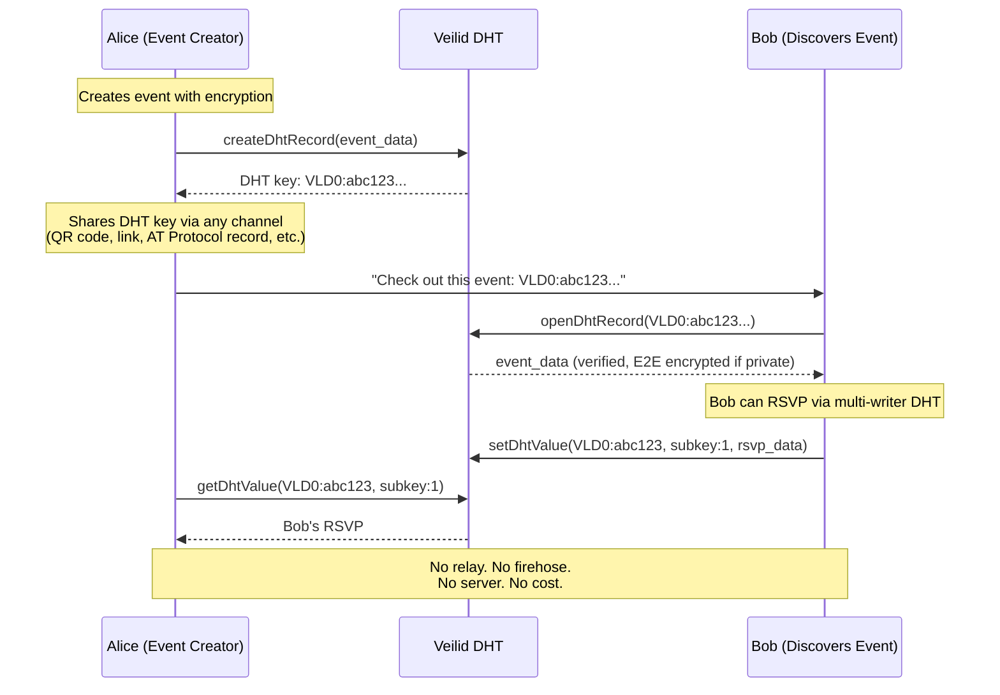
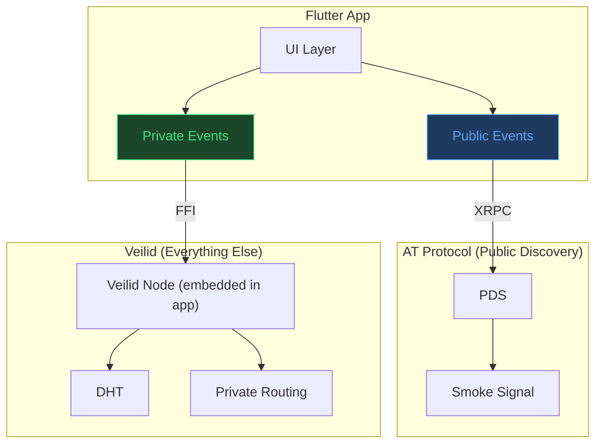
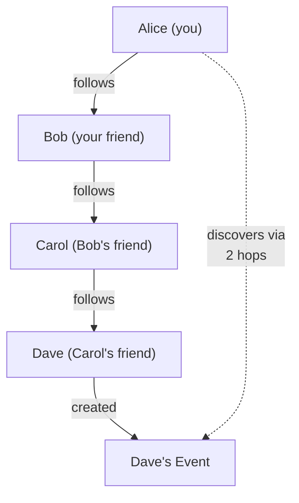
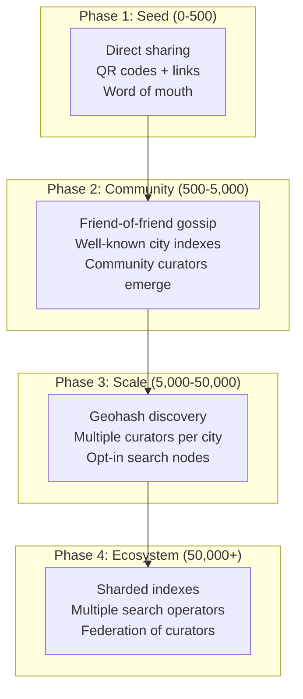

# Protocol Candidates: Solving All Three Weaknesses

> Finding protocols that natively address **centralisation risk**, **relay economics**, and **network lock-in** — the three AT Protocol weaknesses that the hybrid approach only partially mitigated.

---

## The Requirements

The protocol must solve all three simultaneously:

| # | Weakness | Requirement |
|---|----------|-------------|
| 1 | **Centralisation risk** | No single entity controls critical infrastructure. No single point of failure. |
| 2 | **Relay economics** | Every node routes / relays by default. No expensive centralised relay. Cost distributed across participants. |
| 3 | **Network lock-in** | No single entity dominates the protocol. Cheap to run infrastructure. No governance bottleneck. |

Your intuition about "basic routers" is exactly right — what you're describing is a protocol where **every node IS a router**. No special relay infrastructure. Every participant contributes to the network equally. The network gets stronger (not more expensive) as it grows.

---

## Two protocols match. One of them has native Flutter support.

---

## 1. Veilid — The Strongest Candidate ⭐

> Created by the Cult of the Dead Cow (cDc). Privacy-first. Mobile-first. **Has native Flutter/Dart FFI bindings.** Every node is a router.

### Architecture

```
┌─────────────────────────────────────────────────────────────┐
│                    Veilid Network                            │
│                                                             │
│  Every node is equal. Every node routes for others.         │
│  No relay. No server. No central authority.                 │
│                                                             │
│  ┌─────┐     ┌─────┐     ┌─────┐     ┌─────┐              │
│  │Node │◄───►│Node │◄───►│Node │◄───►│Node │              │
│  │(iOS)│     │(Mac)│     │(Lin)│     │(And)│              │
│  └─────┘     └─────┘     └─────┘     └─────┘              │
│      ▲           ▲           ▲           ▲                  │
│      └───────────┴───────────┴───────────┘                  │
│              DHT (Distributed Hash Table)                    │
│           Multi-writer key-value store                       │
│           Private + Safety routing                           │
│           E2E encrypted by default                           │
└─────────────────────────────────────────────────────────────┘
```

### How it solves each weakness

#### ✅ 1. Centralisation Risk → SOLVED

```
AT Protocol:                         Veilid:
  PLC Directory  → single registry    256-bit pubkey → self-generated
  Relay          → single aggregator   Every node routes → no relay
  PDS            → hosted by provider  Source data → on your device
  AppView        → built by Bluesky    App logic → in your app
  
  4 single points of failure           0 single points of failure
```

- **Identity**: 256-bit public key, self-generated. No PLC Directory. No registrar. You ARE your key.
- **Routing**: Every node participates in routing via the DHT. Remove any node — the network routes around it.
- **Data**: Stored in the DHT with multi-writer capability. No single entity hosts your data.
- **Discovery**: DHT-based peer discovery. No central DNS or bootstrap server required (though bootstrap nodes exist for convenience).

#### ✅ 2. Relay Economics → SOLVED

```
AT Protocol Relay costs:              Veilid node costs:
  Infrastructure: $10,000+/month      Infrastructure: $0
  Processes: ALL network data          Processes: only YOUR data + routing
  Scales: worse with more users        Scales: BETTER with more users
  Operator: altruism + funding         Operator: every app user
```

**The key insight**: In Veilid, there IS no relay because every node is a relay. When you run a Veilid app, your device contributes bandwidth and routing to the network. The cost of running the network is the sum of all devices contributing a tiny amount each — not one operator bearing the full cost.

```
10,000 users on AT Protocol:
  └── 1 relay operator pays for ALL 10,000 users' data = $$$$$

10,000 users on Veilid:
  └── Each user's device routes a tiny fraction = $0 per user
  └── Network capacity GROWS with users
```

#### ✅ 3. Network Lock-in → SOLVED

- **No dominant entity**: Veilid is open source, governed by the cDc community. No VC-backed company controls it.
- **No expensive infrastructure**: Anyone can run a node. There's no economic barrier to participation.
- **No proprietary schemas**: You define your own data structures and protocols.
- **No governance bottleneck**: Protocol decisions aren't controlled by a company that also runs the dominant app.
- **Portable identity**: Your 256-bit pubkey works anywhere on the Veilid network. No "handle" tied to a specific provider.

### Flutter / Dart Integration

> [!IMPORTANT]
> **Veilid has official Flutter bindings via Rust FFI.** This is the most significant practical advantage over every other candidate protocol.

```dart
// Veilid Flutter integration — native FFI, not HTTP
import 'package:veilid/veilid.dart';

// Initialize the Veilid node (runs as part of your app)
final veilid = await Veilid.platformInit();
await veilid.startupVeilidCore(updateCallback: (update) {
  // Handle network state changes
  print('Veilid update: $update');
});

// Create a DHT record (like creating an event)
final routingContext = await veilid.routingContext();
final dhtRecord = await routingContext.createDhtRecord(
  DhtRecordDescriptor.dflt(1), // 1 subkey
);

// Write event data to the DHT
await routingContext.setDhtValue(
  dhtRecord.key,
  0, // subkey index
  utf8.encode(jsonEncode({
    'name': 'Perth Flutter Meetup',
    'startsAt': '2026-05-15T18:00:00+08:00',
    'location': 'Spacecubed, 45 St Georges Terrace',
    'createdBy': myPublicKey.toString(),
  })),
);

// Share the DHT key with others — they can read the event
print('Event published at: ${dhtRecord.key}');
```

```dart
// Reading an event (another user's device)
final routingContext = await veilid.routingContext();
final dhtRecord = await routingContext.openDhtRecord(
  eventDhtKey, // shared by the creator
);

final value = await routingContext.getDhtValue(eventDhtKey, 0);
final eventData = jsonDecode(utf8.decode(value!.data));
print('Event: ${eventData['name']}'); // "Perth Flutter Meetup"
```

### How events work on Veilid



### Veilid Assessment

| Factor | Score | Notes |
|--------|:----:|-------|
| Centralisation risk | ✅ 10/10 | Zero single points of failure |
| Relay economics | ✅ 10/10 | No relay. Every node routes. Network gets cheaper with scale. |
| Network lock-in | ✅ 10/10 | Open source, no dominant entity, no expensive infrastructure |
| Privacy | ✅ 9/10 | Onion-style routing, IP obfuscation, E2E encryption |
| Flutter/Dart support | ✅ 8/10 | Native FFI bindings. VeilidChat is a Flutter app. |
| Ecosystem maturity | ⚠️ 4/10 | Small community, early-stage, limited documentation |
| Existing social graph | ❌ 1/10 | No existing user base to leverage |
| Event discovery | ⚠️ 3/10 | No global index. Must build discovery layer. |

---

## 2. Waku — The Messaging-Optimised Candidate

> Built by the Status/Logos team. Purpose-built decentralised pub/sub. Sharded relay network with incentivised node operators. Built on libp2p.

### Architecture

```
┌─────────────────────────────────────────────────────────────┐
│                      Waku Network                            │
│                                                             │
│  Sharded pub/sub. Light nodes for mobile.                   │
│  Content topics for filtering. RLN for anti-spam.           │
│                                                             │
│  ┌─────────────────────────────────────────────┐            │
│  │          Shard 0 (pubsub topic)             │            │
│  │  ┌─────┐  ┌─────┐  ┌─────┐  ┌─────┐       │            │
│  │  │Relay│──│Relay│──│Relay│──│Relay│       │            │
│  │  │Node │  │Node │  │Node │  │Node │       │            │
│  │  └──┬──┘  └─────┘  └─────┘  └──┬──┘       │            │
│  │     │                           │           │            │
│  │  ┌──▼──┐                     ┌──▼──┐       │            │
│  │  │Light│                     │Light│       │            │
│  │  │Node │   (Filter protocol) │Node │       │            │
│  │  │(iOS)│                     │(And)│       │            │
│  │  └─────┘                     └─────┘       │            │
│  └─────────────────────────────────────────────┘            │
│                                                             │
│  ┌─────────────────────────────────────────────┐            │
│  │          Shard 1 (pubsub topic)             │            │
│  │  ... more relay nodes ...                    │            │
│  └─────────────────────────────────────────────┘            │
└─────────────────────────────────────────────────────────────┘
```

### How it solves each weakness

#### ✅ 1. Centralisation Risk → SOLVED

- **Sharded network**: Traffic split across multiple shards. No single relay processes everything.
- **Light nodes**: Mobile devices subscribe to specific content topics via the Filter protocol. They don't need a full relay.
- **No central authority**: No equivalent of Bluesky PBC. Network is governed by the Logos collective.

#### ✅ 2. Relay Economics → SOLVED (differently from Veilid)

Waku takes a different approach — relay nodes exist but are:
- **Cheap to run** (they only process their assigned shard, not the entire network)
- **Incentivised** (the protocol is building a decentralised service marketplace with micropayments)
- **Replaceable** (any new operator can spin up a relay node for a shard)

```
AT Protocol:                         Waku:
  1 relay for entire network           N shards, each with M relay nodes
  Cost: $$$$$ (all data)              Cost: $ per shard (fraction of data)
  Operator: must be rich               Operator: anyone with a VPS
  Incentive: none                      Incentive: micropayment marketplace
```

#### ✅ 3. Network Lock-in → SOLVED

- **Open protocol**: Anyone can run relay nodes, build apps, define content topics
- **No dominant app**: Status (the chat app) uses Waku, but it doesn't control the protocol
- **Content topics are app-defined**: You define `/events/1/perth-tech/proto` — no Lexicon governance needed

### Content Topics for Events

```
Application-defined content topics:

/events/1/perth-tech/proto          ← Perth tech events
/events/1/perth-music/proto         ← Perth music events
/events/1/sydney-tech/proto         ← Sydney tech events
/events/1/global-online/proto       ← Online events
/rsvps/1/{event-id}/proto           ← RSVPs for specific event
/updates/1/{event-id}/proto         ← Updates for specific event
```

A mobile device using the **Filter protocol** subscribes only to the content topics it cares about:

```dart
// Waku: Subscribe to Perth tech events only
// (via nwaku REST API or native Swift/Kotlin SDK bridged to Flutter)
await wakuNode.filterSubscribe(
  contentTopics: ['/events/1/perth-tech/proto'],
  callback: (message) {
    final event = EventModel.fromProto(message.payload);
    print('New event: ${event.name}');
  },
);
```

### Waku Assessment

| Factor | Score | Notes |
|--------|:----:|-------|
| Centralisation risk | ✅ 9/10 | Sharded, no single relay, but bootstrap nodes exist |
| Relay economics | ✅ 8/10 | Cheap sharded relays + incentive marketplace. Not zero-cost. |
| Network lock-in | ✅ 9/10 | Open protocol, no dominant entity |
| Privacy | ⚠️ 7/10 | RLN for anti-spam, but less privacy than Veilid (no onion routing) |
| Flutter/Dart support | ⚠️ 5/10 | No native Dart SDK. Requires Platform Channels or REST API. |
| Ecosystem maturity | ⚠️ 6/10 | Larger than Veilid, backed by Status/Logos, but still niche |
| Existing social graph | ❌ 2/10 | Status app users, small community |
| Event discovery | ✅ 7/10 | Content topics + Store protocol = built-in discovery pattern |

---

## Head-to-Head Comparison

| Dimension | Veilid | Waku |
|-----------|:------:|:----:|
| **Centralisation** | No servers at all. Every node is equal. | Sharded relays — distributed but relay nodes still exist. |
| **Relay cost** | $0--every app user is a router | $ — cheap relay nodes, incentivised via micropayments |
| **Lock-in** | No dominant entity. You control everything. | No dominant entity. Open protocol. |
| **Privacy** | ✅ Onion routing, IP masking, E2E by default | ⚠️ E2E encryption, RLN anti-spam, but no onion routing |
| **Flutter/Dart** | ✅ **Native FFI bindings** | ⚠️ Platform Channels or REST API |
| **Mobile-first** | ✅ Designed for mobile from day one | ✅ Light node protocol for mobile |
| **Pub/Sub model** | ⚠️ DHT + multi-writer (pub/sub-like) | ✅ **Native pub/sub** with content topics and sharding |
| **Offline support** | ⚠️ DHT data persists, but no Store protocol | ✅ Store protocol for message history |
| **Discovery** | ❌ Must build your own | ✅ Content topics + subscriptions |
| **Maturity** | ⚠️ Early stage, small community | ⚠️ More mature, larger ecosystem |
| **Spam protection** | ❌ App-level implementation | ✅ RLN (zero-knowledge proof based) |

---

## The Recommendation

### For YOUR use case (event app, Flutter iOS): **Veilid**

```
Why Veilid wins for this project:

  1. FLUTTER NATIVE — official FFI bindings, VeilidChat proves it works
  2. Zero relay cost — no infrastructure to operate or pay for
  3. No centralisation AT ALL — not "distributed relays" but truly no relays
  4. Privacy by default — onion routing, E2E encryption, IP masking
  5. Mobile-first — designed for exactly your constraints (iOS, battery, connectivity)
  6. Multi-writer DHT — maps perfectly to events (creator writes) + RSVPs (attendees write)
```

### What you lose vs AT Protocol

| Lose | Impact | Mitigation |
|------|--------|------------|
| Smoke Signal interop | Can't read/write Smoke Signal events | Build your own event ecosystem |
| Bluesky social graph | Can't leverage existing followers | Build discovery via QR codes, links, local sharing |
| Bluesky user base | Start from zero | Niche privacy-focused users value this |
| Content moderation (labelers) | No protocol-level moderation | App-level moderation in your Flutter app |
| Protocol maturity | Veilid is early-stage | VeilidChat exists as proof of concept |

### What you gain

| Gain | Impact |
|------|--------|
| **$0 infrastructure cost** | No relay, no PDS, no server to maintain |
| **True decentralisation** | No company can shut down or censor your app |
| **Privacy by default** | Private events are architecturally private, not just "encrypted on top of public" |
| **Native Flutter** | No HTTP bridge, no REST API — direct FFI integration |
| **Network effect works FOR you** | More users = more routing capacity = better network |

---

## Hybrid Option: AT Protocol (discovery) + Veilid (everything else)

If you still want Smoke Signal interop for public events:



This gives you:
- **Public events**: AT Protocol → Smoke Signal interop ✓
- **Private events + RSVPs + messaging**: Veilid → zero relay cost, true privacy, native Flutter ✓
- **No Holochain**: Veilid replaces Holochain in the hybrid architecture, with the advantage of native Flutter FFI instead of HTTP bridging

---

## Veilid at Scale: Social Graph & Event Discovery

> [!WARNING]
> This section tackles Veilid's two biggest weaknesses honestly. The protocol solves centralisation, relay economics, and lock-in beautifully — but it has **no built-in social graph** and **no global discovery mechanism**. These must be engineered at the application layer.

### The Fundamental Problem

Veilid's DHT is a **key-value store**. You need to *know* a key to find data. There is:

- No global index
- No firehose to crawl
- No search API
- No "browse all events"
- No "recommended for you"
- No follow/follower graph built into the protocol

```
AT Protocol:  "Show me all events"  → Relay has indexed everything → instant results
Veilid:       "Show me all events"  → ??? You need a key to look up → nothing
```

This is the price of true decentralisation. The same architecture that eliminates relays also eliminates the thing relays are good at: **global discovery**.

### How the Social Graph Works at 10,000+ Users

There is no single "social graph" in Veilid. Instead, each user maintains their own **contact list** as a DHT record, and connections are built through **direct sharing** and **transitive discovery**.

#### Pattern 1: Contact List as DHT Record

```
Alice's Contact Record (DHT):
┌─────────────────────────────────────────────┐
│ Key: VLD0:alice_contacts_abc...              │
│ Owner: Alice's pubkey                        │
│                                              │
│ Subkey 0: { contacts: [                      │
│   { pubkey: "Bob_xyz...",   name: "Bob" },   │
│   { pubkey: "Carol_def...", name: "Carol" }, │
│   { pubkey: "Dave_ghi...",  name: "Dave" },  │
│ ]}                                           │
│                                              │
│ Subkey 1: { events_created: [                │
│   "VLD0:event_perth_meetup...",              │
│   "VLD0:event_tech_night...",                │
│ ]}                                           │
└─────────────────────────────────────────────┘
```

When Alice shares her pubkey with someone, they can look up her contact record and see:
- Who she knows (if she chooses to make this public)
- What events she's created (links to event DHT keys)

#### Pattern 2: Friend-of-Friend Discovery (Gossip)

This is how Secure Scuttlebutt built a social network without servers — and the same pattern works on Veilid:



**How it works at scale:**

```
Degree 0: You                                    = 1 person
Degree 1: Your direct contacts                   = ~50-150 people
Degree 2: Your contacts' contacts                = ~2,000-5,000 people
Degree 3: Three hops out                         = ~50,000-100,000 people

At 10,000 users with avg 50 contacts each:
  - 2 hops reaches most of the network
  - 3 hops reaches essentially everyone
```

The app periodically crawls contact lists of your contacts (degree 1-2) in the background, building a local index of discoverable events. This is bandwidth-efficient because you're only fetching small DHT records, not streaming a firehose.

```dart
// Background discovery: crawl friend-of-friend events
Future<List<EventModel>> discoverEvents() async {
  final discovered = <EventModel>[];
  
  // Get my contacts
  final myContacts = await getMyContacts();
  
  for (final contact in myContacts) {
    // Get their contact record (includes their events)
    final theirRecord = await routingContext.getDhtValue(
      contact.contactRecordKey, 0,
    );
    final theirData = jsonDecode(utf8.decode(theirRecord!.data));
    
    // Collect their events
    for (final eventKey in theirData['events_created'] ?? []) {
      final event = await fetchEvent(eventKey);
      discovered.add(event);
    }
    
    // Optionally: crawl THEIR contacts too (degree 2)
    for (final fof in theirData['contacts'] ?? []) {
      final fofRecord = await routingContext.getDhtValue(
        fof['contactRecordKey'], 0,
      );
      // ... collect friend-of-friend events
    }
  }
  
  return discovered;
}
```

#### Pattern 3: Growth Dynamics

```
Phase 1: 0-100 users (seed community)
  └── Discovery: Direct sharing (QR codes, links, word of mouth)
  └── Social graph: Manual "add contact" in app
  └── Works well: Small community, everyone knows each other

Phase 2: 100-1,000 users (early growth)
  └── Discovery: Friend-of-friend crawling covers most users
  └── Social graph: ~50 contacts × 2 hops = ~2,500 reachable users
  └── Works well: Community indexes emerge (see below)

Phase 3: 1,000-10,000 users (scale)
  └── Discovery: Community index records become critical
  └── Social graph: Multiple overlapping communities
  └── Challenge: Cold-start problem for isolated new users

Phase 4: 10,000+ users (maturity)
  └── Discovery: Geographic + category indexes essential
  └── Social graph: Organic gossip covers the network
  └── Challenge: DHT bandwidth for crawling at depth 2+
```

---

### How Event Discovery Works

Since Veilid has no global index, discovery must be built using **well-known DHT keys** and **community-maintained indexes**.

#### Strategy 1: Deterministic "Well-Known" Keys

Create DHT keys using a deterministic formula so any app instance can compute the same key for "Perth tech events" without coordination:

```dart
// Deterministic key generation for geographic/category indexes
// Every app instance computes the same key for the same query
String computeIndexKey(String city, String category) {
  // Hash a well-known string to derive a deterministic DHT key
  final input = 'events-index:$city:$category:v1';
  return sha256(input); // Same input → same key → same DHT record
}

// Anyone can find Perth tech events by computing:
final perthTechKey = computeIndexKey('perth', 'tech');
// → always produces the same DHT key

// Fetch the index
final indexData = await routingContext.getDhtValue(perthTechKey, 0);
final eventList = jsonDecode(utf8.decode(indexData!.data));
// → list of DHT keys for individual events
```

```
Well-Known Index Keys (anyone can look these up):

  sha256("events-index:perth:tech:v1")       → list of Perth tech events
  sha256("events-index:perth:music:v1")      → list of Perth music events
  sha256("events-index:sydney:tech:v1")      → list of Sydney tech events
  sha256("events-index:global:online:v1")    → list of online events
  sha256("events-index:perth:*:v1")          → list of ALL Perth events
```

**Multi-writer makes this work**: The index DHT record uses multi-writer subkeys so any event creator can add their event to the index:

```
Index Record: sha256("events-index:perth:tech:v1")
┌────────────────────────────────────────────────────────┐
│ Subkey 0 (admin): { schema: "v1", city: "perth", ... } │
│ Subkey 1 (writer A): { event: "VLD0:abc...", ... }     │
│ Subkey 2 (writer B): { event: "VLD0:def...", ... }     │
│ Subkey 3 (writer C): { event: "VLD0:ghi...", ... }     │
│ ...                                                     │
│ Subkey N: available for next event                       │
└────────────────────────────────────────────────────────┘
```

#### Strategy 2: Community Curators

Trusted community members maintain curated event lists — like a decentralised version of Meetup.com's city pages:

```
"Perth Events" curator (community volunteer):
  ┌──────────────────────────────────────────┐
  │ DHT Record: VLD0:perth_events_curated... │
  │ Curator: @perth_admin pubkey             │
  │                                          │
  │ Featured Events:                         │
  │   - Perth Flutter Meetup (VLD0:abc...)   │
  │   - Tech Night Perth (VLD0:def...)        │
  │   - WA Startup Weekend (VLD0:ghi...)      │
  │                                          │
  │ Updated: 2026-05-01                       │
  └──────────────────────────────────────────┘
```

New users find curators through:
- The app ships with a default list of well-known curator keys
- QR codes at real-world events
- Shared links on social media
- Friend-of-friend contact lists

#### Strategy 3: Geo-Hash Based Discovery

For "events near me", use geohashing to create deterministic DHT keys based on location:

```dart
// Convert lat/lng to geohash, use as DHT index key
final geoHash = Geohash.encode(-31.9505, 115.8605, precision: 4);
// → "qd66" (covers Perth CBD area)

final nearbyKey = computeIndexKey('geo:$geoHash', 'all');
final nearbyEvents = await routingContext.getDhtValue(nearbyKey, 0);
```

```
Geohash grid:
┌────────┬────────┬────────┐
│ qd64   │ qd65   │ qd66   │  ← Perth CBD is in qd66
│        │        │ ●HERE  │
├────────┼────────┼────────┤
│ qd61   │ qd62   │ qd63   │
│        │        │        │
└────────┴────────┴────────┘

Search "nearby": query qd66 + adjacent cells (qd65, qd63, etc.)
Each cell has a well-known DHT index key.
```

#### Strategy 4: App-Level Search Index (Opt-In)

For users who want full search, offer an **opt-in search node** — a community-run service that crawls well-known indexes and provides search:

```
┌──────────────────────────────────────────┐
│ Search Node (opt-in, community run)      │
│                                          │
│ Crawls well-known index keys             │
│ Builds full-text search index            │
│ Serves via Veilid DHT or HTTP            │
│                                          │
│ ⚠️ This IS soft centralisation           │
│ But: anyone can run one                  │
│ And: the app works WITHOUT it            │
└──────────────────────────────────────────┘
```

> [!IMPORTANT]
> This is a pragmatic trade-off. Pure P2P discovery works for small-medium communities. At 10,000+ users, some form of indexing makes discovery dramatically better. The key is that the search node is **opt-in** and **replaceable** — the app functions without it, and anyone can run one.

---

### Discovery Comparison at Scale

| Scale | AT Protocol | Veilid (with above patterns) |
|-------|:---:|:---:|
| **100 users** | Overkill — full relay for 100 people | ✅ Direct sharing + contacts works perfectly |
| **1,000 users** | Works well | ✅ Friend-of-friend + well-known keys covers it |
| **10,000 users** | Works well | ⚠️ Needs community curators + geo indexes |
| **100,000 users** | Works well | ⚠️ Needs opt-in search nodes for full discovery |
| **1,000,000 users** | Relay costs become extreme | ⚠️ Must shard indexes, multiple search nodes |

### Honest Assessment

```
What's genuinely SOLVED:
  ✅ Finding events you've been invited to (you have the DHT key)
  ✅ Finding events from your contacts (crawl their records)
  ✅ Finding events in your city/category (well-known keys)
  ✅ Finding events near you (geohash)
  ✅ RSVPing to events (multi-writer DHT)
  ✅ Private events (encrypted DHT records)

What's HARD but workable:
  ⚠️ Cold-start for new users (need at least one contact to start)
  ⚠️ Full-text search across all events (needs search node)
  ⚠️ "Trending" or "popular" events (no global view)
  ⚠️ Discovery across distant communities (needs 3+ hops)

What's genuinely MISSING vs AT Protocol:
  ❌ "Browse all events globally" (no firehose = no global view)
  ❌ Algorithmic recommendations (no central data to train on)
  ❌ Instant search across everything (no centralised index)
  ❌ Guaranteed content moderation (no labeler infrastructure)
```

### The Growth Strategy



The critical insight: **events are inherently local and social**. You don't need a global index to find events near you or from people you know. The P2P discovery patterns work naturally for an event app because most event discovery happens through social connections and geographic proximity — exactly the patterns Veilid supports well.

---

> [!TIP]
> **Bottom line**: Veilid solves centralisation, relay economics, and lock-in at the protocol level. The social graph and discovery gaps are real but addressable through well-known DHT keys, friend-of-friend gossip, geohash indexes, and community curators. The architecture works well up to ~10,000 users with pure P2P patterns. Beyond that, opt-in search nodes add convenience without reintroducing hard centralisation.
>
> For the event app specifically, the natural locality of events (geographic + social) means P2P discovery is a better fit than for a global social media platform. People discover events through friends, communities, and location — which is exactly how Veilid's patterns work.

---

*Last updated: 2026-04-06*
*Part of: [AT Protocol Overview](./at-protocol-overview.md) | [Protocol Comparison](./decentralised-protocols-comparison.md) | [Hybrid Architecture](./hybrid-at-holochain-architecture.md) | [Social vs Pub/Sub](./social-vs-pubsub-architecture.md)*
