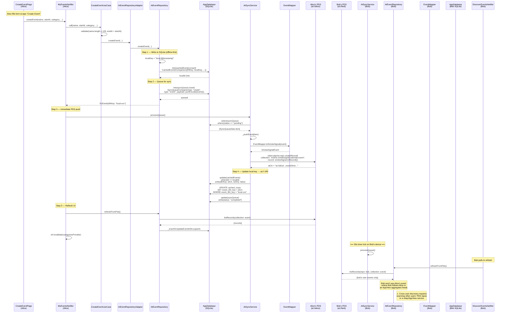
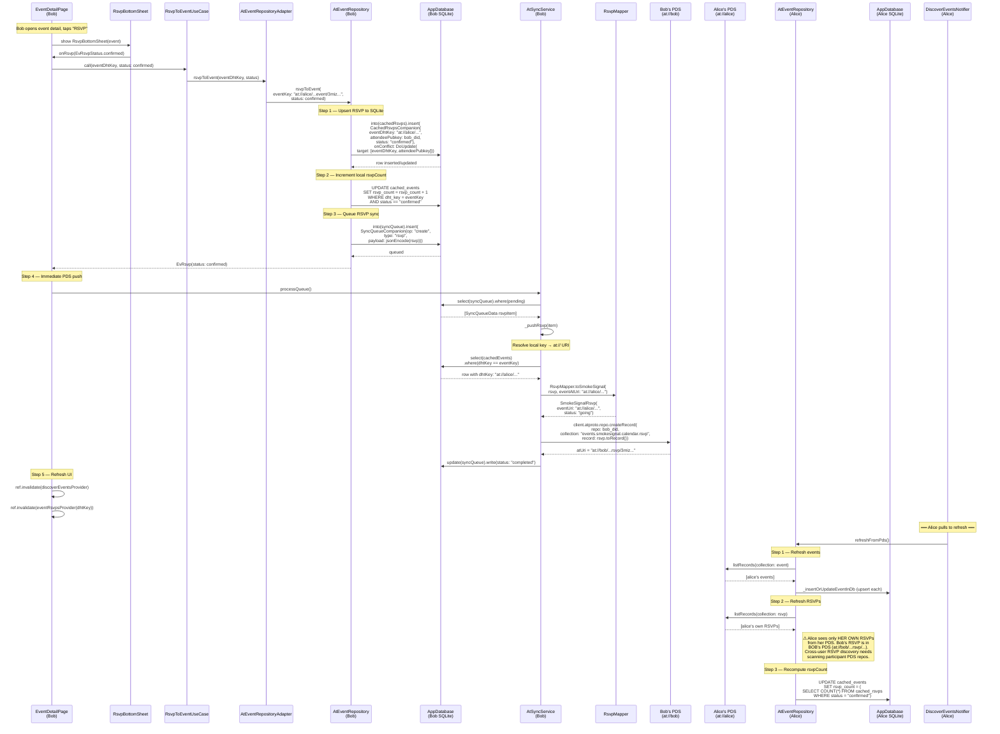
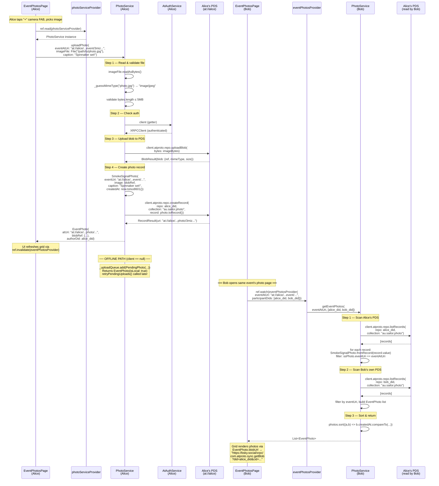
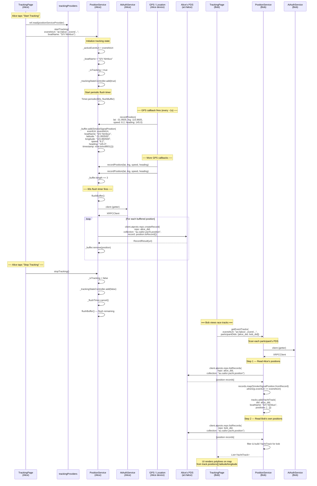

# QT Sequence Diagrams — AT Protocol Multi-Client Flows

> **Two clients, two handles, one PDS.**
> Alice (`alice.bsky.social`) and Bob (`bob.bsky.social`) each run Sailor on separate devices.
> Both authenticate via `AtAuthService.login()` and maintain independent SQLite caches.

---

## 1. New Event — Create & Sync

Alice creates an event. Bob sees it on the next PDS refresh.



---

## 2. RSVP — Respond & Cross-Sync

Bob RSVPs to an event. Alice sees the RSVP on next PDS refresh.



---

## 3. Add Photo — Upload & Cross-Read

Alice uploads a photo for an event. Bob views it by scanning Alice's PDS.



---

## 4. Yacht Position Tracking (Course)

Alice starts GPS tracking during a race. Bob views her track in real-time by reading her PDS positions.



---

## Architecture Summary

| Collection NSID | Stored In | Who Writes | Who Reads | Discovery |
|---|---|---|---|---|
| `events.smokesignal.calendar.event` | Creator's PDS | Event creator | Anyone with DID | Scan PDS repos |
| `events.smokesignal.calendar.rsvp` | Attendee's PDS | Attendee | Anyone with DID | Scan participant DIDs |
| `au.sailor.photo` | Photographer's PDS | Photo author | Anyone with DID | Scan participant DIDs |
| `au.sailor.yacht.position` | Tracker's PDS | Tracking device | Anyone with DID | Scan participant DIDs |

### Key Classes Per Layer

```
┌─────────────────────────────────────────────────────┐
│  UI Layer (apps/sailor/lib/features/...)            │
│  CreateEventPage → MyEventsNotifier                 │
│  EventDetailPage → RsvpBottomSheet                  │
│  EventPhotosPage → eventPhotosProvider              │
│  TrackingPage    → trackingProviders                │
├─────────────────────────────────────────────────────┤
│  Domain Layer                                       │
│  CreateEventUseCase · RsvpToEventUseCase             │
│  EventRepository (interface)                         │
├─────────────────────────────────────────────────────┤
│  Data Layer (AtEventRepositoryAdapter)              │
│  AtEventRepository → AppDatabase (Drift/SQLite)     │
│  PhotoService      → direct PDS (no local cache)    │
│  PositionService   → in-memory buffer → PDS         │
├─────────────────────────────────────────────────────┤
│  Protocol Layer (packages/ev_protocol_at/)          │
│  AtAuthService · AtSyncService                       │
│  EventMapper · RsvpMapper                            │
│  SmokeSignalEvent · SmokeSignalRsvp                  │
│  SmokeSignalPhoto · SmokeSignalPosition              │
│  LexiconNsids                                        │
├─────────────────────────────────────────────────────┤
│  AT Protocol PDS (remote)                           │
│  repo.createRecord · repo.listRecords               │
│  repo.uploadBlob · repo.deleteRecord                │
└─────────────────────────────────────────────────────┘
```
