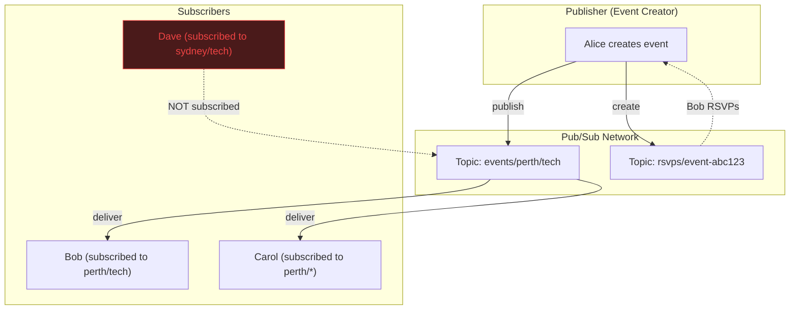

# Social Protocol vs Pub/Sub: Why the Relay Problem Exists

> The AT Protocol relay economics problem isn't a bug — it's a structural consequence of applying a **social** architecture to an **event** problem. This document explains the fundamental difference, why it matters, and what a pub/sub-native approach looks like.

---

## Table of Contents

1. [The Two Models](#the-two-models)
2. [Why AT Protocol Uses the Social Model](#why-at-protocol-uses-the-social-model)
3. [Why Events Don't Need a Social Model](#why-events-dont-need-a-social-model)
4. [Side-by-Side: Same App, Different Architecture](#side-by-side-same-app-different-architecture)
5. [The Relay Cost Problem, Explained](#the-relay-cost-problem-explained)
6. [Pub/Sub Options for Events](#pubsub-options-for-events)
7. [What a Pub/Sub Event Protocol Looks Like](#what-a-pubsub-event-protocol-looks-like)
8. [Mapping to the Hybrid Architecture](#mapping-to-the-hybrid-architecture)
9. [Decision Matrix](#decision-matrix)

---

## The Two Models

### Social Protocol: "Tell Everyone, Let Them Filter"

```
                     ┌─────────────────────┐
                     │     FIREHOSE         │
                     │  (everything flows)  │
                     └──────────┬──────────┘
                                │
            ┌───────────────────┼───────────────────┐
            │                   │                   │
     ┌──────▼──────┐    ┌──────▼──────┐    ┌──────▼──────┐
     │  AppView A  │    │  AppView B  │    │  AppView C  │
     │ (social app)│    │ (event app) │    │ (news app)  │
     └─────────────┘    └─────────────┘    └─────────────┘
     
     Every AppView sees ALL data from ALL users.
     Each one filters for what it cares about.
     The relay processes everything regardless.
```

**Philosophy**: Publish everything to a global stream. Downstream services consume the full stream and cherry-pick what they need.

**Examples**: AT Protocol (Bluesky), ActivityPub (Mastodon), Twitter Firehose API

---

### Pub/Sub Protocol: "Tell Only Who Asked"

```
                ┌──────────────┐
                │ Topic: Perth │──→ Subscriber A ✓
                │   Events     │──→ Subscriber B ✓
                └──────────────┘
                                    Subscriber C ✗ (not subscribed)

                ┌──────────────┐
                │ Topic: Music │──→ Subscriber C ✓
                │   Events     │──→ Subscriber D ✓
                └──────────────┘
                                    Subscriber A ✗ (not subscribed)
                                    Subscriber B ✗ (not subscribed)
                
     Each subscriber only receives data from topics they subscribed to.
     No global stream. No wasted processing.
```

**Philosophy**: Data flows only to those who explicitly registered interest. No global stream, no wasted bandwidth.

**Examples**: MQTT, NATS, libp2p GossipSub, Kafka (with topics), Nostr (with filters)

---

## The Core Difference

```
┌──────────────────────────────────────────────────────────────────────┐
│                                                                      │
│    SOCIAL MODEL                    PUB/SUB MODEL                    │
│                                                                      │
│    Publisher → Global Stream       Publisher → Topic Channel         │
│                  ↓                                ↓                  │
│    Relay ingests ALL data          Only subscribers receive data     │
│                  ↓                                ↓                  │
│    Every downstream service        No one processes data             │
│    processes ALL data to           they didn't ask for               │
│    find the 1% it cares about                                       │
│                                                                      │
│    Cost: proportional to           Cost: proportional to             │
│    TOTAL network activity          YOUR subscriptions only           │
│                                                                      │
│    Scales: badly                   Scales: linearly with interest    │
│    (more users = more cost         (more users = more distributed    │
│     for EVERYONE)                   cost per topic)                  │
│                                                                      │
└──────────────────────────────────────────────────────────────────────┘
```

| Dimension | Social (Firehose) | Pub/Sub (Topics) |
|-----------|:-:|:-:|
| **Data flow** | All data to all consumers | Relevant data to interested consumers |
| **Subscription** | Implicit (you get everything) | Explicit (you subscribe to topics) |
| **Cost distribution** | Relay bears all costs | Cost distributed among subscribers |
| **Discovery** | Excellent (everything is indexed) | Requires topic/channel discovery |
| **Privacy** | Poor (everything visible on firehose) | Better (data scoped to topic) |
| **Latency** | Low (always streaming) | Low (direct to subscribers) |
| **Waste** | High (99% of firehose is irrelevant to any single app) | Low (you only get what you asked for) |
| **Ideal for** | Social graph, feeds, search | Events, notifications, IoT, messaging |

---

## Why AT Protocol Uses the Social Model

AT Protocol was designed for **Bluesky** — a social media platform. Social media has specific requirements that make the firehose model logical:

```
Social Media Requirements:
  ✓ Global discovery — find anyone's content
  ✓ Algorithmic feeds — sort ALL content by relevance
  ✓ Full-text search — index ALL posts
  ✓ Social graph traversal — who follows whom
  ✓ Trending topics — aggregate ALL activity
  ✓ Moderation — scan ALL content for violations
  
  All of these require seeing EVERYTHING.
  A firehose makes sense.
```

The relay is expensive because it **has to be** — the social model requires complete knowledge of the network to deliver its core features (personalised feeds, search, moderation).

---

## Why Events Don't Need a Social Model

An event app's information flow is fundamentally different from social media:

```
Event App Requirements:
  ✓ Geographic discovery — "events near me"
  ✓ Category filtering — "music events", "tech meetups"
  ✓ Time filtering — "events this weekend"
  ✓ RSVP management — "who's going to THIS event"
  ✓ Notifications — "event you RSVP'd to was updated"
  
  NONE of these require seeing everything.
  Each is a scoped query on a subset of data.
```

Here's the waste problem illustrated:

```
AT Protocol Relay processing for an event app:
  
  ┌────────────────────────────────────────────────┐
  │              Total Firehose Data                │
  │                                                │
  │  Posts, likes, follows, blocks, lists,          │
  │  profile updates, feed generator records,       │
  │  label records, DMs, threadgates...             │
  │                                                │
  │  ████████████████████████████████████████████   │  99.5%: Irrelevant to events
  │  ░                                             │   0.5%: Event + RSVP records
  └────────────────────────────────────────────────┘
  
  The event app's AppView MUST process 100% of the firehose
  to find the 0.5% that contains event records.
  
  That's paying to process 200x more data than you need.
```

In a pub/sub model:

```
Pub/Sub processing for an event app:

  Topic: "events.perth" → 50 events/day
  Topic: "events.music" → 200 events/day
  Topic: "rsvps.*"      → 500 RSVPs/day
  
  Total: ~750 messages/day
  
  vs AT Protocol relay: millions of commits/day
  
  Cost reduction: ~99.9%
```

---

## Side-by-Side: Same App, Different Architecture

### Creating an event: Social vs Pub/Sub

```mermaid
sequenceDiagram
    participant Alice as Alice

    rect rgb(30, 58, 95)
    Note over Alice: Social Model (AT Protocol)
    participant PDS as Alice's PDS
    participant Relay as Relay (processes ALL data)
    participant AV as AppView (filters for events)
    
    Alice->>PDS: createRecord(event)
    PDS->>Relay: Firehose commit (alongside millions of other commits)
    Note over Relay: Processes ALL commits<br/>to find event records
    Relay->>AV: Forward matching commits
    AV->>AV: Index this event
    end
```

```mermaid
sequenceDiagram
    participant Alice as Alice

    rect rgb(26, 71, 42)
    Note over Alice: Pub/Sub Model
    participant Net as P2P Network
    participant Bob as Bob (subscribed to "perth-events")
    participant Carol as Carol (not subscribed)
    
    Alice->>Net: publish("perth-events", event_data)
    Net->>Bob: event_data (subscribed ✓)
    Note over Carol: Never receives this data<br/>(not subscribed to this topic)
    end
```





### Receiving an RSVP: Social vs Pub/Sub

```mermaid
sequenceDiagram
    participant Bob as Bob (RSVPing)

    rect rgb(30, 58, 95)
    Note over Bob: Social Model (AT Protocol)
    participant PDS as Bob's PDS
    participant Relay as Relay
    participant AV as Event AppView
    participant Alice as Alice (Event Creator)
    
    Bob->>PDS: createRecord(rsvp)
    PDS->>Relay: Firehose commit
    Note over Relay: This RSVP is just 1 of<br/>millions of daily commits
    Relay->>AV: Forward (if AppView is filtering)
    AV->>AV: Match RSVP to event
    Note over Alice: Alice must poll AppView<br/>to discover this RSVP
    end
```

```mermaid
sequenceDiagram
    participant Bob as Bob (RSVPing)

    rect rgb(26, 71, 42)
    Note over Bob: Pub/Sub Model
    participant Net as P2P Network
    participant Alice as Alice (subscribed to own event RSVPs)
    
    Bob->>Net: publish("event/abc123/rsvps", rsvp_data)
    Net->>Alice: rsvp_data (subscribed ✓, instant)
    Note over Alice: Receives RSVP directly<br/>No relay, no polling
    end
```





---

## The Relay Cost Problem, Explained

Here's why the relay economics are structurally unsolvable *within* the social model:

```
The Relay Operator's Dilemma:

  Revenue: $0 (no protocol-level compensation)
  
  Costs:
    ├── Bandwidth: Subscribe to ALL PDS firehoses
    ├── Compute:   Validate ALL Merkle proofs
    ├── Storage:   Replica of ALL repositories
    ├── Egress:    Serve firehose to ALL AppViews
    └── Growth:    Costs scale with TOTAL network size

  Result: Only well-funded entities (Bluesky PBC,
          maybe a few large companies) can afford to run relays.
          
  → Centralisation is INEVITABLE with this model.
```

A pub/sub model inverts this:

```
The Pub/Sub Operator's Situation:

  Costs:
    ├── Bandwidth: Handle only SUBSCRIBED topics
    ├── Compute:   Process only RELEVANT messages
    ├── Storage:   Cache only ACTIVE topics
    └── Growth:    Costs scale with YOUR subscriptions, not total network

  Result: Anyone can run a topic node for their region/category.
          Small operators are economically viable.
          
  → Decentralisation is the NATURAL outcome.
```

---

## Pub/Sub Options for Events

### 1. libp2p GossipSub

The pub/sub protocol that IPFS and Ethereum use. Already battle-tested at scale.

```
How it works:
  ┌─────────────────────────────────────────┐
  │ Topic: "events.perth.tech"              │
  │                                         │
  │ Mesh peers (direct, full messages):     │
  │   Peer A ←→ Peer B ←→ Peer C ←→ Peer D │
  │                                         │
  │ Gossip peers (metadata only):           │
  │   Peer E ··· Peer F ··· Peer G          │
  │   (hear about messages via IHAVE/IWANT) │
  └─────────────────────────────────────────┘

  - No central server or relay
  - Messages propagate through the mesh
  - Gossip layer ensures nothing is missed
  - Nodes join/leave freely
```

| Aspect | Details |
|--------|---------|
| **Transport** | libp2p (same as IPFS) |
| **Scalability** | Proven at Ethereum scale (~100k nodes) |
| **Dart/Flutter** | ❌ No native Dart implementation |
| **Latency** | ~200-500ms for mesh propagation |
| **Cost** | Zero — peers relay for each other |

### 2. Nostr (NIP-01 Relay Filters)

Nostr is actually **closer to pub/sub** than AT Protocol. Clients subscribe with filters:

```json
// Nostr subscription — only get Perth events
["REQ", "my-sub", {
  "kinds": [31923],           // Calendar event kind
  "#L": ["perth"],            // Location tag
  "since": 1714521600         // Events after April 2026
}]
```

| Aspect | Details |
|--------|---------|
| **Transport** | WebSocket to relays |
| **Scalability** | Good — relays are lightweight |
| **Relay cost** | Low — tiny boxes can run a Nostr relay |
| **Dart/Flutter** | ✅ `nostr_sdk` package exists |
| **Filtering** | Client-side subscription filters |
| **Economics** | Relay operators can charge (NIP-42 auth) |

### 3. Holochain DHT Gossip

Holochain's DHT is effectively a **content-addressed pub/sub** system:

```
DNA: "event_private"  ← this IS the "topic"

All agents running this DNA:
  - Store a shard of the DHT
  - Gossip new entries to neighbors
  - Validate entries against DNA rules
  - Only see data for THIS DNA

Agents NOT running this DNA:
  - See nothing
  - Zero cost
```

| Aspect | Details |
|--------|---------|
| **Transport** | Peer-to-peer gossip |
| **Scalability** | Excellent — more peers = cheaper per peer |
| **Cost** | Distributed — each agent stores a shard |
| **Privacy** | Private entries never leave source chain |
| **Filtering** | Built in — DNA boundaries ARE the filter |
| **Dart/Flutter** | ❌ HTTP bridge required |

### 4. Nostr + Holochain Hybrid (the interesting option)

```
                          ┌─────────────────────────┐
                          │   Your Event App         │
                          ├─────────────────────────┤
                          │                         │
                          │  ┌───────────────────┐  │
                          │  │  Public Events     │  │
                          │  │  (Nostr relays)    │  │
                          │  │  - Filter by kind  │  │
                          │  │  - Filter by geo   │  │
                          │  │  - Cheap relays    │  │
                          │  └───────────────────┘  │
                          │                         │
                          │  ┌───────────────────┐  │
                          │  │  Private Events    │  │
                          │  │  (Holochain DHT)   │  │
                          │  │  - Capability tokens│  │
                          │  │  - E2E encrypted   │  │
                          │  │  - Zero relay cost │  │
                          │  └───────────────────┘  │
                          │                         │
                          └─────────────────────────┘
```

This replaces AT Protocol's role entirely with two cheaper, more appropriate protocols.

---

## What a Pub/Sub Event Protocol Looks Like

Here's what the event app could look like if built around pub/sub instead of a social firehose:

### Topic Structure

```
events/
├── perth/              ← geographic topic
│   ├── tech/           ← category within Perth
│   ├── music/
│   └── community/
├── sydney/
│   ├── tech/
│   └── music/
└── global/             ← non-geographic events
    ├── online/
    └── conferences/

rsvps/
├── {event_id}/         ← per-event RSVP topic
    ├── public/         ← visible count
    └── private/        ← via Holochain cap tokens
```

### Message Flow



### Cost Comparison

| Metric | AT Protocol (Social) | Pub/Sub (Nostr + Holochain) |
|--------|:---:|:---:|
| Data processed by infrastructure | ALL network activity | Only subscribed topics |
| Relay cost to process 1 event | Shared among millions of commits | Direct publish to subscribers |
| Storage for event app | Full repo replicas | Only event data |
| Minimum viable infrastructure | $10,000+/month relay | $5/month Nostr relay + free Holochain |
| Can small operators run it? | No | Yes |
| Centralisation pressure | Extreme | Minimal |

---

## Mapping to the Hybrid Architecture

Here's how the architectural choice maps to each weakness:

```
┌───────────────────────────────────────────────────────────────┐
│ Weakness              │ Social Model     │ Pub/Sub Fix         │
├───────────────────────┼──────────────────┼─────────────────────┤
│ 1. Centralisation     │ Relay = single   │ No relay needed.    │
│    Bluesky bottleneck │ point of failure │ Topics are P2P.     │
│                       │                  │ Any node can serve.  │
├───────────────────────┼──────────────────┼─────────────────────┤
│ 2. Relay economics    │ Relay processes  │ No relay. Pub/sub   │
│                       │ ALL data, $$$    │ peers share the     │
│                       │                  │ cost proportionally. │
├───────────────────────┼──────────────────┼─────────────────────┤
│ 3. Privacy gaps       │ Firehose sees    │ Private events on   │
│                       │ everything       │ Holochain. Never    │
│                       │                  │ touch public infra. │
├───────────────────────┼──────────────────┼─────────────────────┤
│ 4. Lock-in            │ 95% on Bluesky   │ Nostr relays are    │
│                       │ = Bluesky sets   │ cheap + replaceable.│
│                       │ the rules        │ You control DNA.    │
└───────────────────────┴──────────────────┴─────────────────────┘
```

> [!IMPORTANT]
> A pub/sub model **solves all four weaknesses** at the architecture level — not just mitigates them. The trade-off is losing Smoke Signal interop and the Bluesky social graph.

---

## Decision Matrix

### Option A: AT Protocol Only (current plan)
```
+ Smoke Signal interop
+ Bluesky user base
+ atproto.dart SDK
- Relay economics (unsolvable)
- Privacy gaps (unsolvable)
- Bluesky centralisation (unsolvable)
```

### Option B: AT Protocol + Holochain (hybrid doc)
```
+ Smoke Signal interop
+ Privacy via Holochain
+ Graceful degradation
- Relay economics (partially reduced)
- Bluesky centralisation (partially reduced)
- Two protocol stacks to maintain
- No Holochain Dart SDK
```

### Option C: Nostr + Holochain (pub/sub native)
```
+ Relay economics SOLVED (cheap Nostr relays)
+ Centralisation SOLVED (no single bottleneck)
+ Privacy SOLVED (Holochain capability tokens)
+ Lock-in SOLVED (replaceable, cheap relays)
+ Nostr has a Dart SDK (nostr_sdk)
- NO Smoke Signal interop
- No Bluesky social graph
- Smaller existing user base
- Must build discovery from scratch
```

### Option D: AT Protocol + Nostr + Holochain (triple hybrid)
```
+ Smoke Signal interop (AT Protocol)
+ Cheap pub/sub for new events (Nostr)
+ Privacy layer (Holochain)
+ Gradual migration path
- Three protocol stacks (!!!)
- Maximum complexity
- No existing model to follow
```

### The Strategic Question

```
                ┌──────────────────────────────────┐
                │                                  │
                │  Do you value Smoke Signal /      │
                │  Bluesky interop more than        │
                │  solving the relay economics?     │
                │                                  │
                ├──────────┬───────────────────────┤
                │   YES    │        NO             │
                │          │                       │
                │ Option B │   Option C            │
                │ AT + HC  │   Nostr + HC          │
                │          │                       │
                │ Ship MVP │   Build from scratch   │
                │ add HC   │   own the full stack   │
                │ later    │   solve all 4 issues   │
                └──────────┴───────────────────────┘
```

---

> [!TIP]
> **The key insight**: The AT Protocol relay problem is not a flaw in *implementation* — it's a consequence of the social *architecture*. No amount of optimisation will make it cheap, because the social model requires processing everything. If you want to solve the relay economics at the root, you need to switch from a social model to a pub/sub model. The question is whether the Smoke Signal interop is worth accepting the structural cost.

---

*Last updated: 2026-04-06*
*Part of: [AT Protocol Overview](./at-protocol-overview.md) | [Protocol Comparison](./decentralised-protocols-comparison.md) | [IPFS Deep Dive](./ipfs-deep-dive.md) | [Hybrid Architecture](./hybrid-at-holochain-architecture.md)*
