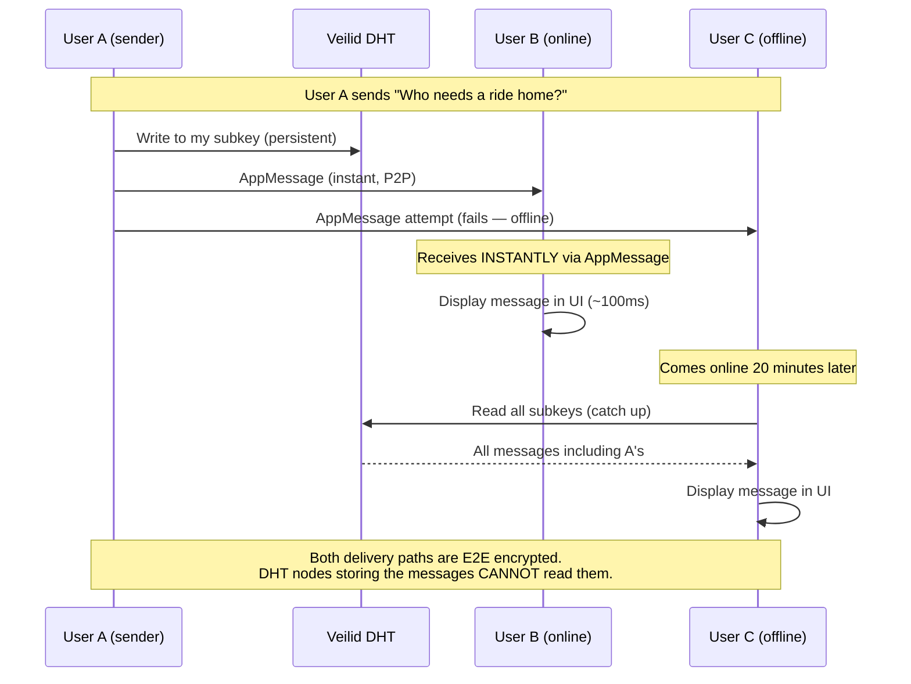

# EV Protocol: Can It Support Chat Natively?

> **TL;DR**: Yes. Veilid was literally designed for this — the team built **VeilidChat** as their reference application. The EV Protocol inherits real-time messaging, offline delivery, and E2E encryption as native primitives. Event-scoped chat is a clean fit, not a bolt-on.

---

## The Surprise: Veilid IS a Messaging Framework

Unlike most DHT-based systems, Veilid wasn't built as a storage network. It was built as a **private communication framework** by the Cult of the Dead Cow (cDc) — the same group that coined the term "hacktivism." Their reference application is **VeilidChat**, a fully encrypted P2P messenger.

This means the EV Protocol doesn't need to invent chat. It already has it.

### Veilid's Messaging Primitives

```
Primitive          What It Does                           Analogy
──────────────     ─────────────────────────────────────  ────────────────
AppMessage         Fire-and-forget message to a node      UDP datagram
                   (delivered if target is online)

AppCall            Request-response to a node              HTTP request
                   (delivered if target is online,
                    requires response)

Private Routes     Anonymous encrypted tunnel              Tor circuit
                   (hides IP of sender AND receiver)

Safety Routes      Source-controlled anonymous path         VPN tunnel
                   (hides sender's IP)

DHT Records        Persistent key-value storage             Database row
                   (survives node going offline)

Multi-writer DHT   Multiple parties write to same record    Shared document
                   (each with their own subkey)
```

### How These Map to Chat Features

```
Chat Feature              Veilid Primitive         Status
──────────────────────    ─────────────────────    ──────────
Send message (online)     AppMessage               ✅ Native
Send message (offline)    DHT record (mailbox)     ✅ Native
Group chat                Multi-writer DHT record  ✅ Native
Read receipts             AppCall (ack response)   ✅ Native
Typing indicators         AppMessage (ephemeral)   ✅ Native
E2E encryption            Built into all comms     ✅ Native
Sender anonymity          Private + Safety routes  ✅ Native
Message history           DHT records (persistent) ✅ Native
Push notifications        ❌ Needs APNS bridge     ⚠️ External
```

---

## Event-Scoped Chat: The Right Abstraction

The EV Protocol doesn't need to be a general-purpose messenger (that's VeilidChat's job). It needs **event-scoped chat** — conversations that exist in the context of a specific event.

### Chat Channels per Event

```
Every event automatically gets three communication channels:

  ┌─────────────────────────────────────────────────────────┐
  │  Event: Swan River Twilight Series — Race 4             │
  │                                                         │
  │  📢 ANNOUNCEMENTS (organiser → attendees)               │
  │     One-to-many, organiser-only writes                  │
  │     "Race 1 starting in 10 minutes"                     │
  │     "Course change: windward mark moved 200m north"     │
  │                                                         │
  │  💬 DISCUSSION (attendees ↔ attendees)                  │
  │     Many-to-many, all registered attendees can write    │
  │     "Anyone need crew for the last race?"               │
  │     "Great photos from today!"                          │
  │                                                         │
  │  🔒 DIRECT MESSAGES (attendee ↔ attendee)               │
  │     One-to-one, fully private, E2E encrypted            │
  │     "Hey, can I crew on your boat tomorrow?"            │
  │                                                         │
  └─────────────────────────────────────────────────────────┘
```

---

## Architecture: How Chat Works in EV Protocol

### Channel 1: Announcements (One-to-Many)

The organiser posts updates that all attendees can read. This is the simplest model — a single-writer DHT record.

```dart
// Announcement = single-writer DHT record, organiser owns it
// Attendees poll or watch the record for updates

const announcementLexicon = {
  "lexicon": 1,
  "id": "ev.chat.announcement",
  "defs": {
    "main": {
      "type": "record",
      "key": "tid",
      "record": {
        "type": "object",
        "required": ["eventDhtKey", "authorPubkey", "messages"],
        "properties": {
          "eventDhtKey": {"type": "string"},
          "authorPubkey": {
            "type": "string",
            "description": "Must match event creator or authorised organiser"
          },
          "messages": {
            "type": "array",
            "items": {"type": "ref", "ref": "#announcement"},
            "maxLength": 100
          }
        }
      }
    },
    "announcement": {
      "type": "object",
      "required": ["text", "sentAt"],
      "properties": {
        "text": {"type": "string", "maxLength": 2000},
        "sentAt": {"type": "string", "format": "datetime"},
        "priority": {
          "type": "string",
          "knownValues": ["normal", "urgent", "safety"]
        },
        "media": {
          "type": "ref",
          "ref": "ev.media.photo#mediaStorage",
          "description": "Optional attached image"
        }
      }
    }
  }
};
```

```
Flow:
  1. Organiser writes announcement to DHT record
  2. Attendees read the record (DHT watch or poll)
  3. New messages appear in the app's announcement feed
  
  Latency: 2-5 seconds (DHT propagation)
  Sufficient? YES — announcements aren't time-critical chat
  
  Size limit: 100 messages × ~500 bytes = ~50KB per record
  For more: paginate with subkeys (subkey per 100 messages)
```

### Channel 2: Discussion (Group Chat via Multi-Writer DHT)

This is the interesting one. Group chat using Veilid's multi-writer DHT records.

```
Architecture:

  Event discussion = one multi-writer DHT record
  Each participant gets their own subkey
  Messages are appended to the participant's subkey

  ┌─────────────────────────────────────────────────┐
  │  DHT Record: ev-chat:{eventDhtKey}              │
  │                                                 │
  │  Subkey 0: (participant A)                      │
  │    [msg1_from_A, msg2_from_A, msg3_from_A]     │
  │                                                 │
  │  Subkey 1: (participant B)                      │
  │    [msg1_from_B, msg2_from_B]                   │
  │                                                 │
  │  Subkey 2: (participant C)                      │
  │    [msg1_from_C]                                │
  │                                                 │
  │  ...up to N participants                        │
  │                                                 │
  │  To render chat: merge all subkeys by timestamp │
  │  Each participant writes ONLY to their subkey   │
  │  = no write contention, no conflicts            │
  └─────────────────────────────────────────────────┘
```

```dart
// lib/services/chat/event_chat_service.dart

class EventChatService {
  final VeilidSchemaLayer _schema;
  final OfflineSyncService _sync;
  
  /// The DHT key for this event's discussion channel
  DhtRecordKey _chatKey(String eventDhtKey) {
    return DhtRecordKey.fromBytes(sha256('ev-chat:$eventDhtKey:v1'));
  }

  /// Send a message to the event discussion
  Future<void> sendMessage({
    required String eventDhtKey,
    required String text,
    String? replyToId,
    MediaStorage? media,
  }) async {
    final chatKey = _chatKey(eventDhtKey);
    final mySubkey = _getMySubkey(chatKey);
    
    // Read my existing messages
    final existing = await _schema.readSubkey(chatKey, mySubkey);
    final messages = List<Map<String, dynamic>>.from(
      existing?.data['messages'] ?? [],
    );
    
    // Append new message
    messages.add({
      'id': generateTid(),
      'text': text,
      'sentAt': DateTime.now().toIso8601String(),
      'senderPubkey': myPubkey.toString(),
      'senderName': myDisplayName,
      'replyToId': replyToId,
      'media': media?.toJson(),
    });

    // Write to my subkey (only I can write here)
    await _schema.updateSubkey(
      key: chatKey,
      subkey: mySubkey,
      collection: 'ev.chat.discussion',
      data: {'messages': messages},
    );

    // ALSO: send AppMessage to online participants for instant delivery
    await _notifyOnlineParticipants(eventDhtKey, messages.last);
  }

  /// Load the discussion — merge all participants' messages
  Future<List<ChatMessage>> loadDiscussion(String eventDhtKey) async {
    final chatKey = _chatKey(eventDhtKey);
    final allMessages = <ChatMessage>[];

    // Read all subkeys (each participant's messages)
    final subkeyCount = await _schema.getSubkeyCount(chatKey);
    
    final futures = List.generate(subkeyCount, (i) async {
      final subkeyData = await _schema.readSubkey(chatKey, i);
      if (subkeyData == null) return <ChatMessage>[];
      
      final messages = List<Map<String, dynamic>>.from(
        subkeyData.data['messages'] ?? [],
      );
      return messages.map((m) => ChatMessage.fromJson(m)).toList();
    });

    final results = await Future.wait(futures);
    for (final msgs in results) {
      allMessages.addAll(msgs);
    }

    // Sort by timestamp to create unified timeline
    allMessages.sort((a, b) => a.sentAt.compareTo(b.sentAt));
    
    return allMessages;
  }

  /// Real-time: send AppMessage to online participants
  Future<void> _notifyOnlineParticipants(
    String eventDhtKey,
    Map<String, dynamic> message,
  ) async {
    final participants = await _getOnlineParticipants(eventDhtKey);
    
    for (final participant in participants) {
      try {
        await veilid.appMessage(
          target: participant.privateRoute,
          message: jsonEncode({
            'type': 'ev.chat.new_message',
            'eventDhtKey': eventDhtKey,
            'message': message,
          }).codeUnits,
        );
      } catch (_) {
        // Participant may be offline — they'll get it from DHT later
      }
    }
  }
}
```

**Real-time delivery flow:**



### Channel 3: Direct Messages (One-to-One, Private)

DMs use the same Veilid primitives but with a private two-party DHT record.

```dart
// DM between two users = shared DHT record with 2 writers

class DirectMessageService {
  final VeilidSchemaLayer _schema;

  /// Create or get the DM channel between two users
  DhtRecordKey _dmKey(String myPubkey, String theirPubkey) {
    // Deterministic: same key regardless of who initiates
    final sorted = [myPubkey, theirPubkey]..sort();
    return DhtRecordKey.fromBytes(sha256('ev-dm:${sorted.join(":")}:v1'));
  }

  /// Send a DM
  Future<void> sendDm({
    required String recipientPubkey,
    required String text,
  }) async {
    final dmKey = _dmKey(myPubkey.toString(), recipientPubkey);
    
    // Write to my subkey (subkey 0 or 1, based on sort order)
    final mySubkey = myPubkey.toString().compareTo(recipientPubkey) < 0 ? 0 : 1;
    
    // ... same pattern as group chat, but only 2 subkeys
    
    // Try instant delivery via AppMessage
    try {
      await veilid.appMessage(
        target: await _getPrivateRoute(recipientPubkey),
        message: jsonEncode({
          'type': 'ev.dm.new_message',
          'text': text,
          'senderPubkey': myPubkey.toString(),
        }).codeUnits,
      );
    } catch (_) {
      // Offline — they'll get it from DHT
    }
  }
}
```

```
DM privacy guarantees:

  ✅ E2E encrypted (only sender + recipient can decrypt)
  ✅ Metadata hidden (private routes hide IP addresses)
  ✅ No server involved (direct P2P or DHT relay)
  ✅ No read receipts unless explicitly enabled
  ✅ Messages encrypted at rest on DHT nodes
  ✅ Forward secrecy possible with key rotation
  
  Compare Signal:        E2E encrypted, but requires Signal's servers
  Compare WhatsApp:      E2E encrypted, but Meta has metadata
  Compare iMessage:      E2E encrypted, but Apple holds iCloud backups
  Compare EV Protocol:   E2E encrypted, NO server, NO metadata exposure
```

---

## The iOS Push Notification Problem

The one thing Veilid **cannot** do natively is wake up an iOS app when a message arrives. iOS kills background processes aggressively.

```
Problem:
  User A sends message to User B.
  User B's app is in background → iOS has killed the process.
  AppMessage fails (no active process to receive it).
  Message sits in DHT until User B opens the app.
  
  Without push: B doesn't know they have a message until they open the app.
  That's a terrible chat UX.

Solution: Apple Push Notification Service (APNS) bridge

  ┌────────────────────────────────────────────────────────────┐
  │                                                            │
  │  User A's App                                              │
  │    │                                                       │
  │    ├──→ DHT: write message (persistent delivery)           │
  │    ├──→ AppMessage: try P2P delivery (instant if online)   │
  │    └──→ Push Service: send push notification               │
  │                                                            │
  │  Push Service (lightweight, optional):                     │
  │    → Receives: "notify pubkey XYZ that they have a msg"    │
  │    → Sends: APNS silent push to wake User B's app          │
  │    → Does NOT see: message content (E2E encrypted)         │
  │    → Does NOT see: sender identity (anonymised token)      │
  │    → Cost: $0 (Firebase Cloud Messaging free tier)         │
  │                                                            │
  │  User B's App (woken by push):                             │
  │    → Reads DHT for new messages                            │
  │    → Decrypts locally                                      │
  │    → Shows notification                                    │
  │                                                            │
  └────────────────────────────────────────────────────────────┘
```

```dart
// lib/services/chat/push_notification_bridge.dart

/// Bridge between Veilid messages and iOS push notifications
/// The push service sees ZERO message content — only "wake up" signals
class PushNotificationBridge {
  final FirebaseMessaging _fcm;

  /// When sending a message, also trigger a push notification
  Future<void> notifyRecipient({
    required String recipientPushToken,
    required String eventDhtKey,
  }) async {
    // Send a DATA-ONLY push (no visible notification — app handles display)
    await _fcm.send(RemoteMessage(
      to: recipientPushToken,
      data: {
        'type': 'ev_chat_message',
        'eventDhtKey': eventDhtKey,
        // NO message content, NO sender identity
        // Just: "check your DHT mailbox"
      },
    ));
  }

  /// On receiving push, wake up and check DHT
  Future<void> onPushReceived(RemoteMessage message) async {
    if (message.data['type'] == 'ev_chat_message') {
      final eventDhtKey = message.data['eventDhtKey'] as String;
      
      // Initialize Veilid (if not running)
      await VeilidService.ensureRunning();
      
      // Read new messages from DHT
      final newMessages = await EventChatService.checkNewMessages(eventDhtKey);
      
      // Show local notification with decrypted content
      for (final msg in newMessages) {
        await LocalNotifications.show(
          title: msg.senderName,
          body: msg.text,
        );
      }
    }
  }
}
```

```
Push notification privacy analysis:

  What the push service sees:
    ✅ A push token (device identifier, not user identity)
    ✅ An event DHT key (opaque hash, reveals nothing)
    ✅ "There's a new message" (but not the content)
    
  What the push service CANNOT see:
    ❌ Message content (E2E encrypted, only in DHT)
    ❌ Sender identity (not included in push payload)
    ❌ Message history (not stored by push service)
    ❌ Recipient identity (only push token → device mapping)

  Privacy trade-off:
    Apple/Google know your device received a "wake up" signal.
    They do NOT know the content, sender, or context.
    
    This is the same trade-off Signal, WhatsApp, and every
    iOS chat app makes. There is no way around it on iOS.
```

---

## Stress Testing Chat at Scale

### UC1: Sailing Regatta Chat (40 sailors)

```
Announcements:
  Race committee posts ~20 announcements per event
  1 DHT record, ~10KB total
  Read by 40 sailors
  ✅ Trivial

Discussion:
  40 sailors chatting = 40 subkeys on multi-writer record
  ~50 messages per person per event = ~2,000 total messages
  ~500 bytes per message = ~1MB total
  Split across 40 subkeys = ~25KB per subkey
  ✅ Fine — well within DHT record limits

Real-time delivery:
  40 users, most on 4G at the river
  AppMessage delivery: ~100ms
  ✅ Instant on mobile network

Push notifications:
  40 devices × 20 announcements = 800 push notifications
  FCM free tier: 500M messages/month
  ✅ Trivially within free tier
```

### UC2: DJ Event Chat (10,000 attendees)

```
Announcements:
  5-10 organiser updates during the event
  1 DHT record, ~5KB total
  Read by ~5,000 concurrent users
  ✅ With caching: fine

Discussion:
  ⚠️ 10,000 users in one group chat is NOT a conversation.
  It's a firehose.

  At 1 message per user per minute = 10,000 messages/minute.
  That's ~167 messages per SECOND.

  PROBLEM: Multi-writer DHT cannot handle 10,000 subkeys
  efficiently. And nobody wants to read 167 messages/second.

  SOLUTION: Don't have a 10,000-person group chat.

  Instead:
    ┌─────────────────────────────────────────────┐
    │  Event: Eclipse — DJ Kestra                  │
    │                                              │
    │  📢 Announcements (organiser only)           │
    │     10 updates, 10,000 readers               │
    │     Pattern: single-writer DHT               │
    │     ✅ Works at any scale                     │
    │                                              │
    │  💬 Discussion Rooms (capped at 200 people)  │
    │     "VIP Lounge" — 200 VIP ticket holders    │
    │     "General Chat" — first 200 to join       │
    │     "Music Nerds" — topic-specific room      │
    │     Pattern: multi-writer DHT per room       │
    │     ✅ Works with room-size caps              │
    │                                              │
    │  🔥 Live Reactions (emoji bar, lightweight)  │
    │     AppMessage broadcast: "🔥" "🎧" "❤️"     │
    │     Not stored in DHT — ephemeral only       │
    │     Pattern: AppMessage fire-and-forget       │
    │     ✅ Works (each reaction is <100 bytes)    │
    │                                              │
    │  🔒 DMs (one-to-one)                         │
    │     Private 2-person conversations           │
    │     Pattern: shared 2-writer DHT record      │
    │     ✅ Works at any scale (each DM is O(1))   │
    └─────────────────────────────────────────────┘
```

```
Live Reactions at scale (10,000 users):

  Every user can tap emoji buttons to react to the live performance.
  These are NOT stored — they're ephemeral AppMessage broadcasts.

  ┌──────────────────────────────────────────────────┐
  │  🔥  32%   ❤️  28%   🎧  22%   🙌  18%         │
  │  ████████  ███████  ██████  █████               │
  │                                                  │
  │  2,847 reactions in the last 30 seconds          │
  └──────────────────────────────────────────────────┘

  Implementation:
    User taps "🔥" → AppMessage to nearby DHT nodes
    Nodes aggregate and broadcast reaction counts
    No DHT storage — pure in-memory P2P gossip

  Bandwidth:
    Each reaction: ~50 bytes
    100 reactions/second: ~5KB/second
    ✅ Negligible on 4G/5G network

  This creates the "live event energy" feeling without
  requiring a chat infrastructure capable of 10,000
  simultaneous conversations.
```

---

## Chat Lexicon Schemas

```dart
// NEW LEXICON: ev.chat.message (the universal chat message schema)
const chatMessageLexicon = {
  "lexicon": 1,
  "id": "ev.chat.message",
  "defs": {
    "main": {
      "type": "record",
      "key": "tid",
      "record": {
        "type": "object",
        "required": ["channelDhtKey", "senderPubkey", "text", "sentAt"],
        "properties": {
          "channelDhtKey": {
            "type": "string",
            "description": "DHT key of the chat channel"
          },
          "senderPubkey": {"type": "string"},
          "senderName": {"type": "string", "maxLength": 100},
          "text": {"type": "string", "maxLength": 2000},
          "sentAt": {"type": "string", "format": "datetime"},
          "replyToId": {
            "type": "string",
            "description": "TID of the message being replied to"
          },
          "media": {
            "type": "ref",
            "ref": "ev.media.photo#mediaStorage"
          },
          "reactions": {
            "type": "object",
            "description": "Aggregated emoji reactions: {'🔥': 5, '❤️': 3}"
          },
          "edited": {"type": "boolean"},
          "editedAt": {"type": "string", "format": "datetime"}
        }
      }
    }
  }
};

// NEW LEXICON: ev.chat.channel (defines a chat channel within an event)
const chatChannelLexicon = {
  "lexicon": 1,
  "id": "ev.chat.channel",
  "defs": {
    "main": {
      "type": "record",
      "key": "tid",
      "record": {
        "type": "object",
        "required": ["eventDhtKey", "name", "type"],
        "properties": {
          "eventDhtKey": {"type": "string"},
          "name": {"type": "string", "maxLength": 100},
          "type": {
            "type": "string",
            "knownValues": ["announcements", "discussion", "dm", "reactions"]
          },
          "maxParticipants": {
            "type": "integer",
            "minimum": 2,
            "maximum": 500,
            "description": "Cap for discussion rooms"
          },
          "creatorPubkey": {"type": "string"},
          "participantPubkeys": {
            "type": "array",
            "items": {"type": "string"},
            "description": "For private/capped channels"
          }
        }
      }
    }
  }
};
```

---

## Performance Summary

| Feature | Mechanism | Latency | Max Users | Cost |
|---|---|---|---|---|
| **Announcements** | Single-writer DHT | 2-5 sec | Unlimited readers | $0 |
| **Discussion rooms** | Multi-writer DHT | 100ms-3s | ~200 per room | $0 |
| **Direct messages** | 2-writer DHT + AppMessage | 100ms (online) / 2-5s (offline) | Unlimited pairs | $0 |
| **Live reactions** | AppMessage broadcast | ~100ms | 10,000+ | $0 |
| **Push notifications** | FCM/APNS bridge | 1-3 sec | Unlimited | $0 (free tier) |
| **Message history** | DHT records | 2-5 sec (first load), instant (cached) | Limited by record size | $0 |

---

## What Chat Adds to the Protocol Stack

```
┌──────────────────────────────────────────────────────┐
│               EV Protocol Stack                       │
│                                                      │
│  ┌──────────────────────────────────────────────┐    │
│  │  Layer 6: CHAT (native via Veilid)            │    │
│  │  Announcements (single-writer DHT)            │    │
│  │  Discussion rooms (multi-writer, capped)      │    │
│  │  Direct messages (2-writer DHT + AppMessage)  │    │
│  │  Live reactions (ephemeral AppMessage)         │    │
│  │  Push bridge (FCM/APNS for iOS wake-up)       │    │
│  └──────────────────────────────────────────────┘    │
│                                                      │
│  ┌──────────────────────────────────────────────┐    │
│  │  Layer 5: PAYMENTS (schema only)              │    │
│  └──────────────────────────────────────────────┘    │
│                                                      │
│  ┌──────────────────────────────────────────────┐    │
│  │  Layer 4: SEARCH (3-tier)                     │    │
│  └──────────────────────────────────────────────┘    │
│                                                      │
│  ┌──────────────────────────────────────────────┐    │
│  │  Layer 3: SCHEMA (Lexicon enforcement)        │    │
│  └──────────────────────────────────────────────┘    │
│                                                      │
│  ┌──────────────────────────────────────────────┐    │
│  │  Layer 2: IDENTITY (bridged)                  │    │
│  └──────────────────────────────────────────────┘    │
│                                                      │
│  ┌──────────────────────────────────────────────┐    │
│  │  Layer 1: NETWORK (Veilid DHT)                │    │
│  └──────────────────────────────────────────────┘    │
│                                                      │
│  ┌──────────────────────────────────────────────┐    │
│  │  Layer 0: TRANSPORT (Veilid)                  │    │
│  └──────────────────────────────────────────────┘    │
└──────────────────────────────────────────────────────┘
```

---

## The Honest Assessment

```
CAN the protocol support chat natively?
  ✅ YES. Veilid's AppMessage, AppCall, and multi-writer DHT
  provide all the primitives needed for event chat.
  VeilidChat proves this works in production.

SHOULD the protocol support chat natively?
  ✅ YES, for event-scoped conversations (announcements,
  discussion rooms, DMs between attendees). These are
  directly tied to the event lifecycle.

What WON'T work natively?
  ⚠️ 10,000-person group chat → cap rooms at ~200
  ⚠️ iOS push notifications → FCM/APNS bridge ($0 but external)
  ⚠️ Persistent message search → accumulates over time,
     needs periodic cleanup (auto-archive after event ends)

What's the UX compared to iMessage / WhatsApp?
  Online-to-online:  ~100ms           (comparable to iMessage)
  Online-to-offline: 2-5 sec + push   (comparable to WhatsApp)
  Group chat (200):  ~100ms-1 sec     (comparable to Slack)
  Message history:   ~2-5 sec first load, then instant from cache

NEW SCHEMAS: 3
  ev.chat.message
  ev.chat.channel
  ev.chat.announcement

NEW INFRASTRUCTURE: None
  (FCM free tier for push — already needed for any iOS app)

PROTOCOL CHANGES: None
  Chat uses existing Veilid primitives.
  Just new Lexicon schemas on top.
```

> [!TIP]
> **The key insight**: Veilid is fundamentally a **communication framework**, not a storage network. Most DHT-based systems (IPFS, BitTorrent, Holochain) are optimised for data persistence. Veilid is optimised for **real-time private communication** that also happens to have persistent storage (DHT). This is why chat is a natural fit — we're using the framework exactly as it was designed.

---

*Last updated: 2026-04-06*
*Part of: [Use Cases](./use-cases.md) | [EV Search Architecture](./ev-protocol-search-architecture.md) | [EV Payments](./ev-protocol-payments.md)*
