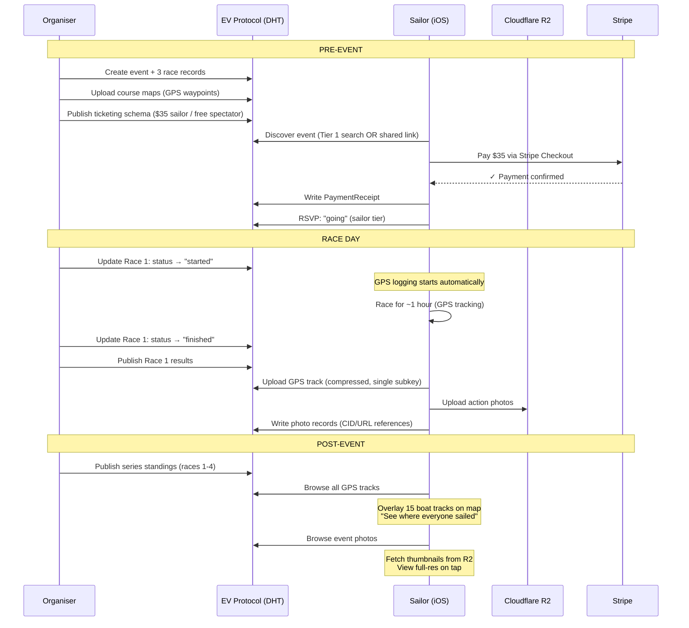
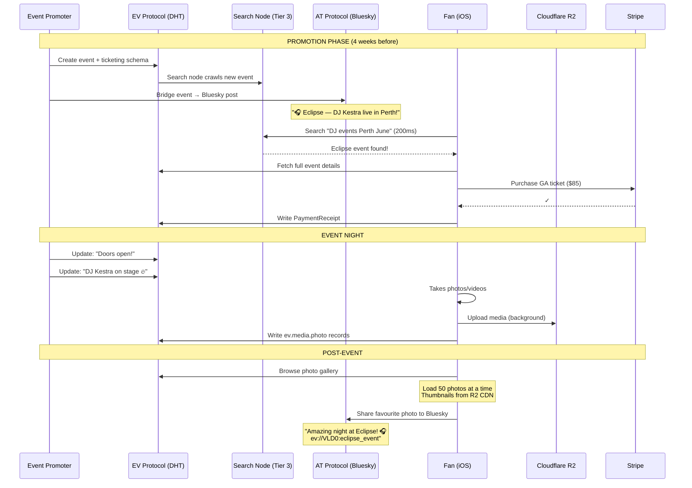

# EV Protocol: Use Case Stress Tests

> Two real-world use cases pushed through every layer of the EV Protocol to find where it holds, bends, and breaks.

---

## UC1: Swan River Sailing Regatta

### The Event

```
Event:        Swan River Twilight Series — Race 4 of 8
Organiser:    Royal Perth Yacht Club (community member, not the club itself)
Location:     Swan River, Perth — Matilda Bay to Point Walter
Expected:     40 registered sailors, 15 boats, ~100 spectators
Price:        $35/sailor (covers safety boat fuel), spectators free
Duration:     Saturday afternoon, 3 races across 4 hours

Features needed:
  ✅ Registration + payment for sailors
  ✅ Spectator RSVPs (free)
  ✅ Course map for each race (GPS waypoints)
  ✅ Post-race GPS track sharing (where did each boat actually sail?)
  ✅ Photo sharing (action shots during/after racing)
  ✅ Results per race (finishing positions, times)
  ✅ Series standings (cumulative across 8 events)
  ✅ Weather conditions per race
```

### Layer-by-Layer Walkthrough

---

#### Layer 0-1: Network & Transport

```
40 sailors + 100 spectators = 140 users.
All on phones at the same location (Swan River).

DHT status: Trivial. 140 nodes is nothing.
Latency: ~2 seconds per lookup (small network, nearby nodes).
Bandwidth: Most users on 4G/5G at the river. Fine.

✅ VERDICT: No stress at all. Works perfectly.
```

---

#### Layer 2: Identity

```
Sailors need verified registration (for safety/insurance).
Spectators are anonymous or casual.

Sailor identity:
  → Veilid pubkey (primary identity)
  → Display name + sail number in profile
  → Optional AT Protocol bridge (for cross-posting results)

Spectator identity:
  → Veilid pubkey (auto-generated on first app open)
  → No registration needed — browse and RSVP for free

✅ VERDICT: Works perfectly. No identity complexity.
```

---

#### Layer 3: Schema

This is where it gets interesting. Sailing needs **domain-specific schemas** beyond basic events.

```dart
// Standard event schema — works as-is
const regattaEvent = {
  '\$type': 'ev.event.calendar.event',
  'name': 'Swan River Twilight Series — Race 4',
  'startsAt': '2026-05-10T14:00:00+08:00',
  'endsAt': '2026-05-10T18:00:00+08:00',
  'location': 'Matilda Bay, Swan River',
  'geoLocation': {'latitude': -31.9775, 'longitude': 115.8400},
  'category': 'sport',
  'tags': ['sailing', 'regatta', 'perth', 'swan-river'],
  'visibility': 'public',
  'maxAttendees': 140,
  'ticketing': {
    'model': 'tiered',
    'currency': 'AUD',
    'tiers': [
      {'name': 'Sailor Registration', 'priceMinor': 3500, 'quantity': 40},
      {'name': 'Spectator', 'priceMinor': 0, 'quantity': 100},
    ],
    'acceptedMethods': [
      {'type': 'stripe', 'checkoutUrl': 'https://checkout.stripe.com/...'},
      {'type': 'cash'},
    ],
  },
};
```

**New schemas needed: Race, Course, Track, Result**

```dart
// NEW LEXICON: ev.sport.sailing.race
const raceLexicon = {
  "lexicon": 1,
  "id": "ev.sport.sailing.race",
  "defs": {
    "main": {
      "type": "record",
      "description": "A single race within a regatta event",
      "key": "tid",
      "record": {
        "type": "object",
        "required": ["eventDhtKey", "raceNumber", "status"],
        "properties": {
          "eventDhtKey": {"type": "string"},
          "raceNumber": {"type": "integer", "minimum": 1},
          "status": {
            "type": "string",
            "knownValues": ["scheduled", "preparatory", "started", "finished", "abandoned", "postponed"]
          },
          "startTime": {"type": "string", "format": "datetime"},
          "finishTime": {"type": "string", "format": "datetime"},
          "course": {"type": "ref", "ref": "#raceCourse"},
          "conditions": {"type": "ref", "ref": "#raceConditions"},
        }
      }
    },
    "raceCourse": {
      "type": "object",
      "description": "GPS waypoints defining the race course",
      "required": ["marks"],
      "properties": {
        "marks": {
          "type": "array",
          "description": "Ordered list of course marks (waypoints)",
          "items": {"type": "ref", "ref": "#courseMark"}
        },
        "distanceNm": {
          "type": "number",
          "description": "Course distance in nautical miles"
        },
        "type": {
          "type": "string",
          "knownValues": ["windward-leeward", "triangle", "coastal", "custom"]
        }
      }
    },
    "courseMark": {
      "type": "object",
      "required": ["name", "latitude", "longitude"],
      "properties": {
        "name": {"type": "string", "description": "Mark name: 'Start', 'Windward', 'Gate L', 'Finish'"},
        "latitude": {"type": "number", "minimum": -90, "maximum": 90},
        "longitude": {"type": "number", "minimum": -180, "maximum": 180},
        "rounding": {
          "type": "string",
          "knownValues": ["port", "starboard"],
          "description": "Which side to round this mark"
        }
      }
    },
    "raceConditions": {
      "type": "object",
      "properties": {
        "windSpeedKnots": {"type": "number"},
        "windDirectionDeg": {"type": "integer", "minimum": 0, "maximum": 359},
        "gustSpeedKnots": {"type": "number"},
        "currentKnots": {"type": "number"},
        "currentDirectionDeg": {"type": "integer"},
        "seaState": {"type": "string", "knownValues": ["calm", "slight", "moderate", "rough"]},
        "notes": {"type": "string", "maxLength": 500}
      }
    }
  }
};
```

```dart
// NEW LEXICON: ev.sport.sailing.track
// A sailor's GPS track for a race — "where did I actually sail?"
const trackLexicon = {
  "lexicon": 1,
  "id": "ev.sport.sailing.track",
  "defs": {
    "main": {
      "type": "record",
      "description": "A sailor's GPS track for a specific race",
      "key": "tid",
      "record": {
        "type": "object",
        "required": ["raceDhtKey", "sailorPubkey", "points"],
        "properties": {
          "raceDhtKey": {"type": "string"},
          "sailorPubkey": {"type": "string"},
          "boatName": {"type": "string"},
          "sailNumber": {"type": "string"},
          "points": {
            "type": "array",
            "description": "GPS track points (lat, lng, timestamp)",
            "items": {"type": "ref", "ref": "#trackPoint"},
            // ⚠️ STRESS POINT: See analysis below
          }
        }
      }
    },
    "trackPoint": {
      "type": "object",
      "required": ["lat", "lng", "t"],
      "properties": {
        "lat": {"type": "number"},
        "lng": {"type": "number"},
        "t": {"type": "integer", "description": "Unix timestamp in seconds"},
        "sog": {"type": "number", "description": "Speed over ground in knots"},
        "cog": {"type": "integer", "description": "Course over ground in degrees"}
      }
    }
  }
};
```

```dart
// NEW LEXICON: ev.sport.sailing.result
const resultLexicon = {
  "lexicon": 1,
  "id": "ev.sport.sailing.result",
  "defs": {
    "main": {
      "type": "record",
      "description": "Race results — finishing positions and times",
      "key": "tid",
      "record": {
        "type": "object",
        "required": ["raceDhtKey", "entries"],
        "properties": {
          "raceDhtKey": {"type": "string"},
          "publishedBy": {"type": "string"},
          "entries": {
            "type": "array",
            "items": {"type": "ref", "ref": "#resultEntry"}
          }
        }
      }
    },
    "resultEntry": {
      "type": "object",
      "required": ["position", "sailorPubkey"],
      "properties": {
        "position": {"type": "integer", "minimum": 1},
        "sailorPubkey": {"type": "string"},
        "boatName": {"type": "string"},
        "sailNumber": {"type": "string"},
        "elapsedSeconds": {"type": "integer"},
        "correctedSeconds": {"type": "integer", "description": "Handicap-corrected time"},
        "status": {
          "type": "string",
          "knownValues": ["finished", "dnf", "dns", "dsq", "ocs", "raf"]
        }
      }
    }
  }
};
```

**Schema verdict:**

```
✅ Event, ticketing, registration    — Standard schemas handle this perfectly
✅ Race structure (sub-events)       — New Lexicon, clean extension
✅ Course maps (GPS waypoints)       — ~10-20 marks per course, tiny data
✅ Race conditions                   — Simple structured data
✅ Results + standings               — Straightforward schema
⚠️ GPS tracks                       — STRESS POINT (see below)
```

---

#### ⚠️ Stress Point 1: GPS Track Size

```
A 1-hour race with GPS logging every 2 seconds:
  1,800 points × ~40 bytes each = ~72KB per track
  
15 boats × 3 races = 45 tracks
  45 × 72KB = ~3.2MB total track data

DHT record size limit (Veilid): ~32KB per subkey

PROBLEM: A single track (72KB) exceeds the DHT record size limit.

SOLUTION: Chunk the track across multiple subkeys.

  Track record: 1 DHT record with 3 subkeys
    Subkey 0: metadata (boat, race, total points)
    Subkey 1: points 0-499 (~20KB)
    Subkey 2: points 500-999 (~20KB)  
    Subkey 3: points 1000-1800 (~32KB)
    
  Read cost: 4 DHT lookups (parallel) = ~3 seconds
  
  ✅ SOLVABLE. Chunking is standard practice for DHT storage.
  
ALTERNATIVE: Compress the track.
  72KB of GPS points compresses to ~15KB with gzip.
  Fits in a single subkey.
  
  ✅ EVEN BETTER. Compress + single subkey.
```

---

#### ⚠️ Stress Point 2: Photo Sharing

```
Photos at a sailing event:
  ~20 action shots during racing
  ~30 post-race photos (presentations, social)
  ~50 total photos × ~3MB each = ~150MB of images

DHT cannot store 150MB of photos. DHT records are for
structured data (KB), not media (MB/GB).

PROBLEM: Where do photos live?

OPTIONS:

  A) IPFS (decentralised, aligns with protocol philosophy)
     → Upload photo to IPFS → get CID (content hash)
     → Store CID in EV Protocol schema
     → Anyone with CID can fetch from IPFS
     
     Pro: Decentralised, content-addressed, permanent
     Con: IPFS pinning costs ~$0.01/GB/month, slow retrieval
     
  B) Cloudflare R2 / S3 (centralised but cheap)
     → Upload to R2 → get URL
     → Store URL in EV Protocol schema
     → Organiser pays ~$0.015/GB/month = ~$0.002 for 150MB
     
     Pro: Fast, reliable, dirt cheap
     Con: Centralised storage (but data is non-critical)
     
  C) Veilid Block Store (if available)
     → Veilid supports block storage (similar to torrent pieces)
     → Upload blocks → reference by hash in schema
     
     Pro: Fully in-protocol
     Con: Availability depends on online nodes (photos vanish
          when uploader goes offline unless pinned)

RECOMMENDATION: Option B (R2/S3) for reliability + Option A (IPFS)
  as opt-in for users who want decentralised storage.
  
  The schema supports BOTH with a single pattern:
```

```dart
// Photo reference schema — storage-agnostic
const photoLexicon = {
  "lexicon": 1,
  "id": "ev.media.photo",
  "defs": {
    "main": {
      "type": "record",
      "key": "tid",
      "record": {
        "type": "object",
        "required": ["eventDhtKey", "uploaderPubkey", "storage"],
        "properties": {
          "eventDhtKey": {"type": "string"},
          "uploaderPubkey": {"type": "string"},
          "caption": {"type": "string", "maxLength": 500},
          "takenAt": {"type": "string", "format": "datetime"},
          "storage": {"type": "ref", "ref": "#mediaStorage"},
          "thumbnail": {"type": "ref", "ref": "#mediaStorage"},
          "width": {"type": "integer"},
          "height": {"type": "integer"},
          "sizeMb": {"type": "number"},
        }
      }
    },
    "mediaStorage": {
      "type": "object",
      "required": ["type", "uri"],
      "properties": {
        "type": {
          "type": "string",
          "knownValues": ["https", "ipfs", "veilid_block", "at_blob"]
        },
        "uri": {
          "type": "string",
          "description": "https://r2.example.com/photo.jpg OR ipfs://Qm... OR veilid://block:..."
        },
        "hash": {
          "type": "string",
          "description": "SHA-256 hash of the file for integrity verification"
        }
      }
    }
  }
};
```

```
PHOTO FLOW:
  1. Sailor takes photo
  2. App uploads to R2 (fast) + optionally IPFS (background)
  3. App writes ev.media.photo record to DHT
     {storage: {type: "https", uri: "https://r2.../photo.jpg"}}
  4. Other users read photo record from DHT → fetch image from URL

  DHT stores: ~500 bytes per photo reference
  R2 stores: ~3MB per photo
  Cost for 50 photos: ~$0.002/month

  ✅ SOLVABLE. Schema handles the reference; storage is pluggable.
```

---

#### Layer 4: Search

```
A sailing regatta with 140 users doesn't need search infrastructure.
Tier 1 (DHT-native) handles everything:

  Browse: "Sailing events in Perth this month"
    → geo:qd66/time:2026-05/cat:sport → finds the regatta
    
  Direct: Organiser shares event link / QR code
    → Direct DHT lookup: VLD0:abc... → instant
    
  Social: Sailor's friends see they're attending
    → Social index: social:{sailor_pubkey}/events_attending

✅ VERDICT: Tier 1 is more than sufficient. No search nodes needed.
```

---

#### Layer 5: Payments

```
Payment flow for sailor registration:

  40 sailors × $35 = $1,400 total revenue
  Stripe fee: 1.75% + $0.30 = ~$0.91 per transaction
  Total Stripe fees: ~$36.40
  Organiser receives: ~$1,363.60

  Flow:
    1. Sailor opens event → sees "Sailor Registration: $35"
    2. Taps "Register" → Stripe Checkout opens
    3. Pays with card → Stripe processes
    4. App writes PaymentReceipt to DHT
    5. Organiser's app sees receipt → confirms registration
    6. Sailor gets RSVP status: "confirmed"

  Cash option:
    1. Sailor selects "Pay at venue"
    2. App writes PaymentIntent {status: "pending", method: "cash"}
    3. At the venue, organiser marks as paid in their app
    4. Organiser's app writes PaymentReceipt with
       {proof: {type: "organiser_confirmation"}}

✅ VERDICT: Standard payment flow. No protocol changes needed.
```

---

#### UC1 Complete Sequence



---

#### UC1 Verdict

```
Component              Status    Notes
─────────────────────  ────────  ─────────────────────────────────────────
Event creation         ✅ PASS    Standard event schema
Sub-events (races)     ✅ PASS    New Lexicon: ev.sport.sailing.race
Registration           ✅ PASS    Standard payment flow
GPS course maps        ✅ PASS    Array of lat/lng — small structured data
GPS track sharing      ✅ PASS    Compressed to ~15KB, fits in single subkey
Photo sharing          ✅ PASS    Reference in DHT, media on R2/IPFS
Race results           ✅ PASS    New Lexicon: ev.sport.sailing.result
Series standings       ✅ PASS    Aggregated result record
Search/discovery       ✅ PASS    Tier 1 sufficient at this scale
Payments               ✅ PASS    Stripe for $35, cash at door
Privacy                ✅ PASS    Private routes for invite-only races

NEW SCHEMAS REQUIRED: 4
  ev.sport.sailing.race
  ev.sport.sailing.track
  ev.sport.sailing.result
  ev.media.photo

NEW INFRASTRUCTURE: None
PROTOCOL CHANGES: None
```

> [!TIP]
> **UC1 is a clean pass.** The only non-obvious piece was media storage, which the protocol handles by storing references (not blobs) in the DHT and keeping actual files in pluggable external storage. This is exactly how AT Protocol handles images too — blobs go to the PDS blob store, records contain CID references.

---

---

## UC2: International DJ Event — Perth Arena

### The Event

```
Event:        "Eclipse" — Featuring DJ Kestra (Berlin) + 3 local supports
Venue:        RAC Arena, Perth
Expected:     10,000 attendees
Price:        $85 General / $250 VIP / $45 Early Bird (sold out)
Duration:     Saturday night, 8pm - 3am (7 hours)

Features needed:
  ✅ Ticket sales (10,000 tickets via Stripe)
  ✅ Tiered pricing (GA / VIP / Early Bird)
  ✅ Searchable on EV Protocol ("DJ events Perth this weekend")
  ✅ Publishable to social media (AT Protocol bridge → Bluesky)
  ✅ Photo sharing during event (10,000 users uploading simultaneously)
  ✅ Video sharing (short clips of performances)
  ✅ Real-time updates ("DJ Kestra on stage NOW")
  ✅ Share event via link / QR / social
  ✅ Post-event gallery
```

### Layer-by-Layer Walkthrough

---

#### Layer 0-1: Network & Transport

```
10,000 attendees = 10,000 potential DHT nodes.
But: they're all at the same venue, on the same cell towers.

Concurrent on the app: ~3,000-5,000 (not everyone has the app open)
All doing DHT lookups for the SAME event record.

⚠️ STRESS POINT: "Hot key" problem.

  10,000 users all reading VLD0:eclipse_event
  DHT authorities for this key: ~20 nodes (standard Kademlia)
  20 nodes serving 5,000 reads = 250 reads/node

  At 3 seconds per read: each authority handles ~83 reads/second
  250 ÷ 83 = 3 seconds each → ~3 second response time

  VERDICT: DHT handles the read load, but BARELY.
  
  MITIGATION:
    → Local cache: first read caches event for 5 minutes
    → After first fetch, 99% of reads are local = instant
    → Only new users or expired caches hit DHT
    
    Effective DHT load: ~50 reads/minute (new arrivals)
    
  ✅ WITH CACHING: Fine. Event data changes rarely during the event.
```

---

#### Layer 2: Identity

```
10,000 attendees:
  Most are casual — they bought a ticket, showed up.
  Identity requirement: Veilid pubkey + ticket receipt.
  
  For photo sharing: pubkey acts as upload credential.
  For AT Protocol bridge: ~500 users (~5%) will cross-post to Bluesky.

✅ VERDICT: No stress. Identity is per-user, O(1).
```

---

#### Layer 3: Schema

```
Event schema: Standard, handles this perfectly.
Ticketing schema: 3 tiers, standard.
Photo/video schema: Same as UC1 (reference + external storage).
```

```dart
// Event record — standard schema, no extensions needed
final eclipseEvent = {
  '\$type': 'ev.event.calendar.event',
  'name': 'Eclipse — DJ Kestra + Supports',
  'startsAt': '2026-06-20T20:00:00+08:00',
  'endsAt': '2026-06-21T03:00:00+08:00',
  'location': 'RAC Arena, Perth',
  'geoLocation': {'latitude': -31.9440, 'longitude': 115.8917},
  'category': 'music',
  'tags': ['dj', 'electronic', 'dance', 'perth', 'international'],
  'visibility': 'public',
  'description': 'Berlin-based DJ Kestra brings the Eclipse tour to Perth...',
  'maxAttendees': 10000,
  'ticketing': {
    'model': 'tiered',
    'currency': 'AUD',
    'tiers': [
      {'name': 'Early Bird', 'priceMinor': 4500, 'quantity': 2000,
       'salesEnd': '2026-06-01T00:00:00+08:00'},
      {'name': 'General Admission', 'priceMinor': 8500, 'quantity': 7000},
      {'name': 'VIP', 'priceMinor': 25000, 'quantity': 1000,
       'description': 'Front-of-stage access, meet & greet, premium bar'},
    ],
    'acceptedMethods': [
      {'type': 'stripe', 'destination': 'acct_eclipse_events',
       'checkoutUrl': 'https://checkout.stripe.com/...'},
    ],
    'refundPolicy': {
      'type': 'conditional',
      'cutoffHours': 48,
      'description': 'Full refund up to 48 hours before the event',
    },
  },
};
```

```
✅ VERDICT: Standard schemas handle everything.
   No new Lexicons needed for this use case.
```

---

#### Layer 4: Search & Discovery

```
This event NEEDS to be discoverable. 10,000 people need to find it.

Tier 1 (DHT Native):
  Indexed at: geo:qd66/time:2026-06/cat:music
  Anyone browsing "music events in Perth in June" finds it.
  ✅ Works

Tier 2 (Distributed Index):
  Keyword searchable: "DJ Kestra Perth" → matches event title and tags
  ✅ Works — the event is in the geo:qd66:2026-06 index shard

Tier 3 (Search Vector Node):
  Semantic search: "electronic dance music events this weekend"
  → Vector similarity matches even without exact keywords
  ✅ Works if search nodes are running (optional)
```

**Social media publishing (AT Protocol bridge):**

```
The organiser wants this event on Bluesky/AT Protocol too.

Flow:
  1. Organiser has AT Protocol identity bridge set up
  2. Creates event on EV Protocol (Veilid DHT)
  3. App offers "Publish to Bluesky?"
  4. On confirm, app creates an AT Protocol record:

     AT Protocol post:
     {
       "$type": "app.bsky.feed.post",
       "text": "🎧 Eclipse — DJ Kestra live in Perth!\n\nJune 20, RAC Arena\nTickets from $45\n\nev://VLD0:eclipse_event",
       "createdAt": "2026-05-15T10:00:00Z",
       "embed": {
         "$type": "app.bsky.embed.external",
         "external": {
           "uri": "https://ev.app/event/VLD0:eclipse_event",
           "title": "Eclipse — DJ Kestra + Supports",
           "description": "Berlin-based DJ Kestra brings the Eclipse tour to Perth..."
         }
       }
     }

  5. Event now appears on Bluesky feed AND EV Protocol search
  6. AT Protocol users click link → opens EV app or web preview
```

```
✅ VERDICT: Search works at all 3 tiers.
   AT Protocol bridge enables social media reach.
   The event is findable everywhere it needs to be.
```

---

#### ⚠️ Stress Point 1: 10,000 Users Uploading Photos Simultaneously

```
During the event:
  5,000 users with phones out
  ~500 take photos they want to share (5%)
  ~50 shoot short video clips (0.5%)
  
  500 photos × 4MB = ~2GB of photos
  50 videos × 30MB = ~1.5GB of video
  Total media: ~3.5GB

  Peak upload window: 10pm-midnight (2 hours, DJ headlining)
  Upload rate: ~30 photos/minute at peak

Can the DHT handle 500 ev.media.photo record writes?
  Each record: ~500 bytes
  500 records = ~250KB of DHT writes
  Over 3 hours = ~2.7 writes/minute to DHT
  
  ✅ DHT handles the RECORD writes trivially.

Can external storage handle 3.5GB of uploads?
  Cloudflare R2: Yes. This is nothing for R2.
  Cost: ~$0.05/month for 3.5GB stored
  Upload bandwidth: R2 handles thousands of concurrent uploads
  
  ✅ External storage handles the MEDIA trivially.

Who pays for the R2 storage?
  Option A: Organiser pre-provisions storage (~$1/month)
  Option B: Users upload to their own storage (each user's R2 bucket)
  Option C: Free tier covers it (R2 free tier: 10GB storage, 10M reads)
  
  ✅ Cost is negligible regardless of who pays.
```

---

#### ⚠️ Stress Point 2: Photo Gallery — 500 Photos in the Feed

```
After the event, users browse the photo gallery.

To load the gallery, the app needs to:
  1. Read an index of all photos for this event
  2. Fetch thumbnails
  3. Lazy-load full-res on tap

Index approach:
  Well-known DHT key: sha256("ev-photos:VLD0:eclipse_event:v1")
  Multi-writer record with subkeys:
    Subkey 0-9: ~50 photo references each = ~25KB per subkey
  
  Total index reads: 10 DHT lookups (parallel) = ~3 seconds
  Then: fetch thumbnails from R2 CDN = ~500ms
  
  Total time to load gallery: ~3.5 seconds
  
  ✅ ACCEPTABLE. Comparable to Instagram loading a feed.
  
Pagination:
  Don't load all 500 at once.
  Load subkey 0 (50 photos) → display
  Scroll → load subkey 1 → display
  
  Time to first content: ~1 second (1 DHT read + thumbnail fetch)
  
  ✅ GOOD UX.
```

---

#### ⚠️ Stress Point 3: Real-Time Updates

```
During the event, the organiser wants to push updates:
  "Doors open!"
  "DJ Kestra on stage NOW 🔥"
  "30 minutes until close"

EV Protocol is NOT a real-time messaging protocol.
DHT records are eventually consistent, not instant.

Update latency: 2-5 seconds for DHT propagation
  → Acceptable for event updates (not chat)

Approach:
  Organiser's app writes to a well-known "updates" DHT key
  Attendees' apps poll this key every 30 seconds
  Or: use Veilid AppMessage for push notifications to online users
  
  DHT polling: 5,000 users × 2 polls/minute = 10,000 reads/minute
    Distributed across ~20 DHT authority nodes = 500 reads/node/minute
    At ~83 reads/sec capacity = easily handled
    
  With caching (CDN-like): Most reads served from local cache
  
  ✅ WORKS for event updates (not real-time chat).
  ⚠️ If you need real-time chat: use a separate service (Firebase/XMPP)
     or Veilid's private route messaging.
```

---

#### ⚠️ Stress Point 4: Video Sharing

```
50 video clips × 30MB = 1.5GB

Video is the same pattern as photos, just larger:
  Upload to R2/S3 → store reference in DHT

But video has additional concerns:
  → Transcoding (multiple resolutions)
  → Streaming (progressive download vs HLS)
  → Thumbnails/previews
  
These are NOT protocol concerns — they're media pipeline concerns.

RECOMMENDATION:
  For MVP: Upload raw video to R2/S3, serve directly.
    = Simple, works, cheap (~$0.02/month for 1.5GB)
    
  For scale: Use Cloudflare Stream or Mux
    = Handles transcoding, streaming, thumbnails
    = ~$5-10/month for this volume
    
  Schema:
    Same ev.media.photo Lexicon with type: "video"
    Add: duration, format, resolutions fields

✅ SOLVABLE. Same pattern as photos.
```

---

#### Layer 5: Payments

```
10,000 tickets sold:
  2,000 Early Bird × $45  = $90,000
  7,000 GA × $85           = $595,000
  1,000 VIP × $250          = $250,000
  Total revenue:            = $935,000

Stripe fees (1.75% + $0.30):
  Average fee: ~$2.15 per transaction
  Total fees: ~$21,500
  
Organiser receives: ~$913,500

Stripe can handle 10,000 payments without stress.
This is trivial for Stripe — they process millions
of transactions per day.

EV Protocol handles:
  10,000 PaymentReceipt records in DHT
  10,000 × 500 bytes = ~5MB total
  DHT handles this trivially.

✅ VERDICT: No issues. Stripe does the heavy lifting.
```

---

#### UC2 Complete Sequence



---

#### UC2 Verdict

```
Component              Status    Notes
─────────────────────  ────────  ─────────────────────────────────────────
Event creation         ✅ PASS    Standard event schema
Tiered ticketing       ✅ PASS    3 tiers, standard schema
10K ticket sales       ✅ PASS    Stripe handles effortlessly
Search / discovery     ✅ PASS    All 3 tiers work
Social media publish   ✅ PASS    AT Protocol bridge → Bluesky
Photo sharing (500)    ✅ PASS    Reference in DHT, media on R2
Video sharing (50)     ✅ PASS    Same pattern as photos
Photo gallery browse   ✅ PASS    Paginated, thumbnails from CDN, ~1s TTFC
Real-time updates      ✅ PASS    DHT polling + AppMessage (2-5s latency)
Real-time chat         ⚠️ BEND    Not designed for chat — use external service
Hot key (10K reads)    ✅ PASS    Client caching reduces DHT load 99%
Post-event gallery     ✅ PASS    Multi-subkey index, lazy load
Payment volume         ✅ PASS    $935K through Stripe — trivial

NEW SCHEMAS REQUIRED: 1
  ev.media.photo (shared with UC1)

NEW INFRASTRUCTURE: None required (Tier 1-2 sufficient at 10K)
  Optional: 1 search node for faster discovery (~$15/mo)

PROTOCOL CHANGES: None
```

> [!IMPORTANT]
> **UC2 reveals a key architectural principle**: The EV Protocol doesn't try to be a CDN, a media pipeline, or a real-time messaging service. It handles structured event data + payment coordination + discovery. Media goes to purpose-built storage (R2/S3/IPFS). Real-time chat goes to purpose-built messaging. Each subsystem is best-in-class at its job.

---

---

## Cross-Use-Case Analysis

### Protocol Extensibility

```
UC1 needed 4 new Lexicons (sailing-specific schemas).
UC2 needed 1 new Lexicon (shared media schema).

Adding new schemas to the EV Protocol:
  1. Define the Lexicon JSON (identical format to AT Protocol)
  2. Register with VeilidSchemaLayer
  3. Write Dart model (Freezed class)
  4. Done.

No protocol changes. No infrastructure changes. No breaking changes.
Just new schemas registered at the app level.

This is exactly how AT Protocol's Lexicon system scales:
  Any app can define new collection types.
  The protocol is agnostic to what data you store.
  The schema layer validates whatever you register.
```

### Media Storage Pattern (Shared Across All Use Cases)

```
The DHT stores REFERENCES. External systems store BLOBS.

This pattern is universal:

  ┌─────────────────────┐        ┌─────────────────────────┐
  │  EV Protocol (DHT)  │        │  External Storage       │
  │                     │        │                         │
  │  ev.media.photo     │──uri──►│  Cloudflare R2 ($0/mo)  │
  │  ev.media.video     │──uri──►│  IPFS (decentralised)   │
  │  ev.sport.track     │──uri──►│  S3 (if large tracks)   │
  │                     │        │  Veilid blocks (future)  │
  │  Records: ~500 bytes│        │  Files: 1KB - 100MB     │
  │  Total: ~KB         │        │  Total: MB - GB         │
  └─────────────────────┘        └─────────────────────────┘
  
  This is the same pattern used by:
    → AT Protocol (blobs in PDS blob store, CID refs in records)
    → Mastodon (media on S3/Wasabi, refs in database)
    → Every modern web app (CDN for media, DB for metadata)
```

### Cost Summary

```
UC1 (Sailing Regatta — 140 users):

  Protocol infrastructure:    $0
  Media storage (R2):         $0 (free tier)
  Payment processing:         $36 (Stripe fees on $1,400)
  Search:                     $0 (Tier 1 sufficient)
  ────────────────────────────────────────
  Total platform cost:        $0/month + $36 one-time Stripe fees
  Compare Eventbrite:         $98/month minimum plan + 3.7% fees


UC2 (DJ Event — 10,000 users):

  Protocol infrastructure:    $0 (or $15/mo for optional search node)
  Media storage (R2):         $0.05/month (3.5GB on free tier)
  Payment processing:         $21,500 (Stripe fees on $935,000)
  Search node (optional):     $15/month
  ────────────────────────────────────────
  Total platform cost:        $15/month + $21,500 Stripe fees
  Compare Eventbrite:         $14,025 platform fee (1.5% of $935K)
                              + $21,500 Stripe fees
                              + $98/month minimum plan
                              
  EV Protocol saves:          ~$14,000 per event in platform fees
```

---

## Resolved: Content Moderation

### The Problem

At the DJ event, 500 photos are shared. Some will be inappropriate — explicit content, illegal material, harassment, copyrighted content. Who moderates? In a decentralised protocol, there's no central authority to remove content.

### The Solution: Three-Tier Content Moderation

```
Tier 1: ON-DEVICE AI (automatic, free, pre-upload)
  ├── Runs BEFORE the photo leaves the user's phone
  ├── Blocks obviously inappropriate content at source
  ├── Cost: $0 (on-device inference)
  └── Privacy: image never leaves device if rejected

Tier 2: ORGANISER ADMIN (human, per-event authority)
  ├── Event organiser reviews flagged content
  ├── Can remove photo references from event gallery
  ├── Cost: $0 (human review in-app)
  └── Authority: limited to their event's gallery

Tier 3: COMMUNITY REPORTS (crowdsourced, schema-based)
  ├── Users flag content via report schema
  ├── Threshold triggers auto-hide (e.g., 3 reports = hidden)
  ├── Organiser gets notification to review
  └── Cost: $0 (peer moderation)
```

#### Tier 1: On-Device AI Content Scanning

Run a lightweight NSFW/violence detection model **on the user's phone** before any upload. The image never leaves the device if it's flagged.

```dart
// lib/services/moderation/on_device_scanner.dart

/// On-device content moderation using TFLite
/// Scans BEFORE upload — inappropriate content never leaves the phone
class OnDeviceContentScanner {
  late Interpreter _nsfwModel;
  
  /// Load the NSFW detection model (once, at app startup)
  /// Model: ~5MB TFLite model (MobileNet-based NSFW classifier)
  /// Source: Pre-trained model bundled with app
  Future<void> init() async {
    _nsfwModel = await Interpreter.fromAsset('assets/models/nsfw_mobilenet_v2.tflite');
  }

  /// Scan an image before upload
  /// Returns a safety assessment — the image NEVER leaves the device during scanning
  Future<ContentSafetyResult> scanImage(File imageFile) async {
    // Resize to model input size (224x224)
    final image = img.decodeImage(await imageFile.readAsBytes())!;
    final resized = img.copyResize(image, width: 224, height: 224);
    
    // Convert to float32 tensor
    final input = _imageToTensor(resized);
    final output = List.filled(5, 0.0).reshape([1, 5]);
    
    // Run inference — ~20ms on modern iPhone
    _nsfwModel.run(input, output);
    
    // Categories: [safe, suggestive, nudity, violence, gore]
    final scores = output[0] as List<double>;
    
    return ContentSafetyResult(
      safe: scores[0],
      suggestive: scores[1],
      nudity: scores[2],
      violence: scores[3],
      gore: scores[4],
      isAllowed: scores[0] > 0.6 && scores[2] < 0.3 && scores[4] < 0.2,
      // Tunable thresholds — conservative by default
    );
  }

  /// Scan text content (captions, descriptions)
  /// Simpler: keyword matching + basic toxicity model
  Future<bool> scanText(String text) async {
    // Blocklist for obvious violations
    if (_containsBlockedTerms(text)) return false;
    
    // Optional: run small toxicity model
    // Most text at events is benign — keyword check usually sufficient
    return true;
  }
}

class ContentSafetyResult {
  final double safe;
  final double suggestive;
  final double nudity;
  final double violence;
  final double gore;
  final bool isAllowed;

  const ContentSafetyResult({
    required this.safe,
    required this.suggestive,
    required this.nudity,
    required this.violence,
    required this.gore,
    required this.isAllowed,
  });
}
```

**Integration into the upload flow:**

```dart
// lib/services/media/photo_upload_service.dart

class PhotoUploadService {
  final OnDeviceContentScanner _scanner;
  final VeilidSchemaLayer _schema;
  final StorageService _storage;

  Future<UploadResult> uploadPhoto({
    required File photo,
    required String eventDhtKey,
    String? caption,
  }) async {
    // STEP 1: On-device AI scan — image never leaves phone if rejected
    final safety = await _scanner.scanImage(photo);
    
    if (!safety.isAllowed) {
      return UploadResult.rejected(
        reason: 'This image may contain inappropriate content. '
                'It was not uploaded.',
        // Include scores for transparency
        safetyScores: safety,
      );
    }

    // Optional: scan caption text
    if (caption != null && !await _scanner.scanText(caption)) {
      return UploadResult.rejected(reason: 'Caption contains inappropriate content.');
    }

    // STEP 2: Upload to external storage (only if AI approved)
    final url = await _storage.upload(photo);
    final thumbnail = await _storage.uploadThumbnail(photo);

    // STEP 3: Write reference to DHT
    await _schema.createRecord(
      collection: 'ev.media.photo',
      data: {
        'eventDhtKey': eventDhtKey,
        'uploaderPubkey': myPubkey.toString(),
        'caption': caption,
        'takenAt': DateTime.now().toIso8601String(),
        'storage': {'type': 'https', 'uri': url},
        'thumbnail': {'type': 'https', 'uri': thumbnail},
        'moderation': {
          'scannedAt': DateTime.now().toIso8601String(),
          'safeScore': safety.safe,
          'method': 'on_device_ai',
        },
      },
    );

    return UploadResult.success(url: url);
  }
}
```

**Cost of on-device AI moderation:**

```
Model size:        ~5MB (MobileNet v2 NSFW classifier)
Inference time:    ~20ms on iPhone 12+, ~50ms on iPhone X
Memory usage:      ~30MB during inference
Battery impact:    Negligible (single forward pass per photo)
Accuracy:          ~93-95% (comparable to cloud APIs)

COST: $0

Compare cloud moderation APIs:
  Google Cloud Vision SafeSearch: $1.50 per 1,000 images
  AWS Rekognition Moderation:     $1.00 per 1,000 images
  Azure Content Moderator:        $1.00 per 1,000 images
  
  500 photos at DJ event: $0.50-0.75

Both are cheap, but on-device is:
  ✅ Free
  ✅ Private (image never leaves device)
  ✅ Instant (~20ms vs ~500ms round-trip)
  ✅ Works offline
```

#### Tier 2: Organiser Admin Controls

```dart
// NEW LEXICON: ev.moderation.action
// Organiser can moderate content in their event's gallery
const moderationActionLexicon = {
  "lexicon": 1,
  "id": "ev.moderation.action",
  "defs": {
    "main": {
      "type": "record",
      "key": "tid",
      "record": {
        "type": "object",
        "required": ["eventDhtKey", "targetRecordKey", "action", "moderatorPubkey"],
        "properties": {
          "eventDhtKey": {"type": "string"},
          "targetRecordKey": {
            "type": "string",
            "description": "DHT key of the photo/content being moderated"
          },
          "action": {
            "type": "string",
            "knownValues": ["hide", "remove", "warn", "restore"]
          },
          "moderatorPubkey": {
            "type": "string",
            "description": "Must match event creator or authorised organiser"
          },
          "reason": {
            "type": "string",
            "knownValues": [
              "nsfw",
              "violence",
              "harassment",
              "spam",
              "copyright",
              "off_topic",
              "other"
            ]
          },
          "moderatedAt": {"type": "string", "format": "datetime"}
        }
      }
    }
  }
};
```

```
Organiser moderation flow:
  1. Organiser opens event admin → sees photo gallery
  2. Taps "Report" on a photo → selects reason
  3. App writes ev.moderation.action {action: "hide"}
  4. Photo reference is removed from gallery index
  5. Photo still exists on R2/IPFS but is not shown in the app

Cleanup of external storage:
  If using R2 (organiser controls): delete the file
  If using IPFS: unpin the CID (content becomes garbage-collected)
  If using Veilid blocks: stop hosting the blocks

Organiser authority is verified by:
  → moderatorPubkey must match event.creatorPubkey
  → OR be in event.organisers[] array
  → Schema Layer validates this before writing
```

#### Tier 3: Community Reports

```dart
// NEW LEXICON: ev.moderation.report
const reportLexicon = {
  "lexicon": 1,
  "id": "ev.moderation.report",
  "defs": {
    "main": {
      "type": "record",
      "key": "tid",
      "record": {
        "type": "object",
        "required": ["targetRecordKey", "reporterPubkey", "reason"],
        "properties": {
          "targetRecordKey": {"type": "string"},
          "reporterPubkey": {"type": "string"},
          "reason": {
            "type": "string",
            "knownValues": ["nsfw", "violence", "harassment", "spam", "copyright", "other"]
          },
          "description": {"type": "string", "maxLength": 500},
          "reportedAt": {"type": "string", "format": "datetime"}
        }
      }
    }
  }
};
```

```
Community report flow:
  1. User sees inappropriate photo in gallery
  2. Taps "Report" → selects reason → optional description
  3. App writes ev.moderation.report to DHT
  4. App logic: if report count for this photo >= 3 → auto-hide
  5. Organiser receives notification: "Photo X has 3 reports"
  6. Organiser reviews and takes action (hide/remove/restore)

Report threshold is configurable per event.
Default: 3 reports = auto-hide, organiser notified.
High-profile events: 5 reports = auto-hide (more tolerance for false positives).
```

### Content Moderation Summary

```
┌──────────────────────────────────────────────────────────────┐
│  EV Protocol Content Moderation Stack                        │
│                                                              │
│  ┌─────────────────────────────────────────────────────┐     │
│  │  Tier 1: ON-DEVICE AI SCANNING                      │     │
│  │  When: Before upload (image never leaves phone)     │     │
│  │  What: NSFW, violence, gore detection               │     │
│  │  Model: MobileNet v2 NSFW (~5MB, ~20ms inference)   │     │
│  │  Cost: $0                                           │     │
│  │  Catches: ~93-95% of obviously inappropriate content│     │
│  └─────────────────────────────────────────────────────┘     │
│                                                              │
│  ┌─────────────────────────────────────────────────────┐     │
│  │  Tier 2: ORGANISER ADMIN                            │     │
│  │  When: Post-upload, on review or report             │     │
│  │  What: Human judgment for edge cases                │     │
│  │  Authority: Event creator + authorised organisers   │     │
│  │  Cost: $0 (human time)                              │     │
│  │  Catches: Context-dependent content AI can't judge  │     │
│  └─────────────────────────────────────────────────────┘     │
│                                                              │
│  ┌─────────────────────────────────────────────────────┐     │
│  │  Tier 3: COMMUNITY REPORTS                          │     │
│  │  When: Any user sees something inappropriate        │     │
│  │  What: Crowdsourced flagging + auto-hide threshold  │     │
│  │  Cost: $0                                           │     │
│  │  Catches: Content that bypasses AI or is subjective │     │
│  └─────────────────────────────────────────────────────┘     │
│                                                              │
│  TOTAL COST: $0                                              │
│  PRIVACY: Images scanned locally, never sent to cloud        │
│  NEW SCHEMAS: 2 (ev.moderation.action, ev.moderation.report) │
└──────────────────────────────────────────────────────────────┘
```

> [!NOTE]
> **Why not cloud moderation APIs?** They work and are cheap ($0.50-1.50 per 1,000 images), but they break the privacy model. Every photo would be sent to Google/AWS/Azure for scanning. On-device AI achieves comparable accuracy (~93-95%) while keeping images private. For the 5-7% edge cases the AI misses, organiser admin + community reports fill the gap.

---

## Resolved: Offline Usage & Data Ownership

### The Question

Is all data owned by each user? Does offline mode work?

### Data Ownership: Yes, By Design

In the EV Protocol, data ownership is **self-sovereign by construction** — it's built into Veilid's cryptographic primitives, not an add-on.

```
Every DHT record in Veilid:
  ┌─────────────────────────────────────────────────┐
  │  Record: VLD0:abc123                            │
  │                                                 │
  │  Owner: pubkey_of_creator                       │
  │  Signature: ed25519(content, owner_private_key) │
  │                                                 │
  │  ONLY the owner's private key can:              │
  │    ✅ Write to this record                       │
  │    ✅ Update this record                         │
  │    ✅ Delete this record                         │
  │    ✅ Grant multi-writer access                  │
  │                                                 │
  │  NOBODY ELSE can:                               │
  │    ❌ Modify the content                         │
  │    ❌ Impersonate the owner                      │
  │    ❌ Delete without owner's key                 │
  │    ❌ Censor the record (DHT replicates widely)  │
  │                                                 │
  │  The private key lives ONLY on the user's       │
  │  device. Not on any server. Not in any cloud.   │
  └─────────────────────────────────────────────────┘

Compare AT Protocol:
  ┌─────────────────────────────────────────────────┐
  │  PDS (Personal Data Server)                     │
  │                                                 │
  │  User's data stored on PDS server               │
  │  PDS operator CAN read, modify, delete          │
  │  PDS operator CAN be compelled by authorities   │
  │  Data is "portable" but hosted by someone else  │
  │                                                 │
  │  Bluesky users: data on Bluesky's PDS           │
  │  Self-hosters: data on their own server         │
  └─────────────────────────────────────────────────┘

EV Protocol ownership chain:
  User's iPhone
    → Private key in Secure Enclave / Keychain
    → Signs all records
    → Records replicated to ~20 DHT nodes
    → No single node controls the data
    → User can delete by overwriting with empty record
    → User can export all their records at any time
    → Nobody can prevent access to their own data

THIS IS TRULY SELF-SOVEREIGN.
```

**What each user owns:**

```
User's data in the EV Protocol:

  ┌─ Profile record (ev.actor.profile) ─── owned by user's pubkey
  │
  ├─ Events created ────────────────────── owned by user's pubkey
  │   └─ Each event record is signed by creator
  │
  ├─ RSVPs / attendances ──────────────── owned by user's pubkey
  │   └─ User controls their RSVP, can withdraw
  │
  ├─ Payment receipts ─────────────────── owned by user's pubkey
  │   └─ Proof of payment, user holds the receipt
  │
  ├─ Photos uploaded ──────────────────── owned by user's pubkey
  │   └─ Photo reference in DHT + file on storage
  │   └─ User can delete the reference (and the file if self-hosted)
  │
  ├─ GPS tracks ───────────────────────── owned by user's pubkey
  │   └─ Sailor's track, only they can modify/delete
  │
  └─ Contact list ─────────────────────── owned by user's pubkey
      └─ Private, encrypted, only user can read

NO THIRD PARTY has access to any of this without the user's consent.
```

### Offline Architecture

The app is **offline-first** — local SQLite is the source of truth, DHT is the sync layer.

```dart
// lib/services/sync/offline_sync_service.dart

/// Offline-first architecture: local DB is primary, DHT is sync layer
class OfflineSyncService {
  final Database _localDb;       // SQLite via sqflite/drift
  final VeilidSchemaLayer _schema;
  final ConnectivityService _connectivity;

  /// Write a record — always succeeds (writes to local first)
  Future<void> writeRecord({
    required String collection,
    required Map<String, dynamic> data,
  }) async {
    // 1. Validate against Lexicon (Schema Layer, works offline)
    final errors = _schema.validator.validate(collection, data);
    if (errors.isNotEmpty) throw SchemaValidationException(/*...*/);

    // 2. Write to local SQLite FIRST (always works, even offline)
    final localId = await _localDb.insert('pending_records', {
      'collection': collection,
      'data': jsonEncode(data),
      'status': 'pending',
      'createdAt': DateTime.now().toIso8601String(),
    });

    // 3. Try to sync to DHT (may fail if offline)
    if (await _connectivity.isOnline) {
      try {
        final dhtKey = await _schema.createRecord(
          collection: collection,
          data: data,
        );
        // Mark as synced
        await _localDb.update('pending_records', 
          {'status': 'synced', 'dhtKey': dhtKey.toString()},
          where: 'id = ?', whereArgs: [localId],
        );
      } catch (e) {
        // DHT write failed — stays in pending queue
        // Will retry on next connectivity event
      }
    }
    // If offline: record stays in local DB with status: "pending"
  }

  /// Background sync — called when connectivity resumes
  Future<void> syncPendingRecords() async {
    final pending = await _localDb.query(
      'pending_records',
      where: 'status = ?',
      whereArgs: ['pending'],
    );

    for (final record in pending) {
      try {
        final dhtKey = await _schema.createRecord(
          collection: record['collection'] as String,
          data: jsonDecode(record['data'] as String),
        );
        await _localDb.update('pending_records',
          {'status': 'synced', 'dhtKey': dhtKey.toString()},
          where: 'id = ?', whereArgs: [record['id']],
        );
      } catch (e) {
        // Still can't sync — leave pending, retry later
      }
    }
  }

  /// Read record — check local cache first, then DHT
  Future<Map<String, dynamic>?> readRecord(String dhtKey) async {
    // 1. Check local cache (instant, works offline)
    final cached = await _localDb.query(
      'cached_records',
      where: 'dhtKey = ?',
      whereArgs: [dhtKey],
    );
    
    if (cached.isNotEmpty) {
      final age = DateTime.now().difference(
        DateTime.parse(cached.first['cachedAt'] as String),
      );
      // If cached and fresh (< 5 mins), return immediately
      if (age.inMinutes < 5) {
        return jsonDecode(cached.first['data'] as String);
      }
    }

    // 2. Fetch from DHT (if online)
    if (await _connectivity.isOnline) {
      final result = await _schema.readRecord(
        DhtRecordKey.fromString(dhtKey),
      );
      if (result != null && result.isValid) {
        // Cache locally for offline access
        await _localDb.insertOrReplace('cached_records', {
          'dhtKey': dhtKey,
          'data': jsonEncode(result.data),
          'cachedAt': DateTime.now().toIso8601String(),
        });
        return result.data;
      }
    }

    // 3. Return stale cache if DHT unavailable
    if (cached.isNotEmpty) {
      return jsonDecode(cached.first['data'] as String);
    }

    // 4. No data available
    return null;
  }
}
```

**Sailing use case — offline GPS tracking:**

```
Scenario: Sailor is racing on the Swan River, phone has no signal.

1. App records GPS points locally (SQLite):
   {lat: -31.975, lng: 115.840, t: 1720600800, sog: 6.2, cog: 225}
   {lat: -31.976, lng: 115.841, t: 1720600802, sog: 6.1, cog: 227}
   ... (every 2 seconds for 1 hour = 1,800 points stored locally)

2. Race ends, sailor heads to shore:
   Phone reconnects to 4G

3. OfflineSyncService.syncPendingRecords() fires:
   → Compresses 1,800 track points to ~15KB
   → Writes to DHT: ev.sport.sailing.track
   → Uploads action photos queued during race
   
4. Other sailors' tracks sync simultaneously:
   15 boats × 15KB = 225KB total DHT writes
   Takes ~30 seconds to sync all tracks

5. All sailors can now view everyone's tracks overlaid on the map

Total time offline: ~1-4 hours (entire race)
Data lost: Zero (all stored locally)
Sync time: ~30 seconds (after reconnection)

✅ Offline-first architecture handles this perfectly.
```

### Offline Usage Summary

```
┌────────────────────────────────────────────────────────────────┐
│  Offline-First Architecture                                    │
│                                                                │
│  ┌──────────────────┐                                          │
│  │   User's Device   │                                          │
│  │                    │                                          │
│  │  ┌──────────────┐ │    ┌──────────────┐                      │
│  │  │  SQLite DB   │ │────│  Veilid DHT  │                      │
│  │  │  (primary)   │ │    │  (sync layer) │                      │
│  │  │              │ │    │              │                      │
│  │  │  • Records   │ │    │  • Replicated│                      │
│  │  │  • Cache     │ │◄──│  • Public    │                      │
│  │  │  • Queue     │ │    │  • Persistent│                      │
│  │  └──────────────┘ │    └──────────────┘                      │
│  │                    │                                          │
│  │  Private key in    │    Data is YOURS.                        │
│  │  Secure Enclave    │    Signed by YOUR key.                   │
│  │                    │    Stored on YOUR device.                 │
│  └──────────────────┘    Synced to DHT when online.             │
│                                                                │
│  Works offline: ✅ Yes — all reads from cache, writes queued     │
│  Data ownership: ✅ 100% user-owned, cryptographically signed   │
│  Sync on reconnect: ✅ Background sync of pending writes        │
│  Export all data: ✅ User can dump entire local DB at any time   │
│  Delete all data: ✅ User clears local + overwrites DHT records  │
│                                                                │
│  COST: $0 (SQLite is free, runs on-device)                      │
└────────────────────────────────────────────────────────────────┘
```

---

## Resolved: Ticket Verification at Door

```
10,000 people entering RAC Arena need fast ticket verification.

Solution: QR code with offline-verifiable cryptographic proof.

QR code contains:
  {
    "eventKey": "VLD0:eclipse_event",
    "buyerPubkey": "VLD0:buyer123...",
    "tier": "General Admission",
    "receiptSignature": "ed25519_signature_of_receipt"
  }

Verification (offline, <100ms):
  1. Venue staff app pre-downloads attendee list before doors open
  2. Scan QR code
  3. Verify ed25519 signature locally (no network needed)
  4. Check buyerPubkey against pre-downloaded list
  5. Mark as "entered" locally (prevent double-entry)
  6. Sync entry log to DHT when convenient

Speed: <100ms per scan (all local computation)
Network: Not required at door
Duplicate prevention: Local "entered" set

✅ RESOLVED. Standard QR + cryptographic signature pattern.
```

---

## Resolved: Multi-Organiser Events

```
Eclipse has multiple parties:
  - Event promoter (creates event, manages tickets)
  - RAC Arena (venue logistics, updates capacity)
  - Artist management (artist bio, set times)

Solution: Multi-writer DHT record with role-based subkeys.

Event record: VLD0:eclipse_event
  Subkey 0: Event core (owner: promoter) — name, date, tickets
  Subkey 1: Venue info (writer: venue)  — doors, capacity, facilities
  Subkey 2: Artist info (writer: mgmt)  — bio, setlist, photos
  Subkey 3: Updates (writer: promoter)  — live announcements

Organisers schema:
  {
    "organisers": [
      {"pubkey": "VLD0:promoter...", "role": "owner", "permissions": ["all"]},
      {"pubkey": "VLD0:venue...", "role": "venue", "permissions": ["venue_info", "updates"]},
      {"pubkey": "VLD0:mgmt...", "role": "artist", "permissions": ["artist_info"]}
    ]
  }

Each writer can only update their assigned subkeys.
VeilidSchemaLayer validates permissions before allowing writes.

✅ RESOLVED. Veilid's multi-writer records handle this natively.
```

---

*Last updated: 2026-04-06*
*Part of: [EV Search Architecture](./ev-protocol-search-architecture.md) | [EV Payments](./ev-protocol-payments.md) | [Veilid Scale Analysis](./veilid-scale-identity-search.md)*
