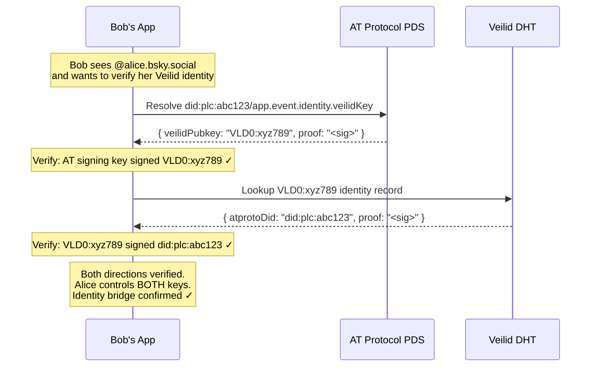
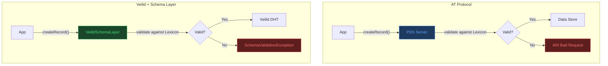
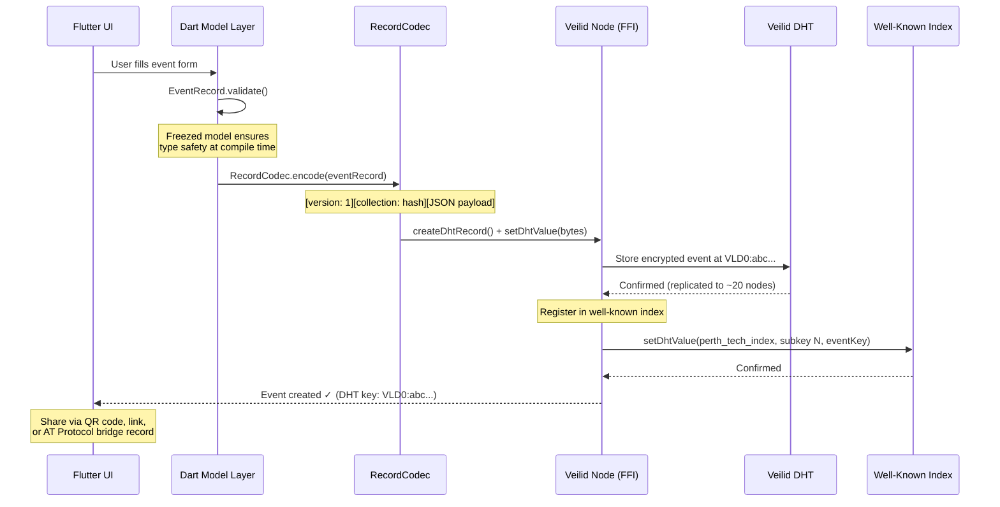
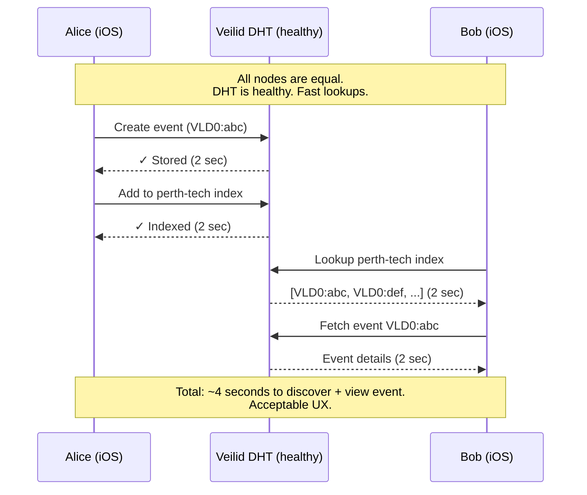
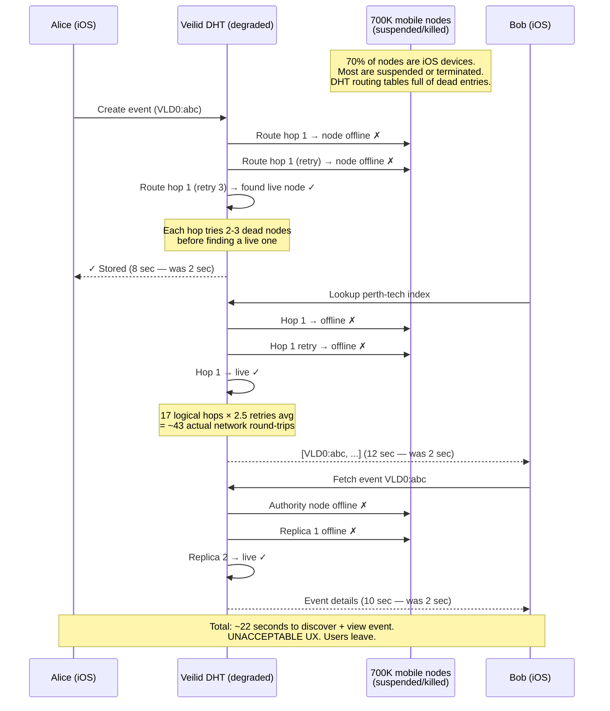

# Veilid Deep Dive: Identity Bridge, Search Nodes & Scale Limits

> An honest engineering assessment of whether the Veilid architecture holds at scale — covering AT Protocol identity preservation, search node design, and concrete failure modes at 100K-1M+ users.

---

## Table of Contents

1. [Maintaining AT Protocol Identity](#maintaining-at-protocol-identity)
2. [Search Node Architecture](#search-node-architecture)
3. [Schema & Data Models: Where's the Lexicon?](#schema--data-models-wheres-the-lexicon)
4. [Sequence Diagram: 1M Users — Degradation & Recovery](#sequence-diagram-1m-users--degradation--recovery)
5. [Practical Scaling Limits](#practical-scaling-limits)
6. [Does It Fail at Millions?](#does-it-fail-at-millions)
7. [Revised Honest Assessment](#revised-honest-assessment)

---

## Maintaining AT Protocol Identity

The user already has an AT Protocol identity (`did:plc:xxxxx`, handle `@alice.bsky.social`). The question is: how do you preserve this identity while adding Veilid capabilities?

### The Two Identities

```
AT Protocol Identity:                   Veilid Identity:
┌──────────────────────────┐            ┌──────────────────────────┐
│ DID: did:plc:abc123      │            │ Pubkey: VLD0:xyz789...   │
│ Handle: @alice.bsky.social│           │ (256-bit Ed25519 key)    │
│ PDS: alice.bsky.network   │           │ No handle, no registry   │
│ Registered in PLC Dir     │           │ Self-generated locally   │
│ Backed by signing key     │           │ IS the signing key       │
└──────────────────────────┘            └──────────────────────────┘

Problem: These are two completely unrelated identities.
         How does Bob verify that the Veilid pubkey he's talking to
         is the same person as @alice.bsky.social?
```

### The Identity Bridge: Bidirectional Proof

The bridge works by having each identity sign a claim about the other — creating a **verifiable, bidirectional link**.

#### Step 1: AT Protocol Side — Publish Veilid Key

Alice stores her Veilid pubkey in her AT Protocol PDS as a record:

```dart
// Publish Veilid pubkey to AT Protocol PDS
await atproto.repo.createRecord(
  repo: session.did,
  collection: 'app.event.identity.veilidKey',
  record: {
    'veilidPubkey': myVeilidPubkey.toString(),
    'linkedAt': DateTime.now().toIso8601String(),
    'proof': signWithAtKey(myVeilidPubkey), // AT signing key signs the Veilid pubkey
    '\$type': 'app.event.identity.veilidKey',
  },
);
```

This creates a publicly verifiable record:
```
at://did:plc:abc123/app.event.identity.veilidKey/self
{
  "veilidPubkey": "VLD0:xyz789...",
  "linkedAt": "2026-05-15T10:00:00Z",
  "proof": "<AT_signing_key_signature_over_veilid_pubkey>"
}
```

Anyone with Alice's DID can resolve this and find her Veilid key.

#### Step 2: Veilid Side — Publish AT Protocol DID

Alice stores her AT Protocol DID in a Veilid DHT record signed by her Veilid key:

```dart
// Publish AT Protocol DID to Veilid DHT
final identityRecord = await routingContext.createDhtRecord(
  DhtRecordDescriptor.dflt(1),
);

await routingContext.setDhtValue(
  identityRecord.key,
  0,
  utf8.encode(jsonEncode({
    'atprotoDid': 'did:plc:abc123',
    'atprotoHandle': '@alice.bsky.social',
    'linkedAt': DateTime.now().toIso8601String(),
    'proof': signWithVeilidKey(atProtoDid), // Veilid key signs the AT DID
  })),
);
```

#### Step 3: Verification Flow

When Bob encounters Alice, the app verifies both directions:



### What the Bridge Preserves

```
┌───────────────────────────────────────────────────────────────┐
│ What users keep from AT Protocol:                             │
│                                                               │
│  ✅ Their DID (did:plc:abc123) — unchanged                    │
│  ✅ Their handle (@alice.bsky.social) — unchanged             │
│  ✅ Their existing followers/social graph — unchanged          │
│  ✅ Their public event history — unchanged                    │
│  ✅ Smoke Signal interop — unchanged                          │
│                                                               │
│ What they gain from Veilid:                                   │
│                                                               │
│  ✅ Private event creation (never touches AT infra)           │
│  ✅ E2E encrypted RSVPs and messaging                         │
│  ✅ Offline-capable event access                              │
│  ✅ No relay dependency for private features                  │
│  ✅ Self-sovereign identity (Veilid key works without PLC)    │
└───────────────────────────────────────────────────────────────┘
```

### Privacy Considerations

```
Identity Bridge Options:

Option A: Public Bridge (both directions visible)
  AT record:     ▶ public (anyone on AT Protocol can see Alice's Veilid key)
  Veilid record: ▶ public (anyone on Veilid can see Alice's AT DID)
  
  Use case: Public figures, event organisers who want discoverability
  Risk: Full identity correlation — AT Protocol observers know your Veilid key

Option B: Selective Bridge (AT → Veilid public, Veilid → AT private)
  AT record:     ▶ public (people can find you on Veilid from AT Protocol)
  Veilid record: ▶ encrypted (only shared with contacts who have your pubkey)
  
  Use case: Regular users who want to be discoverable but not surveilled
  Risk: AT Protocol side reveals your Veilid key

Option C: Private Bridge (both directions encrypted)
  AT record:     ▶ not published (or encrypted in PDS)
  Veilid record: ▶ encrypted (private entry, shared per-contact)
  
  Use case: Maximum privacy — only people you trust know the link
  Risk: Harder to discover; requires out-of-band key exchange

Option D: No Bridge (separate identities)
  No AT record
  No Veilid identity record referencing AT
  
  Use case: Complete separation. Different persona for private events.
  Risk: No discoverability across protocols
```

> [!IMPORTANT]
> The bridge is **user-controlled**. The app should default to Option B (discoverable but not fully transparent) and let users choose their privacy level. Crucially, the bridge is **optional** — the Veilid side works perfectly without any AT Protocol link.

---

## Search Node Architecture

Search nodes solve the "how do I find events I don't know about yet?" problem. Here's the detailed design.

### What a Search Node Does

```
┌──────────────────────────────────────────────────────────────┐
│                     Search Node                               │
│                                                              │
│  1. CRAWL                                                    │
│     - Periodically reads well-known DHT index keys           │
│     - Fetches event details from each listed event key       │
│     - Follows community curator records                      │
│                                                              │
│  2. INDEX                                                    │
│     - Builds a full-text search index (title, description)   │
│     - Indexes by location (geohash), category, date          │
│     - Tracks event freshness (remove expired events)         │
│                                                              │
│  3. SERVE                                                    │
│     - Responds to search queries from app users              │
│     - Returns ranked results with DHT keys                   │
│     - Does NOT store event content — only metadata + keys    │
│                                                              │
│  4. OPTIONAL: PUSH                                           │
│     - Publishes search results back to DHT as curated lists  │
│     - Other nodes can read these without contacting the      │
│       search node directly                                   │
└──────────────────────────────────────────────────────────────┘
```

### Architecture Options

#### Option A: Search Node on Veilid (Fully Decentralised)

The search node itself runs AS a Veilid node. Queries arrive via Veilid's private routing:

```
┌─────────────┐      Veilid Private Route      ┌──────────────┐
│ User's App  │ ───────────────────────────────► │ Search Node  │
│ (iOS)       │ query: "perth music"             │ (VPS/Desktop)│
│             │ ◄─────────────────────────────── │              │
│             │ results: [VLD0:abc, VLD0:def]     │ Full-text    │
└─────────────┘                                  │ index        │
                                                 └──────────────┘

Pros:
  ✅ Fully on Veilid network — no HTTP, no DNS
  ✅ User's identity/IP is hidden (private routing)
  ✅ Search node's location is hidden (safety routes)

Cons:
  ⚠️ Higher latency (Veilid routing adds hops)
  ⚠️ Search node must be always-online
```

#### Option B: Search Node via HTTP (Pragmatic)

The search node exposes a simple REST API. The app calls it over HTTPS:

```
┌─────────────┐      HTTPS                     ┌──────────────┐
│ User's App  │ ──────────────────────────────► │ Search Node  │
│ (iOS)       │ GET /search?q=perth+music       │ (VPS)        │
│             │ ◄────────────────────────────── │              │
│             │ [{"key":"VLD0:abc","name":...}]  │ SQLite +     │
└─────────────┘                                  │ Full-text    │
                                                 └──────────────┘
                                                 
  Then: app fetches actual event data from Veilid DHT
  (search node only provides DHT keys, not the data itself)

Pros:
  ✅ Fast (direct HTTP, no routing hops)
  ✅ Simple to implement
  ✅ Can be cached via CDN

Cons:
  ⚠️ HTTP endpoint is a known address (soft centralisation)
  ⚠️ User's IP is visible to the search node
  ⚠️ Not "purely" decentralised
```

#### Option C: Hybrid DHT Cache + HTTP Fallback

The search node publishes results TO the DHT as well-known records. Users try the DHT cache first, fall back to HTTP:

```dart
// User search flow
Future<List<EventResult>> search(String query) async {
  // 1. Try DHT cache first (fully decentralised)
  final cacheKey = computeSearchCacheKey(query);
  final cached = await routingContext.getDhtValue(cacheKey, 0);
  
  if (cached != null && isFresh(cached)) {
    return parseResults(cached);
  }
  
  // 2. Fall back to HTTP search node
  final response = await http.get(
    Uri.parse('https://search.eventapp.community/search?q=$query'),
  );
  
  return parseResults(response.body);
}
```

```
Flow:
  User searches "perth music"
  → Check DHT key sha256("search-cache:perth:music:2026-04") 
  → If cached result exists and is < 1 hour old: use it
  → If not: query HTTP search node, get results
  → App fetches actual events from Veilid DHT using returned keys
```

### Search Node Economics

```
Running a search node:

  Hardware: Any VPS ($5-20/month), a Raspberry Pi, or a desktop
  
  Crawling cost:
    - 10,000 events × 1 DHT lookup each = ~10,000 lookups
    - At ~500ms per lookup = ~80 minutes full crawl
    - Run every hour = well within capacity of a $5 VPS
    
  Storage:
    - 10,000 events × 1KB metadata each = 10MB
    - 100,000 events = 100MB
    - Trivial storage requirements
    
  Bandwidth:
    - Each search query: ~1KB response
    - 10,000 queries/day = 10MB/day
    - Trivial bandwidth
    
  Total: A single $5/month VPS can serve 100K+ events 
         with 10K+ daily queries
```

### Trust & Abuse

```
Search nodes are NOT authoritative:

  ├── They DON'T store events (just keys + metadata)
  ├── They CAN'T modify events (data is signed in DHT)
  ├── They CAN'T forge RSVPs (requires the user's Veilid key)
  ├── They CAN exclude events from results (censorship risk)
  └── They CAN return stale results (freshness risk)

Mitigations:
  ├── Multiple independent search nodes (diversity)
  ├── App ships with a list of known search nodes
  ├── Users can add/remove search nodes (like DNS servers)
  ├── Community-run nodes vs commercial nodes
  └── Search results always verified against DHT source
```

> [!IMPORTANT]
> **The key principle**: Search nodes are convenience infrastructure, not critical infrastructure. The app works without them (using well-known DHT keys, contacts, and geohash lookups). They make discovery *better*, not *possible*.

---

## Schema & Data Models: Where's the Lexicon?

### The Gap

AT Protocol's Lexicon system is genuinely beautiful. It gives you:
- **Typed schemas** with validation (`string`, `integer`, `datetime`, `blob`, `ref`)
- **Namespaced collections** (`events.smokesignal.calendar.event`)
- **Cross-app interoperability** (any AT Protocol client can read/write the same schemas)
- **Machine-readable definitions** (JSON schema → auto-generate code)
- **Versioning** built in

Veilid gives you: **raw bytes in a DHT record**. No schema. No types. No validation. No interop standard.

```
AT Protocol (Lexicon):
┌──────────────────────────────────────────────────────┐
│ {                                                    │
│   "lexicon": 1,                                      │
│   "id": "events.smokesignal.calendar.event",         │
│   "defs": {                                          │
│     "main": {                                        │
│       "type": "record",                              │
│       "key": "tid",                                  │
│       "record": {                                    │
│         "type": "object",                            │
│         "required": ["name", "startsAt", "createdAt"],│
│         "properties": {                              │
│           "name": { "type": "string", "maxLength": 300 },│
│           "startsAt": { "type": "string", "format": "datetime" },│
│           "location": { "type": "string" },          │
│           "description": { "type": "string" }        │
│         }                                            │
│       }                                              │
│     }                                                │
│   }                                                  │
│ }                                                    │
│                                                      │
│ → Any AT Protocol app reads this.                    │
│ → PDS validates incoming data against schema.        │
│ → Code generators produce typed models.              │
└──────────────────────────────────────────────────────┘

Veilid (DHT):
┌──────────────────────────────────────────────────────┐
│                                                      │
│   routingContext.setDhtValue(key, 0, someBytes);      │
│                                                      │
│   That's it. Those bytes could be anything.           │
│   No schema. No validation. No interop.               │
│                                                      │
└──────────────────────────────────────────────────────┘
```

### The Solution: Build Your Own Schema Layer

You implement what Lexicon provides at the **application layer** using Dart's type system, JSON Schema, or Protocol Buffers.

#### Layer 1: Dart Data Models (Compile-Time Safety)

```dart
// lib/models/schemas/event_record.dart
// This IS your Lexicon equivalent — defined in Dart, not JSON schema

import 'package:freezed_annotation/freezed_annotation.dart';

part 'event_record.freezed.dart';
part 'event_record.g.dart';

/// Schema version — increment on breaking changes
const int kEventSchemaVersion = 1;

/// Namespace equivalent to Lexicon NSID
const String kEventCollection = 'app.event.calendar.event';

@freezed
class EventRecord with _$EventRecord {
  const factory EventRecord({
    /// Schema metadata (like Lexicon $type)
    @Default(kEventCollection) String collection,
    @Default(kEventSchemaVersion) int schemaVersion,
    
    /// Required fields (like Lexicon "required")
    required String name,
    required DateTime startsAt,
    required DateTime createdAt,
    required String creatorPubkey,
    
    /// Optional fields
    String? description,
    String? location,
    GeoPoint? geoLocation,
    DateTime? endsAt,
    String? category,
    List<String>? tags,
    String? imageUrl,
    
    /// Veilid-specific metadata
    String? dhtKey,
    int? maxAttendees,
    @Default(EventVisibility.public) EventVisibility visibility,
  }) = _EventRecord;

  factory EventRecord.fromJson(Map<String, dynamic> json) =>
      _$EventRecordFromJson(json);
}

enum EventVisibility { public, private, inviteOnly }

@freezed
class GeoPoint with _$GeoPoint {
  const factory GeoPoint({
    required double latitude,
    required double longitude,
  }) = _GeoPoint;

  factory GeoPoint.fromJson(Map<String, dynamic> json) =>
      _$GeoPointFromJson(json);
}
```

```dart
// lib/models/schemas/rsvp_record.dart

@freezed
class RsvpRecord with _$RsvpRecord {
  const factory RsvpRecord({
    @Default('app.event.calendar.rsvp') String collection,
    @Default(1) int schemaVersion,
    
    required String eventDhtKey,
    required String attendeePubkey,
    required RsvpStatus status,
    required DateTime respondedAt,
    
    String? displayName,
    String? message,
  }) = _RsvpRecord;

  factory RsvpRecord.fromJson(Map<String, dynamic> json) =>
      _$RsvpRecordFromJson(json);
}

enum RsvpStatus { going, interested, notGoing }
```

#### Layer 2: Serialisation Protocol (Wire Format)

```dart
// lib/services/veilid/record_codec.dart
// Handles encoding/decoding between Dart models and DHT bytes

class RecordCodec {
  /// Encode a record to DHT-ready bytes
  /// Format: [schema_version(1 byte)][collection_hash(4 bytes)][json_payload]
  static Uint8List encode(dynamic record) {
    final json = record.toJson();
    final collectionHash = _hashCollection(json['collection'] as String);
    
    final payload = utf8.encode(jsonEncode(json));
    final buffer = BytesBuilder();
    buffer.addByte(json['schemaVersion'] as int);  // Schema version
    buffer.add(collectionHash);                     // Collection identifier
    buffer.add(payload);                            // JSON payload
    
    return buffer.toBytes();
  }

  /// Decode DHT bytes back to a typed record
  static T decode<T>(Uint8List bytes) {
    final version = bytes[0];
    final collectionHash = bytes.sublist(1, 5);
    final payload = jsonDecode(utf8.decode(bytes.sublist(5)));
    
    // Version migration
    if (version < kCurrentVersion) {
      payload = _migrate(payload, version);
    }
    
    // Route to correct model based on collection
    final collection = payload['collection'] as String;
    switch (collection) {
      case 'app.event.calendar.event':
        return EventRecord.fromJson(payload) as T;
      case 'app.event.calendar.rsvp':
        return RsvpRecord.fromJson(payload) as T;
      default:
        throw UnknownCollectionException(collection);
    }
  }
}
```

#### Layer 3: Schema Registry (Cross-App Interop)

To achieve Lexicon-like interoperability (other apps reading your event format), publish your schema definitions to a well-known DHT key:

```dart
// Schema registry — published to DHT for other apps to discover
final schemaRegistry = {
  'app.event.calendar.event': {
    'version': 1,
    'description': 'A calendar event',
    'fields': {
      'name':        { 'type': 'string', 'required': true, 'maxLength': 300 },
      'startsAt':    { 'type': 'datetime', 'required': true },
      'createdAt':   { 'type': 'datetime', 'required': true },
      'creatorPubkey': { 'type': 'string', 'required': true },
      'description': { 'type': 'string', 'required': false },
      'location':    { 'type': 'string', 'required': false },
      'geoLocation': { 'type': 'geopoint', 'required': false },
      'visibility':  { 'type': 'enum', 'values': ['public', 'private', 'inviteOnly'] },
    },
  },
  'app.event.calendar.rsvp': {
    'version': 1,
    'description': 'An RSVP to an event',
    'fields': {
      'eventDhtKey':    { 'type': 'string', 'required': true },
      'attendeePubkey': { 'type': 'string', 'required': true },
      'status':         { 'type': 'enum', 'values': ['going', 'interested', 'notGoing'] },
      'respondedAt':    { 'type': 'datetime', 'required': true },
    },
  },
};

// Publish to well-known DHT key
final registryKey = sha256('schema-registry:app.event:v1');
await routingContext.setDhtValue(registryKey, 0, utf8.encode(jsonEncode(schemaRegistry)));
```

### Making It Protocol-Level: The Schema Enforcement Layer

The previous section showed schemas as app-level conventions. But your question is: **how do we make this as strict as AT Protocol?** Where the PDS *rejects* bad data before it ever hits the network?

The answer: build a **Veilid Schema Layer** — a Dart SDK middleware that wraps ALL DHT operations. Nothing reads or writes to the DHT without going through it. This achieves the same guarantee as a PDS, enforced at the SDK level instead of the server level.

```
AT Protocol architecture:
  App → PDS (validates against Lexicon) → Data Store
  ─────────────────────────────────────────────────
  Invalid record? PDS rejects it. Never stored.

Veilid + Schema Layer architecture:
  App → VeilidSchemaLayer (validates against Lexicon) → DHT
  ──────────────────────────────────────────────────────────
  Invalid record? Schema Layer rejects it. Never written to DHT.
```

#### The Architecture

```
┌──────────────────────────────────────────────────────────────┐
│                    Your Flutter App                           │
│                                                              │
│  ┌────────────┐    ┌─────────────────────────────────┐       │
│  │ UI Layer   │───►│  Repository Layer                │       │
│  │ (Widgets)  │    │  (EventRepo, RsvpRepo)           │       │
│  └────────────┘    └──────────┬──────────────────────┘       │
│                               │                              │
│                    ┌──────────▼──────────────────────┐       │
│                    │  VeilidSchemaLayer (THE GATE)    │       │
│                    │                                  │       │
│                    │  ├── Lexicon Registry (cached)   │       │
│                    │  ├── validate(collection, data)  │       │
│                    │  ├── encode(record) → bytes      │       │
│                    │  ├── decode(bytes) → record      │       │
│                    │  ├── createRecord(collection,..) │       │
│                    │  ├── readRecord(key) → typed      │       │
│                    │  └── rejectInvalid() → throw     │       │
│                    │                                  │       │
│                    │  NOTHING passes without          │       │
│                    │  schema validation.              │       │
│                    └──────────┬──────────────────────┘       │
│                               │                              │
│                    ┌──────────▼──────────────────────┐       │
│                    │  Veilid FFI (raw DHT)            │       │
│                    │  createDhtRecord / setDhtValue   │       │
│                    └─────────────────────────────────┘       │
└──────────────────────────────────────────────────────────────┘
```

#### Step 1: Define Lexicons (Identical Format to AT Protocol)

Use the **exact same Lexicon JSON format** as AT Protocol. This means any tooling built for AT Lexicons works here too:

```dart
// lib/lexicons/app/event/calendar/event.json
// IDENTICAL format to AT Protocol Lexicon definitions
const eventLexicon = {
  "lexicon": 1,
  "id": "app.event.calendar.event",
  "defs": {
    "main": {
      "type": "record",
      "description": "A calendar event",
      "key": "tid",
      "record": {
        "type": "object",
        "required": ["name", "startsAt", "createdAt", "creatorPubkey"],
        "properties": {
          "name": {
            "type": "string",
            "maxLength": 300,
            "minLength": 1,
            "description": "The event title"
          },
          "startsAt": {
            "type": "string",
            "format": "datetime",
            "description": "When the event starts (ISO 8601)"
          },
          "endsAt": {
            "type": "string",
            "format": "datetime",
            "description": "When the event ends (ISO 8601)"
          },
          "createdAt": {
            "type": "string",
            "format": "datetime"
          },
          "creatorPubkey": {
            "type": "string",
            "description": "Veilid public key of the event creator"
          },
          "description": {
            "type": "string",
            "maxLength": 10000,
            "maxGraphemes": 5000
          },
          "location": {
            "type": "string",
            "maxLength": 500
          },
          "geoLocation": {
            "type": "ref",
            "ref": "#geoPoint"
          },
          "category": {
            "type": "string",
            "maxLength": 100
          },
          "tags": {
            "type": "array",
            "items": { "type": "string", "maxLength": 50 },
            "maxLength": 10
          },
          "visibility": {
            "type": "string",
            "knownValues": ["public", "private", "inviteOnly"],
            "default": "public"
          },
          "maxAttendees": {
            "type": "integer",
            "minimum": 1
          }
        }
      }
    },
    "geoPoint": {
      "type": "object",
      "required": ["latitude", "longitude"],
      "properties": {
        "latitude": { "type": "number", "minimum": -90, "maximum": 90 },
        "longitude": { "type": "number", "minimum": -180, "maximum": 180 }
      }
    }
  }
};
```

```dart
// lib/lexicons/app/event/calendar/rsvp.json
const rsvpLexicon = {
  "lexicon": 1,
  "id": "app.event.calendar.rsvp",
  "defs": {
    "main": {
      "type": "record",
      "description": "An RSVP to a calendar event",
      "key": "tid",
      "record": {
        "type": "object",
        "required": ["eventDhtKey", "attendeePubkey", "status", "respondedAt"],
        "properties": {
          "eventDhtKey": {
            "type": "string",
            "description": "DHT key of the event being RSVPd to"
          },
          "attendeePubkey": {
            "type": "string",
            "description": "Veilid public key of the attendee"
          },
          "status": {
            "type": "string",
            "knownValues": ["going", "interested", "notGoing"]
          },
          "respondedAt": {
            "type": "string",
            "format": "datetime"
          },
          "displayName": {
            "type": "string",
            "maxLength": 200
          },
          "message": {
            "type": "string",
            "maxLength": 1000
          }
        }
      }
    }
  }
};
```

#### Step 2: Build the Schema Validator

```dart
// lib/services/schema/lexicon_validator.dart
// This does what AT Protocol's PDS does — validates records against Lexicons

class LexiconValidator {
  final Map<String, Map<String, dynamic>> _schemas = {};

  /// Register a Lexicon schema
  void register(Map<String, dynamic> lexicon) {
    final id = lexicon['id'] as String;
    _schemas[id] = lexicon;
  }

  /// Validate a record against its Lexicon — returns errors or empty list
  List<ValidationError> validate(String collection, Map<String, dynamic> data) {
    final lexicon = _schemas[collection];
    if (lexicon == null) {
      return [ValidationError('Unknown collection: $collection')];
    }

    final recordDef = lexicon['defs']['main']['record'];
    return _validateObject(data, recordDef, path: '');
  }

  List<ValidationError> _validateObject(
    Map<String, dynamic> data,
    Map<String, dynamic> schema,
    {required String path}
  ) {
    final errors = <ValidationError>[];
    final props = schema['properties'] as Map<String, dynamic>;
    final required = List<String>.from(schema['required'] ?? []);

    // Check required fields
    for (final field in required) {
      if (!data.containsKey(field) || data[field] == null) {
        errors.add(ValidationError('$path.$field is required'));
      }
    }

    // Validate each field against its type definition
    for (final entry in data.entries) {
      final fieldName = entry.key;
      final value = entry.value;
      final fieldSchema = props[fieldName] as Map<String, dynamic>?;

      if (fieldSchema == null) continue; // Unknown fields allowed (forward compat)

      errors.addAll(_validateField(value, fieldSchema, path: '$path.$fieldName'));
    }

    return errors;
  }

  List<ValidationError> _validateField(
    dynamic value,
    Map<String, dynamic> schema,
    {required String path}
  ) {
    final errors = <ValidationError>[];
    final type = schema['type'] as String;

    switch (type) {
      case 'string':
        if (value is! String) {
          errors.add(ValidationError('$path must be a string'));
          break;
        }
        if (schema['maxLength'] != null && value.length > schema['maxLength']) {
          errors.add(ValidationError(
            '$path exceeds maxLength ${schema['maxLength']} (got ${value.length})',
          ));
        }
        if (schema['minLength'] != null && value.length < schema['minLength']) {
          errors.add(ValidationError(
            '$path below minLength ${schema['minLength']}',
          ));
        }
        if (schema['format'] == 'datetime') {
          if (DateTime.tryParse(value) == null) {
            errors.add(ValidationError('$path is not a valid datetime'));
          }
        }
        if (schema['knownValues'] != null) {
          final known = List<String>.from(schema['knownValues']);
          if (!known.contains(value)) {
            errors.add(ValidationError(
              '$path must be one of: ${known.join(', ')} (got: $value)',
            ));
          }
        }
        break;

      case 'integer':
        if (value is! int) {
          errors.add(ValidationError('$path must be an integer'));
          break;
        }
        if (schema['minimum'] != null && value < schema['minimum']) {
          errors.add(ValidationError('$path below minimum ${schema['minimum']}'));
        }
        break;

      case 'number':
        if (value is! num) {
          errors.add(ValidationError('$path must be a number'));
          break;
        }
        if (schema['minimum'] != null && value < schema['minimum']) {
          errors.add(ValidationError('$path below minimum ${schema['minimum']}'));
        }
        if (schema['maximum'] != null && value > schema['maximum']) {
          errors.add(ValidationError('$path above maximum ${schema['maximum']}'));
        }
        break;

      case 'array':
        if (value is! List) {
          errors.add(ValidationError('$path must be an array'));
          break;
        }
        if (schema['maxLength'] != null && value.length > schema['maxLength']) {
          errors.add(ValidationError('$path exceeds max items ${schema['maxLength']}'));
        }
        break;
        
      case 'ref':
        // Resolve reference to another definition and validate
        if (value is Map<String, dynamic>) {
          final refDef = _resolveRef(schema['ref'] as String);
          if (refDef != null) {
            errors.addAll(_validateObject(value, refDef, path: path));
          }
        }
        break;
    }

    return errors;
  }
}

class ValidationError {
  final String message;
  ValidationError(this.message);
  
  @override
  String toString() => 'ValidationError: $message';
}
```

#### Step 3: Build the Enforcing Middleware (The "PDS Equivalent")

This is the critical piece — the gate that **nothing passes without validation**:

```dart
// lib/services/veilid/veilid_schema_layer.dart
// THIS IS YOUR PDS. Nothing reads or writes to DHT without going through here.

class VeilidSchemaLayer {
  final VeilidRoutingContext _routingContext;
  final LexiconValidator _validator;
  final RecordCodec _codec;

  VeilidSchemaLayer({
    required VeilidRoutingContext routingContext,
    required LexiconValidator validator,
  }) : _routingContext = routingContext,
       _validator = validator,
       _codec = RecordCodec();

  // ══════════════════════════════════════════════════════════
  // WRITE PATH — Validates BEFORE writing to DHT
  // Equivalent to: PDS rejecting invalid createRecord requests
  // ══════════════════════════════════════════════════════════

  /// Create a new record in the DHT with schema validation
  /// Throws [SchemaValidationException] if data doesn't match Lexicon
  Future<DhtRecordKey> createRecord({
    required String collection,
    required Map<String, dynamic> data,
    int subkeyCount = 1,
  }) async {
    // ENFORCE: Validate against Lexicon BEFORE touching DHT
    final errors = _validator.validate(collection, data);
    if (errors.isNotEmpty) {
      throw SchemaValidationException(
        collection: collection,
        errors: errors,
        // This is what AT Protocol PDS does — reject invalid data
        message: 'Record rejected: does not conform to Lexicon "$collection"',
      );
    }

    // Add protocol metadata (like AT Protocol's $type)
    data['\$type'] = collection;
    data['\$schema'] = _validator.schemaVersion(collection);

    // Encode and write
    final bytes = _codec.encode(collection, data);
    final record = await _routingContext.createDhtRecord(
      DhtRecordDescriptor.dflt(subkeyCount),
    );
    await _routingContext.setDhtValue(record.key, 0, bytes);

    return record.key;
  }

  /// Update an existing record with schema validation
  Future<void> updateRecord({
    required DhtRecordKey key,
    required String collection,
    required Map<String, dynamic> data,
    int subkey = 0,
  }) async {
    // ENFORCE: Validate before writing
    final errors = _validator.validate(collection, data);
    if (errors.isNotEmpty) {
      throw SchemaValidationException(
        collection: collection,
        errors: errors,
        message: 'Update rejected: does not conform to Lexicon "$collection"',
      );
    }

    data['\$type'] = collection;
    data['\$schema'] = _validator.schemaVersion(collection);
    final bytes = _codec.encode(collection, data);
    await _routingContext.setDhtValue(key, subkey, bytes);
  }

  // ══════════════════════════════════════════════════════════
  // READ PATH — Validates AFTER reading from DHT
  // Equivalent to: PDS ensuring data integrity on read
  // Defence against garbage written by misbehaving apps
  // ══════════════════════════════════════════════════════════

  /// Read and validate a record from DHT
  /// Throws [SchemaValidationException] if stored data is malformed
  /// Returns null if record doesn't exist
  Future<ValidatedRecord?> readRecord(DhtRecordKey key, {int subkey = 0}) async {
    final raw = await _routingContext.getDhtValue(key, subkey);
    if (raw == null) return null;

    try {
      final decoded = _codec.decode(raw.data);
      final collection = decoded['\$type'] as String?;
      
      if (collection == null) {
        throw SchemaValidationException(
          collection: 'unknown',
          errors: [ValidationError('Missing \$type field — not a valid record')],
          message: 'Record at $key has no \$type. Likely garbage data.',
        );
      }

      // ENFORCE: Validate on READ — defence against bad actors
      final errors = _validator.validate(collection, decoded);
      if (errors.isNotEmpty) {
        // Log the violation but don't crash — return it marked invalid
        return ValidatedRecord(
          key: key,
          collection: collection,
          data: decoded,
          isValid: false,
          validationErrors: errors,
        );
      }

      return ValidatedRecord(
        key: key,
        collection: collection,
        data: decoded,
        isValid: true,
        validationErrors: [],
      );
    } catch (e) {
      // Totally unparseable data — not even valid JSON
      return ValidatedRecord(
        key: key,
        collection: 'corrupted',
        data: {},
        isValid: false,
        validationErrors: [ValidationError('Unparseable: $e')],
      );
    }
  }
}

/// Result of reading a DHT record — includes validation status
class ValidatedRecord {
  final DhtRecordKey key;
  final String collection;
  final Map<String, dynamic> data;
  final bool isValid;
  final List<ValidationError> validationErrors;

  const ValidatedRecord({
    required this.key,
    required this.collection,
    required this.data,
    required this.isValid,
    required this.validationErrors,
  });

  /// Safely cast to a typed model — only if valid
  T? as<T>(T Function(Map<String, dynamic>) fromJson) {
    if (!isValid) return null;
    return fromJson(data);
  }
}

/// Thrown when data doesn't conform to its Lexicon
class SchemaValidationException implements Exception {
  final String collection;
  final List<ValidationError> errors;
  final String message;

  SchemaValidationException({
    required this.collection,
    required this.errors,
    required this.message,
  });

  @override
  String toString() => '$message\n${errors.join('\n')}';
}
```

#### Step 4: Wire It Up — The App Can Only Use the Schema Layer

```dart
// lib/services/service_locator.dart
// The raw Veilid FFI is NEVER exposed to app code.
// Only VeilidSchemaLayer is accessible.

Future<void> setupServices() async {
  // 1. Boot Veilid
  final veilid = await Veilid.platformInit();
  await veilid.startupVeilidCore(updateCallback: _handleUpdate);
  final routingContext = await veilid.routingContext();

  // 2. Create and populate the Lexicon validator
  final validator = LexiconValidator();
  validator.register(eventLexicon);     // app.event.calendar.event
  validator.register(rsvpLexicon);      // app.event.calendar.rsvp
  validator.register(profileLexicon);   // app.event.actor.profile
  validator.register(contactLexicon);   // app.event.social.contact
  // ... register all your Lexicons

  // 3. Create the Schema Layer — this is the ONLY thing the app uses
  final schemaLayer = VeilidSchemaLayer(
    routingContext: routingContext,
    validator: validator,
  );

  // 4. Register in service locator — raw routingContext is NOT registered
  getIt.registerSingleton<VeilidSchemaLayer>(schemaLayer);
  // getIt.registerSingleton(routingContext);  ← NEVER DO THIS
}
```

```dart
// lib/repositories/event_repository.dart
// Repository ONLY talks to VeilidSchemaLayer — NEVER to raw DHT

class EventRepository {
  final VeilidSchemaLayer _schema;

  EventRepository(this._schema);

  Future<DhtRecordKey> createEvent(EventRecord event) async {
    // VeilidSchemaLayer validates against Lexicon before writing
    // If "name" is missing or "startsAt" is not a datetime,
    // SchemaValidationException is thrown — data NEVER hits the DHT
    return _schema.createRecord(
      collection: 'app.event.calendar.event',
      data: event.toJson(),
    );
  }

  Future<EventRecord?> getEvent(DhtRecordKey key) async {
    final result = await _schema.readRecord(key);
    if (result == null) return null;

    if (!result.isValid) {
      // Data exists but doesn't match Lexicon
      // Could be: old version, corrupted, or malicious
      _log.warning('Invalid event at $key: ${result.validationErrors}');
      return null; // Treat as if it doesn't exist
    }

    return result.as(EventRecord.fromJson);
  }
}
```

#### How This Compares to AT Protocol PDS



### Where Enforcement Happens: AT vs Veilid

```
AT Protocol enforcement points:
  ┌──────┐     ┌─────┐     ┌──────────┐     ┌───────┐
  │ App  │ ──► │ PDS │ ──► │ Data     │ ──► │ Relay │
  └──────┘     └──┬──┘     │ Store    │     └───────┘
                  │        └──────────┘
              VALIDATES                    
              HERE (server)                 
              
  ✅ Server-side — bad clients can't bypass
  ❌ Requires a PDS server
  ❌ PDS operator can modify validation rules


Veilid + Schema Layer enforcement points:
  ┌──────┐     ┌──────────────┐     ┌─────────┐
  │ App  │ ──► │ SchemaLayer  │ ──► │  DHT    │
  └──────┘     └──────┬───────┘     └─────────┘
                      │                    ▲
                  VALIDATES              │
                  HERE (client)        │
                                     VALIDATES
                                     HERE TOO (on read)
                                     
  ✅ Client-side write validation — YOUR app can't write bad data
  ✅ Client-side read validation — YOUR app rejects bad data from OTHERS
  ⚠️ Other apps CAN write bad data to DHT if they don't use your SDK
  ✅ But YOUR app will reject it on read (defence in depth)
  ✅ No server required
```

> [!IMPORTANT]
> **The key difference from pure "app-level convention"**: By wrapping the raw `VeilidRoutingContext` and **never exposing it** to application code, the Schema Layer becomes the protocol boundary. It's not an honour system — it's a **compiled-in constraint**. Any app built with this SDK physically cannot write invalid data. And on read, invalid data from other sources is rejected.
>
> What you CAN'T prevent: a completely separate app, not using your SDK, writing garbage to the DHT. But your app ignores that garbage — it's invisible to your users. This is actually how the web works too: HTTP doesn't prevent garbage responses, but browsers validate and reject malformed HTML.

### Publishing Lexicons for Other Apps

To enable Smoke Signal-style interoperability (other event apps reading your Lexicons), publish your Lexicon definitions to the DHT:

```dart
// Publish Lexicons to well-known DHT key for other apps to discover
Future<void> publishLexicons(VeilidSchemaLayer schema) async {
  final lexiconRegistryKey = sha256('lexicon-registry:app.event:v1');
  
  await schema.createRecord(
    collection: 'app.event.meta.lexiconRegistry',
    data: {
      'namespace': 'app.event',
      'version': 1,
      'lexicons': {
        'app.event.calendar.event': eventLexicon,
        'app.event.calendar.rsvp': rsvpLexicon,
        'app.event.actor.profile': profileLexicon,
      },
      'publishedAt': DateTime.now().toIso8601String(),
      'publisherPubkey': myPubkey.toString(),
    },
  );
}

// Another app discovering and using your Lexicons:
Future<void> importLexicons(VeilidSchemaLayer schema) async {
  final registryKey = sha256('lexicon-registry:app.event:v1');
  final result = await schema.readRecord(registryKey);
  
  if (result != null && result.isValid) {
    final lexicons = result.data['lexicons'] as Map<String, dynamic>;
    for (final entry in lexicons.entries) {
      schema.validator.register(entry.value as Map<String, dynamic>);
    }
    // Now this app can read AND write app.event records with full validation
  }
}
```

### Comparison: Before and After Protocol Enforcement

| Aspect | App-Level (honour system) | Protocol-Level (Schema Layer) |
|--------|:---:|:---:|
| **Write validation** | Developer remembers to validate | SDK enforces — can't bypass |
| **Read validation** | Developer remembers to validate | SDK enforces — garbage is invisible |
| **Raw DHT access** | Available to all app code | Hidden behind Schema Layer |
| **Lexicon format** | Custom Dart convention | Standard Lexicon JSON (AT-compatible) |
| **Cross-app interop** | Hope they match your format | Publish Lexicons to DHT, apps import them |
| **New record types** | Edit multiple files | Add one Lexicon JSON + register |
| **Bad actor protection** | None | Read-side validation rejects garbage |
| **Smoke Signal compat** | Format may drift | Same Lexicon format — can share schemas |

### Complete Data Flow: Creating an Event



---

## Sequence Diagram: 1M Users — Degradation & Recovery

This shows what actually happens when the pure P2P model meets mobile reality at scale: how iOS churn degrades the DHT, and how anchor/search nodes restore usability.

### Normal Flow (Working Well at 10K Users)



### Degraded Flow (1M Users, High iOS Churn)



### Recovered Flow (1M Users, With Anchor + Search Nodes)

```mermaid
sequenceDiagram
    participant Alice as Alice (iOS)
    participant Anchor as Anchor Nodes (5x VPS)<br/>Always online, stable DHT
    participant Search as Search Node<br/>(HTTP + DHT cache)
    participant DHT as Veilid DHT (stabilised)
    participant Bob as Bob (iOS)

    Note over Anchor: 5 anchor nodes ($5/mo each = $25/mo)<br/>Always online. Stable routing tables.<br/>Host popular DHT records.<br/>Act as reliable routing waypoints.

    Note over Search: 2 search nodes ($10/mo each = $20/mo)<br/>Crawl well-known indexes hourly.<br/>Build full-text search index.<br/>Serve via HTTP + push to DHT cache.

    rect rgb(20, 60, 40)
    Note over Alice,DHT: Alice creates event (anchor-assisted)
    Alice->>DHT: Create event (VLD0:abc)
    Note over DHT: Anchor nodes provide stable routing.<br/>Fewer dead-node retries.
    DHT-->>Alice: ✓ Stored (3 sec — was 8 sec degraded)
    Alice->>DHT: Add to perth-tech index
    DHT-->>Alice: ✓ Indexed (3 sec)
    end

    rect rgb(20, 40, 70)
    Note over Search: Search node crawls (background, every hour)
    Search->>DHT: Read perth-tech index
    DHT-->>Search: Event list (search node is always online, fast)
    Search->>DHT: Fetch each event's metadata
    DHT-->>Search: Event details
    Search->>Search: Build/update search index
    Search->>DHT: Push search cache to well-known DHT key
    end

    rect rgb(60, 40, 20)
    Note over Bob,Search: Bob discovers event (search-assisted)
    Bob->>Search: GET /search?q=perth+music (HTTPS, 100ms)
    Search-->>Bob: [{key:"VLD0:abc", name:"Perth Meetup",...}]

    Note over Bob: Has the DHT key. Fetch full details.

    Bob->>DHT: Fetch event VLD0:abc
    Note over DHT: Anchor nodes + cached replicas<br/>make this reliable
    DHT-->>Bob: Full event details (3 sec)
    end

    Note over Alice,Bob: Total: ~3 seconds to discover + view event.<br/>Search via HTTP: 100ms. DHT fetch: 3 sec.<br/>GOOD UX. Comparable to AT Protocol.

    rect rgb(50, 30, 30)
    Note over Bob,DHT: What if search node is DOWN?
    Bob->>Search: GET /search?q=perth+music
    Search--xBob: Connection refused ✗
    
    Note over Bob: Fallback: query DHT directly
    Bob->>DHT: Read perth-tech well-known index
    DHT-->>Bob: Event list (6 sec — slower but works)
    Bob->>DHT: Fetch VLD0:abc
    DHT-->>Bob: Event details (3 sec)
    
    Note over Bob: Total without search node: ~9 sec.<br/>Slower, but app still works.<br/>AT Protocol with relay down: DEAD.
    end
```



### Infrastructure Cost at 1M Users

```
┌─────────────────────────────────────────────────────┐
│                                                     │
│  Anchor Nodes (DHT Stability):                      │
│    5 × $5/month VPS = $25/month                     │
│    Purpose: stable routing, host popular records    │
│                                                     │
│  Search Nodes (Discovery):                          │
│    2 × $10/month VPS = $20/month                    │
│    Purpose: full-text search, index crawling        │
│                                                     │
│  CDN (Search API caching):                          │
│    Cloudflare free tier = $0/month                   │
│    Purpose: cache search results at edge            │
│                                                     │
│  Total: ~$45/month                                  │
│                                                     │
│  Compare AT Protocol relay at 1M users:             │
│    $50,000+/month                                   │
│                                                     │
│  Ratio: 1,000x cheaper                              │
│                                                     │
└─────────────────────────────────────────────────────┘
```

---

## Practical Scaling Limits

Here's where I stop selling the architecture and start stress-testing it. These are the **real engineering problems** that emerge at scale.

### Limit 1: DHT Lookup Latency

```
Kademlia DHT lookup performance:

  Network Size    Hops (O(log N))    Latency per Hop    Total Latency
  ──────────────  ─────────────────  ─────────────────  ─────────────
  100 nodes       ~7 hops            ~100-300ms         ~1-2 seconds
  1,000 nodes     ~10 hops           ~100-300ms         ~1-3 seconds
  10,000 nodes    ~14 hops           ~100-300ms         ~2-4 seconds
  100,000 nodes   ~17 hops           ~100-300ms         ~2-5 seconds
  1,000,000 nodes ~20 hops           ~100-300ms         ~3-6 seconds

  For comparison:
  AT Protocol relay query: ~50-200ms (centralised index)
```

**Impact**: Loading an event page requires at least 1 DHT lookup (~2-5 seconds at scale). Loading a list of 20 events = 20 lookups. Even with parallelism, the user sees a **2-6 second delay** to show a search result page.

**Mitigation**: Aggressive local caching. Cache DHT results on-device with a TTL. Most events don't change often.

### Limit 2: The Hot Key Problem

When an event goes viral (10,000+ people looking at the same event), the DHT nodes responsible for that key get hammered:

```
Normal event (50 views/day):
  └── Load distributed across ~20 DHT authority nodes
  └── Each node handles ~2.5 requests/day
  └── Fine

Viral event (10,000 views/hour):
  └── SAME ~20 DHT authority nodes
  └── Each node handles ~500 requests/hour
  └── Node becomes overloaded
  └── Lookups fail or timeout
  └── User sees: "Event not found" or "Loading..."
```

**Mitigation**:
- DHT caching at intermediate nodes (built into Kademlia)
- Split popular events across multiple DHT keys (sub-key sharding)
- Search nodes serve cached copies, reducing DHT pressure

### Limit 3: Multi-Writer DHT Record Limits

A DHT record with multi-writer capability for RSVPs:

```
Event DHT Record:
  Subkey 0:  Event details (creator writes)
  Subkey 1:  RSVP from user A
  Subkey 2:  RSVP from user B
  ...
  Subkey N:  RSVP from user N

Problem: Veilid DHT records have a limited number of subkeys.
  - Typical limit: 256 subkeys per record
  - A popular event with 5,000 RSVPs CAN'T store them all
    in a single DHT record
```

**Impact at scale**: Events with more than ~200 RSVPs break the single-record model.

**Mitigation**: Shard RSVPs across multiple DHT records:
```
Event:        VLD0:event_abc...
RSVPs page 1: VLD0:rsvps_abc_page1... (subkeys 0-255)
RSVPs page 2: VLD0:rsvps_abc_page2... (subkeys 0-255)
RSVPs page 3: VLD0:rsvps_abc_page3... (subkeys 0-255)

Event record subkey 1 stores: {
  "rsvpRecordKeys": ["VLD0:rsvps_abc_page1", "VLD0:rsvps_abc_page2", ...],
  "totalRsvps": 742
}
```

Workable, but adds complexity and multiple DHT lookups.

### Limit 4: iOS Background Process Death

```
The iOS Host Problem:

  iOS App Lifecycle:
  ┌──────────┐     ┌──────────┐     ┌──────────┐     ┌──────────┐
  │ Active   │ ──► │Background│ ──► │Suspended │ ──► │Terminated│
  │ (in use) │     │(~30 sec) │     │(frozen)  │     │(killed)  │
  └──────────┘     └──────────┘     └──────────┘     └──────────┘
       ▲                                                   │
       │              Veilid node dies here ───────────────┘
       │
       └──── Veilid node restarts here (cold start: 3-10 sec)
  
  Impact on DHT:
  ├── Your node disappears from routing tables
  ├── DHT data you were hosting becomes unavailable until replicas respond
  ├── Your routing table is stale when you restart
  ├── First lookups after restart are slower (rebuilding routes)
  └── If many users are on iOS, the DHT has HIGH CHURN
```

**Impact at scale**: If 70% of your users are on iOS, roughly 70% of your DHT nodes are frequently offline. This means:
- Fewer nodes available for routing → more hops → slower lookups
- Higher replication needed to maintain data availability
- More bandwidth spent on DHT maintenance (gossip/ping) vs useful work

**Mitigation**: 
- Desktop/VPS "anchor nodes" that stay online and provide DHT stability
- The app itself can run a lightweight "relay helper" service on a cheap VPS
- Aggressive caching so the app works well from cache even when the DHT is slow

### Limit 5: Well-Known Index Contention

```
Well-known index: sha256("events-index:perth:tech:v1")

At 100 events:
  - 100 subkeys, each written by a different event creator
  - Works fine

At 10,000 events:
  - Exceeds subkey limit of a single DHT record
  - Need to shard: events-index:perth:tech:v1:page1, page2, ..., page40
  - WHO manages the pagination? WHO creates new pages?
  - Write contention: multiple creators trying to claim the same subkey

At 100,000 events:
  - 400+ pages, each a separate DHT record
  - Discovery requires reading 400+ DHT records to scan all events
  - Effectively rebuilding a database out of a key-value store
  - This is where the model starts to creak
```

**Impact**: The well-known index pattern works well up to ~1,000 events per category. Beyond that, you're fighting the DHT's nature as a key-value store, not a database.

**Mitigation**: This is exactly where search nodes become necessary — they crawl AND index, so users don't have to.

### Limit 6: Friend-of-Friend Crawling Bandwidth

```
Background discovery crawl at scale:

  Your contacts: 100 people
  Degree 2 (their contacts): 100 × 100 = 10,000 people
  
  DHT lookups needed:
    100 contact records (degree 1)           = 100 lookups
    10,000 contact records (degree 2)        = 10,000 lookups
    Events from each contact (~5 avg)        = 50,000 lookups
    
  Total: ~60,000 DHT lookups for a full degree-2 crawl
  
  At 500ms per lookup (parallelised to 10 concurrent):
    = ~50 minutes for a full crawl
    
  Data transferred: ~60MB (1KB per lookup response)
  
  On mobile data plan: That's noticeable.
```

**Mitigation**: 
- Incremental crawls (only fetch changed records)
- Depth limits (crawl degree 1 fully, degree 2 selectively)
- Wi-Fi-only deep crawls
- Cache aggressively with long TTLs

---

## Does It Fail at Millions?

### At 10,000 Users: Works Well

```
✅ DHT lookups: ~2-4 seconds (acceptable)
✅ Friend-of-friend: 2 hops covers most of the network
✅ Well-known indexes: < 100 events per category, single record works
✅ Multi-writer RSVPs: < 200 per event typically
✅ iOS churn: manageable with 30% desktop/always-on nodes
✅ Search nodes: optional convenience, not needed
```

### At 100,000 Users: Needs Engineering

```
⚠️ DHT lookups: ~3-5 seconds (getting slow for interactive use)
⚠️ Friend-of-friend: degree 2 = 10K+ lookups, needs incremental crawling  
⚠️ Well-known indexes: 1,000+ events per category, needs sharding
⚠️ Multi-writer RSVPs: popular events need RSVP record sharding
⚠️ iOS churn: becoming significant, anchor nodes necessary
✅ Search nodes: 1-2 community search nodes handle the load easily
```

### At 1,000,000 Users: Structural Challenges

```
❌ DHT lookups: ~4-6 seconds (too slow for real-time browsing)
❌ Friend-of-friend: degree 2 impractical (100K lookups)
❌ Well-known indexes: totally broken at this scale (10K+ events per category)
❌ Hot key problem: ANY popular event overloads its DHT authorities
❌ iOS churn: DHT health degrades significantly
⚠️ Multi-writer: manageable with sharding but complex
✅ Search nodes: still work, but need multiple instances + CDN
✅ Identity bridge: scales fine (1 record per user)
✅ Privacy routing: still works at this scale
```

### The Failure Modes

```
At 1M+ users, these things DON'T fail:
  ✅ Routing still works (Kademlia is proven at this scale)
  ✅ Publishing events still works (creating DHT records)
  ✅ RSVPs still work (with sharding)
  ✅ Private events still work (E2E encryption)
  ✅ Identity bridge still works (simple key-value)
  ✅ Search nodes still work (just infrastructure)

At 1M+ users, these things DEGRADE:
  ⚠️ Discovery becomes slow without search nodes
  ⚠️ Well-known indexes become unwieldy
  ⚠️ Popular events see latency spikes
  ⚠️ Background crawling becomes bandwidth-intensive
  
At 1M+ users, these things effectively BREAK:
  ❌ Browsing all events in a category (too many records)
  ❌ Global search without search nodes (infeasible)
  ❌ Real-time "trending" without centralised aggregation (impossible)
  ❌ Maintaining full DHT health with 70% mobile nodes (insufficient uptime)
```

### The Honest Comparison at 1M Users

| Requirement | AT Protocol at 1M | Veilid at 1M |
|---|---|---|
| **Event creation** | ✅ Fast | ✅ Fast (local + DHT write) |
| **Event lookup by key** | ✅ Instant (~100ms) | ⚠️ Slow (~4-6 seconds) |
| **Search all events** | ✅ Built-in (relay indexed) | ⚠️ Needs search nodes |
| **Browse by category** | ✅ AppView query | ⚠️ Sharded indexes + search nodes |
| **Private events** | ❌ Not possible | ✅ Works perfectly |
| **RSVP privacy** | ❌ All public | ✅ E2E encrypted |
| **Infrastructure cost** | ❌ $50K+/month relay | ⚠️ $100-500/month for anchor + search nodes |
| **Centralisation** | ❌ Bluesky controls everything | ✅ Community-operated, replaceable |
| **Single point of failure** | ❌ Multiple (PLC, relay, PDS) | ⚠️ Anchor/search nodes are soft SPOFs |

---

## Where the Architecture Settles

At scale, Veilid **doesn't stay pure P2P**. It naturally evolves toward a hybrid with "infrastructure nodes":

```
Evolution of the architecture:

  Phase 1 (0-10K): Pure P2P
  ┌─────────────────────────────────┐
  │  All nodes equal                │
  │  DHT + well-known keys          │
  │  Friend-of-friend discovery     │
  │  No special infrastructure      │
  └─────────────────────────────────┘

  Phase 2 (10K-100K): P2P + Helpers
  ┌─────────────────────────────────┐
  │  Mobile nodes (light clients)   │
  │  + Anchor nodes (DHT stability) │
  │  + Search nodes (discovery)     │
  │  + Community curators           │
  └─────────────────────────────────┘

  Phase 3 (100K-1M): Federated Infrastructure
  ┌─────────────────────────────────┐
  │  Mobile nodes (light clients)   │
  │  + Multiple anchor nodes        │
  │  + Multiple search nodes (CDN)  │
  │  + Sharded indexes              │
  │  + This starts to look like...  │
  │    a cheaper version of         │
  │    AT Protocol's relay model    │
  └─────────────────────────────────┘
```

> [!WARNING]
> **The uncomfortable truth**: At 1M+ users, Veilid's "every node is a router" model partially breaks down on mobile. You end up needing "anchor nodes" and "search nodes" that are functionally similar to AT Protocol relays — just much cheaper to run and not controlled by a single entity. The centralisation you eliminated at the protocol level creeps back in at the infrastructure level.
>
> The difference from AT Protocol is:
> - **Cost**: ~$500/month vs ~$50,000/month
> - **Control**: Multiple independent operators vs one company
> - **Dependency**: App works (slowly) without them vs app dies without them
> - **Privacy**: Search nodes only see metadata vs relays see everything
>
> These are real improvements. But it's not the zero-infrastructure dream at 1M+ scale.

---

## Revised Honest Assessment

### The Scaling Ceiling

```
┌────────────────────────────────────────────────────────┐
│                                                        │
│  Pure P2P ceiling: ~10,000 users                       │
│  ─────────────────────────────────▲                    │
│                                   │                    │
│  Works great. No infrastructure.  │                    │
│  Discovery via contacts/indexes.  │                    │
│  DHT latency acceptable.          │                    │
│                                                        │
│  Assisted P2P ceiling: ~100,000 users                  │
│  ─────────────────────────────────────────▲            │
│                                           │            │
│  Needs 2-5 anchor nodes ($20/month)       │            │
│  Needs 1-2 search nodes ($10/month)       │            │
│  Discovery still good with search nodes.  │            │
│  DHT latency manageable with caching.     │            │
│                                                        │
│  Federated P2P ceiling: ~1,000,000+ users              │
│  ─────────────────────────────────────────────────▲    │
│                                                   │    │
│  Needs 10+ anchor nodes                          │    │
│  Needs 3-5 search nodes + CDN                    │    │
│  Sharded indexes essential                        │    │
│  Looks like cheap, distributed relay model        │    │
│  Still works. Still cheaper. Still more private.  │    │
│  But not "zero infrastructure" anymore.            │    │
│                                                        │
└────────────────────────────────────────────────────────┘
```

### Why It's Still Worth It

Even at 1M users, where the pure P2P dream fades, Veilid delivers improvements that AT Protocol structurally can't:

```
AT Protocol at 1M:             Veilid at 1M:
  Relay: $50K/month              Infra: $500/month (100x cheaper)
  Privacy: zero                  Privacy: E2E encrypted
  Control: 1 company             Control: 10+ independent operators
  Failure: app dies               Failure: app degrades
  Lock-in: total                  Lock-in: operators are replaceable
```

### Recommendation for Your Project

```
Realistic scale expectation for a niche event app:
  Year 1: 0 - 1,000 users       → Pure Veilid P2P works perfectly
  Year 2: 1,000 - 10,000 users  → Still pure P2P, maybe 1 search node
  Year 3: 10,000 - 50,000 users → 2-3 anchor nodes + 1-2 search nodes
  
  The million-user scaling problems are REAL but are
  YEARS away from being YOUR problem.
  
  Ship with pure P2P. Add infrastructure as you grow.
  The architecture supports incremental scaling.
```

---

> [!TIP]
> **The pragmatic takeaway**: Veilid works beautifully up to ~10K users as pure P2P. From 10K-100K, you add a few cheap helper nodes. At 1M+ you need distributed infrastructure that's still 100x cheaper and far more private than the AT Protocol equivalent. The architecture doesn't "fail" at scale — it evolves from pure P2P to federated P2P, trading some ideological purity for practical performance. For a niche event app, the pure P2P ceiling is likely years away from being relevant.

---

*Last updated: 2026-04-06*
*Part of: [AT Protocol Overview](./at-protocol-overview.md) | [Protocol Comparison](./decentralised-protocols-comparison.md) | [Hybrid Architecture](./hybrid-at-holochain-architecture.md) | [Social vs Pub/Sub](./social-vs-pubsub-architecture.md) | [Protocol Candidates](./protocol-candidates-solving-weaknesses.md)*
